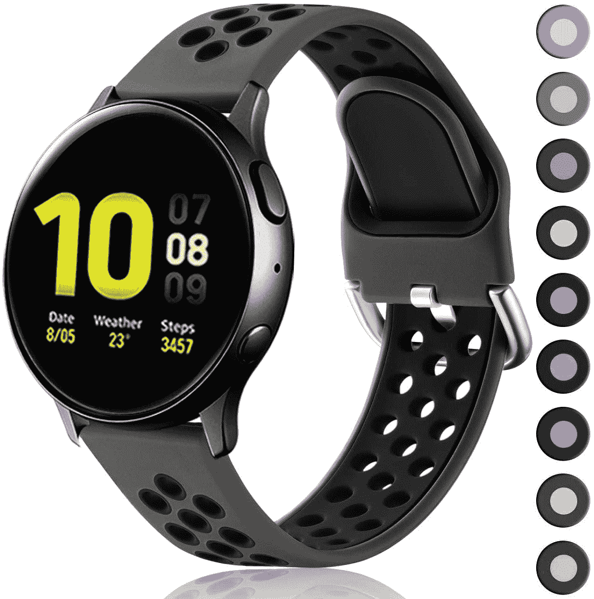
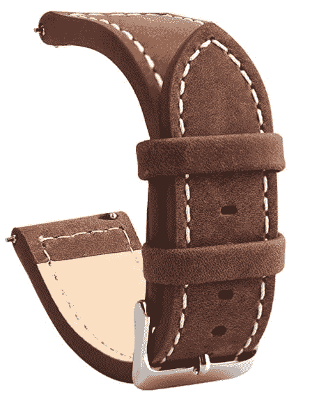
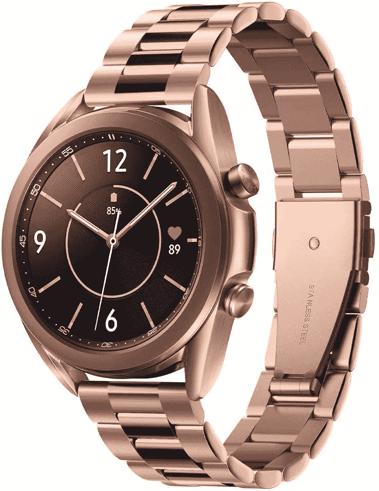
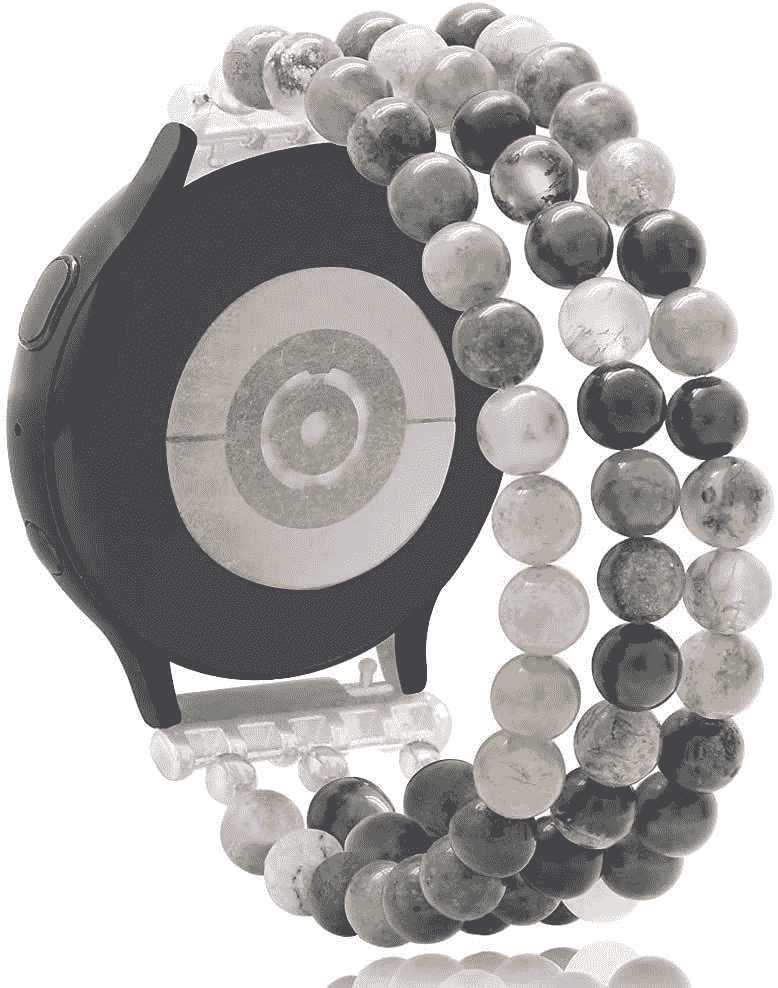
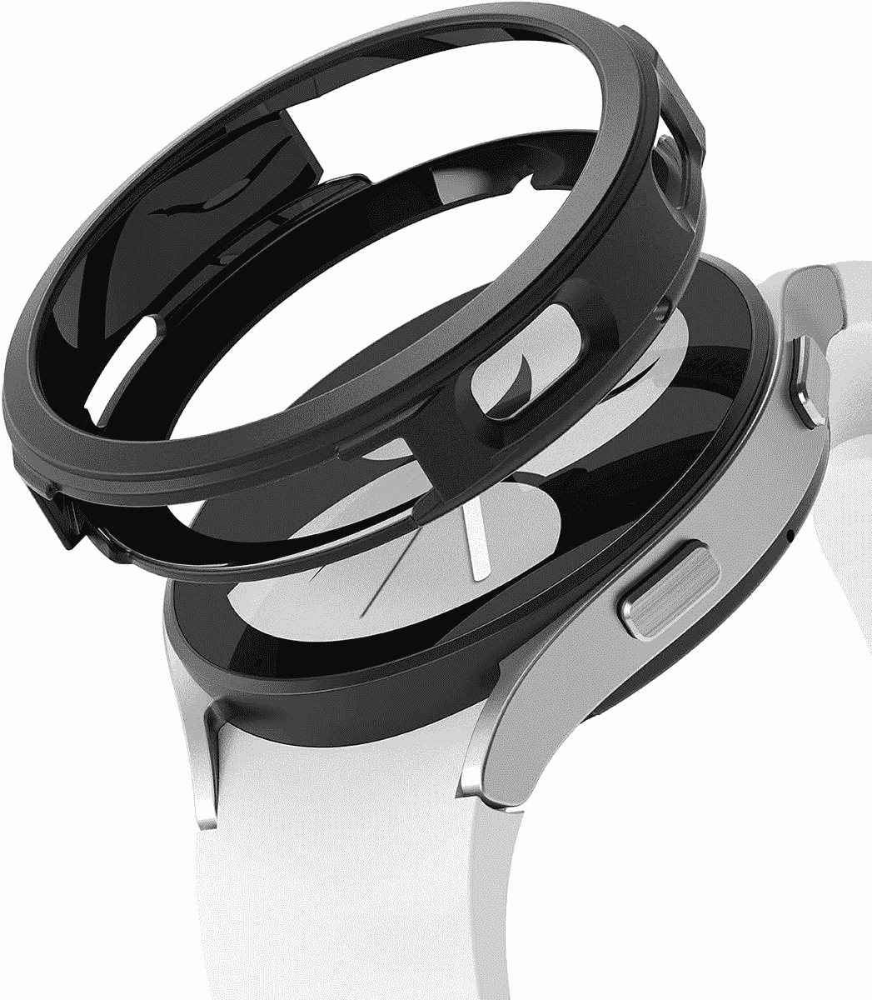
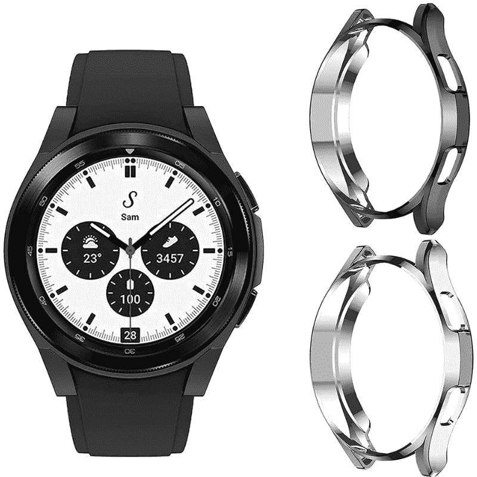
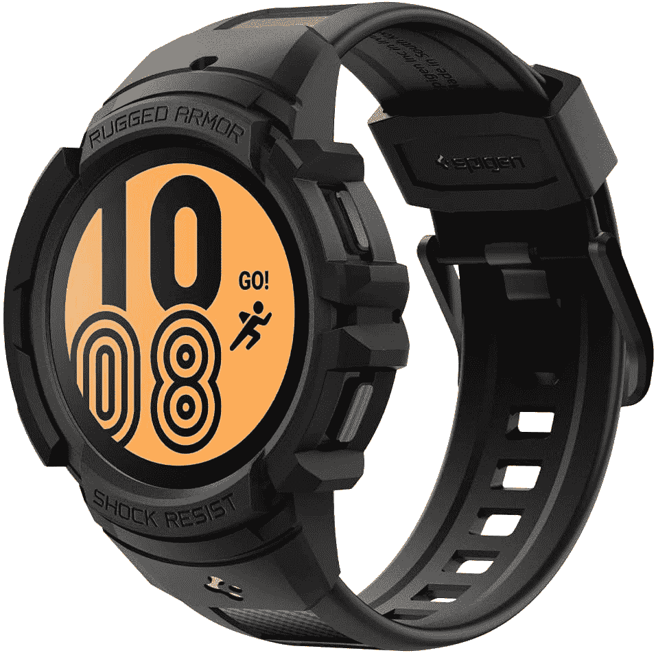

# 2023 年最佳三星 Galaxy Watch 4 款表带和表壳

> 原文：<https://www.xda-developers.com/best-galaxy-watch-4-bands/>

三星 [Galaxy Watch 4](https://www.xda-developers.com/samsung-galaxy-watch-4/) 可能不是目前市场上最新或[最好的智能手表](https://www.xda-developers.com/best-smartwatches/)，但与市场上的许多其他选择相比，它仍然物有所值。正如我们在 [Galaxy Watch 5 与 Galaxy Watch 4 对比](https://www.xda-developers.com/samsung-galaxy-watch-5-vs-galaxy-watch-4/)中提到的，老款手表仍然可以与三星最新的 WearOS 智能手表相媲美。如果你有一款普通的 Galaxy Watch 4 或经典款，那么我们建议你保留它，直到下一款 Galaxy Watch 上市。你可以随时购买一个新的表带或表壳来改变现有手表的外观和感觉，以防你想改变一下。如果你不知道该买哪个，这里有一些不错的选择供你考虑:

所有三星 Galaxy Watch 4 型号都使用相同的表带。没错，Galaxy Watch 4 (40mm)、Galaxy Watch 4 (44mm)、Galaxy Watch 4 Classic (42mm)、Galaxy Watch 4 Classic (46mm)，都使用相同的 20mm 表带/表带。

## 最佳三星 Galaxy Watch 4 和 Galaxy Watch 4 经典表带

以下是 2023 年最棒的 Galaxy Watch 4 和 Galaxy Watch 4 经典乐队的合集:

*   <picture></picture>

    Yeejok 硅胶表带

    ##### yee jok 硅胶表带

    Galaxy Watch 4 的 yee jok 硅胶表带是一个很好的选择，如果你不想花很多钱买一个替换表带的话。这是一种相对便宜的硅胶带，也有许多不同的颜色。

*   <picture></picture>

    硅胶透气带

    ##### Lerobo 透气软硅胶表带

    这种透气带和你用 Apple Watch Nike edition 得到的差不多。它非常适合那些生活方式积极的人，因为带子上的孔可以让你的皮肤呼吸。它还有许多不同的颜色可供选择。

*   <picture></picture>

    棕色皮质表带

    ##### ponis de 真皮表带

    这款 Galaxy Watch 4 的经典棕色表带由真皮制成，有三种不同颜色可供购买。它还带有沿两侧的对比缝线，整体外观出众。

*   <picture></picture>

    Spigen Modern Fit

    ##### Spigen Modern Fit 表带

    如果你想为你的 Galaxy Watch 4 配一条金属表带，Spigen Modern Fit 表带也是一个不错的选择。它有两种颜色可供选择，这两种颜色都为手表增添了经典的外观和感觉。

*   <picture></picture>

    编织松紧带

    ##### wear lizer 编织松紧带

    这款编织表带为 Galaxy Watch 4 提供了一个漂亮舒适的贴合感。它非常容易佩戴和取下，因为它可以不带扣佩戴，并且可以直接戴在手腕上。

*   <picture></picture>

    串珠松紧带

    ##### KAI 顶级串珠表带

    这种特殊的带珠表带可以完全改变手表在手腕上的观感。这是手工制作的，也有不同颜色可供选择。

* * *

## 最佳三星 Galaxy Watch 4 和 Galaxy Watch 4 经典案例

最好的 Galaxy Watch 4 外壳不仅可以保护你的手表免受意外跌落和磨损，还可以改变它的整体外观和感觉。以下是现在可以购买的最佳案例:

### Galaxy Watch 4 40mm 毫米表壳

下面提到的情况将只适合 40 毫米版本的 Galaxy Watch 4。

*   <picture></picture>

    Spigen Liquid Air

    ##### Spigen Liquid Air Galaxy Watch 4 case

    如果你不想给你的智能手表增加很多体积，但仍然想要基本的保护，这款来自 Spigen 的轻薄外壳就是要走的路。

*   <picture></picture>

    林克空中运动

    ##### 林克空中运动表带

    林克空中运动是一种柔软的硅胶风格表壳，增加了一层基本的保护。它甚至有一个清晰的选项。

*   <picture></picture>

    Yitkor 超薄 TPU 表壳

    ##### Yitkor 超薄 TPU Galaxy 手表 4 表壳

    这款灵活的 TPU 表壳有几种颜色可供选择。它为你的手表提供了很好的保护，还有一些精确的按钮切口。

### Galaxy Watch 4 44mm 毫米表壳

那些拥有 44 毫米版本 Galaxy Watch 4 的用户可以查看下面提到的情况:

*   <picture></picture>

    林克空中运动

    ##### 林克空中运动表带

    林克空中运动是一种柔软的硅胶风格表壳，增加了一层基本的保护。它也有一个清晰的选项，以防你想炫耀你的手表的颜色。

*   ##### sup case Unicorn Beetle Pro for Galaxy Watch 4

    sup case Unicorn Beetle Pro 是一款坚固耐用的外壳，能够为您的手表提供良好的保护。它非常适合那些生活方式积极的人，或者只是想让手表看起来像经典 G-Shock 的人。

    T34
*   <picture></picture>

    Spigen Rugged Armor Pro

    ##### Spigen Rugged Armor Pro Galaxy Watch 4 外壳

    Spigen 为 Galaxy Watch 4 打造的 Rugged Armor 外壳与其为智能手机打造的外壳类似。它配有一个表带，可以为你的手表提供足够的保护。

### Galaxy Watch 4 款经典 42 毫米表壳

如果你有 42 毫米版本的 Galaxy Watch 4 Classic，请查看下面提到的选项。

*   <picture></picture>

    Spigen Liquid Air

    ##### Spigen Liquid Air Galaxy Watch 4 表壳

    如果你不想给自己的智能手表增加很多体积，可以考虑购买这款特殊的表壳。对于 Galaxy Watch 4 Classic 来说，这是一个相对较薄的外壳，可以提供相当大的保护。

*   <picture></picture>

    林克空中运动

    ##### 林克空中运动表带

    林克空中运动是一种柔软的硅胶风格表壳，增加了一层基本的保护。如果你想炫耀你手表的颜色，你也可以买一个清晰的版本。

*   <picture></picture>

    Spigen Rugged Armor Pro

    ##### Spigen Rugged Armor Pro Galaxy Watch 4 Case

    Spigen 的 Rugged Case for the Galaxy Watch 4 Classic 自带表带，为手表提供了良好的保护。它还有三种不同的颜色。

### Galaxy Watch 4 款经典 46 毫米表壳

最后，下面提到的链接将带您到 Galaxy Watch 4 Classic 的 46 毫米型号的表壳列表。

*   <picture></picture>

    Spigen Liquid Air

    ##### Spigen Liquid Air Galaxy Watch 4 case

    如果你想要一个不会给你的智能手表增加太多体积的简单选项，Spigen 的这个特例值得一试。不过这只会给你的手表增加基本的保护，所以要记住这一点。

*   <picture></picture>

    林克空中运动

    ##### 林克空中运动表带

    林克空中运动是一种柔软的硅胶风格表壳，增加了一层基本的保护。对于那些想要炫耀手表颜色的人来说，它甚至有一个清晰的选项。

*   ##### sup case Unicorn Beetle Pro for Galaxy Watch 4

    sup case Unicorn Beetle Pro 是一款坚固耐用的外壳，能够为您的手表提供良好的保护。它非常适合那些生活方式积极的人，或者只是想让手表看起来像经典 G-Shock 的人。

    T34

* * *

这些是你现在在 2023 年可以买到的最好的 Galaxy Watch 4 表带。我们在这个特别的系列中加入了各种表壳和表带，所以一定要选择你喜欢的那一款。这里提到的许多选项也相对实惠，所以你可以选择多个表带和表壳，在它们之间轮换，打造全新的外观。

##### 三星 Galaxy 手表 4

三星 Galaxy Watch 4 配备了最新的 OneUI 手表平台，是 Android 用户的绝佳选择。

 <picture></picture> 

Samsung Galaxy Watch 4

##### 三星 Galaxy Watch 4 经典版

三星 Galaxy Watch 4 的经典款配备了旋转表圈，让您可以以直观的方式与手表互动。

如果你还没有购买 Galaxy Watch 4，并且正在寻找更好的东西，那么你可能需要考虑一下新的 [Galaxy Watch 5](https://www.xda-developers.com/samsung-galaxy-watch-5-review/) 。是的，Galaxy Watch 4 与 Galaxy Watch 5 相比表现不错，如果你有旧型号，你应该坚持使用旧型号，但新用户肯定应该考虑升级到新的 Galaxy Watch 5。它增加了一系列值得注意的功能，同时保留了以前型号中的最佳功能。