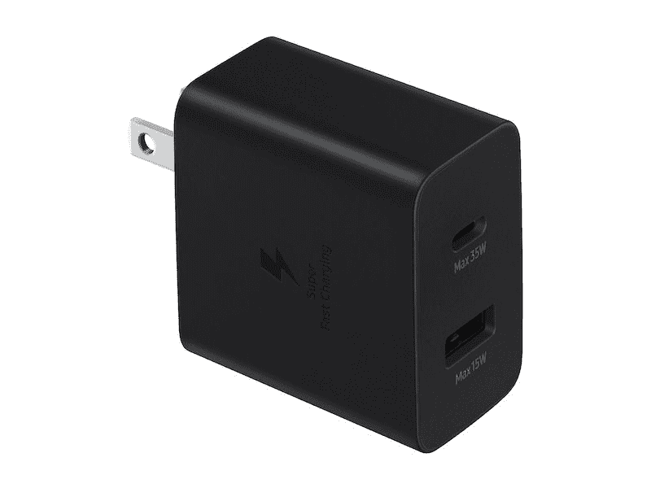
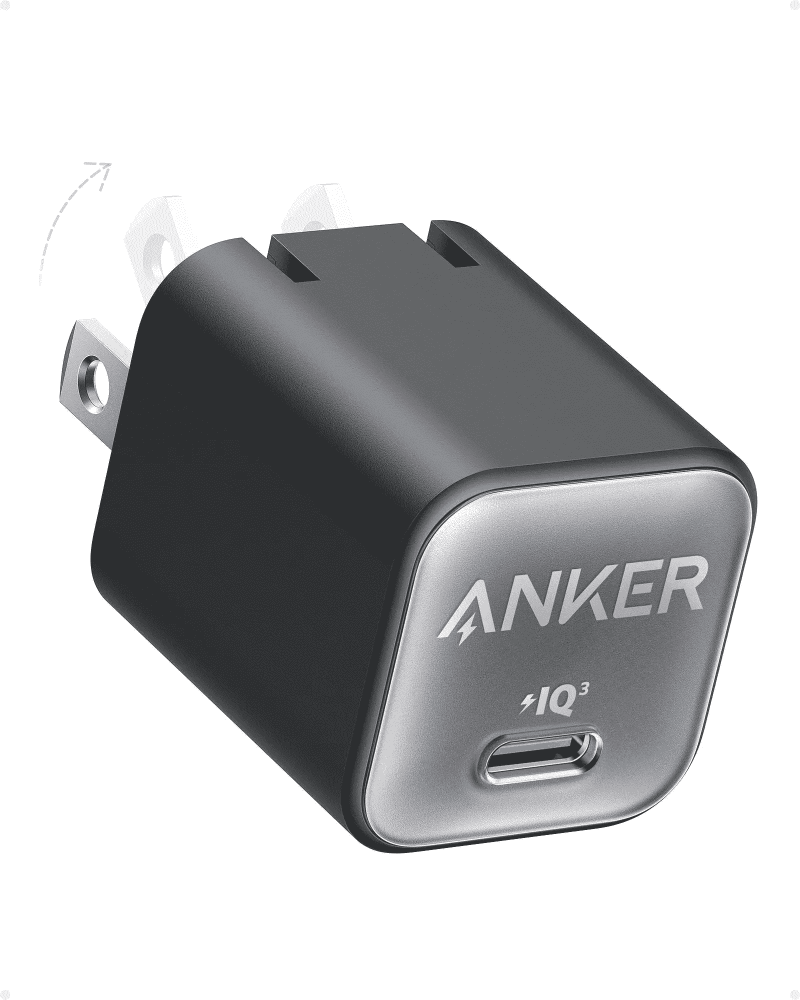
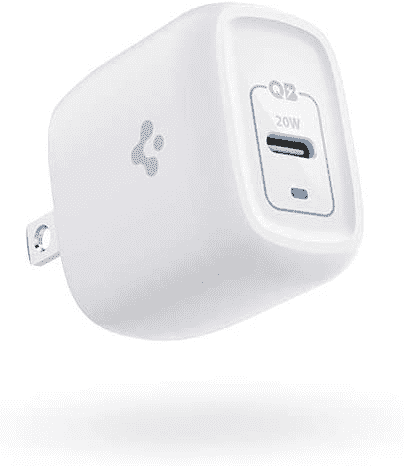
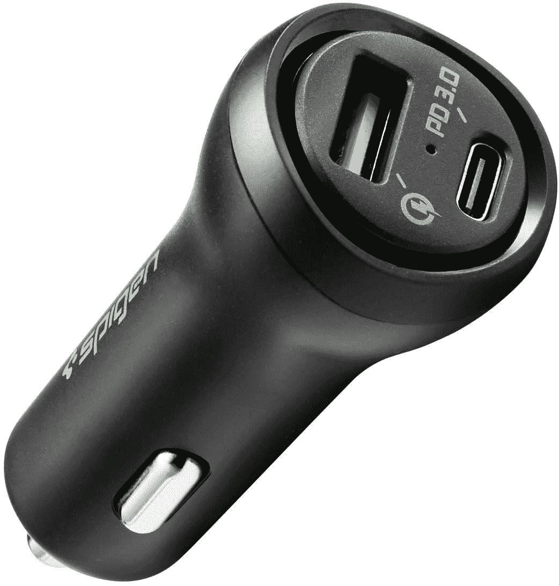
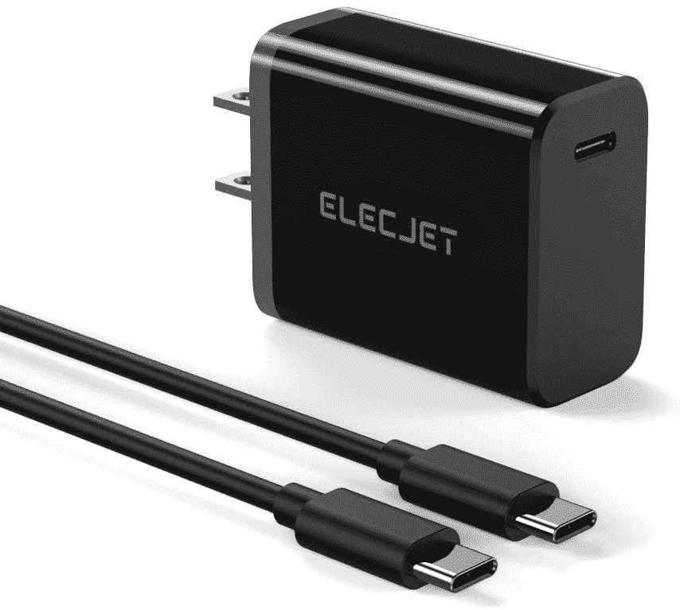
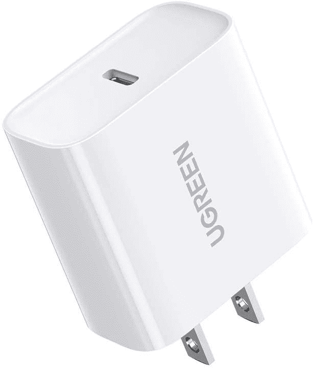
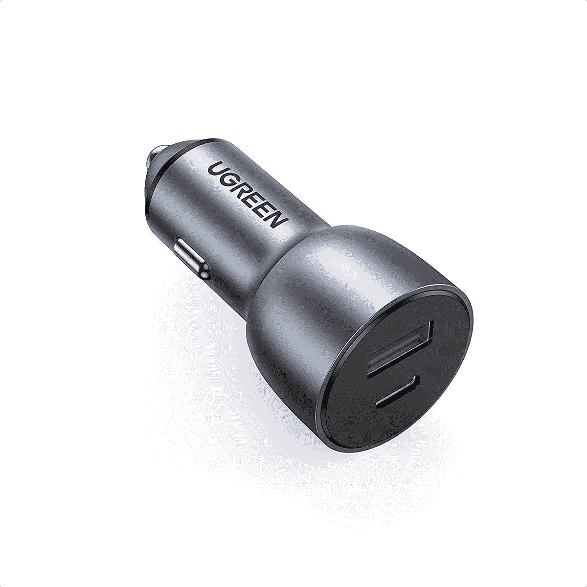

# 2023 年 Galaxy Z Flip 3 的最佳充电器

> 原文：<https://www.xda-developers.com/best-galaxy-z-flip-3-chargers/>

# 2023 年 Galaxy Z Flip 3 的最佳充电器

三星没有将充电器与 Z Flip 3 捆绑在一起，所以你必须购买一个。我们挑选了最好的 Galaxy Z Flip 3 充电器。

Galaxy Z Flip 3 与 Galaxy Z Fold 3 一起于 2020 年 8 月发布。它代表了对其前身 Galaxy Z Flip 2 的巨大升级，并成为市场上最受欢迎的可折叠手机。虽然 Galaxy Z Flip 4 接替了它，但对于那些寻求第一部可折叠手机的人来说，Galaxy Z Flip 3 仍然是一个受欢迎和备受推崇的选择。

如果你最近购买了一部 Galaxy Z Flip 3，并且需要一个充电器，我们可以满足你的需求——我们为你的手机编辑了一份最佳快速充电器列表。只是要记住，Galaxy Z Flip 3 支持 15W 有线充电和 10W 无线充电。另一件要记住的事情是，智能手机在盒子里有一根 USB Type-C 到 Type-C 电缆。所以你应该只买一个有 C 型接口的充电器，或者如果你买一个有 A 型接口的充电器，确保盒子里有一根兼容的电缆。

## 最佳三星 Galaxy Z Flip 3 充电器

*   <picture></picture>

    三星 25W 超快壁式充电器

    ##### 三星 25W USB-C 充电器

    这款来自三星的官方壁式充电器自带 USB Type-C 口，最高可充电 25W。因此，你一定会在你的 Z Flip 3 上获得最高的充电速度。它还可以与其他 USB PD 3.0 和 PPS 兼容设备一起使用。

*   <picture></picture>

    15W 无线充电器带适配器

    ##### 三星 15W 快充无线充电器

    这款无线充电板非常适合你的 Galaxy Z Flip 3。它支持高达 15W 的充电，因此您的手机将获得最高的充电速度。它还有一个内置风扇来控制热量。

*   <picture></picture>

    三星 35W 电源适配器 Duo

    ##### 三星 35W 电源适配器 Duo

    这是三星设计的又一款有线充电器。它带有两个 USB 端口——一个 Type-C 和一个 Type-A。Type-A 端口可以提供 15W 的功率，而 Type-C 端口可以达到 35W，因为该设备支持 USB PD 3.0 PPS。

*   <picture></picture>

    Anker Nano 3

    ##### Anker Nano 3 30W GaN 充电器

    Anker Nano 3 是市面上最小的 GaN 基充电器之一。它可以为兼容设备提供高达 30W 的功率，并有五种颜色可供选择。该公司还对充电器提供 24 个月的保修。

*   <picture></picture>

    Spigen 20W arc station Pro

    ##### Spigen 20W arc station Pro GaN USB-C 充电器

    Spigen 20W arc station Pro 充电器采用 GaN 技术，与硅基充电器相比，体积更小，产生的热量更少。它带有一个 Type-C 端口，支持高达 20W 的快速充电。

*   <picture></picture>

    三星 15W 无线充电器 Duo

    ##### 三星 15W 无线充电器 Duo

    三星无线充电器 Duo(第二代)可以同时为您的 Galaxy Z Flip 3 和其他 Qi 兼容配件充电。它提供了 15W 的最大充电速度，并有一个内置风扇来控制热量。

*   <picture></picture>

    Nektech 快速充电器

    ##### Nekteck 18W USB-C 充电器

    NeckTeck USB 壁式充电器是 Galaxy Z Flip 3 智能手机的另一个预算选择。它支持快充 2.0 标准，提供高达 18W 的快充。你在充电器上得到一个单一的 A 型端口，兼容的 C 型和 microUSB 电缆与之捆绑。

*   <picture></picture>

    Spigen USB C 车充

    ##### Spigen 45W USB-C 车充

    Spigen USB C 车充带有两个端口——一个 Type-A 和一个 Type-C。而 Type-C 端口可以为 USB PD 兼容设备提供高达 27W 的快速充电

*   <picture></picture>

    Elecjet 超快充电座

    ##### elec jet 30W USB-C 充电器

    这款 elec jet 有线充电器是新款可折叠智能手机的又一大选择。它支持高达 25W 的快速充电，并配有一个 Type-C 端口。它还捆绑了一根 Type-C 到 Type-C 电缆，因此您将获得一根备用电缆以供使用。

*   <picture></picture>

    u green 20W PD 快速充电器

    ##### u green 20W USB-C 充电器

    Ugreen 正在以非常实惠的价格出售这款优秀的快速充电器。它不仅可以为你的 Galaxy Z Flip 3 快速充电，也可以为其他设备快速充电。支持 USB 供电和 Quick Charge 4.0+快充标准。

*   <picture></picture>

    Ugreen 车充

    ##### u green 20W USB-C 车充

    除了出色的壁式充电器，u green 还出售这款可以为你的 Galaxy Z Flip 3 快速充电的神奇车充。它有两个端口——一个 Type-C 和一个 Type-A——所以你可以同时给车内的两个设备充电。

这些是 Galaxy Z Flip 3 智能手机的最佳充电器。三星 15W 充电器是最好的选择，因为它便宜并且完全兼容你的智能手机。我们也有一些来自 Anker、NekTeck 和 Elecjet 的可靠选项。如果您正在寻找更多无线充电器推荐，请务必查看我们的[最佳 Qi 无线充电器综述](https://www.xda-developers.com/best-qi-wireless-charger/)。

 <picture></picture> 

Samsung Galaxy Z Flip 3

Galaxy Z Flip 3 可能不是三星最新最棒的产品，但我们认为它仍然保持得很好，并为第一次尝试可折叠产品的人提供了有趣的体验。

你打算为你的三星 Galaxy Z Flip 3 买哪个充电器？请在评论区告诉我们。同时，我们还为 Galaxy Z Flip 3 挑选了[最佳保护套，帮助你保护它。如果你想探索更多的选择，你可以看看我们关于](https://www.xda-developers.com/best-samsung-galaxy-z-flip-3-cases/)[最佳 USB PD 快速充电器](https://www.xda-developers.com/best-usb-pd-fast-charger/)和[最佳 Qi 无线充电器](https://www.xda-developers.com/best-qi-wireless-charger/)的综述。