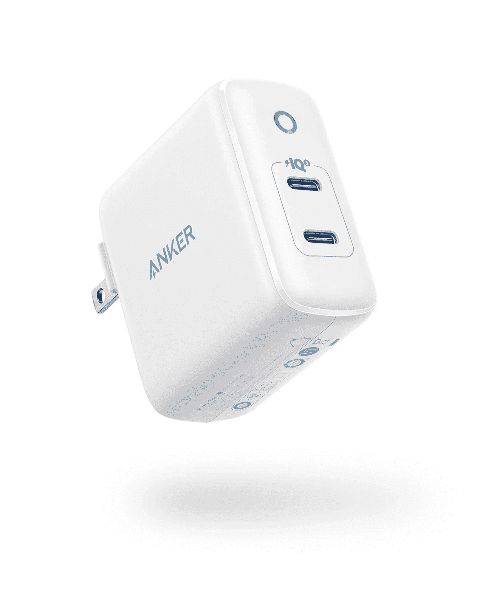

# 2023 年最佳 Galaxy Z Fold 3 充电器

> 原文：<https://www.xda-developers.com/best-galaxy-z-fold-3-chargers/>

三星 Galaxy Z Fold 3 可能不再是市场上最前沿的可折叠手机，但它仍然是市场上最好的可折叠手机之一。随着 Galaxy Z Fold 4 的到来，随着零售商为新款机型腾出空间，你可以在 Galaxy Z Fold 3 上找到[的特价商品。你还可以获得令人印象深刻的硬件，包括 7.6 英寸的内部显示屏和 6.2 英寸的外部显示屏，骁龙 888 芯片组，三个 12MP 摄像头，以及支持 25W 快速充电的 4，400mAh 电池。如果你刚刚得到一台 Galaxy Z Fold 3，并且正在寻找一个快速充电器，我们可以帮助你。](https://www.xda-developers.com/best-galaxy-z-fold-3-deals/)

我们选出了市场上最好的 Galaxy Z Fold 3 充电器，你现在就可以购买。我们的建议包括适用于三星智能手机的壁式充电器、无线充电器和车载充电器。

下面列出的所有充电器都将与 Z Flip 3 配合使用，Z Flip 3 支持 25W 有线快速充电和 11W 无线快速充电。

## 最佳三星 Galaxy Z Fold 3 充电器

*   <picture></picture>

    Belkin boost charge 壁式充电器

    ##### Belkin 25W USB-C 充电器

    如果你不想买三星充电器，这款 Belkin 充电器可能是你可以为你的手机购买的最直接的充电器了。由于支持 USB PD 3.0 PPS，它能够进行 25W 充电。此外，它具有纤薄的外形，非常适合旅行。

*   <picture></picture>

    Anker Nano 3

    ##### Anker Nano 3 30W GaN 充电器

    Anker Nano 3 是市面上最小的 GaN 基充电器之一。它可以提供高达 30W 的功率，并为您的 Galaxy Z Fold 3 快速充电。该充电器有五种颜色可供选择，还提供 24 个月的保修。

*   <picture></picture>

    三星 25W 超快壁式充电器

    ##### 三星 25W USB-C 充电器

    这款来自三星的官方壁式充电器自带 USB Type-C 口，最高可充电 25W。因此，你一定会在你的 Z Flip 3 上获得最高的充电速度。它还可以与其他 USB PD 3.0 和 PPS 兼容设备一起使用。

*   <picture></picture>

    Anker 324 充电器 40W

    ##### Anker 324 充电器(40W)

    这款来自 Anker 的充电器提供高达 40W 的功率，通过其两个 USB-C 端口，您可以同时为 Galaxy Z Fold 3 和其他设备充电。

*   <picture></picture>

    elec jet 25W 超级快速充电器

    ##### elec jet 25W 超级快速充电器

    elec jet 25W 快速充电器是为您的新 Z Fold 3 智能手机充电的另一个绝佳选择。它兼容 USB PD 和 PPS，可提供高达 25W 的功率。此外，您还可以获得一个 C 类端口和一根 C 类到 C 类捆绑电缆。

*   <picture></picture>

    Spigen USB C 充电器

    ##### Spigen 45W USB-C 车载充电器

    如果你家里有多个支持 USB PD 的设备，需要高达 45W 的功率，Spigen USB C 充电器是个不错的选择它带有一个 C 类端口，支持 PPS。此外，您还可以获得 24 个月的保修，超过了通常的 12 个月和 18 个月。

*   <picture></picture>

    内克壁式充电器

    ##### 内克 18W USB-C 充电器

    如果你不想在快速充电器上花太多钱，你可以选择内克壁式充电器。它配有一根 USB 连接线，所以你不必担心找到一根线来给你的手机充电。此外，45W 充电支持在为任何兼容 USB PD 的笔记本电脑充电时也很方便。

*   <picture></picture>

    Anker PowerWave II Pad

    ##### Anker PowerWave II 15W 无线充电器 Pad

    如果官方无线充电器对你来说太贵，这款 Anker PowerWave II 支架充电器可以帮上忙。它支持高达 15W 的快速无线充电，因此您将获得最高速度。此外，它还配有电源适配器，因此您不必担心找不到交流适配器。

*   <picture></picture>

    Baseus 双口车载适配器

    ##### Baseus 65W USB-C 车载充电器

    这款 Baseus 的电源车载充电器是您 Z 折 3 的绝佳选择。它支持高达 65W 的快速充电，支持 USB PD 3.0 和 PPS，因此足以提供最高的充电速度。板载有两个 USB 端口-一个 A 型和一个 C 型-该公司捆绑了一个 100W 的 USB C 型电缆。

*   <picture></picture>

    Baseus 45W PD 快速充电壁式充电器

    ##### Baseus 45W GaN 4 口充电器

    除了其快速车载充电器，Baseus 还提供这款支持高达 45W 充电的优秀壁式充电器。USB PD 3.0 和 PPS 支持也存在，从而保证您的手机将获得最高的充电速度。此外，充电器中有两个 C 型端口和一根捆绑的 C 型电缆。

*   <picture></picture>

    Elecjet 45W USB C 超快充电器

    ##### elec jet 45W 超快充电器

    这款 elec jet 壁式充电器是你 Z Fold 3 智能手机的又一个不错的选择。它具有可折叠的引脚，便于存储，并支持 USB PD 3.0 以及 PPS。顾名思义，该充电器能够提供高达 45W 的功率。因此，您不仅可以为手机充电，还可以为任何支持 USB PD 的笔记本电脑充电。最后，它还捆绑了一根 USB Type-C 电缆。

*   <picture></picture>

    Belkin boost charge 快速无线充电板

    ##### Belkin boost charge 15W 无线充电板

    Belkin boost charge 充电板是您 Galaxy Z Fold 3 的优秀无线充电器。它与 Qi 兼容，支持高达 15W 的功率输出，因此您将获得手机的最高充电速度。它还配有防滑材料，可以将手机固定在适当的位置。

*   <picture></picture>

    Baseus USB-C 壁式充电器

    ##### Baseus 65W GaN 3 口充电器

    如果你需要一个充电器同时为多个设备充电，这款 Baseus 充电器是一个很棒的选择。它配有两个 USB Type-C 和一个 Type-A 端口，可同时为多达三个设备充电。此外，该充电器支持高达 65W 的总功率输出，如果连接了多个设备，可在设备之间智能分配。

*   <picture></picture>

    Ugreen 双端口 PD 快速充电器

    ##### u green 66W 双 USB-C 充电器

    如果你想给一个以上的 Type-C 设备充电，u green 快速充电器是另一个不错的选择。顾名思义，它有两个 C 型端口。此外，你得到一个可折叠的插头，方便旅行。充电器总功率输出为 65W。

*   <picture></picture>

    u green 30W PD 壁式充电器

    ##### u green 30W USB-C PD 壁式充电器

    u green 30W PD 壁式充电器是您的 Galaxy Z Fold 3 的一个实惠选择。由于其 30W 的功率输出，它可以在 Fold 3 上提供最快的充电速度。此外，Ugreen 还增加了对快速充电(QC) 4.0+的支持，因此您也可以对 QC 兼容设备进行快速充电。

*   <picture></picture>

    三星无线充电器三重奏

    ##### 三星无线充电器三重奏

    如果你拥有多台支持无线充电的设备，三星无线充电器三重奏可能适合你。它提供 9W 最大功率输出，并配有 25W 电源适配器。

*   <picture></picture>

    15W 无线充电器 duo

    ##### 三星无线充电器 Duo

    使用三星无线充电器 Duo，您可以同时为您的可折叠手表和 Galaxy 手表充电。充电器可以输出 15W 最大功率。buttontext=

*   <picture></picture>

    Spigen arc station Super Mini

    ##### Spigen 27W arc station Super Mini

    Spigen arc station Super Mini 是一款为你的 Galaxy Z Fold 3 设计的紧凑型壁式充电器，充电器的尺寸在所有边上都超过一英寸。此外，它可以向可编程电源(PPS)兼容设备提供 25W 的功率，因此 Fold 3 将以最高速度充电。

这些都是市面上最好的 Galaxy Z Fold 3 充电器。如果你正在寻找一个具体的建议，如果你只是想给你的 Galaxy Z Fold 3 充电，Belkin BoostCharge 壁式充电器是最佳选择。三星官方充电器也很棒，但它们也是最贵的。请记住，您需要使用捆绑的 Type-C 电缆或支持 25W 充电的电缆来获得这些充电器的快速充电速度。如果你需要合适的充电线，我们已经挑选了你现在就能买到的最好的 USB 线。

 <picture></picture> 

Samsung Galaxy Z Fold 3

##### 三星 Galaxy Z Fold 3

Galaxy Z Fold 3 由高通骁龙 888 SoC 驱动，提供了令人惊叹的可折叠显示屏。

这些是你现在能买到的最好的 Galaxy Z Fold 3 充电器。三星官方 25W 充电器和 Anker Nano 3 是我们从列表中挑选的首选。如果你正在寻找一个可以同时为 Galaxy Z Fold 3 和笔记本电脑或平板电脑充电的多端口充电器，Baseus 和 Ugreen 有一些可靠的选择。无论您是在寻找有线充电器还是无线充电器，我们的产品系列都有足够的选项满足您的各种需求。

你打算买哪个快速充电器？请在评论区告诉我们。同时，我们也有市面上 [best Z Fold 3 cases](https://www.xda-developers.com/best-samsung-galaxy-z-fold-3-cases/) 的选购指南。如果你想买一个可折叠的，我们建议你去看看最新的 Galaxy Z Fold 4 上的[特价。](https://www.xda-developers.com/best-samsung-galaxy-z-fold-4-deals/)