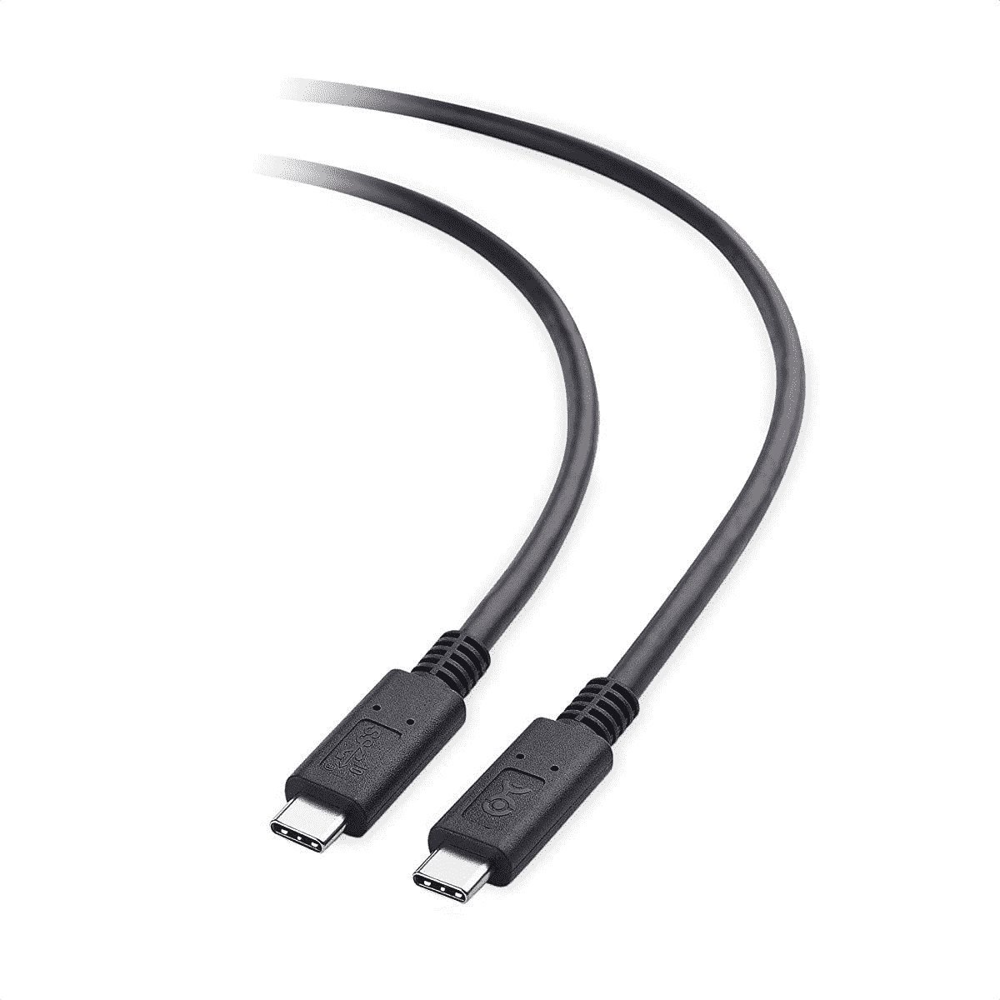
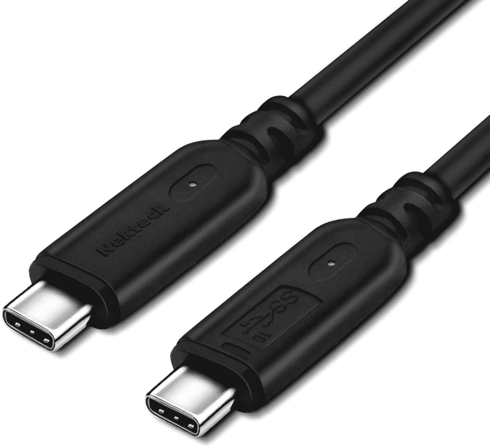
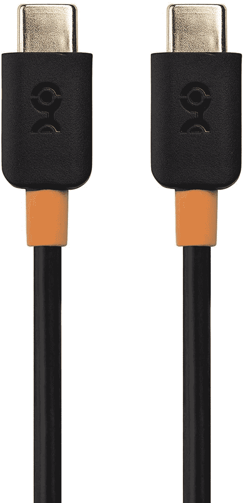

# 2023 年 Galaxy Z Fold 3 的最佳 USB 电缆

> 原文：<https://www.xda-developers.com/best-galaxy-z-fold-3-usb-cables/>

# 2023 年 Galaxy Z Fold 3 的最佳 USB 电缆

Galaxy Z Fold 3 需要一根新的 USB Type-C 或 Type-A 电缆吗？我们选择了市场上最好的 Galaxy Z Fold 3 USB 电缆。

Galaxy Z Fold 3 和 T2 Galaxy Z Flip 3 这两款新的可折叠手机已经加入了三星的智能手机 folio。新手机带来了几个令人兴奋的功能和规格。这些功能中包括 USB 3.1 Type C 端口，可以在两款手机上实现有线数据传输和充电。虽然 Z Fold 3 和 Z Flip 3 的包装盒中都有兼容的 Type-C 电缆，但如果您正在为您的手机寻找新的 Type-C 电缆，我们可以帮助您。我们为 Z Fold 3 和 Z Flip 3 挑选了市场上最好的 USB Type-C 到 Type-C 和 Type-A 到 Type-C 电缆。

由于新的 Galaxy Z Fold 3 支持 25W 快速充电，由于 USB PD 3.0 和 PPS 支持，您需要一根能够提供 25W 功率的电缆来提供最高的充电速度。Z Flip 3 只支持 15W 快速有线充电。如前所述，为了实现快速数据传输，两款手机上的 Type-C 端口都是 USB 3.1(也称为 USB 3.2 Gen 2)，因此，如果线缆另一端的设备同样快速，那么经过认证的该代电缆将能够以高达 10Gbps 的速度传输数据。

## 最佳 Galaxy Z Fold 3 USB 型到 C 型电缆

你通常只会使用 A 型到 C 型 USB 电缆进行快速数据传输，因为任何超快速充电器都不会有能够提供 25W 功率的 A 型端口。

 <picture></picture> 

Belkin USB-A to USB-C Cable

##### Belkin USB-A 至 USB-C 电缆

这种 Belkin 电缆支持 USB 3.1 速度，这意味着您能够以高达 10Gbps 的速度传输数据。但在充电方面，你只会得到 15W 左右的快充。该电缆采用聚碳酸酯连接器和柔性 TPE 电缆护套。

 <picture></picture> 

Anker Powerline II

##### 安科 USB-C 到 USBC-C 电缆

这款 Anker Powerline II 电缆是我们为您的新三星折叠式手机挑选的 A 型到 C 型电缆。它支持高达 10Gbps 的数据传输速度。它还通过了 USB-IF 认证，并附带终身保修。

 <picture></picture> 

Cable Matters USB Type-C cable

##### 线缆问题 USB-C 转 USB-C 线缆

如果你不想花太多钱买电缆，这款电缆很重要，USB Type-C 电缆会让你感兴趣。尽管价格较低，但这种电缆相当不错，支持高达 10Gbps 的数据传输。此外，您将获得高达 15W 的快速充电功率。

## 最佳 C 类至 C 类电缆

Type-C 到 Type-C 电缆包括超快速充电和超快速数据传输选项。

 <picture></picture> 

Samsung USB-C to USB-C cable

##### 三星 USB-C 至 USB-C 电缆

在为你的手机购买配件时，你最不需要担心的是与官方配件的兼容性。这款三星 Type-C 线也是如此。它将提供最快的支持充电和数据传输。三星电缆的价格也很合理。

 <picture></picture> 

Cable Matters USB-C to USB-C Cable

##### 线缆问题 USB-C 转 USB-C 线缆

电缆问题 Type-C 至 Type-C 电缆为快速充电和数据传输需求提供了最佳选择。它支持高达 10Gbps 的数据传输和高达 100W 的功率传输。别无所求。

 <picture></picture> 

Nekteck USB-C to USB-C 3.1 Gen 2 Cable

##### Nekteck USB-C 至 USB-C 电缆

NekTeck 还为您的 Galaxy Z Fold 3 提供了一种出色的 C-C 型电缆。它支持高达 100W 的快速充电和高达 10Gbps 的数据传输。该电缆还具有坚固的结构。

 <picture></picture> 

Baseus USB-C to USB-C 3.1 Gen 2 Cable

##### Baseus USB-C 转 USB-C 电缆

这种 Baseus 电缆带有尼龙编织层，以提供额外的耐用性。此外，它支持 100 瓦的功率传输和高达 10Gbps 的数据传输。该电缆也是 USB-IF 认证。

 <picture></picture> 

Cable Matters USB C to USB C Cable

##### 线缆问题 USB-C 转 USB-C 线缆

不想在 USB 连接线上花太多钱？有线电视问题会有所帮助。该公司的这款 USB Type-C 至 Type-C 电缆拥有您需要的一切- 60W 功率传输和高达 10Gbps 的数据传输支持。

这些是您的新 Galaxy Z Fold 3 或 Z Flip 3 的最佳 USB 电缆。如果您正在为每种类型的电缆寻找一个具体的建议，Anker Powerline II 是 A 类到 C 类电缆的最佳选择，Baseus 将是 C 类到 C 类电缆的最佳选择。三星官方的线缆也是一个不错的选择。

 <picture></picture> 

Samsung Galaxy Z Fold 3

##### 三星 Galaxy Z Fold 3

Galaxy Z Fold 3 是三星最新的旗舰可折叠智能手机。它由高通骁龙 888 SoC 驱动，运行在 Android 11 上，只有一个用户界面。

 <picture></picture> 

Samsung Galaxy Z Flip 3

Galaxy Flip 3 是三星的新款翻盖式可折叠手机。它采用 6.7 英寸 120Hz 柔性屏幕和骁龙 888 SoC。

你打算买哪种 USB 线？请在评论区告诉我们。我们还为你挑选了[最佳 Galaxy Z Fold 3 保护套](https://www.xda-developers.com/best-samsung-galaxy-z-fold-3-cases/)和[最佳 Z Fold 3 支架保护套](https://www.xda-developers.com/best-galaxy-z-fold-3-kickstand-cases/)。