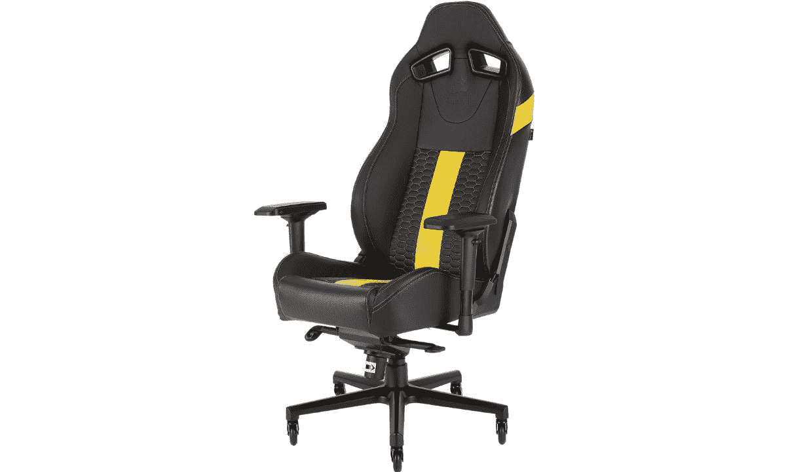
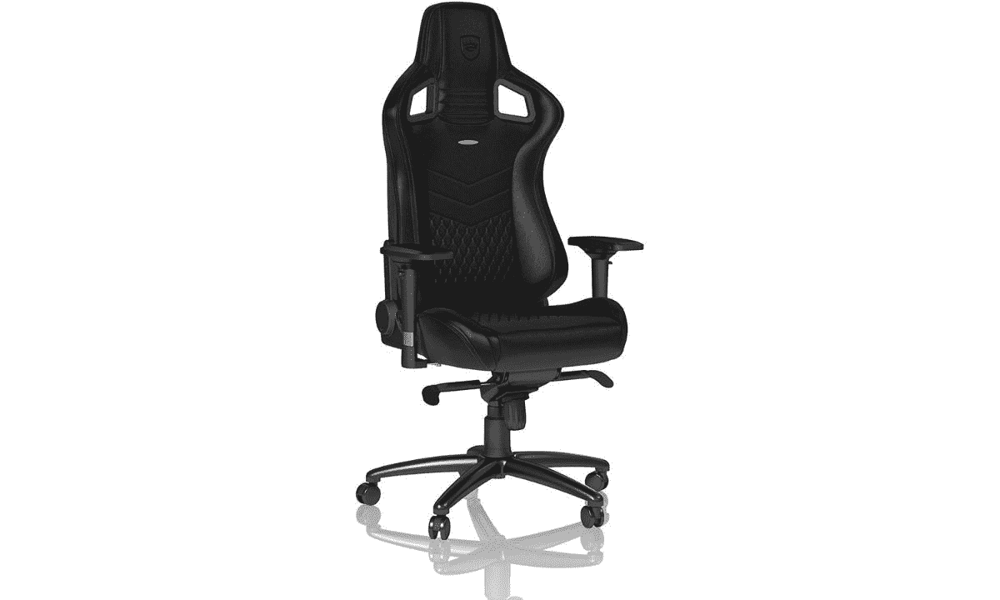

# 2023 年最佳游戏椅

> 原文：<https://www.xda-developers.com/best-gaming-chairs/>

最好的游戏椅都有一些核心功能，可以让你的游戏体验更上一层楼。你要把舒适放在第一位，因为许多游戏时间比预期的要长。这包括缓冲、整体设计、材料和可调节性。你还需要一些既耐用又时尚的东西，既适合你的游戏室，又适合你的体型。一个伟大的游戏椅会让你享受其余的设置；你可以花所有你想要的钱去买最好的游戏显示器或 T2 游戏鼠标，但是你必须不停地换来换去才能舒服，这会让你分心。

幸运的是，你不必花很多钱买一把顶级游戏椅来获得舒适的回报。无论你是一个狂热的游戏玩家，还是一个在日常办公任务中分配时间的人，都有很多实惠的选择可以帮助你改善体验。让我们来看看一堆不同尺寸和价格的好办公椅，帮你找到你需要的。

## 最佳综合奖:海盗船 T2 公路勇士

海盗船 T2 路勇士游戏椅不是市场上的最新选择之一。事实上，这种特殊的游戏椅早在三年前就出现了，但它仍然很强劲。它提供了我们对顶级游戏椅的所有期望，包括 4D 扶手、大量调节选项等。海盗船 T2 公路勇士有很多值得喜欢的地方，我们认为尽管它年代久远，但它是你今天能买到的最好的游戏椅之一。根据零售商的不同，它有许多不同的颜色可供选择。

这是一种高质量的椅子，专为那些长时间坐在电脑前玩游戏的人设计。其宽大的座椅有助于您找到舒适的贴合感，穿孔 PU 皮革装饰可以承受一些严重的使用。包括可连接的枕头和腰垫，头枕通风，让您在夏天保持凉爽。

海盗船 T2 公路勇士的基础是由铸铝制成，并配备了直排轮风格的脚轮。底座足够坚固，可以承受 300 磅的重量，否则应该可以持续很长时间。该椅子还提供 170 度的倾角，座位倾角为 17 度。这更符合许多其他优质游戏椅，所以这里没有抱怨。关于海盗船 T2 路勇士游戏椅最好的事情之一是，它很容易建立。你还可以在这款椅子的盒子里找到所有必要的配件，让整个过程非常顺畅。

##### 海盗船 T2 路勇士游戏椅

海盗船 T2 公路勇士可能不是市场上最新的游戏椅，但我们认为它提供了所有的基本功能，使用起来非常舒适。

## 最佳溢价:Secretlab Titan Evo 2022

Secretlab 是这个领域最受欢迎的名字之一。该公司最近推出了新的和更新的 Titan Evo 2022 系列，该系列吸收了我们对 Titan 系列的所有喜爱，并使其变得更好。Secretlab Titan Evo 2022 椅子最棒的一点是，它有多种不同的饰面和定制选项。快速浏览一下 Secretlab 网站，你会看到所有可用的选项。他们有电竞版的椅子，代表不同的电竞团队和赛事，包括“世界 2021 年”、“LCS 2021 年”和“国际 DOTA 2 锦标赛”。此外，你还可以购买一些特别版，包括新的“攻击泰坦”主题椅子。

Secretlab Titan Evo 2022 游戏椅也提供了卓越的舒适度。这把椅子有一个钢架，使用 Secretlab 冷固化泡沫和一系列不同的室内装潢选择。这种特殊的椅子有三种不同的尺寸可供选择，包括小号、普通和加大号。一切都是为了找到合适的舒适度，所以请随意探索不同的选择。

Secretlab Titan Evo 2022 也有大量的调节选项。你可以调节椅子的高度、靠背的角度、扶手的高度和角度等等。这把椅子还有一个内部腰部支撑系统，由靠背上的两个旋钮控制。它允许一个灵活的内膜上下移动以及进出。这把椅子保留了我们对 Secretlab 的所有期望，包括 4D 扶手、优质液压装置、倾斜功能等。它有点贵，但它也将在未来许多年内为您提供出色、舒适的游戏体验。

##### Secretlab Titan EVO 2022 游戏椅

Secretlab Titan Evo 2022 是目前市场上最好的游戏椅之一。它配备了我们期望从高级游戏椅中获得的所有功能。

## 也很棒:Noblechairs 史诗

如果你正在寻找 Secretlab Titan Evo 2022 的替代品，Noblechairs Epic 值得考虑。它由真皮制成，具有真正的高级手感，并采用坚固的钢架和冷泡沫缓冲(就像 Secretlab Titan Evo 上使用的一样)。看起来只有一种尺寸，尽管它能够承受高达 265 磅的重量。

Noblechairs Epic 配有 4D 扶手，可调节高度、宽度、深度和旋转角度。有 PU 和真正的混合皮革装饰选项，它包括摇摆机构和锁定功能，你可以调整它的高度和靠背角度。这可以让你将椅子调整到合适的角度，享受舒适的观看体验。

Noblechairs Epic 系列游戏椅的价格几乎与 Titan Evo 2022 相同，这使得它更适合那些想要优质椅子的人。它确实比较贵，但考虑到它带来的所有功能和定制选项，我们认为它是值得的。你还会看到高端制造质量，这对于游戏椅等产品的整体寿命至关重要。

这种特殊的椅子有两年的制造商保修，所以你不用担心它会很快放弃你。值得指出的一点是，它相对较大；如果你打算为你的布置购买椅子，确保你有足够的空间放椅子。

 <picture></picture> 

Noblechairs Epic Series gaming chair

##### Noblechairs Epic 系列游戏椅

Noblechairs Epic 是一款顶级游戏椅，采用皮革外观，并提供大量调节选项，带来舒适体验。

## 最佳预算:美洲狮盔甲一

最好的游戏椅往往很贵，但你仍然可以在不花太多钱的情况下享受时尚。那些预算紧张的人应该看看 Cougar Armor One，这是一款价格实惠的椅子，具有许多出色的功能，有助于它与许多高端选择进行正面交锋。根据你购物的零售商的不同，它仍然要花费几百美元，但是对于这里提供的质量来说，这是一个稳定的价格。

美洲狮装甲一号有许多不同的颜色，包括橙色、粉色和黑色。橙色是美洲狮的标志性颜色，看起来非常醒目，尽管黑色的选择要低调得多。它的设计与市场上的许多其他游戏椅非常相似，所以如果你已经习惯了，你会有宾至如归的感觉。它具有透气的 PVC 皮革，可拆卸的头部和腰部枕头，以及大量的可调部件。您可以设置适当的高度，向后倾斜高达 180 度(连续倾斜和可定制的倾斜阻力)，2D 扶手提供高度和旋转调节。

##### 美洲狮装甲一游戏椅

Cougar Armor One 是一款经济型游戏椅，它不吝啬基本功能，并提供舒适的体验。

## 最佳皮革:Noblechairs 图标

如果你喜欢你在 Noblechairs 上看到的东西——包括这篇综述中也包括的 Epic 版本——但想要更豪华一点的东西，Noblechairs 图标有一个更传统的设计，你可以得到一个真皮内饰。是的，对于那些喜欢这种设计但不想用真皮的人来说，它也有人造革的款式。还有一些不同的颜色和口音可以更好地适应你的风格。

Noblechairs 图标避开了许多游戏椅中常见的赛车美学，而是采用了更传统的高背造型。皮革下的高密度泡沫可防止变形，并能很好地分散身体的负荷，非常适合那些喜欢长时间玩游戏的人。扶手具有 4D 可调性，靠背可以倾斜高达 135 度，座椅高度可以调节，所有东西都位于坚固的铝制底座上，支撑力高达 330 磅。如果你想跳过赛车设计，获得更专业的外观，这应该是一个很好的选择。

##### 诺贝尔椅图标

Noblechairs Icon 是一款非常棒的游戏椅，配有真皮饰面，设计简单而优雅，适合大多数设置。

## 最佳人体工程学:Razer Iskur

在讨论人体工程学椅子的时候，Razer Iskur 是不可能被忽略的。Iskur 是 Razer 的一款高级游戏椅，专为长时间坐在电脑前的游戏玩家设计。它有两种不同的尺寸(标准和 XL)可供选择，以适应更多的人，它配有一个额外的可拆卸头枕，并有三种不同的颜色可供选择。它价格偏贵，但它经久耐用，无论你看哪里，它的评价都很高。

Razer Iskur 最棒的一点是它配有可调节的腰部支撑。这是一个完全雕塑的腰部，应该可以让你长时间舒适。此外，能够调整腰部支撑的角度确实使它成为比其他椅子更好的选择。许多游戏椅都有内置的腰部支撑，但没有多少能让你调整角度。Razer Iskur 在这方面是独一无二的，它是市场上最符合人体工程学的游戏椅之一。

Razer 正在使用 PVC 皮革作为这把椅子的外部。这意味着它的外观和手感不如真皮的那种高档，但它能完成任务。如果这不是你的事情，你可以得到 Razer Iskur 游戏椅与织物外观太。除了让椅子更加透气，还赋予了它独特的外观。这款椅子的布料版本也有可调节的腰部支撑，这意味着你不会错过太多东西。

除了可调节的腰部支撑，您还可以获得可调节的靠背和头枕。Razer 使用高密度成型的椅子，即使你长时间坐在上面玩游戏，它仍然非常舒适。它的 4D 扶手是我们对许多高端游戏椅的另一大期待。五叉底座非常坚固，可以承受大约 300 磅的重量。

##### 雷蛇伊斯库尔

Razer Iskur 是一款符合人体工程学的游戏椅，配有专用的可调腰部支撑系统。它非常舒适，看起来很棒。

## 最适合大画幅:AndaSeat Kaiser 3

AndaSeat 的 Kaiser 3 是 Kaiser 系列中最新、最棒的一款，对于那些携带超大号相框的人来说，这是一个很好的选择。它的 XL 型号适合身高在 5 英尺 11 英寸到 6 英尺 8 英寸之间的人，同时它可以支撑高达 395 磅的重量。这要归功于坚固的五叉铝底座和钢架，以及在地毯或硬木上滚动良好的重型脚轮。即使你的身高在 4 英尺 11 英寸到 6 英尺 2 英寸之间，Kaiser 3 大号也能完成这项工作。

Kaiser 3 没有添加腰枕，而是内置了可调节的腰部支撑。您可以调节座椅靠背的高度和深度，以获得完美的坐姿，同时靠背和座椅非常宽，不会挤压您的肩膀或背部。靠背可以倾斜到 165 度，4D 扶手可以向各个方向移动，甚至还有一个磁性头枕，可以调节到合适的高度。

AndaSeat 主要使用人造革内饰，感觉真实且相当豪华。我使用过同样材料的 Kaiser 2，由于它的耐刮擦和耐污性，随着时间的推移，它的耐用性没有任何问题。如果你想要更好的透气性，还有亚麻面料。PVC 皮革有七种不同的颜色，布料有两种颜色可供选择。尽管这种椅子有突出的特点，但你经常可以找到比这种综述中的高级选项更便宜的椅子。

##### 安达仕特凯泽 3

AndaSeat 的 Kaiser 3 是任何想要深度舒适和足够空间来放置超大框架的人的绝佳选择。加大码最适合身高 6 英尺 8 英寸、体重 395 磅的人。

## 最适合你的游戏椅

坐在一台[最好的游戏笔记本电脑](https://www.xda-developers.com/best-gaming-laptops/)或[最好的游戏电脑](https://www.xda-developers.com/best-pre-built-gaming-pcs/)前，没有一把舒适的椅子，会部分破坏你的体验。游戏过程可能会持续几个小时，虽然你应该一直伸展身体，四处走动以促进血液流动，但有一把合适的游戏椅可以消除不适，让你专注于手头的游戏。

有很多很棒的游戏椅，但海盗船 T2 公路勇士是最适合大多数人的首选，他们希望从旧椅子或基本的办公椅升级。更多的高级选择可以从 Secretab 和 Noblechairs 等产品中获得，但 Corsair 在平衡功能、舒适性和价格方面做得很好。我们认为 Razer Iskur 对于那些背部疼痛的人来说也是一个很好的选择，因为它具有可调节的腰部支撑系统，这是许多最高级的椅子所缺少的。

如果你想坚持紧缩预算，美洲狮的椅子是首选。尤其是 Cougar Armor One 有几种不同的颜色，它有可调的倾斜阻力和 180 度的倾斜运动，并配有头部和腰部枕头，您可以调整以获得更舒适的坐姿。对于那些体型较大的人来说，AndaSeat Kaiser 3 是一款具有高级功能的高级椅子，价格可能没有你想象的那么高。