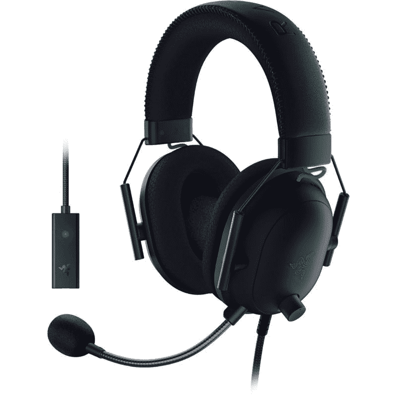
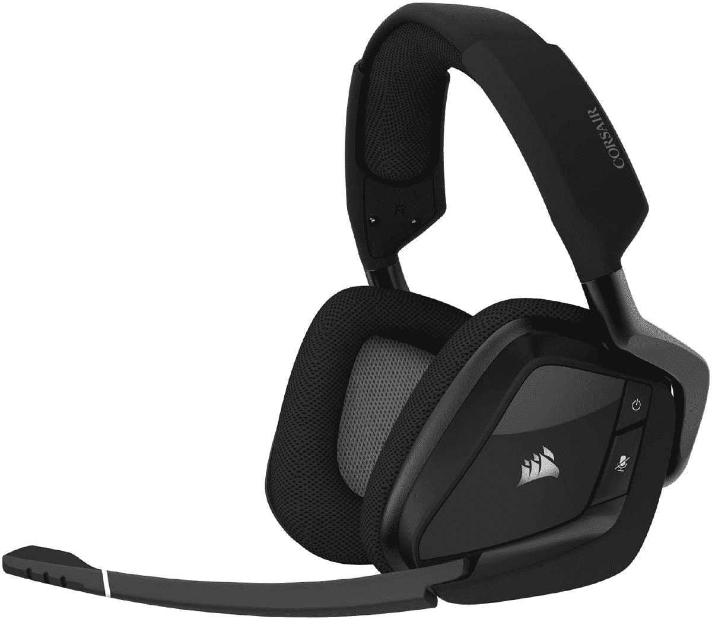
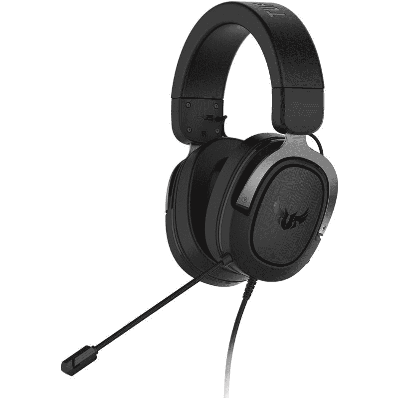
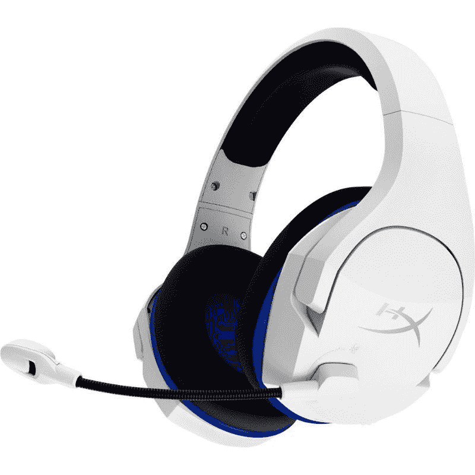
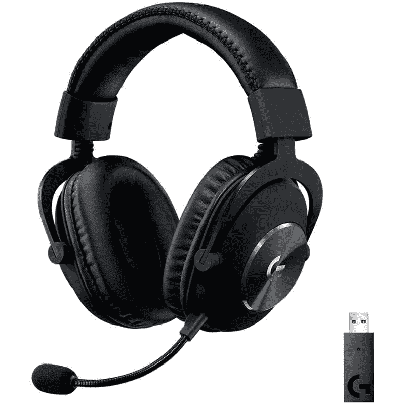
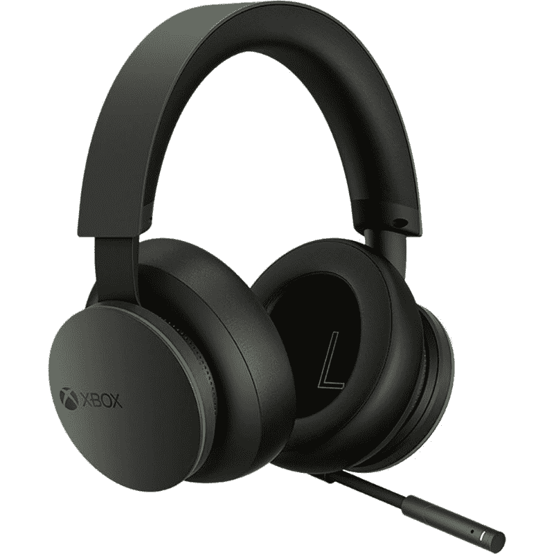
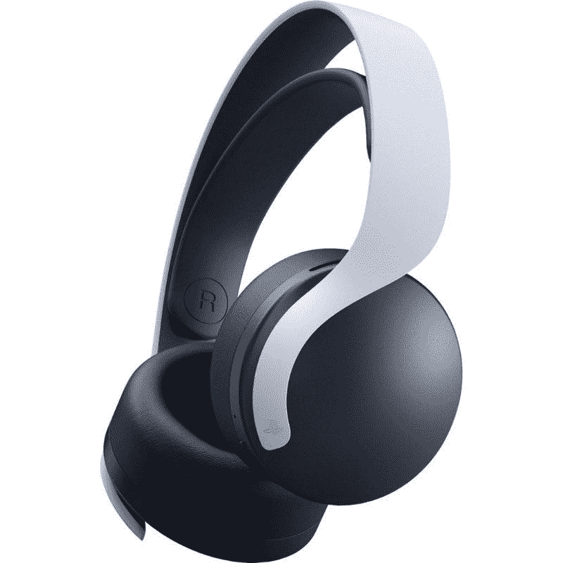

# 2023 年最佳游戏耳机

> 原文：<https://www.xda-developers.com/best-gaming-headset/>

购买最好的游戏耳机对于获得良好的体验至关重要。一个好的耳机可以在玩游戏时产生巨大的影响，无论是在线竞技射击游戏还是休闲的单人游戏。您对游戏耳机的选择将决定您如何在虚拟世界中听到音效，以及如何在游戏中与队友交流。

但就像其他外设一样，选择合适的游戏耳机并不容易，因为市场上有太多的选择。没有放之四海而皆准的解决方案，但是我们已经收集了您下次购买时应该考虑的最佳解决方案。

## 最佳有线游戏耳机:Razer BlackShark V2

有线游戏耳机并不短缺，这一领域的竞争非常激烈。但在所有可用的选项中，我们认为雷蛇黑鲨 V2 是最突出的一个。这款游戏耳机有很多令人喜欢的地方，我们认为它符合所有要求。

Razer Blackshark V2 基于 2012 年推出的标志性原装 Blackshark 耳机。它因其音质、舒适度和麦克风质量在社区中非常受欢迎。新的黑鲨 V2 在这些关键方面进行了本质上的改进，以提供更好的整体体验。除了现代的设计之外，BlackShark V2 耳机还使用了 Razer 的 TriForce Titanium 50mm 毫米驱动器。

就音质而言，黑鲨 V2 被认为是这一领域的佼佼者。音频质量非常清晰，低音、中音和高音分离良好，避免音调相互干扰。对于一个售价 100 美元的耳机来说，这尤其令人惊讶，所以这太好了。这款耳机最棒的一点是，你可以使用 Razer 的 Synapse 软件进一步调整音频质量。您还可以使用 THX 空间音频软件来提高整体音频质量，不仅仅是游戏体验。该软件还预装了专门的游戏简介，如 CS:GO、Apex Legends、 [Valorant](https://www.xda-developers.com/riot-games-valorant-reportedly-wont-run-on-pcs-that-bypass-windows-11-system-requirements/) 等。

Razer BlackShark v2 有一个最小的，微妙的设计。它比市场上的许多其他游戏耳机都轻，而且它有泡沫垫，让它在长时间的游戏中佩戴舒适。在长时间的游戏过程中，购买一副佩戴舒适的耳机非常重要。黑鲨 V2 在这方面很棒。该耳机还配有一个可拆卸的 Razer HyperClear 心形麦克风。公平地说，虽然麦克风是最薄弱的环节。这足够清楚了，但 Razer 在麦克风质量方面仍有工作要做。

雷蛇也有无线版本的黑鲨 V2。虽然价格更高，但也有白色的。

 <picture></picture> 

Razer BlackShark V2 Wired Gaming Headset

##### 雷蛇黑鲨 V2

Razer BlackShark V2 有线游戏耳机价值 100 美元，物超所值。它提供了一个很好的功能组合，包括 THX 空间音频的出色音频质量，良好的声音麦克风，等等。

## 最佳无线游戏耳机:海盗船 Void RGB Elite

如果你想要一副高质量的游戏无线耳机，Corsair 的 Void RGB Elite 是你最好的选择。这是该公司广受欢迎的耳机系列的最新产品，售价 109 美元，与市场上的其他无线型号相比并不算特别贵。

Void RGB Elite 的设计非常舒适，这要归功于头带和耳杯上的衬垫，它们可以在两个轴上旋转，以找到适合任何人头部的合适位置。它主要由塑料制成，带有一些金属部件，这使得它不如我们希望的那样耐用，但只要妥善保管，应该可以使用很长时间。

像许多面向游戏的耳机一样，Void RGB Elite 使用特殊的 USB 发射器，而不是蓝牙。这是出于几个原因:蓝牙有更多的滞后，并不是所有的 PC 都支持蓝牙，这些定制的发射器可以支持更长的范围，在 Void RGB Elite 的情况下为 40 英尺。其他硬件功能包括音量调节旋钮、麦克风静音按钮、不使用时麦克风自动静音以及耳机两侧的 RGB。我们失望地看到一个微型 USB 端口。微型 USB 只是越来越老了，如果能看到 USB Type-C 就好了。

Void RGB Elite 配备 7.1 环绕声，并与 Corsair 的 iCue 软件兼容，用于定制音频功能和 RGB。如果你不喜欢这些耳机开箱后的声音，在 iCue 中调整 Corsair 耳机的音量非常简单。

海盗船的 Void RGB Elite 售价 109 美元，提供了一系列相当不错的功能:无延迟和远程无线通信、像样的麦克风、自动静音、RGB 和 7.1 环绕声。这款耳机对于讨厌有线的游戏玩家来说是一款非常棒的多面手，不过如果你对无线不感兴趣，也有有线版本。

 <picture></picture> 

Corsair Void RGB Elite Wireless headset

##### 海盗船 Void RGB 精英无线耳机

Corsair Void RGB Elite 无线耳机配有 7.1 环绕声、50 毫米驱动器和 2.4GHz 无线连接，通过专用接收器实现无延迟体验。

## 替代最佳游戏耳机:华硕 TUF 游戏 H3

如果你的预算非常少，那么我们认为华硕 TUF 游戏 H3 是一个很好的选择。TUF 游戏 H3 最好的一点是，它可以很好地与各种平台兼容，包括 PC、Mac、PlayStation、Xbox 和任天堂 Switch。

TUF 博彩 H3 是相当简单的设计。它有一个全黑色的结构，稍微拉长的耳罩佩戴舒适。作为一款有线游戏耳机，TUF 游戏 H3 依靠 3.5 毫米插孔进行连接。这是一种简单的非编织电缆，无法从耳机主体上拆下。

除了平均建设质量，然而，没有太多抱怨 TUF 游戏 H3。事实上，它是这个价格范围内声音较好的耳机之一。它在各种游戏中都能很好地工作，而不会强迫你在不同的档案间切换。其令人印象深刻的声音背后的一个主要原因是其舒适和贴身。你可以很容易地听到所有重要的脚步声和音频提示，主要是因为音频没有泄露出去。该耳机还支持虚拟 7.1 环绕声，这在这种价格实惠的耳机上并不常见。

说到麦克风，TUF 游戏 H3 在底部有一个不可拆卸的长杆。这是一个灵活的麦克风，但你可能仍然很难保持它在视线之外。不过，就音质而言，它表现不错。它可以滤除大部分背景噪音，还可以压缩音频信号以提高清晰度。它的音质比不上高端耳机，但它的价格已经足够了。

 <picture></picture> 

ASUS TUF Gaming H3 Wired Gaming Headset

##### 华硕 TUF 游戏 H3 有线游戏耳机

华硕 TUF 游戏 H3 是一个坚实的一对预算游戏耳机，提供良好的音质。它没有令人印象深刻的设计，但价格适中。

## 最佳预算无线游戏耳机:HyperX 云毒刺核心无线

如果你想在市场上买一个便宜的无线游戏耳机，我们建议你看看 HyperX Cloud Stinger Core wireless。它的价格约为 80 美元，就无线游戏耳机而言，这是相当实惠的。它不是市场上功能最齐全的游戏耳机，但它是一个不太贵的可靠选择。

HyperX 云毒刺核心看起来就像它的有线对应物。这就好像 HyperX 拿走了一副有线云毒刺耳机，并切断了电线。不过，这不一定是件坏事。Stinger Core 头戴式耳机的特点是带有几度旋转的网状耳罩。头带和耳杯上的填充物也相当轻，佩戴舒适。在这一点和整体轻量级设计之间，可以肯定地说，你可以佩戴 Cloud Stinger Core 进行长时间的游戏会话，而不会出现任何问题。

在电池寿命方面，HyperX Cloud Stinger Core 一次充电可以持续 17 小时左右。这款耳机最大的优点之一就是可以通过 USB Type-C 端口充电。如果你已经有了另一个带有 USB-C 端口的现代外设，那就少了一根电缆。对于连接，Cloud Stinger 核心依赖于一个小型无线加密狗，通过 2.4GHz 连接连接到您的 PC 或笔记本电脑。

对于音频，云毒刺核心使用 40 毫米钕定向驱动器。它支持 Windows 上的软件支持的虚拟 7.1 环绕声功能，这是一个很好的补充。音频质量，虽然没有什么特别的，但对于价格来说还是很不错的。它提供清晰的音频和良好的分离，使您可以轻松地听到游戏中敌人的脚步声、聚会聊天中朋友的声音等等。您还可以依靠这款耳机的内置麦克风与您的成员聊天。它也有同样的翻转静音功能，这是我们过去见过的，很好。

 <picture></picture> 

HyperX Cloud Stinger Core Wireless Gaming Headset

##### HyperX 云毒刺核心无线

HyperX Cloud Stinger Core 无线游戏耳机是一对可靠的易拉罐，提供令人印象深刻的音频质量和良好的设计，仅售 80 美元。

## 最佳高端无线游戏耳机:罗技- G PRO X 无线

如果你正在寻找一个伟大的高端无线游戏耳机，那么我们认为你应该考虑看看罗技 G Pro X 无线。这实际上与 2019 年推出的有线前身是一样的耳机，除了这个是无线的。

除了电线之外，这款耳机在视觉上与旧款相同。它主要由金属制成，配有钢铰链和一个包在皮垫中的弹性带。它有相同的黑色美学，没有其他颜色选择。由于增加了电池，新版本有点重，但佩戴起来仍然非常舒适。对于连接，罗技 G Pro X 无线依赖于 2.4GHz 的 USB 射频转换器。它提供无延迟的无线音频，即使对于专业电子竞技玩家来说也是一个完美的选择。

罗技 G Pro X 无线是伟大的游戏。由于佩戴舒适，它也适合玩游戏。它还提供虚拟环绕声，以模拟 Valorant、Apex Legends 等游戏中的定向音频。罗技 G Pro X Wireless 也可以很好地与各种控制台配合使用。罗技表示，它的功能范围为 15 米，这意味着它也非常适合在沙发上玩游戏。

罗技 G Pro X 无线在音质方面也很棒。这是一款适合游戏和媒体消费的耳机。它还提供了不错的隔离，但不要指望它能屏蔽所有外部噪声。麦克风也相当不错，但它变得更好的蓝色 Vo！ce '软件。您可以从一堆预置中选择，也可以创建自己的自定义均衡器。蓝色 Vo！“ce”是一款非常全面的软件，如果你最终决定购买这款耳机，我们强烈建议你探索一下。

 <picture></picture> 

Logitech G Pro X Wireless Gaming Headset

##### 罗技 G Pro X 无线

对于那些寻求无延迟无线连接的人来说，罗技 G Pro X Wireless 是一个很好的选择。G Pro X Wireless 还拥有优质的麦克风，是在线游戏的完美选择。

## Xbox 最佳游戏耳机:Xbox 无线耳机

如果你正在为你的 Xbox 主机寻找一个耳机，那么我们推荐官方的 Xbox 无线耳机。这款特殊的耳机非常适合那些希望购买一款简单易用的配件的人，这款配件可以与 Xbox 配合使用，并以相对实惠的价格提供正确的功能。如果这就是你要找的，那就别再找了。在兼容性方面，Xbox 无线耳机可以与 Xbox 系列 X 和 S、Xbox One、PC 和移动设备兼容。

说到设计，Xbox 无线耳机的黑色塑料底盘在耳罩周围有一个微妙的绿色亮点。这是一款外观相对简单的耳机，设计时尚，配有毛绒泡沫头带和耳罩。右边有一个 Xbox 标志，表明这是微软官方的配件。Xbox 无线耳机最棒的一点是它将音量旋钮整合到了耳罩面板中。您可以旋转右耳罩面板来调节音量，而左耳罩调节游戏/聊天音频。它比旋转物理转盘来调节声音更直观。

Xbox 无线耳机佩戴起来也很舒适，因为它有柔软的支撑耳罩和软垫头带。这绝对是那种可以长时间佩戴而不会出现任何问题的耳机。整体音频质量也与同价位的许多耳机不相上下。它提供了一个平衡的音景，让您听到所有音频的良好细节。

这款耳机最棒的一点是它支持 Xbox 无线协议和蓝牙。它还可以同时工作，这意味着您可以在游戏机上玩游戏的同时使用这两种配对来听音乐或接电话。论续航，Xbox 无线耳机一次充电应该能坚持 15 个小时左右，这是可以的。它可能会更好，但是考虑到它的特性集，你可以任其发展。

 <picture></picture> 

Xbox Wireless Gaming Headset

##### 微软 Xbox 无线耳机

微软的 Xbox 无线游戏耳机是与 Xbox 主机搭配的完美音频配件。其实惠的价格和可靠的功能使其优于市场上的许多其他选择。

## PlayStation 5 最佳游戏耳机:索尼 Pulse 3D 无线耳机

你不一定要花大价钱为你的 PS5 买一个高质量的耳机。索尼自己的 Pulse 3D 无线耳机是我们为 2022 年 PS5 选择的最佳无线耳机。作为 PS5 的官方配件，Pulse 3D 无线游戏耳机可以与主机无缝配合，并且它还支持 PS5 的 3D 音频。

Pulse 3D 无线耳机配有 USB 加密狗，您可以将其插入 PC、Mac 或 PS5 本身。此外，它还配有一个 3.5 毫米耳机插孔，让你可以与音频插孔的基本任何东西配对。也就是说，除了 PS5 之外，所有设备都只能获得基本的立体声音频。索尼 Pulse 3D 无线耳机就像 PlayStation 5 一样，具有非常未来的设计。这种设计并不适合所有人，但我们认为它看起来很简洁，并且与主机很相配。

我们不喜欢 Pulse 3D 无线耳机的一点是，它没有配备吊杆麦克风。由于这个原因，耳机不能很好地将你的声音从背景噪音中隔离出来，所以当谈到麦克风质量时，它可能不是最好的。如果你经常发现自己在嘈杂的环境中玩，那么最好要么关闭语音聊天，要么寻找其他选项。另一方面，音频质量和 3D 沉浸感非常好。3D 音频沉浸感确实是您需要体验的东西，Pulse 3D 耳机听起来很棒，与 Tempest 3D 音频配合很好。

Pulse 3D 耳机还提供了良好的电池续航时间。对于游戏马拉松来说，它并不理想，但是一次充电使用 12 个小时应该没有问题。话虽这么说，电池没电了还可以用 3.5mm 耳机插孔来用耳机，那就不错了。关于耳机有一点值得指出的是，耳垫更适合较小的耳朵。因此，如果你的耳朵比较大，那么你可能会发现长时间佩戴 Pulse 3D 耳机会不舒服。

 <picture></picture> 

Sony Pulse 3D Wireless Gaming Headset

##### 索尼 Pulse 3D 无线游戏耳机

索尼 Pusle 3D 无线耳机非常适合那些寻求简单易用的无线耳机以获得休闲游戏体验的人。

* * *

这就是我们收集的 2022 年你能买到的最好的游戏耳机。Razer Blackshark V2 和 Corsair Void RGB Elite 是我们挑选的最佳游戏耳机。它们都以相对实惠的价格提供令人印象深刻的音质和舒适的贴合感。如果你正在购买廉价耳机，那么考虑看看华硕 TUF H3。我们还为 Xbox 和 PlayStation 游戏机添加了高级选项和专用配对，请务必查看。

本系列中提到的所有耳机都适用于个人电脑和笔记本电脑。如果你想买一台新的笔记本电脑，我们鼓励你看看我们的一些产品系列，包括[最佳笔记本电脑](https://www.xda-developers.com/best-laptops/)、[最佳游戏笔记本电脑](https://www.xda-developers.com/best-gaming-laptops/)，甚至还有[最佳预算游戏笔记本电脑](https://www.xda-developers.com/best-cheap-gaming-laptops/)。和往常一样，您可以加入我们的 [XDA 计算论坛](https://forum.xda-developers.com/c/xda-computing.12289/)来讨论并从我们社区的专家那里获得更多的产品推荐。