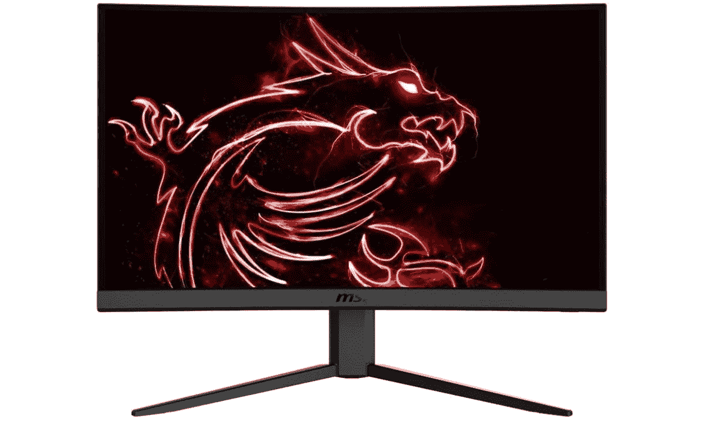
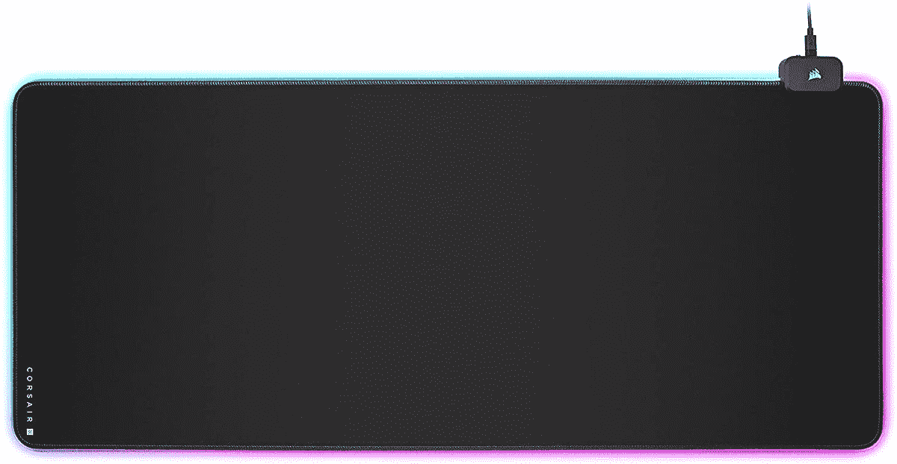

# 2023 年最佳游戏笔记本电脑配件

> 原文：<https://www.xda-developers.com/best-gaming-laptop-accessories/>

[最佳游戏笔记本电脑](https://www.xda-developers.com/best-gaming-laptops/)配件可以提升任何 PC，无论是经济型还是高级，成为真正的娱乐中心。现在，越来越多的游戏玩家转向笔记本电脑寻求便携性和性能，配件市场正在起飞。由于选择和品牌的数量巨大，在游戏配件市场导航可能会势不可挡，这就是为什么我们在这里收集了一批绝对最好的游戏笔记本电脑配件。最棒的部分？它们几乎可以在任何个人电脑上运行，所以你的桌面也会有同样的改进。我们提供了最好的游戏鼠标、键盘、耳机、显示器等一切，帮助您获得完整的最佳设置。

*   ##### Razer death adder V3 Pro

    Razer 的最新化身其 DeathAdder Pro 是我们在谈到身边的[最佳游戏鼠标](https://www.xda-developers.com/best-gaming-mouse/)时的首选。它符合人体工程学，握感舒适(只要你是右撇子)，它有一个 4000Hz 的无线转换器，30，000 DPI 的光学传感器跟踪效果非常好。电池可持续使用长达 90 小时，自定义配置文件允许快速设置。抓住它的黑色或白色。

*   ##### 罗技 G Pro 无线

    罗技的 G Pro 无线游戏鼠标长期以来一直是休闲和专业游戏玩家的最爱。它比 DeathAdder V3 Pro 更实惠，重量只有 80g，用在右手或左手都超级舒服。它有一个 Hero 16K 传感器，用于精确指向，附带的适配器具有 1 毫秒的报告速率，电池只是去了又去。

*   ##### 海盗船 K100 RGB

    海盗船的 K100 RGB 是我们挑选的[最佳机械键盘](https://www.xda-developers.com/best-mechanical-keyboards/)。它具有 4，000Hz 的轮询速率，0.5 毫秒的响应时间，以及 OPX 光学机械开关，具有极其精确的按键记录。大甲板包括宏键，控制轮，RGB 边缘照明，当然，每个键可定制的 RGB 照明。

*   ##### 雷蛇 Huntsman Mini

    雷蛇的 Huntsman Mini 对于那些想要更紧凑的东西的人来说是一个出色的 60%键盘选择。它配有红色开关，驱动距离为 1.2 毫米，驱动力为 48 克，让您在竞争中领先一步。它的建造很好，它具有 Razer 的可定制色度 RGB，并有黑色或汞白色可供选择。

*   它很容易连接，握起来很舒服，会让你忘记鼠标和键盘。从一堆不同的颜色和设计中选择最适合你的风格。T31
*   ##### HyperX Cloud II

    如果你想无线上网，HyperX Cloud II 是最好的游戏耳机[之一](https://www.xda-developers.com/best-gaming-headset/)。即使在长时间的游戏中，它也非常舒适，由于可调节的带子，它适合大多数头部，电池可持续约 30 小时。最重要的是，声音清晰，麦克风不会打扰你的朋友。使用 2.4GHz 转换器连接到您的电脑。

*   ##### 雷蛇黑鲨 V2

    如果你想坚持使用有线耳机，没有比雷蛇黑鲨 V2 更好的了。他们采用了 Razer 的 TriForce titanium 50mm 毫米驱动器来实现颠簸的声音，你可以使用 Razer 的软件仔细调整音频。THX 空间音频甚至可用。耳机轻便舒适，麦克风可拆卸。

*   ##### Thermaltake 海量 20 RGB

    游戏笔记本电脑将大量硬件塞进狭小的空间，内置散热系统有时会跟不上。Thermaltake 巨大的 20 RGB 散热垫增加了一个 200 毫米的风扇，可定制的 RGB 照明，以及内置的支脚来支撑您的 PC。这是在不升级笔记本电脑的情况下最大化帧速率的好方法。

    T31
*   ##### 三星奥德赛 G7

    拥有 1440p (QHD)分辨率的[最佳游戏显示器](https://www.xda-developers.com/best-gaming-monitors/)之一就是三星奥德赛 G7。其 QLED 显示屏提供 1 毫秒的响应时间、240 赫兹的刷新率、精确的色彩再现和高达 600 尼特的亮度。它是弯曲的，以便更容易看到，HDR 是额外的活力。它兼容 NVIDIA G-Sync 和 AMD FreeSync Premium Pro，并且有大量端口可以轻松连接。

*   <picture></picture>

    MSI Optix g24c 4

    ##### MSI Optix g24c 4

    不是每个人都需要 QHD 或 4K 分辨率，尤其是游戏笔记本电脑。微星的 Optix G24C4 是一款 24 英寸 1080p 显示器，价格实惠，规格令人印象深刻。刷新率达到 144Hz，响应时间为 1 毫秒，1500R 曲线便于观看。它很好地涵盖了 sRGB 和 DCI-P3 色域，并包括 DP 和 HDMI 端口。

*   <picture></picture>

    埃尔加托 hd60s

    ##### 埃尔加托 HD60 S

    埃尔加托的 HD60 采集卡可以帮你实现你的流媒体野心；只需通过 HDMI 将其连接到您的笔记本电脑和显示器，即可以每秒 60 帧的速度解锁 1080p 流媒体。它体积小巧，功能强大，是您在同时进行游戏和流媒体播放时最大限度提升性能的理想之选。

*   ##### 罗技 StreamCam

    游戏流媒体的另一个关键组成部分可以用这个罗技 StreamCam 来检查，它是[最好的网络摄像头之一](https://www.xda-developers.com/best-webcams/)。当然，你的游戏笔记本电脑可能有内置网络摄像头，但它可能无法匹配这里提供的 1080p 60fps 视频。罗技的自动取景和自动曝光增强功能让你的观众尽可能看起来更好。

*   <picture></picture>

    Corsair mm 700 RGB 游戏鼠标垫

    ##### Corsair mm 700 RGB 游戏鼠标垫

    使用外接鼠标将有助于您的准确性，但在普通的旧桌上使用它将会抵消任何优势 Corsair 的 MM700 RGB 是[最好的鼠标垫](https://www.xda-developers.com/best-rgb-mousepads/)之一，它提供了一个平滑无缝的指向区域。它的内置 RGB 照明是可定制的，允许您将其与您的设置的其余部分相匹配。

*   ##### 网件夜鹰 XR1000

    游戏笔记本电脑的好处在于它可以去任何地方，但在线游戏玩家将需要一个能够跟上的 Wi-Fi 路由器。Netgear 的 Nighthawk Pro XR1000 就是这样的路由器，为您的所有设备提供跨两个频段的 AX5400 速度。DumaOS 3.0 可以轻松地对网络流量进行优先级排序和监控，您可以预期高达约 2500 平方英尺的覆盖范围。

*   ##### Matein 旅行背包

    为你的游戏笔记本电脑和配件准备一个优质背包绝对不是个坏主意。你会想利用个人电脑的便携性，但游戏笔记本电脑仍然很重。这款 Matein 包有一个用于存放笔记本电脑的套，还有许多用于存放旅行物品的口袋。它有 12 种不同的颜色和 15.6 或 17 英寸的尺寸。

    T17

## 为您的游戏笔记本电脑选择最佳配件

游戏笔记本电脑出厂时就可以运行您最喜爱的游戏，您只需一台电脑和一个交流适配器就能应付自如。然而，笔记本电脑的触摸板并不适合任何动作游戏，键盘可能没有你需要的所有按键，扬声器可能不会提供你需要的声音，显示器可能不够大。我们建议首先选择一个外部鼠标，在这种情况下，Razer DeathAdder V3 Pro 或 Logitech G Pro Wireless 是首选。也可以用无线手柄，最新的 Xbox 版本是最好的之一。

至于声音，选择优质耳机可以带来更身临其境的体验。如果你喜欢竞技游戏，这可能意味着生与死的区别。如果你想无线上网，HyperX Cloud II 是一个很好的选择，而 Razer BlackShark V2 是一款高端无线耳机。如果你发现笔记本电脑的显示屏不够大，看看三星 Odyssey G7 或 MSI Optix G24C4 不失为一个好主意。如果你有更多的预算，那么[最佳 4K 游戏显示器](https://www.xda-developers.com/best-4k-gaming-monitors/)可能会更合你的心意。

一旦你建立了一个强大的游戏硬件核心，Elgato 和 Logitech 的流媒体配件就会发挥作用。这可能需要更好的路由器，但 Netgear Nighthawk XR1000 可以胜任这项任务。最后，别忘了拿起一个[大笔记本电脑背包](https://www.xda-developers.com/best-laptop-backpacks-college/)，装上你的电脑和所有新配件。

我们推荐查看我们挑选的[最佳游戏笔记本电脑](https://www.xda-developers.com/best-gaming-laptops/)、[最佳廉价游戏笔记本电脑](https://www.xda-developers.com/best-cheap-gaming-laptops/)和[最佳 AMD 锐龙笔记本电脑](https://www.xda-developers.com/best-amd-ryzen-laptops/)。有大量的选项可供选择，你一定会找到适合你需要的东西。