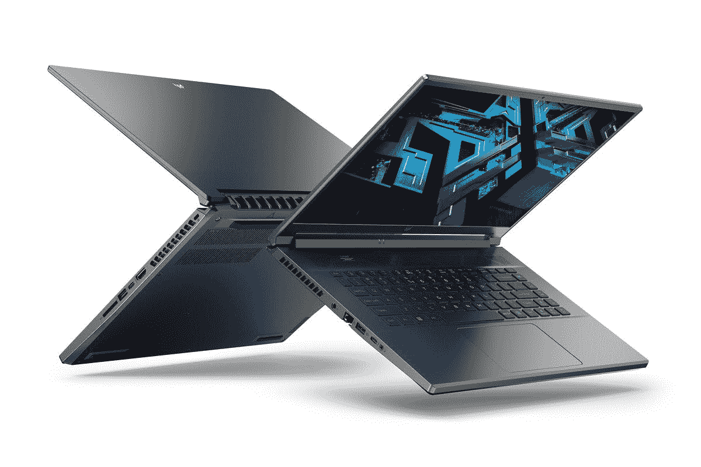
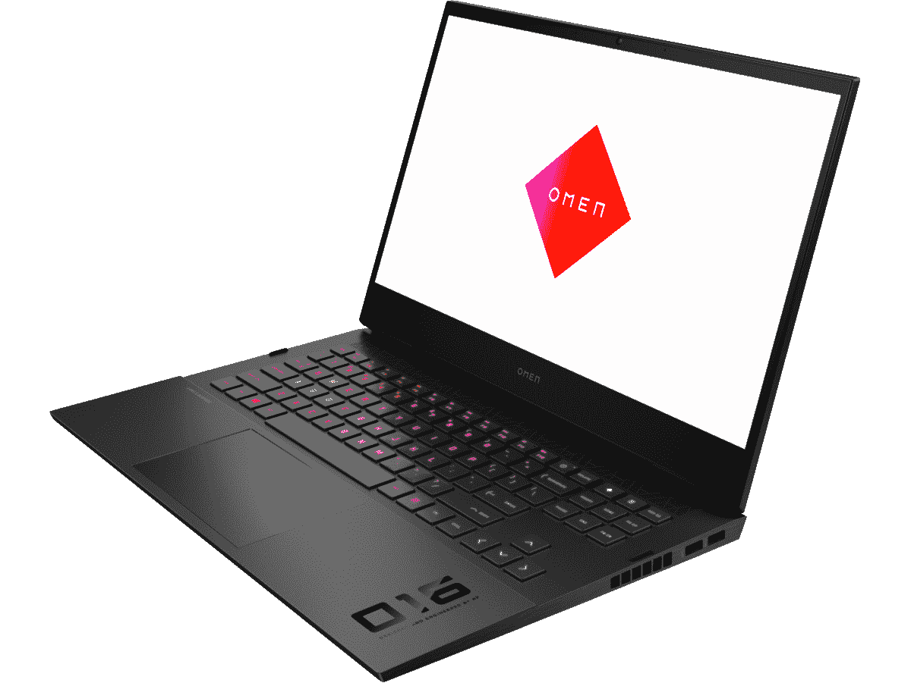
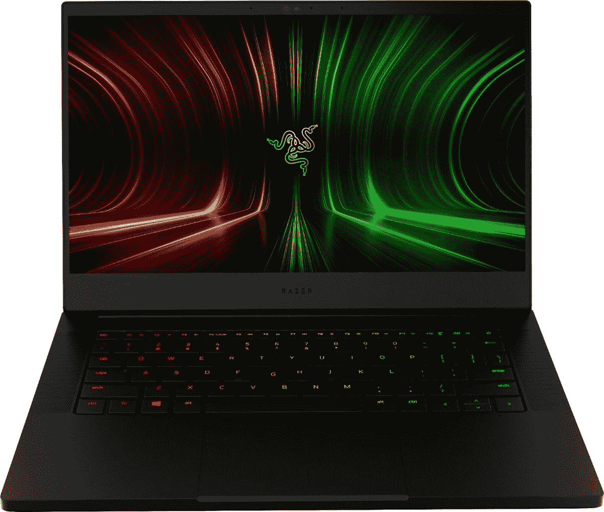
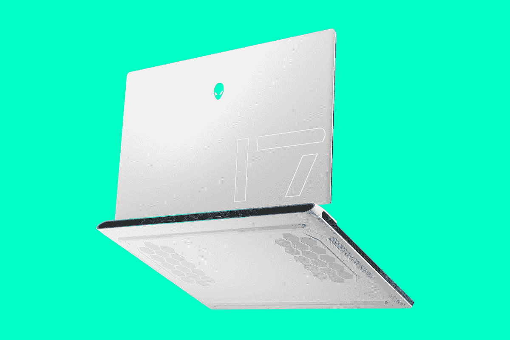

# 2023 年最佳游戏笔记本电脑

> 原文：<https://www.xda-developers.com/best-gaming-laptops/>

游戏是世界上最流行的娱乐方式之一，对我们许多人来说，也是最好的娱乐方式。但与许多其他形式的娱乐不同，游戏需要特定且通常昂贵的硬件来享受。很难找到你喜欢的东西，当你花费超过 1000 美元时，你希望确保你得到的东西正好适合你。为了帮助您，我们收集了一些您今天可以购买到的最好的游戏笔记本电脑，因此您可以放心购买。

虽然每个人都有不同的需求，但对于游戏笔记本电脑来说，有几样东西往往非常重要——强大的规格，如 CPU、GPU 和 RAM——以及可以尽可能流畅地运行游戏的高刷新率显示器。当然，你可能需要考虑更多因素，比如网络摄像头质量或整体便携性。这取决于你在寻找什么，但我们已经收集了一些选项，所以你可以找到适合你的。

## 最佳综合:宏基掠夺者 Triton 500 SE

宏碁是一个相当受欢迎的品牌，但与其他一些品牌相比，这个名字可能有点不为人知。不过，这不应该抹杀这样一个事实:宏碁 Predator Triton 500 SE 绝对是一款出色的机器。如果您想要在时尚和(某种程度上)便携的包装中获得强大的性能和出色的屏幕，这就是您的笔记本电脑。

首先，在性能方面，宏碁 Predator Triton 500 SE 最高配备了英特尔酷睿 i9-12900H，这是一款 45W 处理器，具有 14 个内核，20 个线程，速度提升至 5GHz。对于所有游戏来说，这是一款出色的处理器，它将为您提供比大多数游戏可能需要的性能更高的性能。您还可以搭配高达 Nvidia GeForce RTX 3080 Ti GPU，因此您可以毫无问题地运行任何您想要的现代游戏。此外，高达 32GB 的内存和 2TB 的内存为您提供了全面体验所需的一切。以后你也可以自己升级这些东西。

Predator Triton 500 SE 的一大优点是，它不仅可以用于游戏，这与显示器有很大关系。宏碁在这里使用 16 英寸的面板，长宽比为 16:10，因此它也非常适合完成工作。但是，如果游戏是您的重点，四核高清+ (2560 x 1600)分辨率和 240Hz 刷新率也将为您提供清晰的视觉效果和流畅的体验，几乎可以玩任何游戏。此外，我们甚至发现这个屏幕上的色彩还原非常好，sRGB 的覆盖率为 100%，P3 DCI 的覆盖率为 99%。

与许多其他笔记本电脑不同，宏碁 Predator Triton 500 SE 也没有忽视网络摄像头。它配有一个全高清摄像头，虽然 Windows Hello 没有面部识别支持，但至少你有一个指纹识别器。

在端口方面，宏碁 Predator Triton 500 SE 配备了很多，这是你对游戏笔记本电脑的期望。有两个 Thunderbolt 4 端口、两个 USB Type-A 端口、HDMI 2.1、RJ45 以太网、一个耳机插孔和一个全尺寸 SD 读卡器。你真的不能要求更多，这应该确保您所有的外围设备将无需适配器工作。

总的来说，这是一台非常时髦的机器。它的厚度为 0.78 英寸，重量为 5.28 磅，显然不是超级轻，但考虑到内部强大的规格，它仍然相当便携。从外表上看，它也很干净。它采用光滑的银色机箱，没有太多的 RGB 照明让它显得太突出。键盘有 RGB 灯光，但仅此而已。

虽然宏碁 Predator Triton 500 SE 不是最便宜的机器，但它是一款出色的笔记本电脑，与许多其他类似规格的笔记本电脑相比，它的价格仍然相当合理，并且它没有为此做出太多牺牲。下面可以买。

 <picture></picture> 

Acer Predator Triton 500 SE

##### 宏基掠夺者 Triton 500 SE

Acer Predator Triton 500 SE 是一款功能强大的游戏笔记本电脑，具有顶级的规格和出色的显示性能，适合游戏和工作。

## 配备有机发光二极管显示屏的最佳顶级游戏笔记本电脑:Razer Blade 15 (2022)

如果你有钱花，并且想要一种全面的顶级体验，那么 [Razer Blade 15](https://www.xda-developers.com/razer-blade-15-2022-oled-review/) 可能就是你想要的。这是一款非常高端的游戏笔记本电脑，有一些配置选项，因此您可以根据自己的喜好进行调整。

从性能开始，Razer Blade 15 配备了英特尔酷睿 i9-12900H CPU，具有 14 个内核，20 个线程，速度高达 5Ghz，是目前最强大的笔记本电脑处理器之一。作为备份，您可以获得最高配有 105 瓦功率的 NVIDIA GeForce RTX 3080 Ti 显卡的 Razer Blade 15，从而获得出色的游戏体验。您可以搭配高达 32GB 的 DDR5 RAM(可升级至 64GB)和 1TB 固态硬盘，如果您希望以后扩展存储，还可以加上一个免费的 M.2 插槽。所有这些使得 Blade 15 已经成为最好的游戏笔记本电脑之一。

Razer Blade 15 Advanced 为您提供了几个显示器选项，因此您可以选择更符合您需求的产品。它是一个 15.6 英寸的面板，长宽比为 16:9，但你可以选择一个具有超快的 360Hz 刷新率的全高清(1920 x 1080)面板，一个具有 240Hz 或 165Hz 刷新率的四高清(2560 x 1440)型号，或者一个具有 144Hz 刷新率的超高清(3840 x 2160)面板。但最好的选择可能是最近推出的有机发光二极管模式。这为您提供了只有有机发光二极管才能提供的四核高清分辨率、240Hz 刷新率和 0.1 毫秒的超快响应时间，带来了非凡的游戏和媒体体验。

Razer Blade 15 还不像大多数游戏笔记本电脑那样牺牲网络摄像头，从而增加了完整的优质体验。这里有一个全高清/1080p 摄像头，因此您可以传输游戏或进行视频通话，而且看起来仍然很棒。另外，该相机甚至支持 Windows Hello 面部识别。你不会在这个列表中的更多笔记本电脑上找到这种组合。

Razer Blade 15 的设计干净而时尚，使这款笔记本电脑可以在公共场合轻松使用，而不会引起太多关注。这是一个内外全黑的机箱，除了盖子上的绿色雷蛇标志。键盘具有每个按键的 RGB 背光，但它只透过按键的标签发光，所以它不像其他游戏笔记本电脑那样令人讨厌。考虑到其规格，Razer Blade 15 也相当便携，重量仅为 4.4 磅。另外，它的厚度不到 17 毫米。这令人印象深刻，并有助于整体的溢价感觉。

你也不会错过港口。Razer Blade 15 Advanced 有两个 USB Type-C/Thunderbolt 4 端口(每侧一个)，三个 USB Type-A (3.2 Gen 2)端口，HDMI 2.1，一个耳机插孔和一个全尺寸 SD 读卡器。你可能唯一想添加的是一个以太网端口，但这仍然是一个很好的端口设置，有了两个 Thunderbolt 端口，你可以使用 [Thunderbolt dock](https://www.xda-developers.com/best-thunderbolt-docks/) 添加任何你想要的连接。

Razer Blade 15 是一个完整的高级体验，具有高端性能、时尚的设计、适合不同用户的出色显示选项，甚至还有带 Windows Hello 的全高清网络摄像头。这不是一台便宜的笔记本电脑，但它到处都很棒，你不会错的。下面可以买。

 <picture></picture> 

Razer Blade 15

##### 雷蛇之刃 15

Razer 的 Blade 15 提供了游戏笔记本电脑中最顶级的体验之一，其规格和设计适合任何人。

## 最佳主流笔记本电脑:惠普 Omen 16

如果你想要一台功能强大、价格不贵的游戏笔记本电脑，[惠普 Omen 16](https://www.xda-developers.com/hp-omen-16-2022-review/) 可能是你目前能找到的最佳选择之一。它提供了非常好的性能，所以你可以以合理的价格运行任何现代游戏。

首先关注性能，Omen 16 配备了 AMD 锐龙 7 6800H，这是一款 8 核 16 线程的快速处理器，能够提升到 4.7GHz。它还配备了 Nvidia GeForce RTX 3060 GPU(尽管你可以升级到 RTX 3070 Ti)，所以你可以毫无问题地玩几乎任何你想玩的游戏。更高要求的标题可能需要你调整一些设置来获得更高的帧速率，但这已经是一个非常强大的 GPU 了。最重要的是，Omen 16 配备了 16GB 的内存(最高 32GB)，这对大多数游戏来说应该足够了，还有一个 512GB 的固态硬盘(最高 1TB)，也可以存储一些游戏。

你还需要一个好的游戏显示器，Omen 16 为大多数人提供了一个非常可靠的体验。它有一个 16 英寸的全高清分辨率面板和 16:9 的宽高比，这仍然是游戏笔记本电脑最常见的格式。该面板还具有 144Hz 的刷新率，因此您可以享受更流畅的游戏体验，并在快速反应至关重要的游戏中做出更快的反应。还有一个四高清 165 赫兹面板的选项。可悲的是，这里的一个妥协是网络摄像头，尽管这对于游戏笔记本电脑来说相当典型。你买了一台 720p 的相机，必要时还能用，但如果你经常使用，就不太理想了。

Omen 16 的特点是相当干净的美学，灰色的底盘，没有太多的天赋，这不是一件坏事。这是一款无论放在哪里都很好看的笔记本电脑，如果您确实想让它更有个性，RGB 背光键盘可以让您添加一点颜色，而不会过于花哨，因为颜色只会透过按键标签发光。这是一款相当重的笔记本电脑，重量为 5.16 磅，厚度为 22.6 毫米。

四舍五入就是端口选择。两个 USB Type-C 端口、三个 Type-A 端口、HDMI、RJ45 以太网、一个耳机插孔和一个全尺寸 SD 读卡器为您提供了一个非常完整的设置，可以轻松处理所有外围设备。可悲的是，没有 USB4 支持，但你应该有足够的端口，所以你不会需要它。

总而言之，这是一款性价比很高的笔记本电脑，无论您玩什么，它都一定会给您带来稳定的游戏体验。

 <picture></picture> 

Omen 16t-b100

##### 惠普 Omen 16z

这一版本的 Omen 16 由 AMD 锐龙 7 和 Nvidia GeForce RTX 3060 驱动，它可以提供稳定的游戏体验，而无需倾家荡产。

## 最佳游戏笔记本电脑:微星泰坦 GT77

游戏笔记本电脑都是关于性能，如果你想要的权力，你不能得到比微星泰坦 GT77 提供的更多。无论从哪方面来看，这都是一台绝对的笔记本电脑，以至于你可能会说它不再是真正的便携式了，但它仍然比台式机更容易携带，并且它给你带来了令人难以置信的强大功能。

当我们说它非常强大时，我们不是在开玩笑。微星泰坦 GT77 配备了英特尔新的 HX 系列 CPU，其基本 TDP 为 55W。您可以配置高达 16 个内核和 20 个线程的英特尔酷睿 i9-12900HX，加上高达 5GHz 的加速速度，CPU 本身可以使用 150W 的功率，但还有 GPU。您可以为这款笔记本电脑配置高达 Nvidia GeForce RTX 3080 Ti，最高可使用 175 瓦的功率。总的来说，这两个组件最多可以使用 250 瓦，其中 175 瓦用于 GPU，75 瓦用于 CPU。对于笔记本电脑来说，这是令人难以置信的性能。您还可以获得高达 32GB 的内存(可升级到 64GB)和 1TB 的固态硬盘，如果您想要更多，还可以获得额外的 M.2 插槽。几乎从任何方面来看，这都是一台糟糕的机器。

这种显示器也是为了利用这种巨大的能量。这是一个 17.3 英寸的大面板，具有超高清(3840 x 2160)分辨率，屏幕非常清晰。此外，该显示器覆盖了 100%的 DCI-P3，因此色彩还原应该非常出色，使这款笔记本电脑成为游戏、媒体消费和内容创作的理想之选。最重要的是，你得到了 120 赫兹的刷新率，所以你仍然可以在这个分辨率下享受流畅的游戏。

大尺寸为大量电源腾出了空间，但遗憾的是，这并不是一个出色的网络摄像头。你有一个 720p 的摄像头，可以用于视频通话和流媒体，但你可能需要购买一个[外部网络摄像头](https://www.xda-developers.com/best-webcams/)才能获得最佳效果。谢天谢地，至少你有 Windows Hello 面部识别功能，这总是很好的，但并不总是游戏笔记本电脑的保证。

正如您可能预料的那样，这种能力不适合小型机箱。微星 Titan GT77 厚度高达 23mm，重量为 7.28 磅，不容易随身携带。这也是一款相当花哨的笔记本电脑，每个按键都有 RGB 照明，风扇排气口内有一个灯带。这在笔记本电脑的背面创造了一个大的灯条，肯定会引起一些注意，但当你随身携带这样的笔记本电脑时，这可能首先是不可避免的。

MSI Titan GT77 拥有丰富的端口，包括两个 Thunderbolt 端口、三个 USB Type-A 端口、RJ45 以太网、HDMI 2.1、mini-DisplayPort、一个耳机插孔和一个全尺寸 SD 读卡器，是您可以要求的最完整的设置之一。如果你需要更多，Thunderbolt 支持也使它更容易扩展。

这无疑是一台昂贵的笔记本电脑，但你不会在任何其他笔记本电脑上找到这种性能，对于一些游戏玩家来说，这可能是值得的要价。下面可以买，其他配置亚马逊上也有。

##### 微星泰坦 GT77

MSI Titan GT77 专为追求性能高于一切的用户打造，以便携性为代价，却拥有令人难以置信的性能。

## 最佳紧凑型 AMD 游戏笔记本电脑:Razer Blade 14

AMD 处理器在性能方面已经赶上甚至超过了英特尔的硬件。如果你是“红色团队”的粉丝，Razer Blade 14 是你今天可以得到的最好的 [AMD 驱动的笔记本电脑](https://www.xda-developers.com/best-amd-ryzen-laptops/)之一，它还具有非常便携的优点。这是 2022 年的更新，它带来了一些变化。

Razer Blade 14 由 AMD 锐龙 9 6900HX 处理器提供支持，这是一款非常强大的 CPU，具有 8 个内核，16 个线程，速度高达 4.9GHz。这是这款笔记本电脑唯一可用的处理器，所以至少你知道你会得到一个顶级的 CPU。对于图形，你可以使用 Nvidia GeForce RTX 3080 Ti，笔记本电脑可以提供高达 100W 的功率。它没有这个列表中的大笔记本电脑强大，但对于这个尺寸来说，这实际上是很棒的。它还配有 16GB 的内存(焊接的)和 1TB 的 M.2 固态硬盘。

Razer Blade 14 配备了 16:9 纵横比的 14 英寸面板和两种配置选项。像以前的型号一样，你可以获得 Quad HD (2560 x 1440)面板，它也有 165Hz 的刷新率，提供了图像质量和流畅游戏的巨大平衡，这也应该非常适合内部的 GPU。2022 年型号的 Blade 14 为显示器增加了一个更便宜的新选项，所以你可以选择 144Hz 刷新率的全高清面板，但这个选项只适用于 GeForce RTX 3060 GPU，这也是今年的新选项。

Razer Blade 14 上的网络摄像头类似于我们上面提到的 Blade 15 上的摄像头。Razer 已经让 Windows Hello 的 1080p 网络摄像头支持其 Blade 笔记本电脑中的标准，这很好。这是帮助这款笔记本电脑脱颖而出的另一个好的附加功能。

按照 Razer 的一贯做法，作为一款游戏笔记本电脑，Blade 14 相当低调。它是一个全黑的铝制机箱，盖子上有一个绿色的 Razer 标志。RGB 照明的唯一暗示是在键盘上，每个按键都有 Razer Chroma RGB，但灯光只能通过按键标签看到，所以它并不过分华丽。由于是 14 英寸笔记本电脑，这也是目前最轻的游戏笔记本电脑之一，重 3.92 磅，厚 16.8 毫米。这是一款游戏笔记本电脑，您可以轻松带到学校或旅途中，尽管它仍然比超极本重得多。

至于端口，Razer Blade 14 封装了两个 USB Type-C (3.2 Gen 2)端口，两个 USB Type-A (3.2 Gen 2)端口，HDMI 2.1 和一个 3.5 毫米耳机插孔。一些更大的笔记本电脑有更多的端口，但对于 14 英寸的笔记本电脑来说，这是一个非常可靠的设置，加上所有的 USB Type-A 端口都相当快。当然，由于 AMD 处理器，没有 Thunderbolt 支持。

如果您想要一款功能强大的便携式笔记本电脑，或者如果您只是 AMD 处理器的粉丝，Razer Blade 14 是一款出色的游戏笔记本电脑，是您的最佳选择之一。

 <picture></picture> 

Razer Blade 14

##### 雷蛇之刃 14

Razer Blade 14 是一款小巧而强大的游戏笔记本电脑，采用 AMD 处理器和 NVIDIA RTX 显卡。

## 最佳轻型游戏笔记本电脑:华硕 ROG Flow X13

游戏笔记本电脑通常有相当沉重的包装，但如果你不需要尖端的性能，[华硕 ROG 流 X13](https://www.xda-developers.com/asus-rog-flow-x13-review/) 是一个非常棒的游戏敞篷车，也非常轻。这是我个人购买和拥有的唯一一台笔记本电脑，作为一个偶尔玩电脑游戏的人，我绝对推荐它。

从性能开始，ROG 流 X13 由高达 AMD 锐龙 9 6900HS 驱动。这是一款 35W 处理器，具有 8 个内核，16 个线程，加速速度高达 4.9GHz，使其成为一款非常强大的笔记本电脑处理器，同时也是一款功耗更低的高效处理器。该处理器搭配高达 NVIDIA GeForce RTX 3050 Ti(最高 40W 功率)，为您提供基线 RTX 支持和稳定的整体性能。你应该可以在这个硬件上运行几乎任何现代游戏，尽管你可能需要调低一些质量设置。除此之外，您还可以获得高达 32GB 的内存和 1TB 的固态硬盘作为存储。

如果你想给你的钻机增加更多的功率，你可以购买 ROG 流量 X13 和 ROG Xg Mobile，这是一个外部 GPU 外壳，可与 [Nvidia GeForce RTX 3080(笔记本电脑)GPU](https://shop-links.co/1784990906402112250?u1=5656cb5a-71ab-48ac-aed8-bd3521cf3e37) 或 [AMD 镭龙 RX 6850M XT](https://shop.asus.com/us/90nr0a90-p00620-rog-xg-mobile-2022.html) 一起使用。外部 GPU 还为笔记本电脑添加了一系列端口，包括多个 USB-A 端口、HDMI 和 DisplayPort。

华硕 ROG 流 X13 上的显示器也很有趣。这是一个 13.4 英寸的面板，长宽比为 16:10，这在游戏笔记本电脑上并不常见。更高的屏幕意味着它也有助于提高工作效率，因此这是一款多功能笔记本电脑。基本型号使用全高清+ (1920 x 1200)面板，刷新率为 120Hz，但也有超高清+ (3840 x 2400)配置，刷新率为 60Hz。这也是一款可转换的笔记本电脑，因此屏幕也支持触摸和笔输入，在某些型号中，盒子中甚至包含一支笔。

网络摄像头是华硕削减的一个领域，你可以在这台笔记本电脑上获得一个相当基本的 720p 摄像头。没有 Windows Hello 面部识别，但如果你想更容易地解锁你的电脑，侧面的电源按钮上有一个指纹识别器。

在设计方面，华硕 ROG 流 X13 真正闪耀其便携性。它的重量只有 2.87 磅，甚至比一些没有专用显卡的普通敞篷车还要轻，厚度也只有 15.8 毫米，令人印象深刻。除此之外，它是一款外观相当精致的笔记本电脑，全黑色机箱，盖子上刻有条纹，视觉效果不佳。不过，有些型号的盖子上确实有 ROG 横幅的 RGB 照明。键盘有背光，但只有白色，所以看起来相当专业。

至于端口，你得到了大部分的基础知识，虽然供应不像这个列表中的其他笔记本电脑那样广泛。有两个 USB Type-C (3.2 Gen 2)端口，一个 USB Type-A (3.2 Gen 2)端口，HDMI 2.0 和一个 3.5 毫米耳机插孔。对于这种尺寸的笔记本电脑来说，这不是一个糟糕的设置，至少 USB 端口相对较快。当然，Thunderbolt 支持不包括在内，但 ROG Xg 移动 GPU 使用了一个专有的连接器，也可以用作扩展坞。

对于那些只玩游戏而不需要最快游戏体验的用户来说，华硕 ROG Flow X13 是一个绝佳的选择。这是一款重量轻但功能强大的笔记本电脑，可以处理大多数现代游戏，同时也是多功能的。对于家庭使用，ROG Xg 移动配件也可以增加很多权力。

 <picture></picture> 

ASUS ROG Flow X13

##### 华硕 ROG 流量 X13

华硕 ROG 流 X13 是一款轻薄的敞篷车，有胆量运行大多数现代游戏。

## 最佳 17 英寸笔记本电脑:外星人 x17 R2

游戏可以是令人难以置信的身临其境的体验，当你看着大屏幕时更是如此。如果你想要一台 17 英寸的笔记本电脑，戴尔的新外星人 x17 是最强大的游戏笔记本电脑之一，但它也非常紧凑，这正是外星人 X 系列的全部。

就性能而言，外星人 x17 领先于同类产品。它配备了高达第 12 代英特尔酷睿 i9-12900HK 处理器，14 个内核，20 个线程，速度高达 5GHz，轻松成为目前最快的笔记本电脑处理器之一。支持这一点，您可以获得高达 175 瓦功率的 NVIDIA GeForce RTX 3080 Ti 显卡，使其成为该列表中最强大的笔记本电脑之一。而且，就像外星人 x15 R2 一样，它使用了一种独特的散热化合物，使其相对较薄。最后，您可以获得高达 64GB 的内存和 4TB 的固态硬盘存储。这是一台彻头彻尾的野蛮机器。

继续显示。这种 17.3 英寸的面板有三个主要版本:第一个是更节省预算的选项，具有全高清(1920 x 1080)面板和 165Hz 刷新率；另一个是全高清屏幕，360Hz 刷新率，支持 NVIDIA G-SYNC 和先进的 Optimus 技术；最后一个是超清晰的超高清(3840 x 2160)面板，刷新率为 120Hz，Adobe RGB 的覆盖率为 100%，亮度为 500 尼特。最后一个选择几乎是多余的，但是如果你想要最好的，你可以走这条路。

不幸的是，尽管有其他非常强大的规格，网络摄像头仍然是 720p 传感器。然而，这款笔记本电脑确实包含 Windows Hello 面部识别功能，因此在这方面它的便利性得到了加分。

类似于其较小的亲戚，外星人 x17 R2 拥抱其游戏精神，这是显而易见的只是看着它。笔记本电脑布满了 RGB 照明，从盖子上的外星人标志，背面的多色 RGB 环，背光键盘，在某些型号中，甚至还有 RGB 触摸板。如果你喜欢，你可以玩很多灯。除此之外，外星人 x17 试图相当紧凑。根据您选择的显示器，它的厚度为 20.9 毫米或 21.4 毫米，重量为 6.65 磅。这远不是轻，但对于一台规格如此强大的 17 英寸笔记本电脑来说，这还不算太糟糕。如果你首先想要一台 17 英寸的游戏笔记本电脑，便携性不太可能是你的优先考虑事项。

至于港口，外星人 x17 是挤满了人。它有一个 Thunderbolt 4 端口，一个 USB Type-C (3.2 Gen 2)端口，两个 USB Type-A (3.2 Gen 1)端口，HDMI 2.1，mini DisplayPort 1.4，2.5Gbps 以太网，一个耳机插孔和一个 microSD 卡插槽。在这里你真的没有别的要求了，这只是一个很好的端口设置。

如果你想要终极游戏笔记本电脑，外星人 x17 R2 几乎是。它拥有出色的性能、显示屏、RGB 照明、端口，甚至令人惊讶的紧凑设计，拥有游戏笔记本电脑的一切。当然，所有这些加起来是一台非常昂贵的机器，但如果你买得起，你可以在下面购买，或者在戴尔的网站上查看顶级配置。

 <picture></picture> 

Alienware x17 R2

##### 戴尔外星人 x17 R2

为了获得极致的游戏性能，外星人 x17 拥有顶级的 CPU、GPU 和游戏笔记本电脑所需的一切。

## 最佳预算游戏笔记本电脑:Acer Nitro 5

游戏笔记本电脑可能会变得非常昂贵，但您不必花费数千美元来获得稳定的游戏体验。如果你正在寻找价格在 1000 美元以下的产品，Acer Nitro 5 是你目前能找到的最佳选择之一。

为这台笔记本电脑提供动力的是英特尔酷睿 i5-12500H，这已经是一个非常强大的处理器，具有 12 个内核，16 个线程，速度高达 4.5GHz。实际上，您不需要更多就可以获得稳定的游戏体验，Acer Nitro 5 还具有 Nvidia GeForce RTX 3050 Ti GPU，它可以为您提供运行大多数现代游戏所需的所有功能，尽管您可能需要在要求更高的游戏中调整一些设置。这种配置还包括 16GB 的内存和 512GB 的固态硬盘，所有这些对于价格不到 1000 美元的笔记本电脑来说都是一笔非常划算的交易。

展示并不特别令人印象深刻，但它也完成了工作。这是一个 15.6 英寸的面板，全高清分辨率(1920 x 1080)，刷新率为 144Hz。这不是一个令人兴奋的屏幕，但它非常适合笔记本电脑内部的硬件，任何更高的屏幕都超出了 GPU 在游戏中的处理能力。在显示器上方，有一个 720p 的摄像头，这不是很好，但这几乎是你对游戏笔记本电脑的期望。

在设计方面，2022 Acer Nitro 5 采用了全新、更简洁的外观，周围大多是圆滑的线条。你确实在后面有大的排气孔，但它们看起来仍然相当优雅，所以它可能会更糟。键盘支持 RGB，尽管它不是按键照明。在便携性方面，我们预计总重量为 5.51 磅，因此它不是最容易携带的笔记本电脑，但对于游戏笔记本电脑来说，这应该不会太令人惊讶。

最后，在端口方面，THunderbolt 4 有一个 USB Type-C 端口，三个 USB Type-A 端口，HDMI，RJ45 和一个耳机插孔，所以你可以拥有你想要的一切。在连接性方面，你真的没有更多要求了。

总而言之，Acer Nitro 5 美元的价格已经让它很容易被选中，但在撰写本文时，你实际上可以只花 850 美元找到它，以这个价格，这是显而易见的。

##### Acer Nitro 5

Acer Nitro 5 是一款相对实惠的游戏笔记本电脑，可以毫无问题地处理大多数现代游戏，而且不会倾家荡产。

* * *

在我们看来，这些是今天你能买到的最好的游戏笔记本电脑。头把交椅属于宏碁 Predator Triton 500 SE，因为它太完美了。它有非常强大的规格和良好的冷却系统，加上非常高的刷新率显示。但它也是一个高 16:10 显示屏，色彩覆盖范围很大，因此它也非常适合工作效率，它有一个 1080p 网络摄像头用于视频通话，它有一个时尚的设计，所有这些价格都非常合理。很难不爱它。也就是说，从技术上来说，列表中最强大的笔记本电脑是 MSI Titan GT77，所以如果你想让性能高于一切，你应该去那里。

如果你想看看一些更实惠的游戏笔记本电脑，请查看我们的[最佳廉价游戏笔记本电脑](https://www.xda-developers.com/best-cheap-gaming-laptops/)列表，找到一些不错的选择。如果你对游戏一点都不感兴趣，为什么不看看我们对你现在能买到的[最好的笔记本电脑](https://www.xda-developers.com/best-laptops/)的综合报道呢？