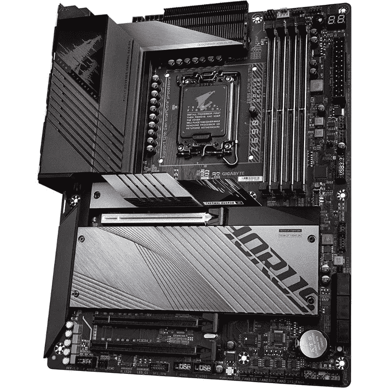

# 2023 年最佳千兆主板

> 原文：<https://www.xda-developers.com/best-gigabyte-motherboards/>

技嘉是该领域最受欢迎的 PC 组件制造商之一，也是四大主板制造商之一。该公司提供从最低端到最高端的各种不同的主板，而不是专注于任何特定的细分市场。由于 PC 处于上一代和当前一代的十字路口，有大量千兆字节的主板可供选择。以下是我们的建议。

## 最佳 Z790 主板:技嘉 Z790 Aorus Master

Z790 芯片组本质上是 Z690 芯片组，只有几个额外的 PCIe 4.0 通道；它仍然使用相同的 LGA 1700 插座。因此，像技嘉这样的公司已经选择更新他们现有的 Z690 主板，高端 Z790 Aorus Master 也不例外。虽然目前最新一代 Z690 主板比 Z790 主板便宜，但如果你打算购买最高端的主板，你也可以选择 Z790。

Z790 Aorus Master 配色比较忙；它的黑色 PCB 上点缀着银色的电子元件和白色的文字，而电路板上的所有东西都是银色和黑色的，带有拉丝金属表面。M.2 固态硬盘的散热器有一部分是反光的，带有 Aorus 徽标，后部 I/O 的外壳顶部有一个 RGB 显示屏。这种设计显然是高级的和游戏化的，尽管没有使用目前流行的经典的深黑色加 RGB 主题。

Aorus Master 是一款 EATX 主板，尺寸比 ATX 更大，需要支持 EATX 的机箱。谢天谢地，千兆字节很好地利用了所有这些额外的空间；Aorus Master 有一个 20+1+2 级 VRM，五个 M.2 插槽(其中一个支持 PCIe 5.0 固态硬盘)，支持 DDR5-7600，以及大量功能，如错误代码显示和风扇和 I/O 接头。后部 I/O 布满了 USB 3.2 端口，包括一个 10 千兆位英特尔以太网端口，这在消费级主板上非常少见。

Z790 Aorus Master 可以使用顶级酷睿 i9-13900K 为一台极其高端的 PC 提供动力，同时拥有基本上任何您想要的所有 I/O。对于主板来说，500 美元的价格确实很高，但在高端市场中，Aorus Master 实际上有点便宜。来自竞争厂商的主板很少能提供 Aorus Master 的所有功能。

##### 技嘉 Z790 Aorus Master

除了价格之外，Gigabyte Z790 Aorus Master 没有什么不喜欢的。它很贵，但你可以得到很多套件，包括稳定的电源传输，出色的 BIOS，以及用于所有组件的大量连接。

## 最佳 Z690 主板:技嘉 Z690 Aorus Ultra

随着 Z790 芯片组的出现，Z690 主板将上市销售，这很好，因为 Z690 在功能上与 Z790 相同。技嘉的 Z690 Aorus Ultra 是任何想要在预算内构建中端至高端 PC，同时不牺牲任何重要功能并为 12900K 和 13900K 等高端芯片留出升级路径的人的绝佳选择。

Z690 Aorus Ultra 主要采用双色设计，黑色用于 PCB、I/O 外壳和 VRM 散热器，深灰色用于 M.2 散热器和 VRM 散热器上方的装饰性护罩的拉丝金属饰面。I/O 外壳中还集成了一个小型 RGB 显示器。总的来说，Aorus Ultra 外观出众，应该能与大多数其他部件完美搭配。

Z690 Aorus Ultra 唯一缺少的重要东西是 PCIe 5.0 SSD 支持，这是一个遗憾。除此之外，这款主板几乎拥有你想要的一切:16+1+2 相位 VRM，4 个 M.2 插槽(所有这些都运行在 PCIe 4.0 上)，以及对快速 DDR5-6200 内存的支持。后部 I/O 包括 13 个 USB 端口(其中 9 个是 USB 3.2)和一个 2.5 千兆位英特尔以太网端口。虽然比较 Aorus Ultra 和 Aorus Master 并指出所有差异很容易，但 Aorus Ultra 仍然提供了一系列令人印象深刻的功能，应该可以满足几乎所有人的需求。

在撰写本文时，Z690 Aorus Ultra 的价格约为 350 美元，对于一款高端主板来说，这是一笔相当不错的交易，该主板唯一的缺点是缺乏 PCIe 5.0 SSD 支持，并且在技术上是最新一代的。总的来说，Z690 Aorus Ultra 对于那些有钱购买高端 PC，但没有无限预算或希望拥有更多必要功能的人来说是一个非常好的选择。

 <picture></picture> 

Gigabyte Z690 Aorus Ultra motherboard

##### 技嘉 Z690 Aorus Ultra

技嘉 Z690 Aorus Ultra 是一款价格相对低廉的主板，配有英特尔 Z690 芯片组和 LGA 1700 插座。

## 最佳 B660 主板:技嘉 B660 Aorus Master DDR4

典型的中端 B660 主板比高端 Z690 主板的成本低得多，但缺少高端主板的许多功能和质量。除了 B660 和 Z690 芯片组之间的基线差异之外，B660 主板往往具有更少的 VRM 阶段、更少的 I/O、更少的 PCIe 插槽等等。技嘉的 B660 Aorus Master DDR4(不是 DDR5 版本)是个有趣的例外；它与 Z690 主板有许多共同的功能，但价格与其他供应商的 B660 主板一样高。

B660 Aorus Master 在 M.2 散热器和 VRM 散热器上使用了 Gigabyte 的黑色加深灰色的典型组合，并带有拉丝金属表面。黑色的 PCB 被一些白色的文字和银色的迹线以及电子元件的电线所强调，而其中一个深灰色的散热器上蚀刻有 Aorus 的标志。I/O 外壳上还有一个 RGB Aorus 徽标，电路板背面有一些 RGB 照明。

与更高端的 Z690 Aorus Ultra 相比，B660 Aorus Master 做出了一些权衡:三个 PCIe 4.0 M.2 插槽而不是四个，以及支持 DDR4 内存而不是 DDR5。然而，使用 DDR4 可能是有益的，因为它比 DDR5 便宜得多，而且速度也快不了多少。最值得注意的是，B660 Aorus Master 采用了 16+1+1 阶段的 VRM，与 Z690 Aorus Ultra 非常相似，即使是一个 Core i9-13900K 也足以支持。后面的 I/O 上没有很多 USB 3.2 端口，但该主板仍然有 2.5 千兆位英特尔以太网。

B660 Aorus Master 提供了所有的功能和质量，绝对是 LGA 1700 主板中较好的一款。它的价格为 180 美元，尽管有很多更便宜的 B660 主板，但更便宜的主板放弃了大量功能，如 VRM 级、M.2 插槽和后部 I/O 端口。如果你想用更快的组件升级你的电脑，技嘉的 B660 Aorus Master 绝对物有所值。

##### 技嘉 B660 Aorus 主机

Gigabyte B660 Aorus Master 是一款 LGA1700 主板，具有 16+1+1 阶段 VRM、三个运行于 PCIe 4.0 的 M.2 NVMe 插槽，并支持英特尔的第 12 代和第 13 代 CPU。

## 最佳 X670 主板:技嘉 X670 Aorus Elite

你可能知道，AMD 这一代的 [AM5 主板](https://www.xda-developers.com/best-am5-motherboards/)有两个高端芯片组:X670 和 X670E。这些芯片组如此相似，以至于我们不推荐一个 X670 和一个 X670E 千兆主板，而是推荐 X670 和 X670E 芯片组中千兆最强的主板。X670 Aorus Elite 为高端锐龙 7000 PC 集成了许多功能，而成本却没有使用 X670E 芯片组的类似规格的高端主板高。

X670 Aorus Elite 主要使用黑色，并在 I/O 外壳、PCB 和 M.2 散热器上点缀一些极简的装饰性白线。所有的散热器(除了顶部 M.2 插槽上的一个)和 I/O 外壳都有一个拉丝金属表面，这在优质主板上很常见。VRM 散热器的一部分和顶部的 M.2 散热器是灰色的，而不是黑色或白色的，但它们实际上与主板的其余部分非常契合。如果你是那种不喜欢常见的深黑色搭配 RGB 审美的人，那么 Aorus Elite 适合你。

X670 Aorus Elite 使用 16+2+2 级 VRM，并支持 DDR5-6666，即使与锐龙 9 7950X 搭配也很好。它在其他功能上也没有牺牲太多，因为它有四个 M.2 插槽(其中一个以 PCIe 5.0 的速度运行)，Wi-Fi 6E 和 2.5 千兆以太网，不幸的是，这是来自 Realtek 而不是英特尔。PCIe 5.0 对图形的支持也不见了，但由于市场上还没有 PCIe 5.0 GPU，这真的无关紧要。Aorus Elite 在后置 I/O 上也有 9 个 USB 3.2 端口，对于大多数用户来说应该绰绰有余。

价格是 X670 Aorus Elite 脱颖而出的地方。这款主板的价格不到 300 美元，可以与昂贵得多的 X670E 型号相媲美，并且在 VRM 尺寸和 DDR5 支持方面也略胜竞争对手的主板。X670 Aorus Elite 对于希望以合理的预算构建高端锐龙台式机的人来说是一个不错的选择。

##### 技嘉 X670 AORUS Elite AX

Gigabyte X670 Aorus Elite AX 拥有高端游戏 PC 的必备功能，包括支持 DDR5-6666 内存、三个固态硬盘 M.2 插槽和一个 16 级 VRM。

## 最佳 B650 主板:技嘉 B650 Aorus Elite

正如你可能从它的名字中猜到的，技嘉的 B650 Aorus Elite 本质上是一个稍微精简的 X670 Aorus Elite，其 90%的功能要少得多。这类似于 Gigabyte 的 Z690 和 B660 主板之间的差异，但需要注意的一点是，B650 主板与 X670 主板具有相同的超频支持，这使得 B650 Aorus Elite 与 X670 主板一样适合超频。

B650 Aorus Elite 实际上与 X670 Aorus Elite 几乎具有相同的外观，只有一些微小的差异。B650 主板主要是黑色，带有白色的极简图形，穿过 I/O 外壳、PCB 和 M.2 散热器，一些部件被染成银灰色。与 X670 型号一样，如果你不喜欢纯黑色和 RGB 的典型游戏外观，B650 Aorus Elite 是一个很好的选择。

Aorus Elite 的 B650 版本放弃的主要功能是一些 VRM 级(14+2+1 而不是 16+2+2)和一个 M.2 插槽，但除此之外几乎没有其他功能受到影响。VRM 对于锐龙 9 7950X 仍然足够(至少在库存设置下),并且剩余的三个 M.2 插槽仍然包括一个支持 PCIe 5.0 的插槽。如果您使用大量 USB 设备，您可能会对 B650 Aorus Elite 只有 8 个 USB 3.2 端口(外加 4 个 USB 2.0 端口)感到失望。至少 2.5 千兆位 Realtek 以太网与 X670 型号没有变化。

B650 Aorus Elite 的价格约为 230 美元，是较贵的 B650 主板之一，但如果你计划在未来用更高端的组件升级你的 PC，多花一点钱来获得更多的 VRM 和 PCIe 5.0 对固态硬盘的支持可能是值得的。如果你想要更多的 VRM、额外的 M.2 插槽和更多的 USB 端口，你也可以选择多花 50 美元左右购买 X670 版本。

##### 技嘉 B650 Aorus Elite

Gigabyte B650 Aorus Elite 是一款中端 AM5 主板，配有 14+2 级 VRM，支持 PCIe 5.0 固态硬盘，以及令人印象深刻的各种后置 I/O

## 第 10 代和第 11 代英特尔的最佳 Z590 主板:技嘉 Z590 Aorus Elite

英特尔的 500 系列现在已经有两年历史了，它缺少了相当多的现代功能，但这实际上对那些重视价值而不是原始性能的人来说是好的。技嘉的 Z590 Aorus Elite 是任何想要使用英特尔第 10 代或第 11 代 CPU 构建可超频 PC 而不使用任何昂贵的尖端内存或存储的人的好选择。

从视觉上看，Z590 Aorus Elite 和其他打着 Aorus Elite 牌子的主板很像；PCB 是纯黑色的，散热器和 I/O 外壳也是纯黑色的，所有这些都经过了金属拉丝处理。大多数散热器上都刻有尖锐的线条，这可能会稍微提高散热性能，但总体而言，这只是为了美观。可定制的 RGB 照明集成在主板的 PCB 中，靠近后部 I/O 和芯片组散热器上的 Aorus 徽标。

凭借 12+1 级 VRM 和对快速 DDR4-5400 内存的支持，Z590 Aorus Elite 能够为 Core i9-10900K 和 Core i9-11900K 等高端 CPU 提供最佳性能所需的马力。该板还有三个用于 NVMe 固态硬盘的 M.2 插槽，其中一个支持 PCIe 4.0 型号。后面的 I/O 是 Z590 Aorus Elite 的致命弱点，因为只有六个 USB 3.2 端口(加上四个 USB 2.0 端口)和 Realtek 的 2.5 千兆以太网，而不是英特尔，后者通常是更好的品牌。

Z590 Aorus Elite 的售价约为 170 美元，当你考虑到 DDR4 比 DDR5 便宜，PCIe 3.0 固态硬盘比 PCIe 4.0 和 5.0 型号便宜，并且你可以很容易地找到新的或二手第 10 代和第 11 代 CPU 的交易时，这些节省就会增加。明显的缺点是，你只能使用第 10 代和第 11 代 CPU 以及 PCIe 4.0 和 3.0 设备。如果你主要是玩游戏，并且不追求超高的帧速率，这个限制可能不会困扰你，但是如果你需要大量的 CPU 马力，你可能要考虑当前一代的主板。

##### 技嘉 Z590 AORUS Elite AX

Gigabyte Z590 Aorus Elite 是第 10 代和第 11 代英特尔 CPU 的高端主板。它具有 12+1 级 VRM，并支持 PCIe 4.0 固态硬盘。

## 最佳 X570 主板:技嘉 X570S Aorus Elite

锐龙 5000 正在进入暮年，但利用 AMD 的上一代 CPU 和主板，构建中端至高端 PC 仍然是可能的。Gigabyte 的 X570S Aorus Elite 具有与现代中端主板相当的功能，并且不仅对主板本身，而且对整个系统的成本都有吸引力的价格标签。

从极简到高度细节，X570S Aorus Elite 无疑是高度细节的代表。配色方案是最黑色的，到处都有一些 Aorus 徽标，但 X570S 最有趣的是它在整个面板上使用了细线。这些线路以几乎无缝的方式蚀刻到 PCB、散热器和 I/O 外壳中。此外，电路板背面有一些 RGB 照明。

X570 和 X670 之间的主要区别是缺乏 PCIe 5.0 和 DDR5 支持。不管你怎么划分，没有 PCIe 5.0 都是一个缺点，但是如果你更关心性价比而不是原始性能，那么 DDR4 支持而不是 DDR5 是很好的。此外，X570S Aorus Elite 支持极快的 DDR4-5400 内存和 12+2 级 VRM，这足以让锐龙 9 5950X 全速运行。它也有三个 M.2 插槽，但只有两个运行 PCIe 4.0。除了不支持 PCIe 5.0 之外，X570S 在后端 I/O 方面也有一个关键弱点；只有八个 USB 3.2 端口、四个 USB 2.0 端口和 2.5 千兆位 Realtek 以太网。

X570S Aorus Elite 的价格为 200 美元，非常适合注重价值和足够的连接性以支持合理数量的外围设备的中高端 PC。然而，这种主板基本上没有升级途径，因为它使用的 AM4 插槽将不再获得新的 CPU，所以如果你想要高端 CPU 性能，你将不可避免地必须切换到新的主板。

##### 技嘉 X570S Aorus Elite

Gigabyte X570S Aorus Elite 是一款适用于锐龙 5000 CPUs 的中端 AM4 主板，配有 12+2 级 VRM、三个 NVMe SSD 插槽和 Wi-Fi 6E。

## 最佳 B550 主板:技嘉 B550 游戏 X V2

越来越难找到价格可以接受的好 B550 主板，对 Gigabyte 来说尤其如此。此外，低于 200 美元的 X570 主板很难证明购买一些更高端的 B550 主板是合理的，因为它们几乎没有任何便宜，而且有大量明显的切割功能。技嘉只有一款 B550 主板值得购买，那就是 B550 Gaming X V2。

作为一种非常便宜的主板，B550 Gaming X V2 看起来不像更昂贵的千兆主板那样昂贵。I/O 外壳是纯黑色塑料，散热器是纯黑色的，带有拉丝金属表面，PCB 本身是黑色的，并且由于缺少用于 M.2 插槽的散热器，大部分都暴露在外。主板上印满了几何图形，这给了 Gaming X V2 一些急需的细节。

B550 Gaming X V2 对于中端锐龙 5 和锐龙 7 CPUs 来说很好，但对于更高端的锐龙 9 芯片来说可能有点困难，因为它只有一个 10+3 级 VRM 和 DDR4 内存支持上限为 4733MHz。只有两个 M.2 插槽，但谢天谢地其中一个支持 PCIe 4.0 固态硬盘。也许 B550 Gaming X V2 最大的问题是后面的 I/O:只有四个 USB 3.2 端口，两个 USB 2.0 端口和一个千兆位 Realtek 以太网端口。这块板上的连接简直微不足道。

弥补这一切的是价格。130 美元，比高端的 B550 和 X570 主板便宜得多，值得购买。B550 Aorus Elite 的价格约为 170 美元，但功能明显少于 X570S Aorus EliteX570S 型号的额外 30 美元是值得的。我们并不是说技嘉的 B550 Gaming X V2 很棒，只是因为 B550 Aorus Elite 很贵，但它证明了它的存在足够好，对于那些需要便宜且马力足够持续多年的建筑商来说可能很棒。

##### 技嘉 B550 游戏 X V2

技嘉 B550 游戏 X V2 主板是一个低端的 AM4 板，最基本的功能是驱动一台中型电脑。它具有 10+3 级 VRM，并支持 PCIe 4.0 固态硬盘。

## 最佳迷你 ITX 主板:技嘉 B650I Aorus Ultra

在不牺牲漂亮功能或抬高价格的情况下，很难让迷你 ITX 变得合适，但技嘉的 B650I Aorus Ultra 在实现平衡方面做得很好。这款 B650 主板比使用 AMD 高端芯片组或任何英特尔芯片组的其他千兆型号更受推荐，因为迷你 ITX 主板根本没有额外功能的空间，而且锐龙 7000 通常比英特尔第 12 代和第 13 代 CPU 更高效，使其更适合紧凑型电脑。

ITX 主板上没有太多空间可以用来装饰，但 Gigabyte 在 B650I Aorus Ultra 上做得相当好。主板大部分是黑色的，在 PCB、M.2 散热器和 I/O 外壳上有一些银色的点缀和文字，正是这些点缀阻止了 B650I Aorus Ultra 看起来平淡无奇，因为主板上没有任何引人注目的 RGB。

B650I Aorus Ultra 只配备了一个 8+2+1 级 VRM，这是一个稳定的中端甚至低端，但重要的是要记住，迷你 ITX 电脑往往运行更低功耗的 CPU，这使得缺少一个结实的 VRM 不是一个大问题。它通过 DDR5-6400 内存支持和三个 M.2 插槽弥补了这一点，其中一个插槽支持 PCIe 5.0。B650I Aorus Ultra 应该有更多的 USB 端口(它只有七个，其中四个是 USB 3.2)，但至少它有 2.5 千兆英特尔以太网。

技嘉的 B650I Aorus Ultra 售价 270 美元，客观上很贵，但这对于迷你 ITX 主板来说是正常的。如果你想使用中端锐龙 7000 CPU(特别是 65 瓦的非 X 型号)并需要大量高速固态硬盘，B650I Aorus Ultra 可以很好地完成这项工作。不过，如果您使用大量外围设备，您可能希望充分利用它的前置 I/O 接口，并获得一个 USB 集线器。

##### 技嘉 B650I Aorus Ultra

技嘉 B650I 是一款 AM5 迷你 ITX 主板，非常适合运行中端锐龙 7000 芯片的个人电脑；它配有一个 8+2+1 级 VRM 和一个用于 NVMe 固态硬盘的 PCIe 5.0 插槽。

## 2023 年你能买到的最好的千兆主板:最终想法

技嘉将其注意力平均分配到主板市场的各个领域，这意味着很容易为几乎所有芯片组找到价格合理的技嘉主板。高端 Z790 Aorus Master 值得与强大的英特尔 CPU(如 Core i9-13900K)配对，而 X670 Aorus Elite 等主板具有您想要的高端 PC 的功能，而没有抬高价格的虚饰。该公司较便宜的中端主板，如 B660 Aorus Master DDR4，得益于与高端型号非常相似，只是去掉了一些功能。

根据您选择的处理器，您还可以查看我们专门收集的用于英特尔芯片的[最佳主板](https://www.xda-developers.com/best-motherboard-intel/)或用于 AMD 芯片的[最佳主板](https://www.xda-developers.com/best-motherboard-amd/)。这些集合有一些非常好的选择，它们会节省你很多时间去梳理每一个单元。我们还鼓励您加入我们的 [XDA 计算论坛](https://forum.xda-developers.com/c/xda-computing.12289/)进行讨论，并从我们的社区成员那里获得更多产品建议。