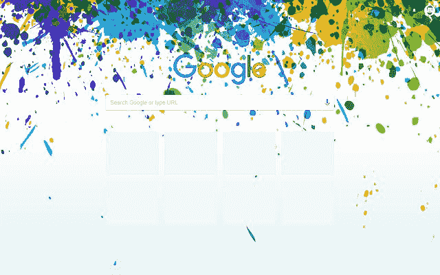

# 2023 年最佳谷歌浏览器主题

> 原文：<https://www.xda-developers.com/best-google-chrome-themes/>

当谈到浏览器时，谷歌 Chrome 是大多数人的首选，它确实走了很长的路。从几年前作为一个不错的第三方选择，到目前为止是世界上使用最多的浏览器，谷歌在 Chrome 上有很多值得骄傲的事情。除了出现在 Chromebooks 中，它还被安装在数十亿台 T2 电脑上。Chrome 附带的一个功能是主题支持。今天，我们将向您简要介绍一些最好的谷歌 Chrome 主题。

移动版本不支持它们，但在桌面上，主题仍然完全相关。从简单的彩色主题到艺术和风景主题，你可以随心所欲地美化你的浏览体验。可能性是无限的。

浏览本指南:

## 官方主题(简单)

一个官方主题不会错，是谷歌自己做的。它们不会太偏离你的浏览器的审美，同时也允许你在上面添加一点点个性。谷歌实际上为谷歌 Chrome 制作了很多官方主题，从非常简单到非常丰富多彩。以下是这一类别中的一些佼佼者。

### 只有黑色

谷歌 Chrome 已经提供了深色主题，但 Just Black 的纯黑色更进了一步。对于那些使用纯黑色有机发光二极管显示器的人来说，这是一个理想的主题(或者只是那些不喜欢在深色主题上使用深灰色而不是黑色的人)。

**[下载正义黑主题！](https://chrome.google.com/webstore/detail/just-black/aghfnjkcakhmadgdomlmlhhaocbkloab)**

### 玫瑰

“玫瑰”主题将你的浏览器涂成浅玫瑰色，同时又不影响浏览器其余部分的整体外观。如果你想获得一个“别致”的外观，或者如果你想让你的整个操作系统围绕这个颜色，这是你现在能得到的最好的 Chrome 主题之一。

**[下载玫瑰主题！](https://chrome.google.com/webstore/detail/rose/aobcgffnbkbipbflopponndoiommhnch)**

### 海洋泡沫

海洋泡沫实际上相当简单。主色调仍然是白色，而背景变成了蓝绿色，让人想起海洋的感觉。如果你有大海/海滩壁纸或者你真的喜欢绿松石色，那就完美了。

**[下载海沫主题！](https://chrome.google.com/webstore/detail/sea-foam/lahipjfggmgneaopcckkaipmoandaboo)**

### 高对比度彩色

在低光环境或光敏性中的用户可以利用高对比度主题，该主题多年来一直包含在 Windows 等操作系统中，高对比度彩色主题在一个单一主题中提供了亮暗主题的最佳效果。

**[下载高对比度多彩主题！](https://chrome.google.com/webstore/detail/high-contrast-colorful/cdfdkmklcjlnnnlnplffpdiekfhkpbme)**

### 海洋的

如果你喜欢海洋泡沫主题提供的“海洋”外观，但你不太喜欢它是一个浅色主题，那么你可能会更喜欢“海洋”主题。它同样是绿色的，灵感来自海洋，但它的色调更暗。

**[下载海洋主题！](https://chrome.google.com/webstore/detail/oceanic/gbbacdmgjdfajabgglpjifcedoajdimg)**

### 经典蓝色

最后，经典蓝是我们在旧版本的 Windows 上使用的旧版本 Chrome 的旧蓝/白主题的翻拍。如果你喜欢怀旧，这绝对是你应该走的路！

**[下载经典蓝色主题！](https://chrome.google.com/webstore/detail/classic-blue/mdifmgkofhcnndinbbdbaplplnmdalnc)**

* * *

## 官方主题(艺术家)

如果你认为 Chrome 团队制作的官方、标准的谷歌 Chrome 主题无聊或缺乏一点点火花，那么谷歌也有几个更“艺术”的主题可以看看。这些主题中的大部分都是与黑人艺术家合作制作的，几乎只是对一些现有主题的丰富多彩的艺术旋转。

### 位+件

这个主题是由 Laci Jordan 制作的，根据官方描述，它的灵感来自“声音的连通性和多样性的想法”。这是一个丰富多彩的“纯黑色”主题，如果你已经喜欢这个主题，你可能会觉得这个很酷。

**[下载比特+碎片主题！](https://chrome.google.com/webstore/detail/bits-%2B-pieces/foocngohimdoacmhbjfkdldchhiipieo)**

### 观星者

这一张是由布鲁克林的漫画家兼插画师奥利维亚·菲尔兹(Olivia Fields)制作的，她的主题直接从星空中获得灵感，以紫色为主色调。结果是一个紫色的主题和迷人的背景，非常迷人。

**[下载观星者主题！](https://chrome.google.com/webstore/detail/stargazers/fgjgecgjcaoepmcinebllijclpmnoeke)**

### 金色的

“金色”主题实际上一点也不金色，与它的名字可能暗示的相反。相反，这是一个以红色为基础的主题，实际上是以创造性的方式使用颜色，由艺术家 Sabrena Khadija 制作。绝对值得一看。

**[下载黄金主题！](https://chrome.google.com/webstore/detail/golden/enkocoijmmekfdjddafcgablpppkkdnk)**

### 火花

根据洛杉矶插画师 Abelle Hayford 的描述,《星火》讲述的是“寻找爱的东西”。主题本身使用蓝色色调来补充“火花”绘画背景，这应该是展览的明星。结果是辉煌的，并显示自己是最好的谷歌浏览器的主题之一。

**[下载一个火花主题！](https://chrome.google.com/webstore/detail/a-spark/kegokicnbkenackdeocgdgalnapidbdf)**

### 连接

由崭露头角的平面设计师 Laci Jordan 设计的 Connect 具有非常丰富多彩的设计和背景，根据描述，“捕捉了自由流动的有机形状中表现的人类互动的感觉。”

**[下载连接主题！](https://chrome.google.com/webstore/detail/the-connect/hcapmcoajgfcfoefogpnojloikekboci)**

### 欣快

这个也是由 Sabrena Khadija 制作的，这位布鲁克林的艺术家制作了我们之前展示的“金色”主题。这个主题在设计上看起来也非常相似，大多使用蓝色而不是红色。

**[下载欣快感主题！](https://chrome.google.com/webstore/detail/euphoria/gpdhmlkimigjliojgaaihhbgdcmedagn)**

* * *

## 极客主题

现在是时候进入非官方主题的领域了。非官方主题构成了 Chrome 网上商店的绝大部分主题，在这个地方，它们与[应用](https://www.xda-developers.com/best-android-apps/)和扩展混合在一起。有些比其他的更糟糕，但是偶尔你也能碰到宝石。如果你想在你的浏览器上展示你的极客信誉，这里有一些最好的基于漫画书和电子游戏的极客主题。

### 钢铁侠材料设计

在这里我们发现了一个受钢铁侠启发的静态主题，它具有动态和醒目的颜色，实现了非常好的视觉效果。另一方面，它也有一个颜色的阴影，在活动和非活动标签之间形成一个很好的对比。

**[下载钢铁侠材质设计主题！](https://chrome.google.com/webstore/detail/iron-man-material-design/nekeenfmlfhgoaojceionblcpbbjmnpk)**

### 塞尔达黑暗

如果你正在寻找一个黑暗主题，并且你是塞尔达传说的粉丝，那么你已经找到了安装在你的浏览器中的完美主题。这个 Chrome 主题有一个基于塞尔达传说的漂亮的深色配色，这使它成为晚上观看的理想选择。

**[下载塞尔达暗黑主题！](https://chrome.google.com/webstore/detail/zelda-dark/lilddpnkkhkcjkdaaglfminjopbijomp)**

### 死池全屏主题

如果你碰巧喜欢红色，并且是《死侍》的粉丝，那么你一定要试试这个主题。毕竟谁不喜欢死侍呢？近年来最具标志性的漫威角色之一，出现在极客可用的最佳谷歌浏览器主题之一中。

**[下载死侍全屏主题主题！](https://chrome.google.com/webstore/detail/deadpool-full-screen-them/echjomhoplepodjjaaohelfnlnoelhgd)**

### 无人区主题

毫无疑问，无人区是一件艺术品，所以如果你的浏览器需要一个新的主题，或者你是游戏的粉丝，这是一个很好的选择。这个主题的配色方案完美地捕捉了游戏令人难以置信的艺术风格。

**[下载无人区主题主题！](https://chrome.google.com/webstore/detail/no-mans-sky-theme/lcggbanajlngbcajphmanikmlikahhpo)**

### 超级卢卡里欧

如果你是 Lucario 的粉丝，或者你只是喜欢神奇宝贝，这可能是你最理想的主题。这并不总是很容易选择，尤其是当涉及到神奇宝贝主题的主题时，但这个主题只是通过使用一些颜色来完美地捕捉这个标志性角色的本质。

**[下载《百万富翁》主题！](https://chrome.google.com/webstore/detail/mega-lucario/pkmbefcnbchjdllfcmcldjjnoimgepbo)**

* * *

## 自然主题

你真的不喜欢极客主题吗？简单一点的东西怎么样？风景背景一直是壁纸的流行选择，这是有充分理由的。你的主题是你的谷歌体验的中心，所以一个好看的、受自然启发的主题可能正是你正在寻找的。

### 美人

如果你喜欢自然，并且你正在寻找一个令人放松的主题，这可能非常适合你。只要看看这个主题附带的景观背景，你就会在充满色彩的不可思议的景观中找到大自然的平衡与和谐。

**[下载美颜主题！](https://chrome.google.com/webstore/detail/%D0%BA%D1%80%D0%B0%D1%81%D0%BE%D1%82%D1%8B/bbbelgoeoihcmnkgkeanmogncgkfichm)**

### 瀑布

如果你正在寻找一个具有惊人设计的主题，这里你会发现一个迷人的景色。每当你打开一个新的标签页时，这个瀑布会让你感到新鲜、平静和积极。在这个主题中，颜色是华丽的，因为颜色是精心选择的，以便于区分选项卡，从而加快导航。

**[下载瀑布主题！](https://chrome.google.com/webstore/detail/%D0%B2%D0%BE%D0%B4%D0%BE%D0%BF%D0%B0%D0%B4/gdpgcnldcilcebknigdlemgbpjjigbkj)**

### 海上悬崖

有时候，我们只是在寻找一个“新鲜”的主题，用漂亮的颜色，让我们更快地导航。这就是为什么我们遇到了这个简单而优雅的主题，它的美丽景色让我们想起了海滩上美丽的日落。

**[下载海崖主题！](https://chrome.google.com/webstore/detail/%D0%BC%D0%BE%D1%80%D1%81%D0%BA%D0%B8%D0%B5-%D1%81%D0%BA%D0%B0%D0%BB%D1%8B/bpokehhbejeciipobnhjkhhflnmpidkf)**

### 日落

如果你正在寻找一个主题，让你觉得你是在一个美丽的地方度假，这就是你所需要的。这是一个简单而令人惊叹的主题，带有紫色和淡紫色的色调，所以看起来很赏心悦目。它是如此放松和现实，它会让你觉得你在那里。就风景而言，这是最好的谷歌 Chrome 主题之一。

**[下载夕阳主题！](https://chrome.google.com/webstore/detail/sunset/oglpppdfhoddodgobkgdocdonaifnpde)**

### 山地湖

这个主题是基于班夫国家公园的景观，如果你喜欢这里的风景，你会发现这个主题很不错。它有很好的色彩平衡与风景优美的背景，会让你想去露营和探索。

**[下载山湖主题！](https://chrome.google.com/webstore/detail/%D0%B3%D0%BE%D1%80%D0%BD%D0%BE%D0%B5-%D0%BE%D0%B7%D0%B5%D1%80%D0%BE/lpgjpcjhnomlehclepbjbapegdmlegdf)**

### 美丽的风景

一个令人惊叹的高清晰度质量和定制选项的主题。它也有很好的纹理和一些非常漂亮的醒目的颜色，结合良好的排版，易于阅读，所以你不会累坏你的眼睛。

**[下载美丽风景主题！](https://chrome.google.com/webstore/detail/beautiful-landscape/ambfimhigppdidfmelpjmojccbfdoeig)**

### 在树叶下面

谷歌的这个自然主题是由第一代墨西哥裔美国设计师兼插画师马里索尔·奥特加创作的。它在新的标签页上展示了两片叶子的图片，以及一只青蛙的眼睛。简单又酷！

**[下载叶下主题！](https://chrome.google.com/webstore/detail/under-the-leaf/ighhdikapddjihgaphbnbcgipafcamjk)**

* * *

## 艺术主题

最后，艺术主题也是一个不错的选择，如果你想给你的浏览器添加一些特色的话。然而，“艺术”的定义取决于我们问的是谁。有些人可能会在他们的主屏幕上出现一个心形图案，并称之为“艺术”主题，而其他人可能喜欢稍微复杂或抽象一点的东西。无论情况如何，以下是我们的一些最佳选择。

### **颜色**

### 

想让你的 Chrome 浏览器看起来像一块新鲜的画布？这个主题为新的选项卡页面添加了一点色彩。在新标签页的正上方，有彩虹的每一种颜色。

**[下载颜色主题](https://chrome.google.com/webstore/detail/colors/lhbgjlhhonbdjfdoiklbbkejcipkbnac)**

### 复古机器人主题

如果你想要的是一个有趣而丰富多彩的主题，同时又生动而令人兴奋，那就别再找了。这个主题的颜色太棒了。它使用黑色背景的霓虹色调。它还在浏览器顶部有一个漂亮的发光效果，这使它看起来非常光滑。

**[下载复古机器人主题！](https://chrome.google.com/webstore/detail/retro-robots-theme/ejiklfknjocjccolialojlfhliacoeoo)**

### 心形图案

这个心形图案的主题就像它听起来的那样——背景是多种颜色的心形图案。如果你喜欢可爱的主题，这可能是你喜欢的类型。

**[下载心形图案主题！](https://chrome.google.com/webstore/detail/%D1%81%D0%B5%D1%80%D0%B4%D0%B5%D1%87%D0%BD%D1%8B%D0%B9-%D1%83%D0%B7%D0%BE%D1%80/egpfinapjokiedjpndnfmiijmbeegdgb)**

### 树叶的图案

接下来是一个叶子主题的图案，这也正是它听起来的样子。或者不是。“叶子的图案”主题可能暗示了类似秋天的主题，但它实际上是手绘的叶子图案。如果你问我，它看起来很酷。

**[下载树叶主题的图案！](https://chrome.google.com/webstore/detail/%D1%83%D0%B7%D0%BE%D1%80-%D0%B8%D0%B7-%D0%BB%D0%B8%D1%81%D1%82%D1%8C%D0%B5%D0%B2/kllddekidnclbcjnjbnfjpbcgkhkfkoo)**

### 提示提示

这个主题是由艺术家梅丽莎·佩恩·贝克(Melissa Payne Baker)创作的，似乎直接基于一幅画。这幅画本身有很好的色彩组合，应该能取悦艺术爱好者。

**[下载提示提示主题！](https://chrome.google.com/webstore/detail/hint-hint-by-melissa-payn/jcnedclkjioogebficncfndihdhlofgd)**

### 公园大道主题

最后，但同样重要的是，这个主题采用了一种乡村风格的设计，但它绝对是独一无二的，即使是在 2021 年。如果你正在寻找一些与列表中其他主题不同的东西，这是一个很好的起点。

**[下载百汇驱动主题主题！](https://chrome.google.com/webstore/detail/parkway-drive-theme/adgclfleponkjkobcmjcgmcaikmmgiok)**

* * *

就推荐而言，你真的不能错过官方主题，因为它们通常是最新的，并且与 UX 的其他部分配合得很好。Chrome 主题，包括这个列表中的一些，如果没有适当的维护，可能会持续几年，它们仍然会像以前一样工作——尽管 UI 发生了变化。然而，随着时间的推移，抓住一些定期调整和支持的东西总是一个好习惯。无论是官方选项还是“艺术家”官方选项都令人惊叹。