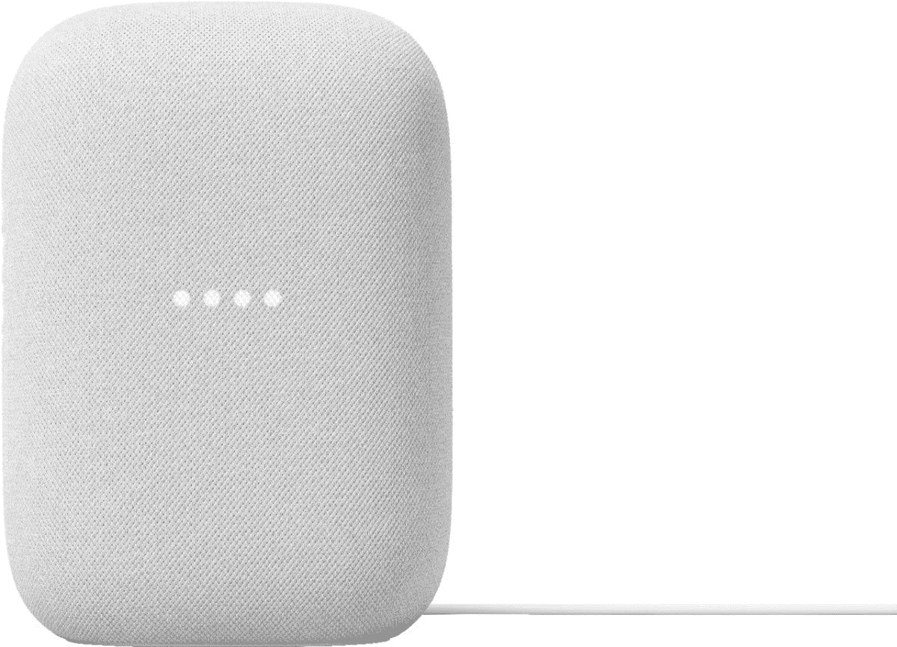

# 2023 年 Google Home 和 Google Assistant 最佳智能灯

> 原文：<https://www.xda-developers.com/best-google-home-smart-lights/>

如果你通过 Google Home 对你的智能家居进行编程，并且你使用一个 [Google Assistant 智能音箱](https://www.xda-developers.com/best-google-assistant-speakers/)，那么你会想要一些兼容的灯。智能灯是最受欢迎、最易于使用的智能家居技术之一，任何人都可以安装。智能灯非常容易使用，使用起来非常有趣。谁不喜欢用一个简单的语音命令来打开和关闭所有的灯呢？

当然，功能远不止于此。有了谷歌助手在幕后，你可以编程各种各样的行动和自动化，使你的一天既聪明又轻松。如果你是安卓、谷歌助手和[谷歌主页](https://www.xda-developers.com/works-with-google-home-announced/)的用户，这些都是你想要的。

*   <picture></picture>

    Govee Glide Hexa

    ##### Govee Glide Hexa

    不仅仅是为了内容创作者，这些光板可以在家中的任何地方创造出令人惊叹的设计和效果。每个面板可以同时显示多种颜色，支持动画效果，并可以随着音乐一起跳动。使用谷歌助手或功能齐全的配套应用程序来控制它们。

*   <picture></picture>

    GE Cync

    ##### GE Cync

    GE Cync 是一个完整的智能家居产品生态系统，包括摄像头和恒温器，比一些竞争对手更实惠，同时提供类似的功能。不过，如果你只是想要一些物美价廉、兼容谷歌的智能灯泡，这是一个简单的推荐。

*   <picture></picture>

    纳米叶形状

    ##### 纳米叶形状

    原来的模块化智能光板已经分支，现在出现了一堆不同的形状。不过，它们都相互兼容，因此你可以真正创造出你梦想中的智能照明设计。创建创造性的场景，并使用应用程序或您的谷歌助手来控制它们。

*   <picture></picture>

    Wiz Connected

    ##### Wiz Connected

    飞利浦的其他智能灯品牌与色调略有不同，因为不需要集线器。这些价格实惠的灯泡有白光或 RGB 两种颜色，可以直接连接到您的家庭 Wi-Fi。使用应用程序、Google Assistant 甚至可选的硬件遥控器进行控制。从完美的灯泡开始。

*   <picture></picture>

    Lifx light strip

    ##### Lifx light strip

    Lifx 是不需要中枢的 Hue 生态系统的绝佳替代品。如果你想要比灯泡更有创意，LED 灯带是不二之选。作为自定义场景的一部分，这些有 8 个区域可以点亮，当然，所有这些都可以通过谷歌助手进行控制。

* * *

购买支持 Google Home 和 Google Assistant 的智能灯会非常有趣。但也相当令人不知所措，因为有太多的选择。说到智能灯，首先要看的就是飞利浦 Hue。品牌就像智能灯的 iPad，几乎是品类的代名词。范围已经扩大到室内和室外类别，如果你不能从色调中找到它，它可能不存在。飞利浦也是即将推出的智能家居标准 Matter 的创始合作伙伴。这一点很重要，原因有很多，尤其是因为它让你的智能家居经得起未来的考验。

但竞争是创新的驱动力，而 Hue 无疑有助于推动一个蓬勃发展的类别。Govee 和 Lifx 等公司提供了很好的替代产品，它们的范围都在不断扩大，而且都不需要专门的中心。飞利浦甚至在 Wiz 推出了低价产品，价格适中的灯泡非常适合第一次使用的人。多亏了 Google Assistant 和 Google Home，你不需要担心被锁定在单一的产品生态系统中，你可以轻松地混合和搭配，并获得很好的效果。

 <picture></picture> 

Google Nest Audio

##### 谷歌巢音频

使用谷歌有史以来最好的智能扬声器，控制您的智能家居并获得美妙动听的音乐。家中任何地方的谷歌助手的完美伴侣。

如果你想多样化，一个很好的起点是选择一款符合你需求的[最佳智能音箱](https://www.xda-developers.com/best-smart-speakers/)，然后围绕它建立你的家庭生态系统。