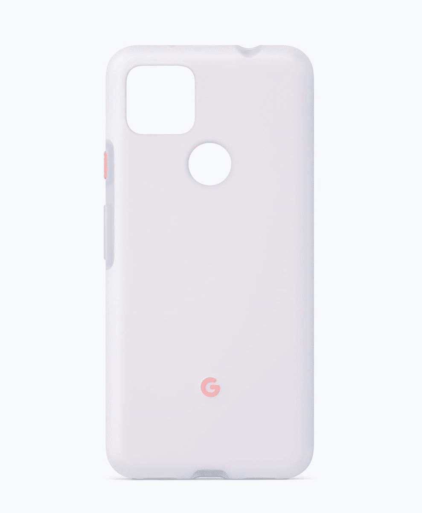
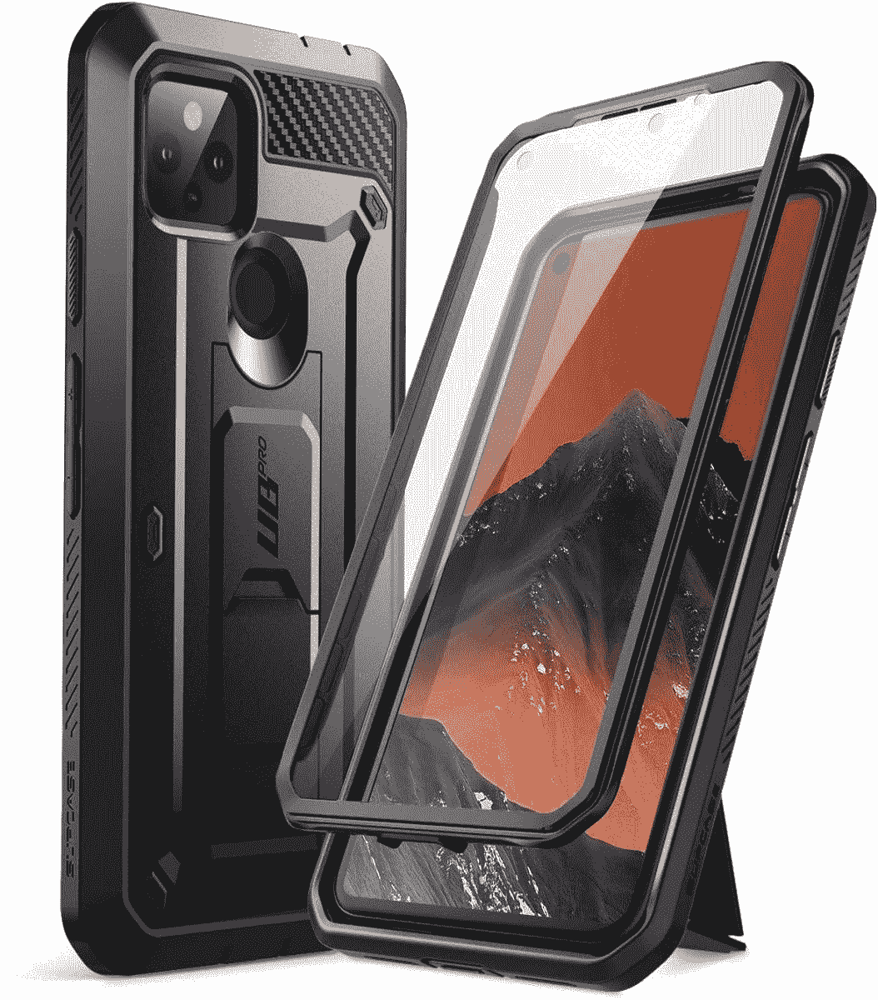
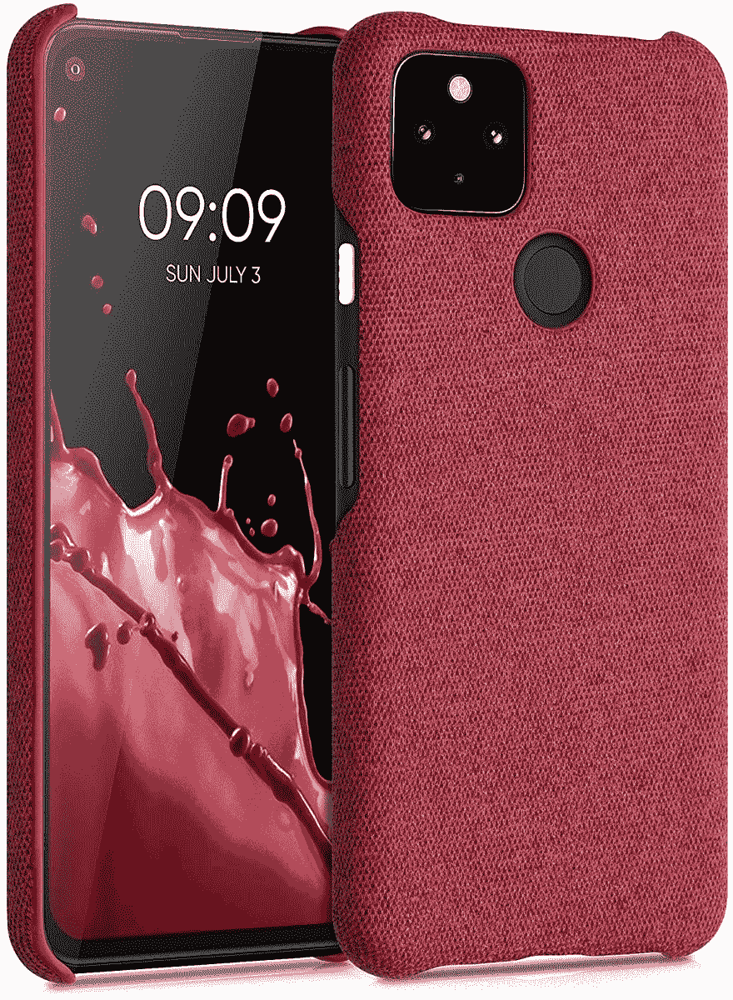
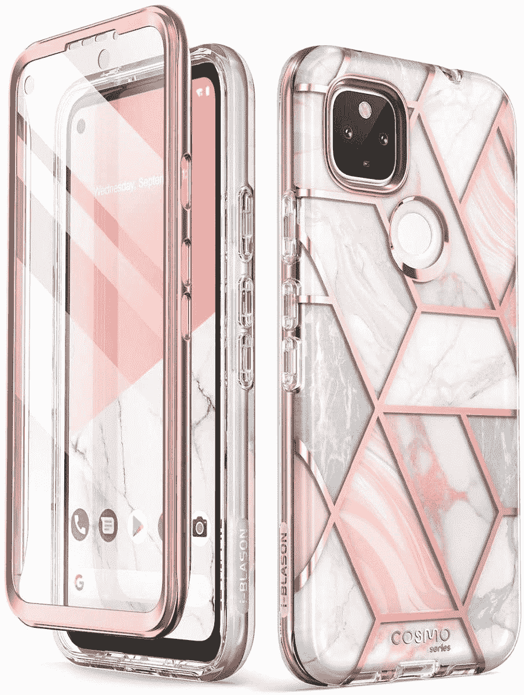
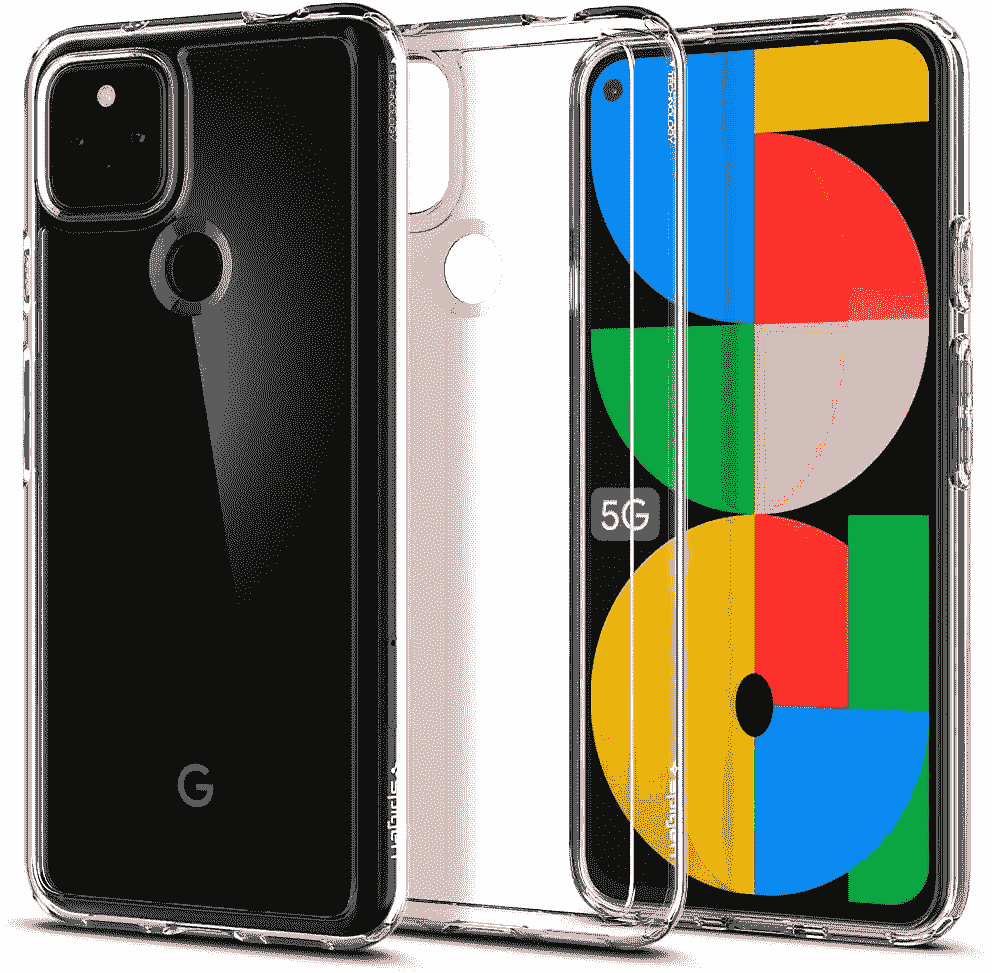
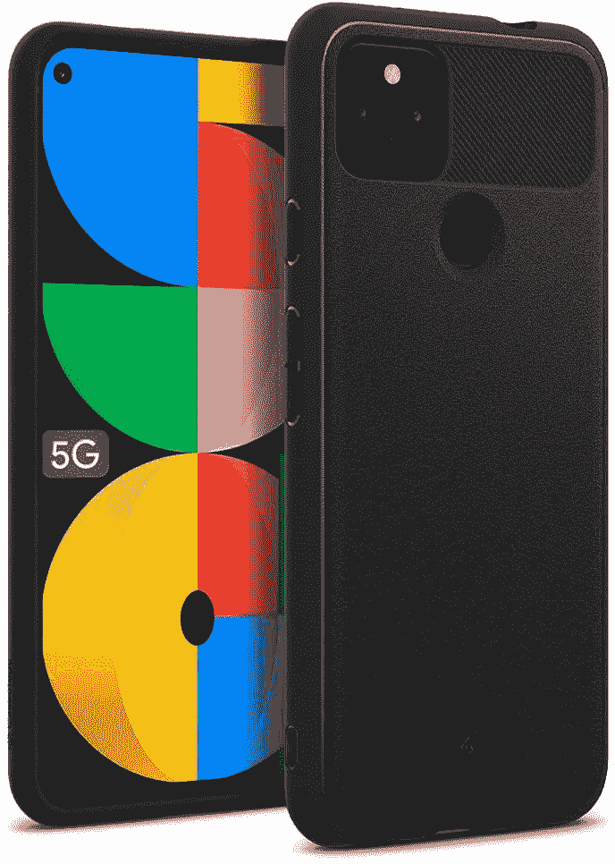

# 2023 年购买的最佳像素 5a 保护套

> 原文：<https://www.xda-developers.com/best-google-pixel-5a-cases/>

# 2023 年购买的最佳像素 5a 保护套

寻找好的 Pixel 5a 外壳？我们可以帮忙。我们为你现在能买到的新款 Pixel 智能手机挑选了最好的保护套。

[像素 5a](https://www.xda-developers.com/google-pixel-5a/) 官方。这是一款中端智能手机，加入了谷歌产品组合中的 Pixel 5 和 Pixel 4a 以及 5G。该公司将 6.34 英寸全高清+屏幕、高通骁龙 765G SoC 和 4，680mAh 电池集成到智能手机中。你还将获得 6GB 的内存、128GB 的板载存储和 Android 11。

此外，该手机采用金属一体式设计，具有坚固的制造质量。手机可能会经受住一两次小的跌落，但你仍然会冒险，因为这款手机没有官方的耐用性声明。因此，如果你打算购买或已经订购了这款手机，买一个保护套来保护它还是有意义的。市场上有一些优秀的 Pixel 5a 外壳，我们为您挑选了最好的。

 <picture></picture> 

Google Pixel 5a case

##### 谷歌超薄 Pixel 5a 保护套

Pixel 5a 的谷歌官方保护套可以从各个方面保护手机。它采用优质材料制成，非常合身。此外，该外壳可以承受跌落、刮擦和碰撞。它有四种令人兴奋的颜色可供选择。

 <picture></picture> 

Supcase Unicorn Beetle Pro

##### SUPCASE UB Pro Pixel 5a 外壳

Supcase Unicorn Beetle Pro 是最具保护性的外壳之一，内置屏幕保护器和坚固的保险杠。如果你经常摔手机，这就是你要去的地方。它甚至有一个支架和一个皮带皮套。

 <picture></picture> 

Spigen Tough Armor

##### Spigen 坚韧装甲像素 5a 盒

众所周知，Spigen Tough Armor 保护套可以为智能手机提供出色的保护，这款 Pixel 5a 保护套也不例外。它将提供顶级的防刮擦和跌落保护。此外，还有一个内置的支架，对媒体消费很有用。

 <picture></picture> 

kwmobile Fabric case

##### kwmobile 织物 Pixel 5a 外壳

谷歌没有正式为 Pixel 5a 提供织物外壳，但这不应该阻止你从 kwmobile 获得一个。外壳覆盖了手机的所有四个角落，以保护手机免受碰撞、跌落和刮擦。它有七种颜色可供选择。

 <picture></picture> 

iBlason Cosmo

##### i-Blason Cosmo Pixel 5a 表壳

iBlason Cosmo 系列以提供引人注目的设计和充分的保护而闻名。箱子里还有一个内置的屏幕保护器！。

 <picture></picture> 

OtterBox Commuter

##### OtterBox 通勤像素 5a 表壳

OtterBox 通勤包采用了类似 Caseology Legion 的双层设计。有一个柔软的 TPU 内层和一个坚硬的聚碳酸酯外层来保护你的像素 5a。该案件还注入了银基添加剂，以阻止微生物生长。

 <picture></picture> 

Spigen Ultra Hybrid

##### Spigen 超混合像素 5a 外壳

Spigen Ultra Hybrid 是一个清晰的案例，其特点是 TPU 保险杠和聚碳酸酯背面，为日常灾难提供坚实的保护。该保护套还带有凸起的边缘，以保护屏幕和相机设置。

 <picture></picture> 

OtterBox Symmetry Clear

##### OtterBox 对称像素 5a 外壳

除了通勤系列保护套，OtterBox 还出售 Pixel 5 的对称透明保护套。它不是完全透明的，带有半透明的设计。此外，外壳采用聚碳酸酯材料，保护您的手机免受刮伤和跌落。

 <picture></picture> 

Caseology Vault

##### 案例库像素 5a 案例

Caseology Vault 保护套采用一体式设计，修身剪裁。它还具有纹理背部，增加了安全握持的深度。此外，表壳有两种颜色可供选择，由军用级 TPU 材料制成。

这些是像素 5a 的最佳情况。如你所见，有很多选择。你可以选择 Spigen Tough Armor 或 OtterBox 通勤包，为你的 Pixel 5a 提供出色的保护，因为它们都是久经考验的品牌。如果你想要完美的匹配，谷歌官方保护套也是一个不错的选择，但它比其他选择更贵，所以请记住这一点。此外，案例学和渴求案例也值得考虑。

对于 Pixel 5a，您计划采用哪种情况？请在评论区告诉我们。与此同时，如果你还在等待订购智能手机，我们已经挑选了[最佳 Pixel 5a 交易](https://www.xda-developers.com/best-google-pixel-5a-deals/)来帮助你节省一些钱。此外，不要忘记查看我们的 [Pixel 5a 评测](https://www.xda-developers.com/google-pixel-5a-review/)，了解我们对这款设备的想法。我们正在通过几天的使用更新评论，所以你可以像我们一样体验这款手机。看看吧！

 <picture></picture> 

Google Store

##### 谷歌 Pixel 5a

Pixel 5a 是谷歌最新的中端智能手机。它配备了骁龙 765G SoC、6GB 内存和全高清+显示屏。