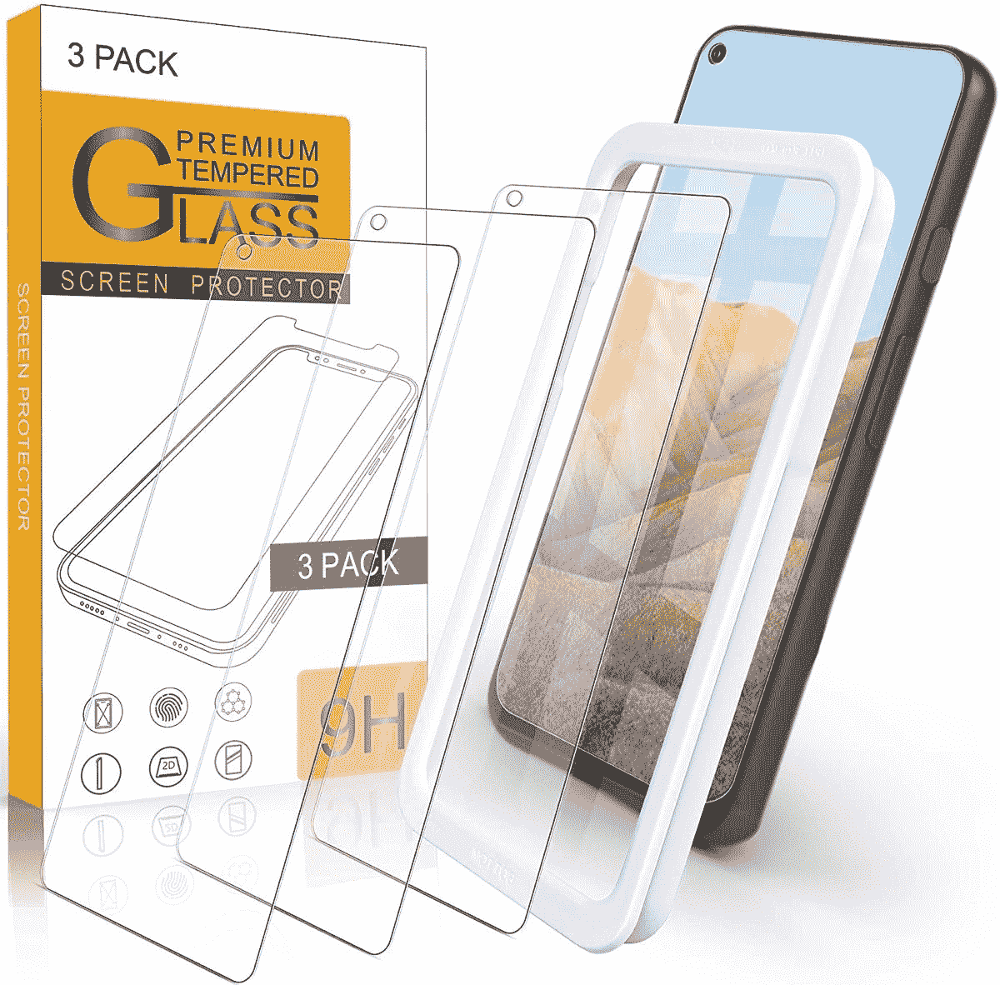
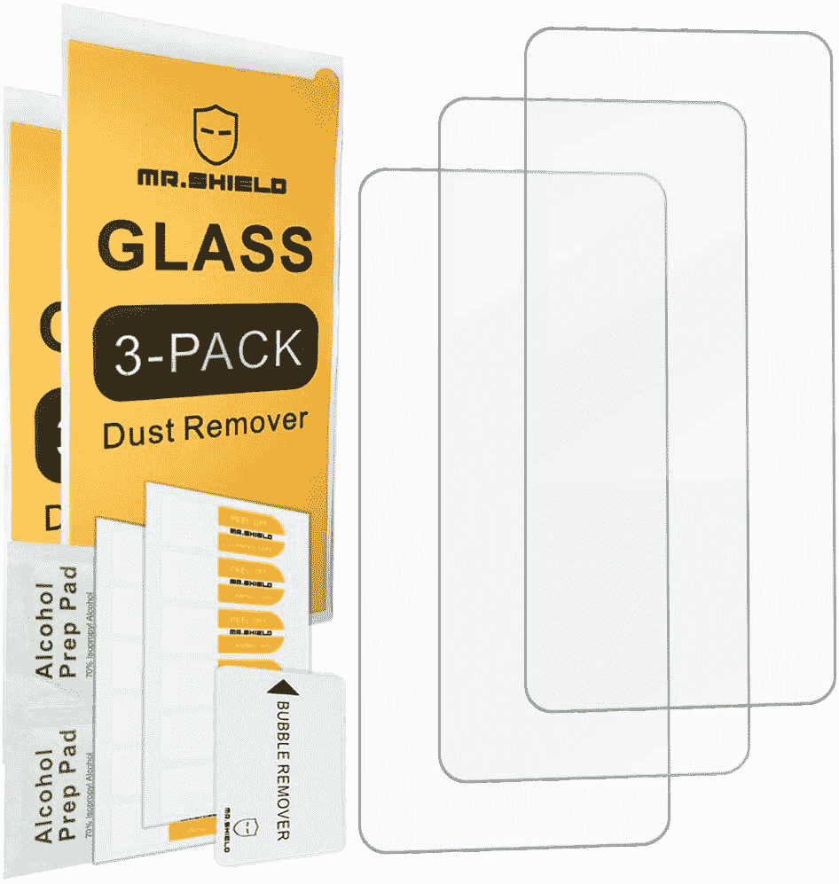
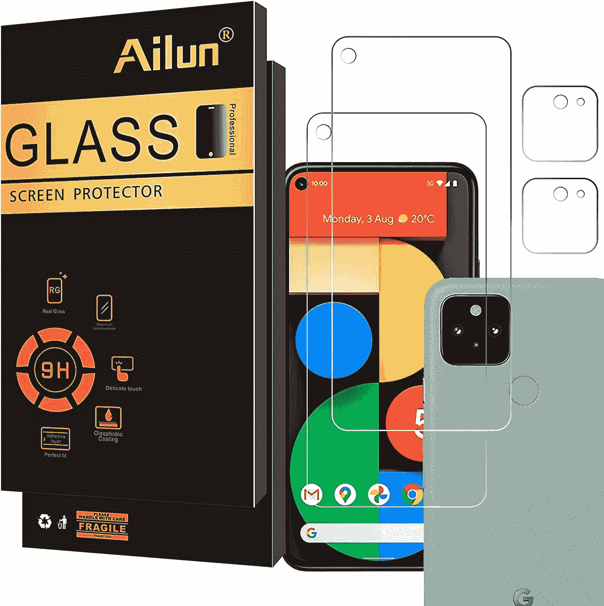
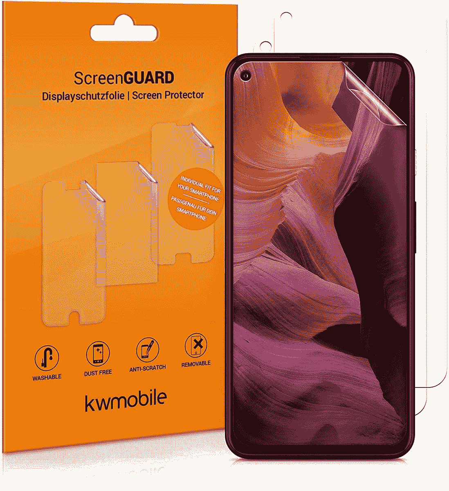
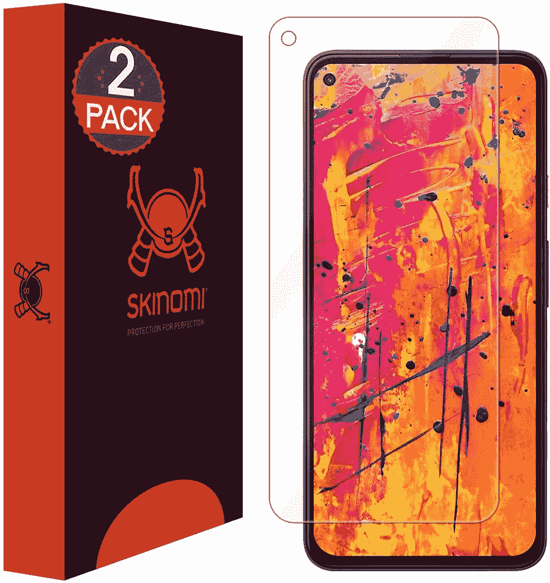
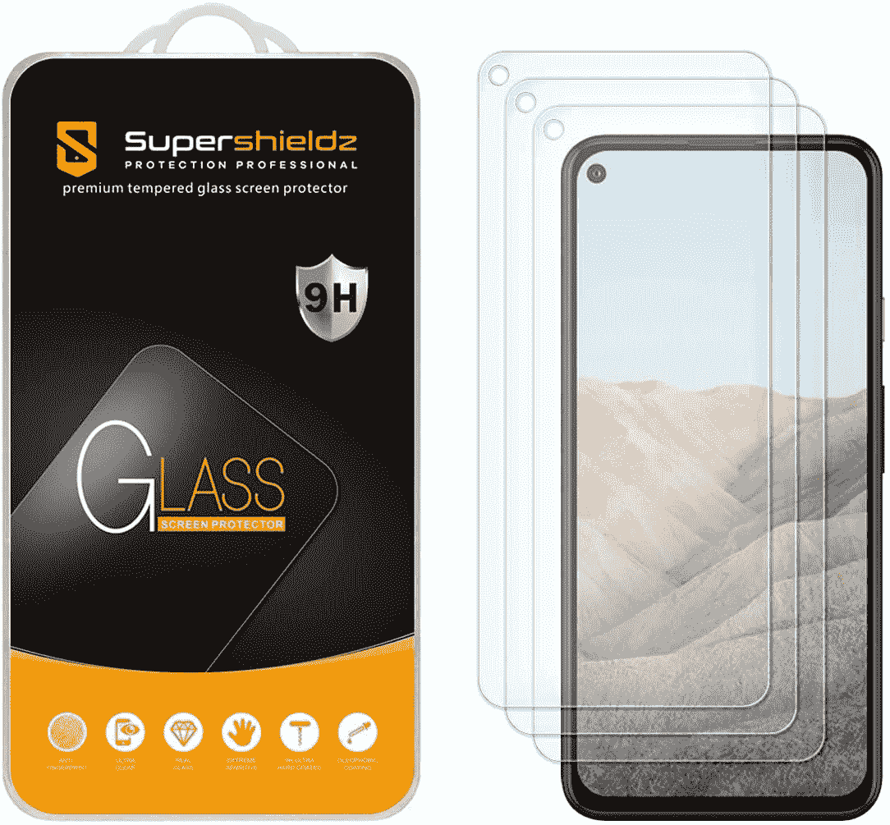
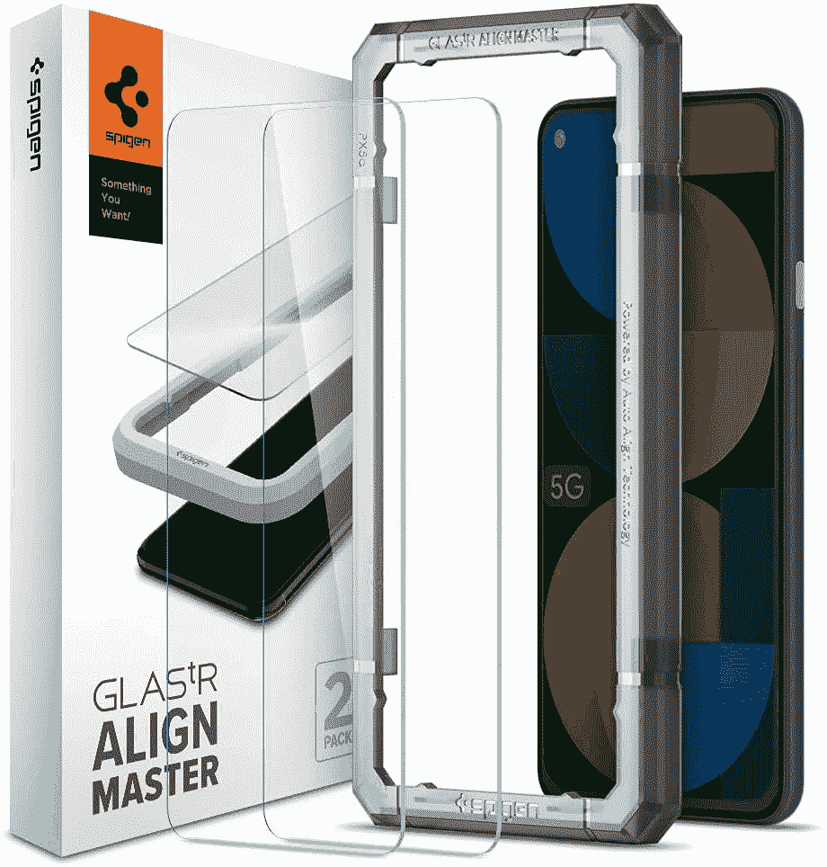

# 2023 年最佳谷歌 Pixel 5a 屏幕保护器

> 原文：<https://www.xda-developers.com/best-google-pixel-5a-screen-protectors/>

# 2023 年最佳谷歌 Pixel 5a 屏幕保护器

我们选择了最好的 Pixel 5a 屏幕保护器。我们的建议包括 PET 膜、TPU 膜和钢化玻璃保护套。

[谷歌 Pixel 5a](https://www.xda-developers.com/google-pixel-5a/) 的构建质量相当不错。它采用金属一体式设计，塑料外壳，正面有康宁大猩猩玻璃 3 保护。然而，增加一个外壳和一个屏幕保护器来更好地保护你的手机总是好的。我们已经为 Pixel 5a 推荐了[最佳案例，现在轮到屏幕保护器了。以下是你现在能买到的最好的 Pixel 5a 屏幕保护器。](https://www.xda-developers.com/best-google-pixel-5a-cases/)

一个屏幕保护器，当与一个好的外壳一起使用时，可以在很大程度上保护你的手机免受划痕和裂缝的影响。损坏的显示器维修起来会很贵，所以买一个高质量的屏幕保护器可以帮你省下一大笔钱。

## 最佳像素 5a 屏幕保护器

像往常一样，我们的建议包括 PET 膜，TPU 膜和钢化玻璃保护套的组合。所以你可以根据自己的喜好挑一个。钢化玻璃保护器通常提供最好的保护，而 TPU 膜是最灵活的。因此，即使在带有弯曲边缘的屏幕上，它们也能提供良好的贴合性。PET 薄膜不如 TPU 薄膜柔韧，但它们提供的保护稍好。

 <picture></picture> 

Arae Screen Protector

##### Arae Pixel 5a 屏幕保护器

像素 5a 的 Arae 屏幕保护器使用钢化玻璃来保护屏幕。它的额定硬度为 9H，并带有疏水和疏油涂层，以抵御汗水和指纹污迹。

 <picture></picture> 

Mr. Shield Screen Protector

##### Mr. Shield 钢化玻璃像素 5a 屏幕保护器

Mr. Shield 屏幕保护器也采用了 9H 级钢化玻璃。此外，如果您收到损坏的设备或有装配或安装问题，公司将提供有限的终身更换保修。

 <picture></picture> 

ArmorSuit MilitaryShield

##### 盔甲军装防护像素 5a 屏幕保护

如果你不是钢化玻璃保护罩的粉丝，这款盔甲军装屏幕保护罩可能会让你感兴趣。这本质上是一部具有自我修复功能的 TPU 电影。随着时间的推移，屏幕保护器本身会消除任何轻微的划痕或磨损痕迹。

 <picture></picture> 

Ailun Screen Protector

##### 艾伦像素 5a 屏幕保护器

指纹污迹可能令人讨厌，如果你正在寻找一种屏幕保护器来消除它们，那么你会喜欢艾伦玻璃保护器。它具有疏油涂层，以抵御指纹污迹。

 <picture></picture> 

Kwmobile display film

##### kwmobile ScreenGuard Pixel 5a 屏幕保护器

kwmobile 屏幕保护器是 PET 膜，承诺防刮擦。它很容易应用，并且你在盒子里得到三个屏幕保护，这将足以持续手机的一生。此外，薄膜上还有一层疏油涂层。

 <picture></picture> 

Skinomi Screen Protector

##### Skinomi Pixel 5a 屏幕保护器

如果你不喜欢 ArmorSuit 军用盾牌，Skinomi 屏幕保护器也是 TPU 电影。它由军用级 TPU 材料制成，可以吸收冲击，并为 Pixel 5a 屏幕提供良好的保护。你也能获得自我修复的支持。

 <picture></picture> 

SuperShieldz Tempered Glass

##### SuperShieldz 钢化玻璃像素 5a 屏幕保护器

SuperShield 钢化玻璃保护器还具有 9H 硬度，并涂有疏水和疏油材料。该公司表示，它将提供出色的抗划伤性。此外，盒子里还有两个保护器。

 <picture></picture> 

Skinomi Matte Protector

##### Skinomi 哑光像素 5a 屏幕保护

除了常规的 TPU 保护膜，Skinomi 还提供哑光保护膜，可以减少眩光，提高可见度和明亮的环境。它还使用军用级材料，并且可以自我修复。

 <picture></picture> 

Spigen Tempered Glass

##### Spigen 钢化玻璃像素 5a 屏幕保护器

Pixel 5a 的 Spigen 钢化玻璃保护套配有智能安装程序，可帮助安装。钢化玻璃还涂有疏油材料，以防止污迹，硬度为 9H。

这些是你现在能买到的最好的 Pixel 5a 屏幕保护器。如果你喜欢钢化玻璃，盾牌保护者先生是一个很好的选择，而 TPU 电影爱好者会欣赏斯基诺米电影。就 PET 膜而言，kwmobile 显示膜非常棒。我们建议购买钢化玻璃屏幕保护套，因为它们不仅保护性更强，而且手指在屏幕上滑动时也更光滑。它们在可视性方面也更好。

 <picture></picture> 

Google Store

##### 谷歌 Pixel 5a

Pixel 5a 是谷歌最新的中端智能手机。它配备了骁龙 765G SoC、6GB 内存和全高清+显示屏。

你打算买哪个屏幕保护？请在评论区告诉我们。你也可以阅读我们对 Pixel 5a 的详细评论，了解我们对它的看法。