# 2023 年最佳 HDMI 线缆

> 原文：<https://www.xda-developers.com/best-hdmi-cables/>

如果你已经升级到最新一代的游戏主机，正在购买一台新的 [4K 或 8K 电视](https://www.xda-developers.com/best-tv/)，或者只是需要一根支持 eARC 的 HDMI 电缆来安装家庭影院，市场上有大量的选择。但是如果你不确定哪种 HDMI 线适合你，我们可以帮你。

虽然自 2002 年首次亮相以来，HDMI 规范已经有了多次更新，但现在你只需要考虑 HDMI 2.0 和 HDMI 2.1。当然，对于大多数高清和全高清信号源，即使是像 HDMI 1.3 和 HDMI 1.4 这样的老一代电缆也能正常工作。尽管如此，如今 HDMI 2.0 电缆相当便宜，而且它们有足够的带宽来支持你在可预见的未来进行的任何合理的升级。因此，我们建议使用 HDMI 2.0，而不是 HDMI 1.3 或 1.4。当然，如果你有多余的钱，获得 HDMI 2.1 可以确保你在未来有更多的空间。

下面简单介绍一下我们推荐的两种 HDMI 线缆的性能。

*   HDMI 2.1: 48Gbps 带宽，支持 120Hz 的 4K、60Hz 的 8K、30Hz 的 10K、用于指定 HDR 元数据的动态 HDR、可变刷新率(VRR)和 eARC(增强音频返回通道)。
*   HDMI 2.0: 18Gbps 带宽，支持 240Hz 的 1080p，144Hz 的 1440p，60Hz 的 4K，4K 分辨率的 24 位色深，多达 32 个音频通道，以及 ARC。HDMI 2.0a 增加了 HDR 支持，HDMI 2.0b 增加了混合对数伽玛支持

你可以阅读[我们关于各种 HDMI 代和连接器](https://www.xda-developers.com/hdmi-standards-specs-explained/)的解释，了解更多信息。

## 最佳 HDMI 2.1 电缆

你需要一根 HDMI 2.1 电缆将你的主机或游戏电脑连接到电视上，进行 [4K@120 游戏](https://www.xda-developers.com/best-4k-120hz-gaming-tv/)甚至 8K@60 游戏。HDMI 2.1 电缆也用于通过 eARC 将音频发送回您的条形音箱或扬声器设置。

 <picture>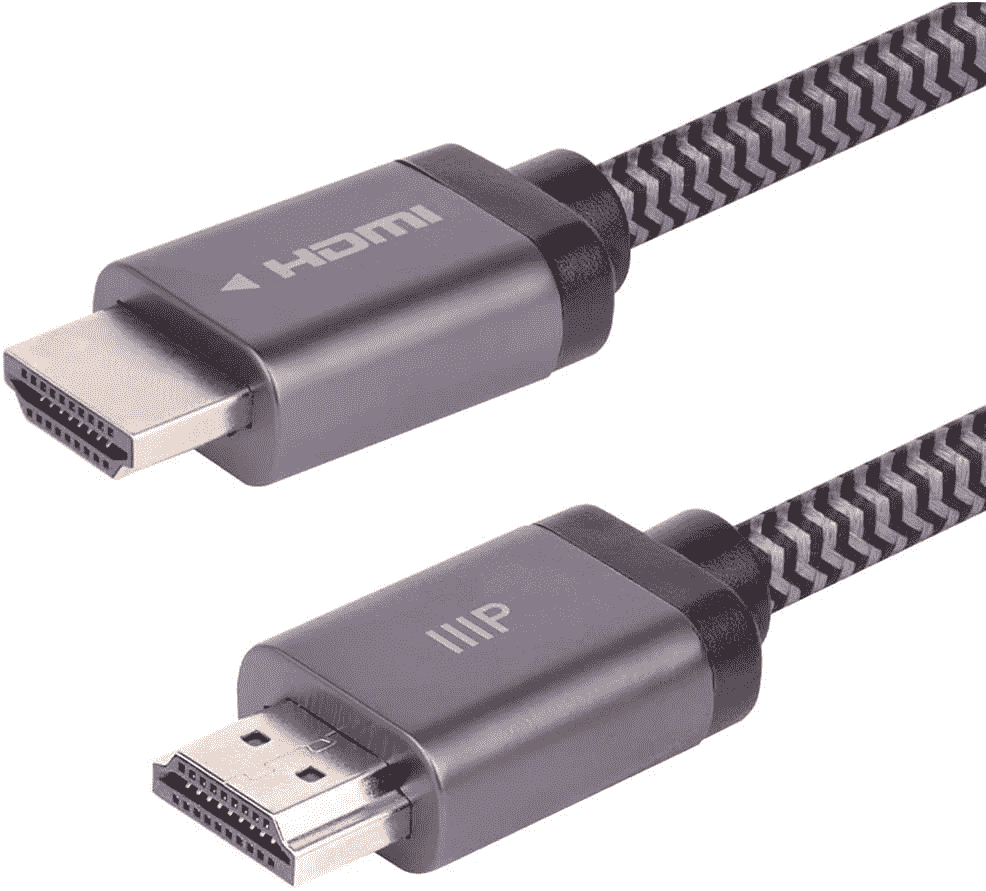</picture> 

Monoprice Ultra High Speed HDMI 2.1 Cable

##### 单价超高速 HDMI 2.1 电缆

单价 HDMI 2.1 线是一个很好的选择。它不贵，你可以买到三英尺、六英尺、十英尺和十五英尺的尺码。该电缆将非常适合 4K@120fps 游戏和 eARC。

 <picture>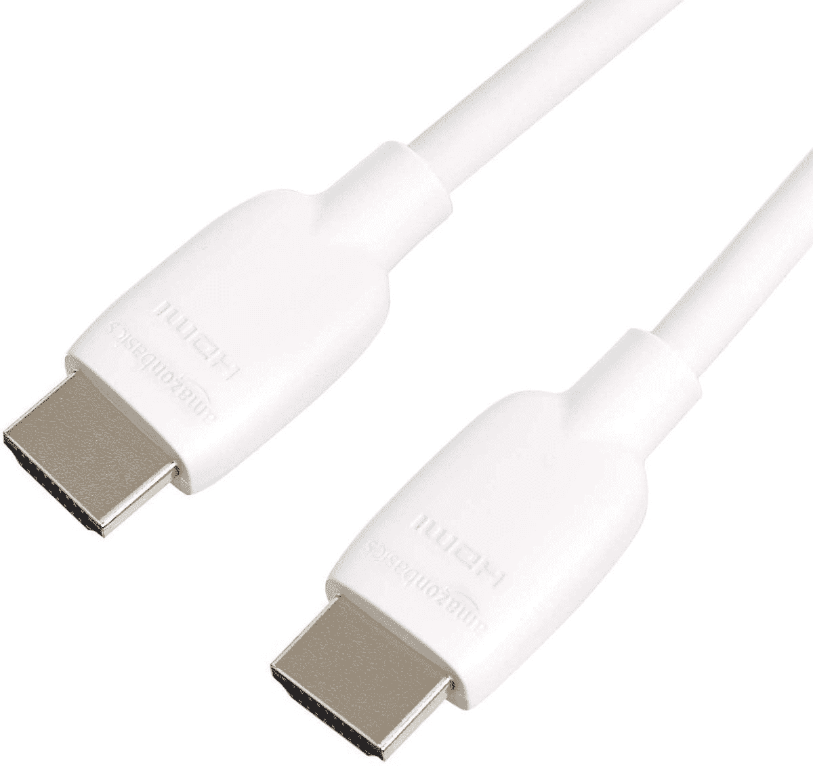</picture> 

AmazonBasics High-Speed HDMI Cable

##### 亚马逊基础高速 HDMI 电缆

AmazonBasics 的东西经常是漫无目的的，但是这个亚马逊品牌的 HDMI 2.1 线还是挺不错的。你可以买到三、六、十英尺的尺码，并有三种颜色可供选择。

 <picture>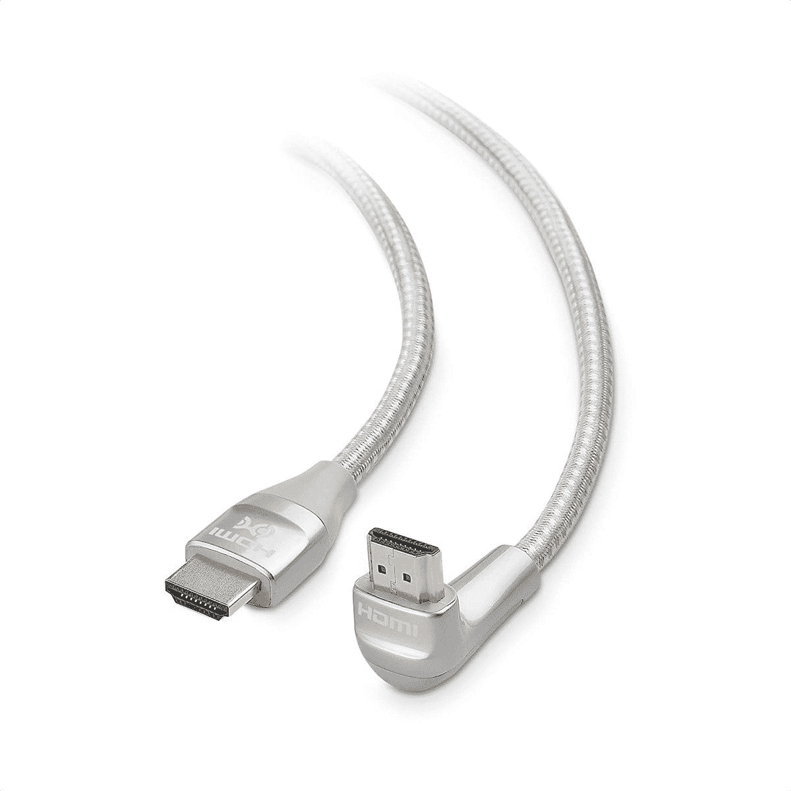</picture> 

Cable Matters HDMI cable

##### 电缆问题 HDMI 电缆

如果您需要一根 HDMI 2.1 电缆，连接器弯曲 270 度，这是 Cable Matters 的一个绝佳选择。它有 6.6 英尺的尺寸和银色。在狭窄的空间里使用这种电缆会很方便。

 <picture>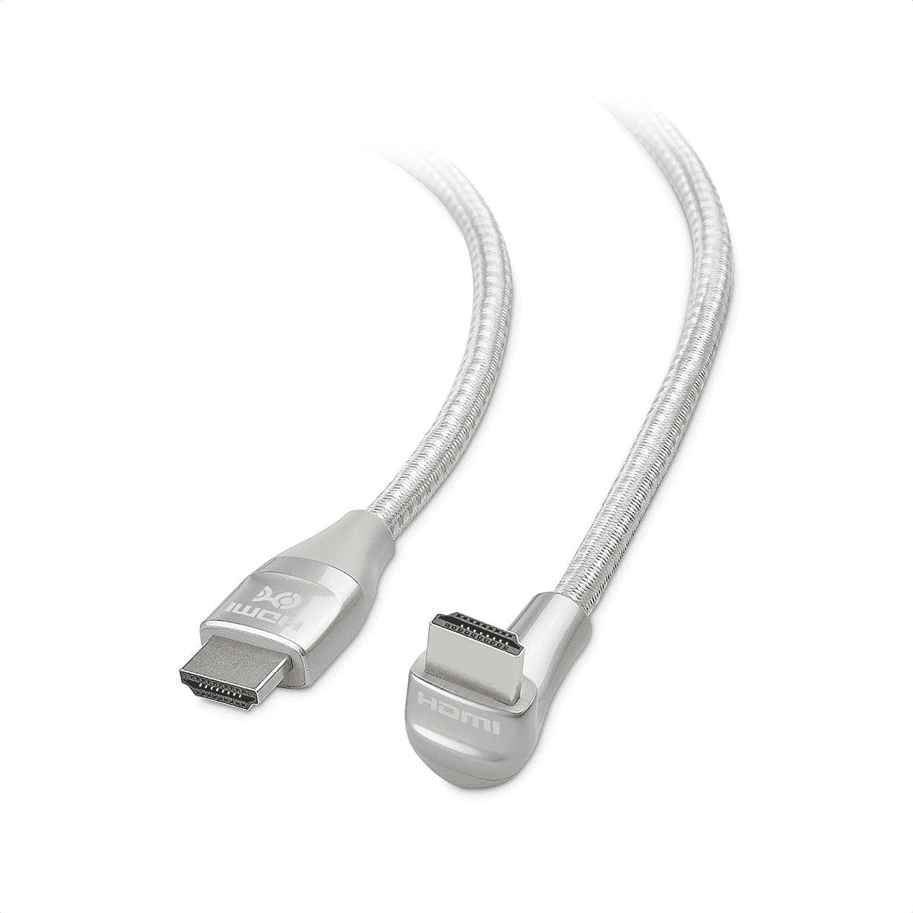</picture> 

Cable Matter 90-degree HDMI cable

##### 电缆问题 90 度 HDMI 电缆

除了出色的 270 度电缆，Cable Matters 还提供这种 90 度选项。它有单一的 6.6 英尺大小和银色选项。这种电缆对壁挂式电视来说很方便。

 <picture>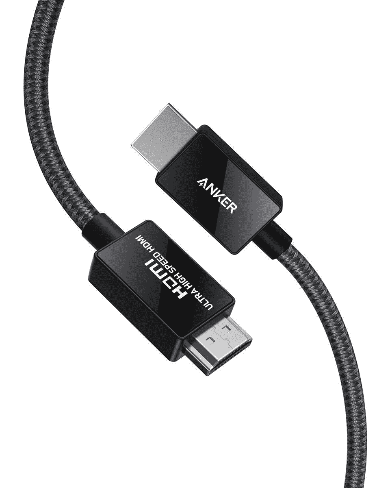</picture> 

Anker Ultra High Speed HDMI cable

##### Anker 超高速 HDMI 电缆

Anker 制造了一些最好的移动配件，这种 HDMI 电缆也不例外。它完全兼容 HDMI 2.1 规范，尺寸仅为 6.6 英尺。

 <picture>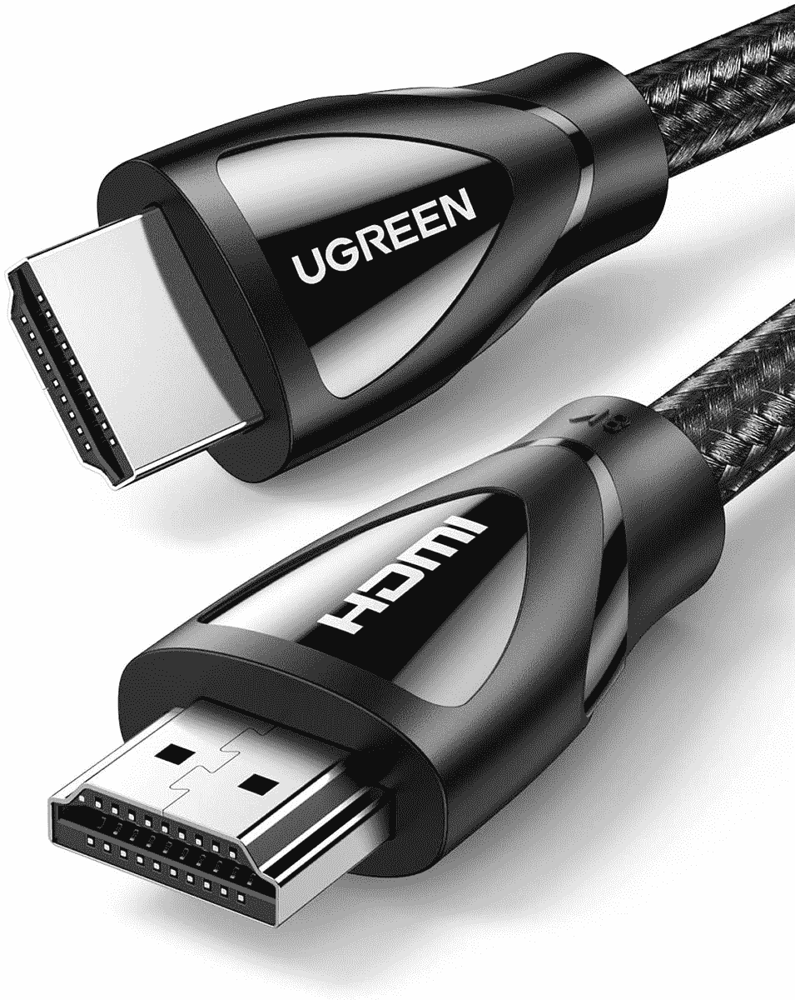</picture> 

Anker Ultra High Speed HDMI cable

##### Anker 超高速 HDMI 电缆

这种 Ugreen 电缆是市场上另一种良好的 HDMI 2.1 兼容选项。你可以买四种尺寸的——3 英尺、6 英尺、10 英尺和 16 英尺——但只有一种颜色可供选择。

 <picture>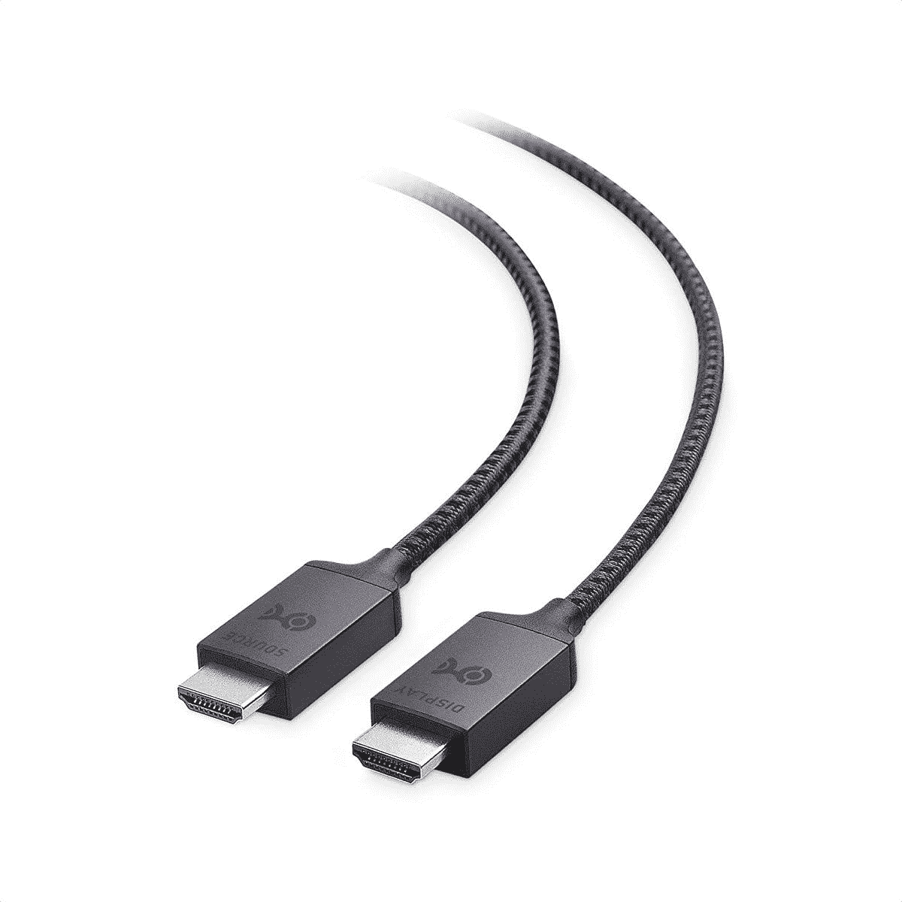</picture> 

Cable Matters Optic HDMI cable

##### 光缆 HDMI 电缆

如果您需要更长的 HDMI 2.1 电缆，Cable Matters 提供这种光纤 HDMI 电缆，确保信号顺利到达目的地。它的大小是 32.8 英尺或 10 米。

 <picture>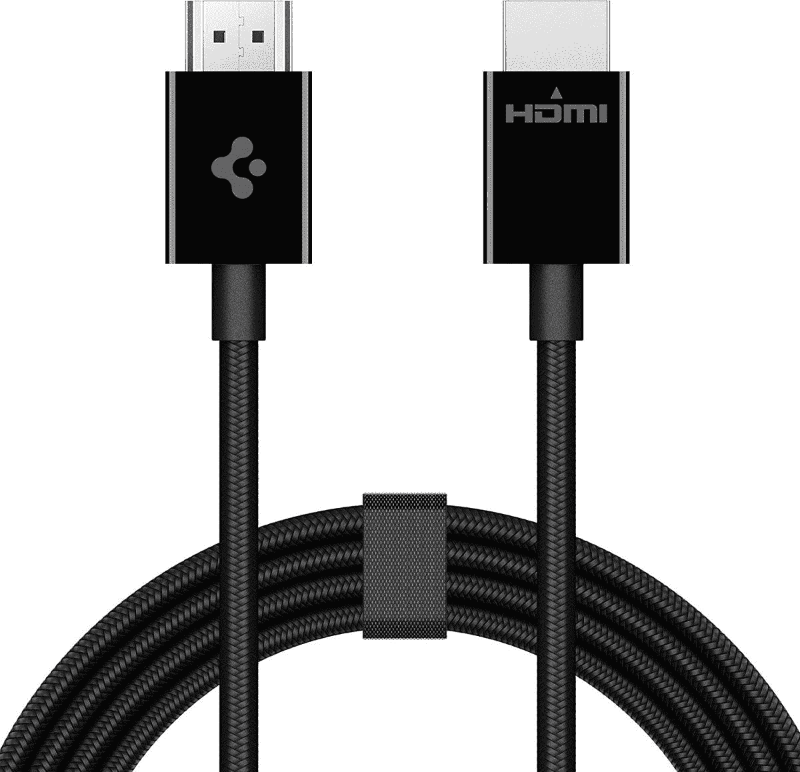</picture> 

Spigen ArcWire 8K HDMI 2.1 Cable

##### Spigen ArcWire 8K HDMI 2.1 电缆

如果你不喜欢其他任何品牌，Spigen 也出售 HDMI 2.1 电缆。它不像我们推荐的其他产品那样实惠，但是它有 24 个月的保修期。

 <picture>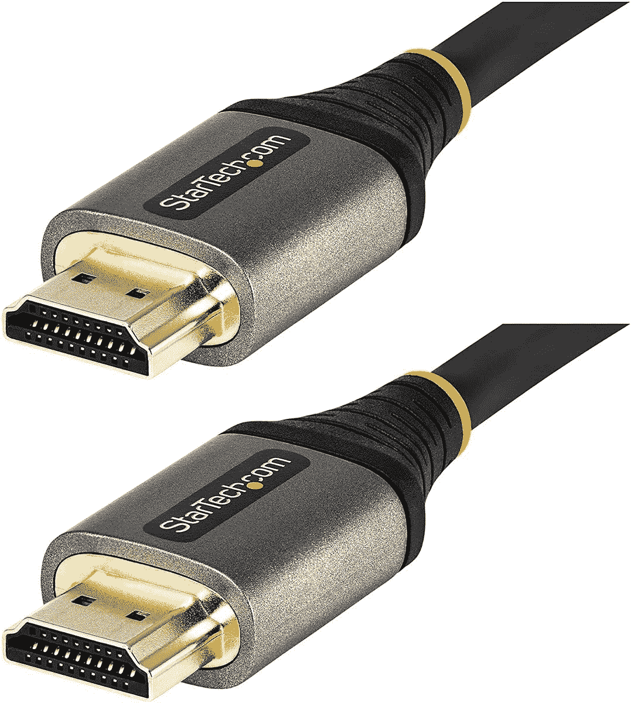</picture> 

StarTech.com HDMI 2.1 Cable

##### StarTech.com HDMI 2.1 电缆

这种 StarTech.com HDMI 2.1 电缆带有一个灵活的 TPE 护套，用于消除应力和延长使用寿命。它有一米和两米两种尺寸。

* * *

## 最佳 HDMI 2.0 电缆

当您不需要高级游戏功能，而需要使用 HDMI 2.0 电缆来执行较低带宽的任务(如观看电影)时，HDMI 2.0 电缆非常合适。不幸的是，HDR 支持只在 HDMI 2.0a 更新中添加，所以不是每个 HDMI 2.0 电缆都支持它。因此，如果你想让 HDR 工作，你需要确保你的 HDMI 2.0 电缆支持它，或者选择 HDMI 2.1 电缆以避免麻烦。

 <picture>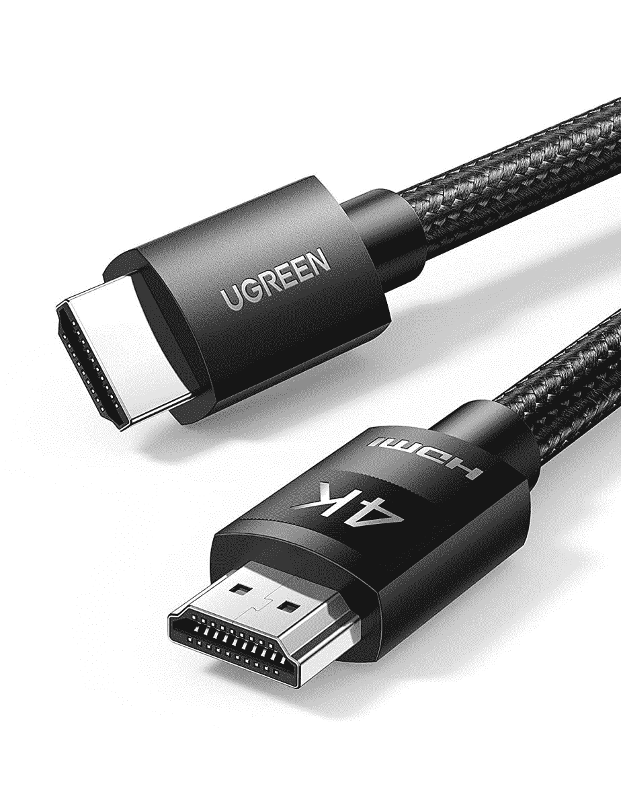</picture> 

Ugreen High Speed HDMI cable

##### 绿色高速 HDMI 电缆

Ugreen 是一款物超所值的配件，这款 HDMI 2.1 就是一个很好的例子。它价格实惠，而且像广告宣传的那样有效。另外，你可以买一米、两米、三米的。

 <picture>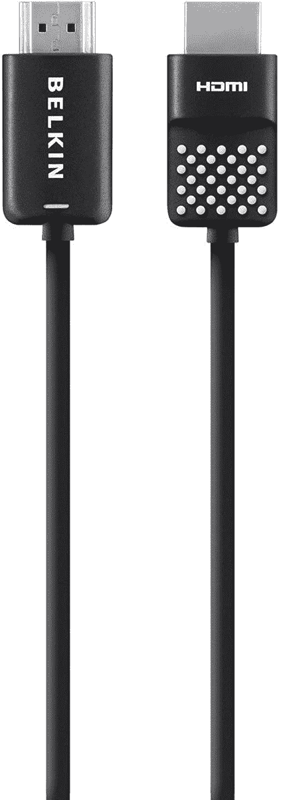</picture> 

Belkin High-Speed HDMI Cable

##### Belkin 高速 HDMI 电缆

这是 Belkin 的一款优秀的 HDMI 2.0 线，有六英尺和 12 英尺两种尺寸可以买。该电缆的一个连接器还带有纹理材料，便于抓握，更容易插入或取出。

 <picture>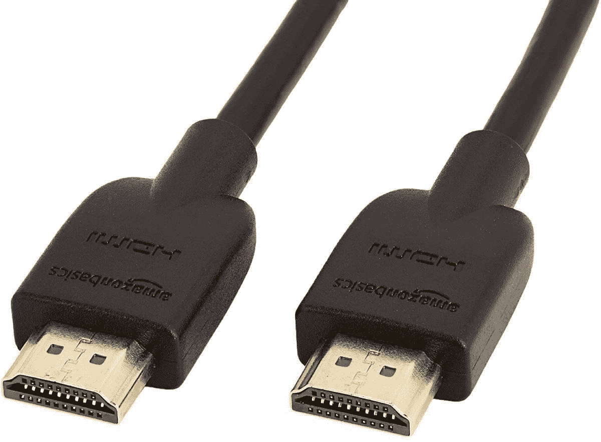</picture> 

AmazonBasics High-Speed HDMI Cable

##### 亚马逊基础高速 HDMI 电缆

如果你不打算在 HDMI 线缆上花太多钱，AmazonBasics 高速 HDMI 线缆是个不错的选择。它有五种尺寸，你可以便宜地买到多种电缆包。HDR 也表示支持。

 <picture>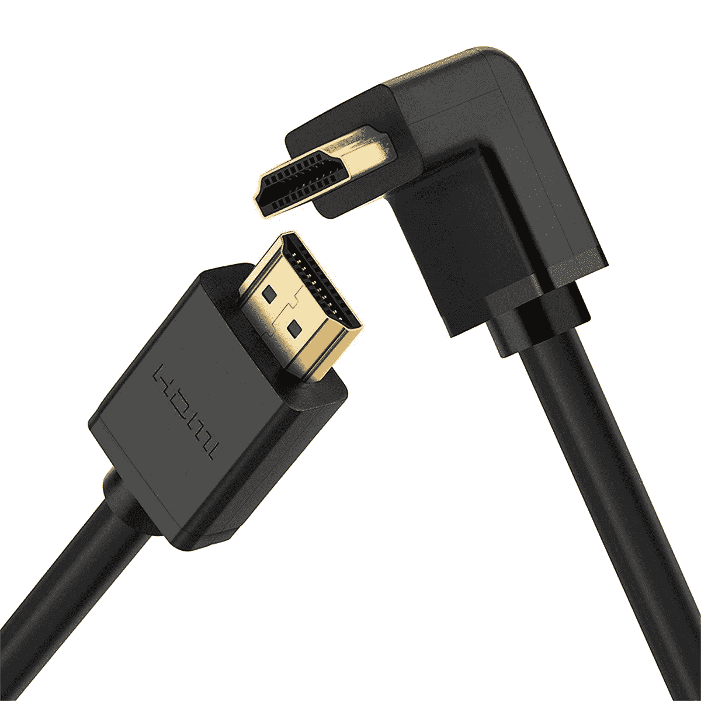</picture> 

Ugreen 270-degree angled cable

##### 绿色 270 度角 USB-C 电缆

Ugreen 的这款 270 度角 HDMI 2.0 线缆可以帮助您在狭窄的空间中避免不必要的线缆弯曲。它有三、六、十英尺三种尺寸。

 <picture>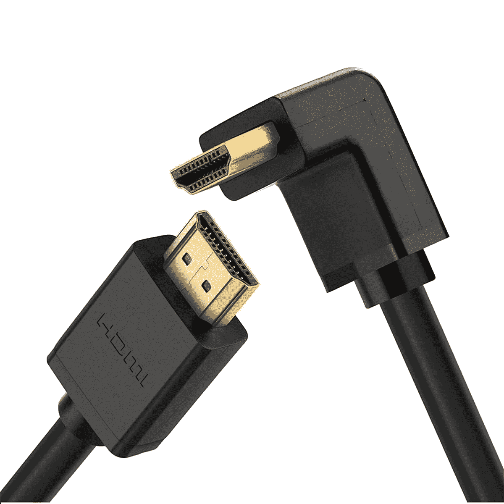</picture> 

Ugreen 90-degree angled cable

##### 绿色 90 度角电缆

Ugreen 还提供 90 度角的 HDMI 2.0 线缆。它有 3、6、10 和 15 英尺四种尺寸，完全兼容 HDMI 2.0 规范。

 <picture>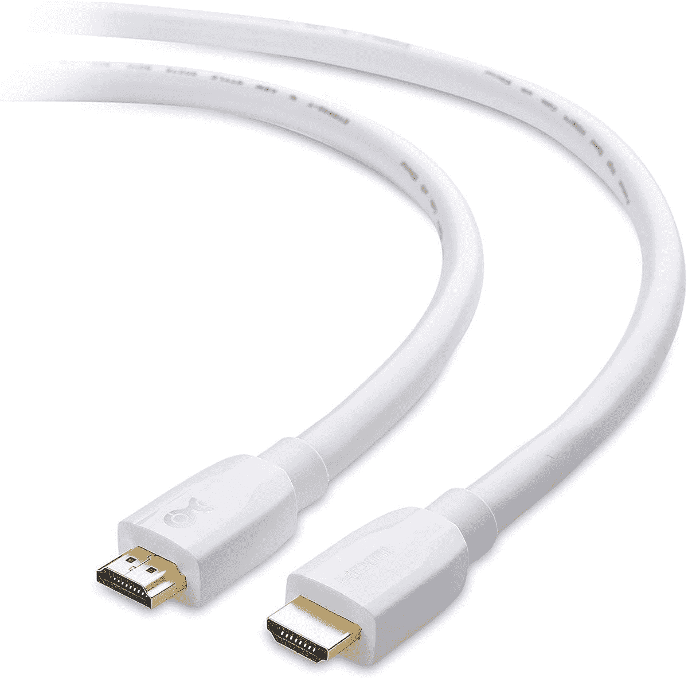</picture> 

Cable Matters HDMI 2.0b cable

##### 电缆问题 HDMI 2.0b 电缆

除了其出色的 HDMI 2.1 电缆，Cable Matters 还提供这种高级 HDMI 2.0b 电缆。它支持 HDR 和 HLG，这两者在常规 HDMI 2.0 电缆中不可用。

这些是市场上最好的 HDMI 2.0 和 HDMI 2.1 电缆。AmazonBasics 和 Ugreen 提供了一些最好的性价比电缆，如果你需要 HDMI 电缆，你可以从我们的建议中选择任何一种电缆。

你打算买哪种电缆？请在评论区告诉我们。同时，我们还挑选了市场上最好的 USB 线和你今天能买到的 T2 最好的显示器。