# 苹果 MacBook Pro 13 最佳耳机(2022)

> 原文：<https://www.xda-developers.com/best-headphones-macbook-pro-13-2022/>

# 苹果 MacBook Pro 13 最佳耳机(2022)

耳机是非常重要的 MacBook Pro 配件，尤其是对那些在路上工作的人来说。以下是目前可用的最佳选项列表。

苹果的 [MacBook Pro 13 (2022)](https://www.xda-developers.com/apple-macbook-pro-13-inch-m2-2022-review/) 是目前上市的[最好的 MAC 电脑](http://www.xda-developers.com/best-macs/)之一。然而，与 14 英寸和 16 英寸的 [MacBook Pro (2021)](https://www.xda-developers.com/macbook-pro-2021/) 型号不同，它没有提供重新设计的机箱和凹口显示屏。相反，除了传统的 Thunderbolt 4 端口和耳机插孔外，它还具有从 M1 到 M2 的芯片组凸起。这意味着您可以将它与有线和无线耳机/耳塞配对。因此，无论您是在寻求休闲音乐聆听还是工作会议的选择，我们都已经选择了几个耳机品牌和型号，它们将与您的 MacBook Pro 13 完美配合。

## MacBook Pro 13 最佳耳机(2022)

*   <picture></picture>

    Beats studio 3

    ##### Beats studio 3

    Beats studio 3 有六种不同的颜色，并提供即时配对、空间音频支持、噪音消除等功能。

*   <picture>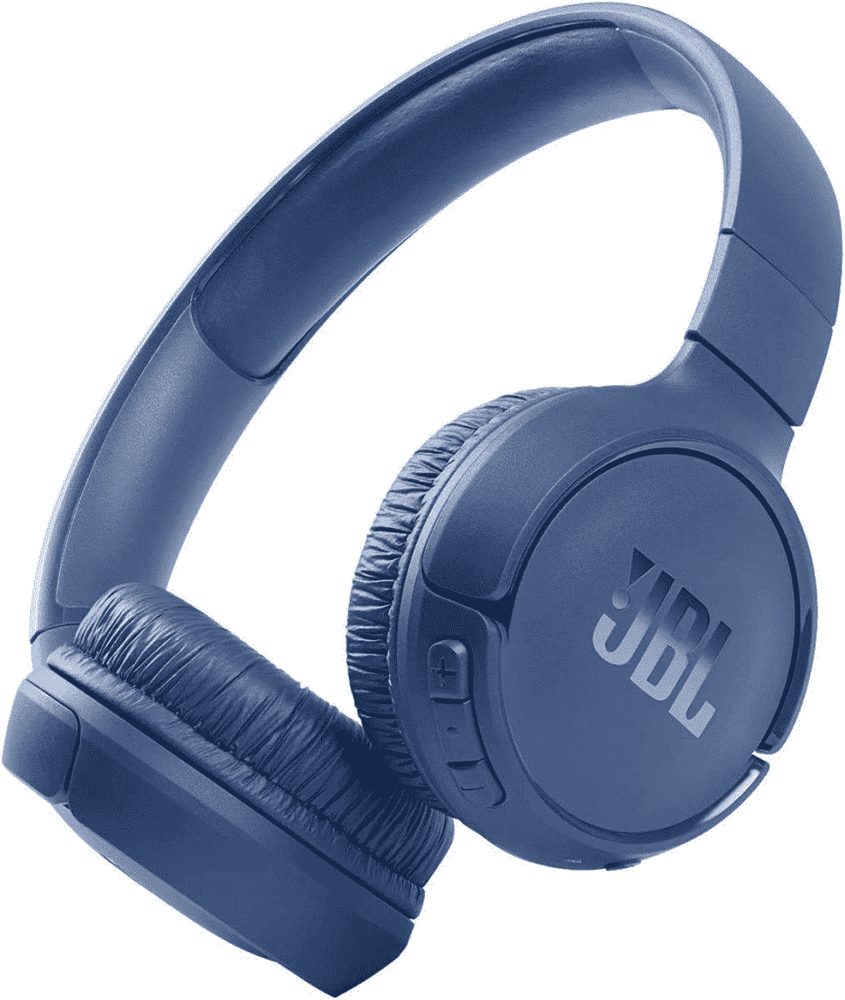</picture>

    JBL 调 510 Bt

    ##### JBL 调 510BT

    这些实惠的通过 2 小时充电提供 40 小时的使用。

*   <picture>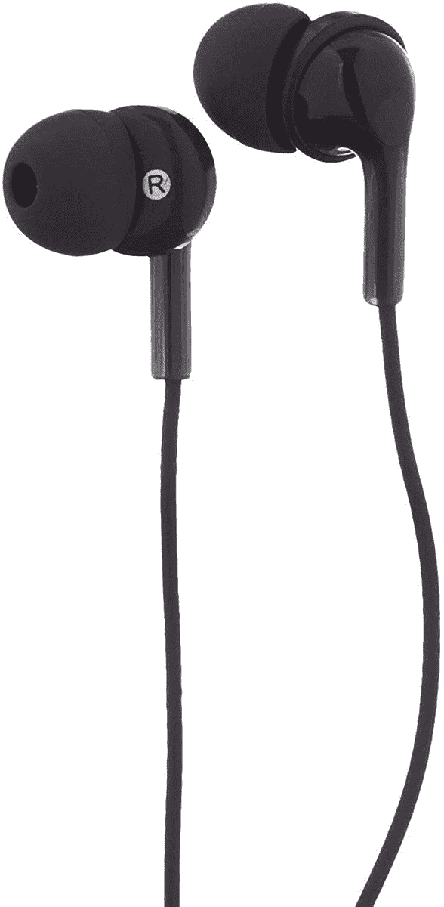</picture>

    亚马逊基本款耳塞

    ##### 亚马逊基本款入耳式有线耳机

    这些有线耳机的价格不到 10 美元——对于预算有限的人来说。

*   ##### 索尼 WH-1000XM5

    索尼制造了世界上最好的音频产品，WH-1000XM5 耳机采用了新的、更时尚的设计，音频更好，改进的 ANC 有八个麦克风和两个处理器，电池续航时间为 30 小时。它很贵，但它提供了一种奇妙的体验。

    T34
*   <picture></picture>

    ATH 音响技术公司-M20X

    ##### ATH 音响技术公司-M20X

    这些来自一家声誉良好的公司，以有线或无线方式出售。

*   <picture>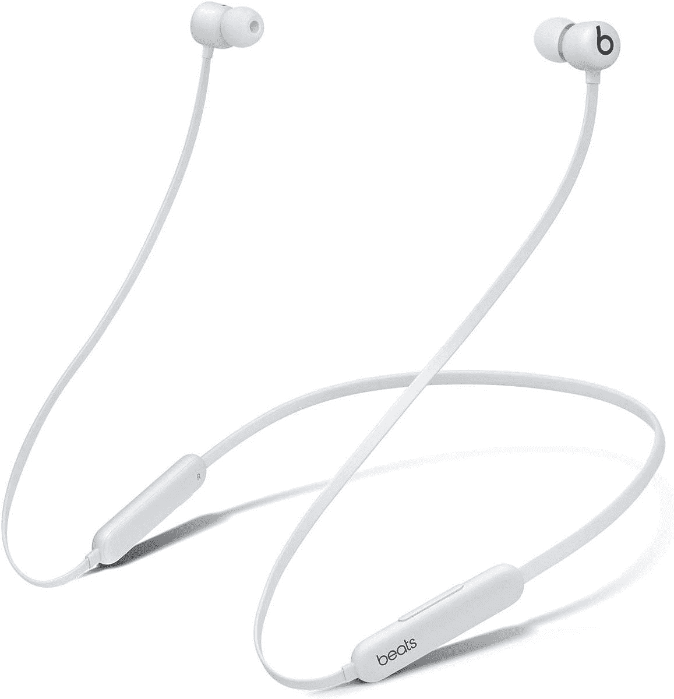</picture>

    Beats Flex

    ##### Beats Flex

    这些微型耳塞提供了 12 小时的电池和四种令人惊艳的颜色选择。

*   ##### 苹果 ai rpods Pro 2

    ai rpods Pro 2 拥有大量功能，包括主动降噪(ANC)、杜比 Atmos 内容和无线充电，尽管它们的结构紧凑。

    T34
*   ##### 苹果 AirPods Max

    和 AirPods Pro 一样，AirPods Max 自带主动降噪(ANC)和杜比 Atmos 支持。不过，由于尺寸更大，Max 变种提供了更多的音频沉浸感。

    T44
*   <picture>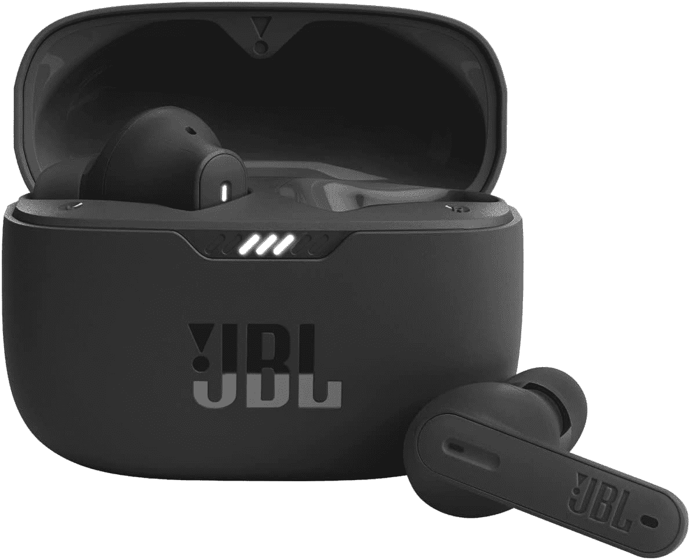</picture>

    JBL 调 230 NC

    ##### JBL 调 230NC

    这些 ANC 耳塞提供三种颜色选择和 IPX4 防水。

*   <picture>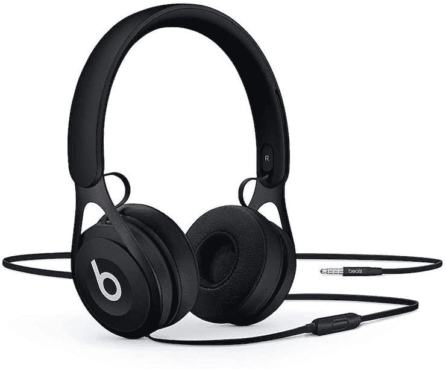</picture>

    Beats EP 耳机

    ##### Beats EP

    有四种颜色可选，这些有线耳机都是免电池的。

*   <picture>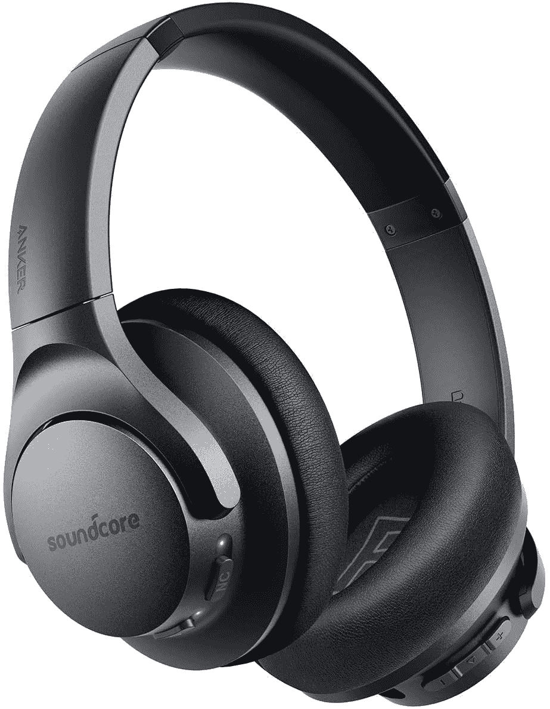</picture>

    Anker Soundcore Life Q20

    ##### Anker Soundcore Life Q20

    这些舒适的耳机支持 hi-res 音频、ANC 等等。

*   <picture></picture>

    Beas Studio Buds

    ##### Beats Studio Buds

    Beats Studio Buds 提供了良好的音效、ANC、舒适的贴合感，以及长达八小时的续航时间，比 AirPods Pro 少了很多。

*   <picture>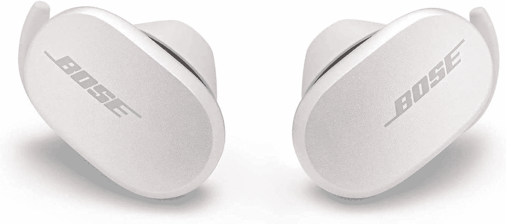</picture>

    Bose quiet comfort

    ##### Bose QC 降噪耳塞

    有两种颜色可选，这些 ANC 耳塞包 6 小时的收听时间。

*   <picture>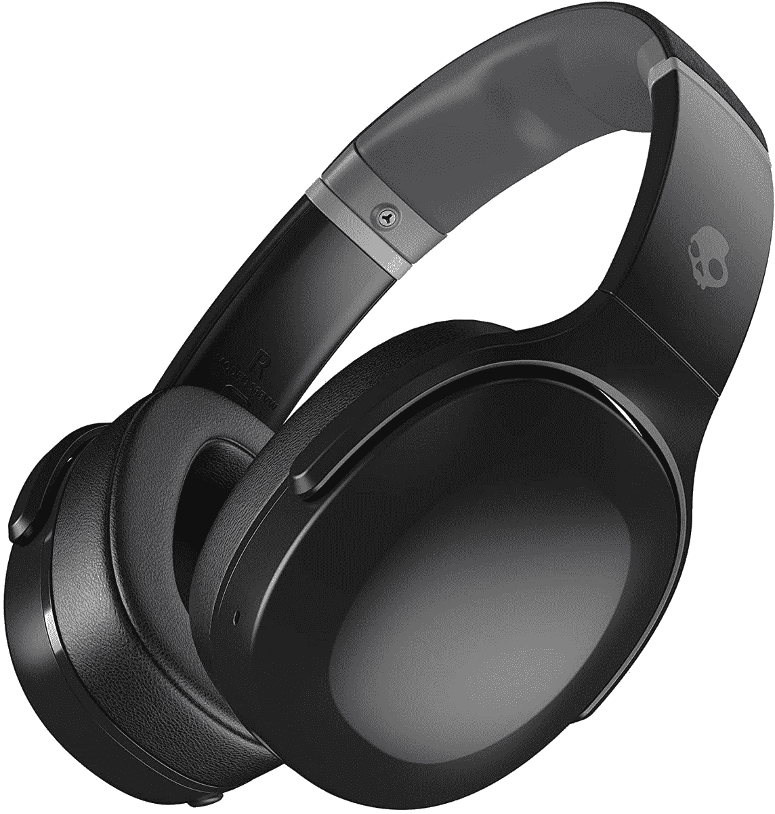</picture>

    Skullcandy Crusher Evo

    ##### Skullcandy Crusher Evo

    这些提供 41 小时的收听时间和磁贴追踪支持。

*   ##### 苹果 ai rpods 3

    ai rpods 3 的设计与 AirPods Pro 相似，但没有硅胶吸头。如果你不喜欢 AirPods Pro 的入耳式设计，你可以得到 AirPods 3。

    T34
*   <picture>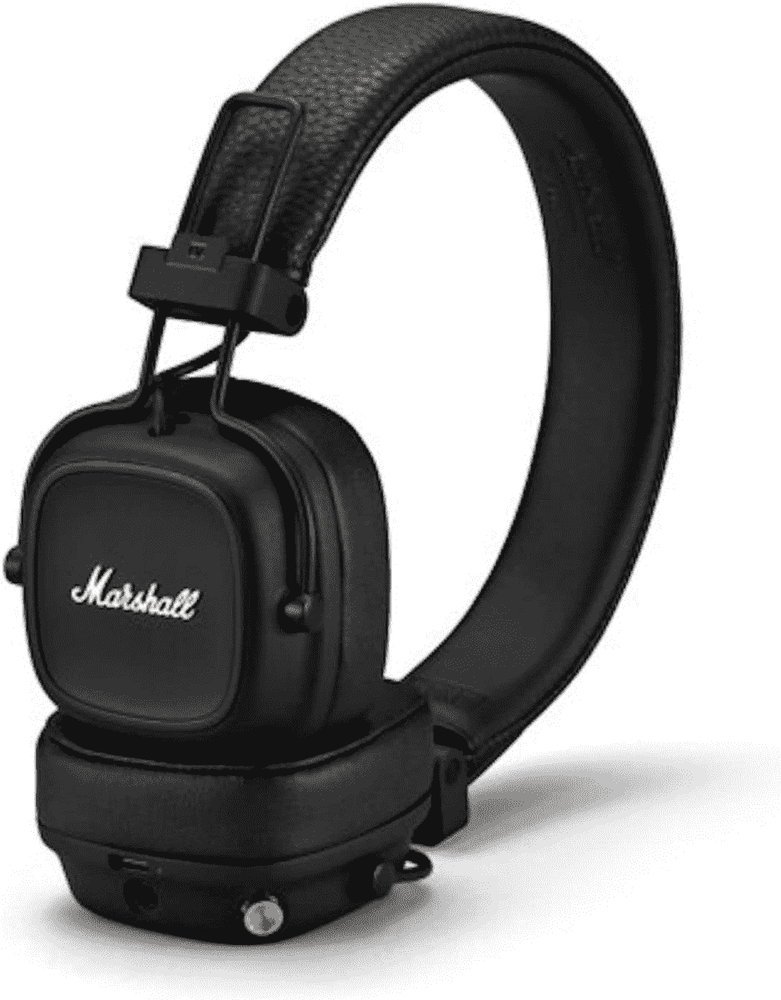</picture>

    马歇尔少校 IV

    ##### 马歇尔少校 IV

    这些真皮耳机支持有线和无线充电两种方式

*   <picture></picture>

    Apple EarPods

    ##### Apple EarPods

    Apple 的有线耳塞包括媒体遥控器和麦克风。

*   <picture>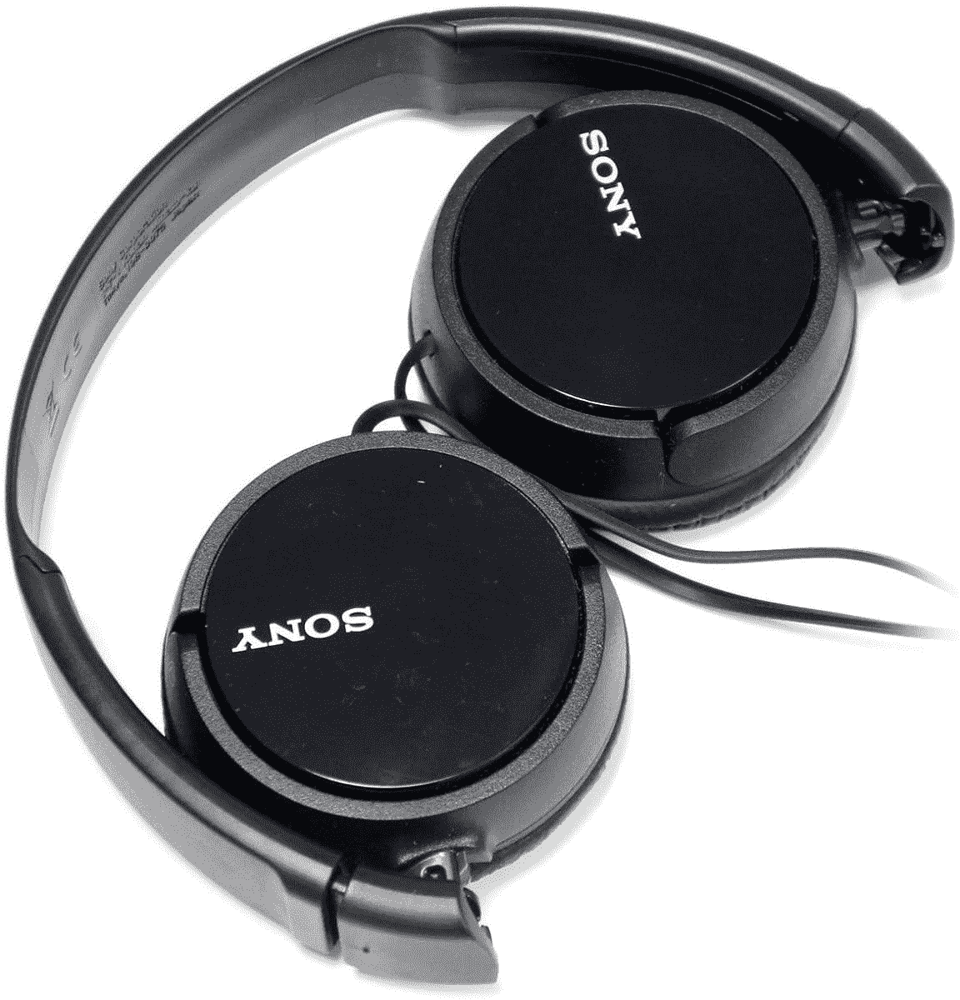</picture>

    索尼 ZX110

    ##### 索尼 ZX110

    索尼 zx 110 提供了可折叠设计，便于存放和携带。

*   <picture>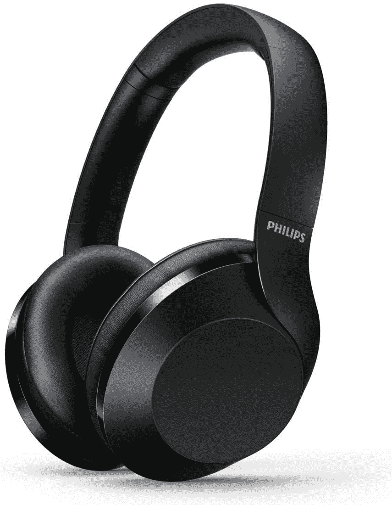</picture>

    飞利浦 ph 802

    ##### 飞利浦 PH802

    这些支持无损音频，30 小时的聆听，还有更多。

*   ##### Bose quiet comfort 45

    Bose quiet comfort 45 是配备 ANC 的几款最好的耳机。

    T34
*   ##### 飞利浦 SHP9500 HiFi 立体声耳机

    如果你不想花太多钱给自己买一个无损音频设备，飞利浦 SHP9500 是一个不错的实惠选择。当搭配一个好的 DAC 时，它们听起来会非常棒。

    T44

* * *

就我个人而言，如果我必须选择耳机来搭配我的 MacBook Pro 13，我会选择 AirPods Max 和 [AirPods Pro 2](https://www.xda-developers.com/airpods-pro-2-review/) ，这两款耳机适用于不同的使用情况。我不认为自己是一个音响发烧友，所以我不完全是在寻找最好的质量。相反，我在寻找我的 MacBook Pro 完全支持的耳机。在我看来，无缝连接和苹果生态系统的好处物有所值。我以前在 Mac 上使用过第三方蓝牙和耳机及扬声器。与使用包含苹果 H 或 W 芯片的产品相比，这种体验并不那么可靠。

给你的 MacBook Pro 买耳机很重要。如果你打算用它来工作，那就更是如此。毕竟，你可能需要参加大量的在线会议。主动噪音消除(ANC)通过隔离来自周围环境的声音，帮助您专注于会议。即使你不打算在工作中使用它，当你想听音乐或播放电视内容时，耳机也是一个很好的配件。

 <picture></picture> 

MacBook Pro (2022)

##### 苹果 MacBook Pro 13 英寸(2022)

2022 年的 MacBook Pro 13 英寸提供了经典的设计，重新引入了 Touch Bar，并封装了 M2 芯片。