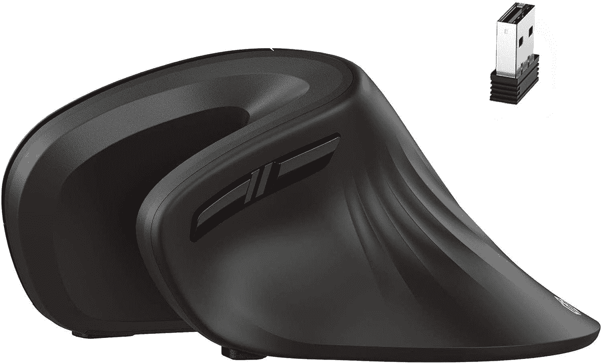
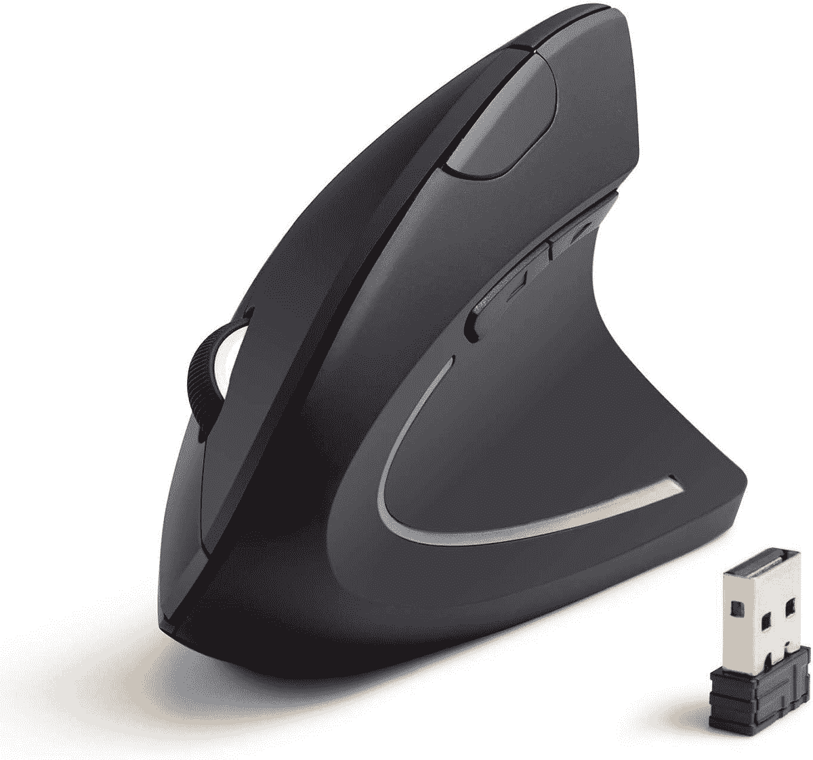
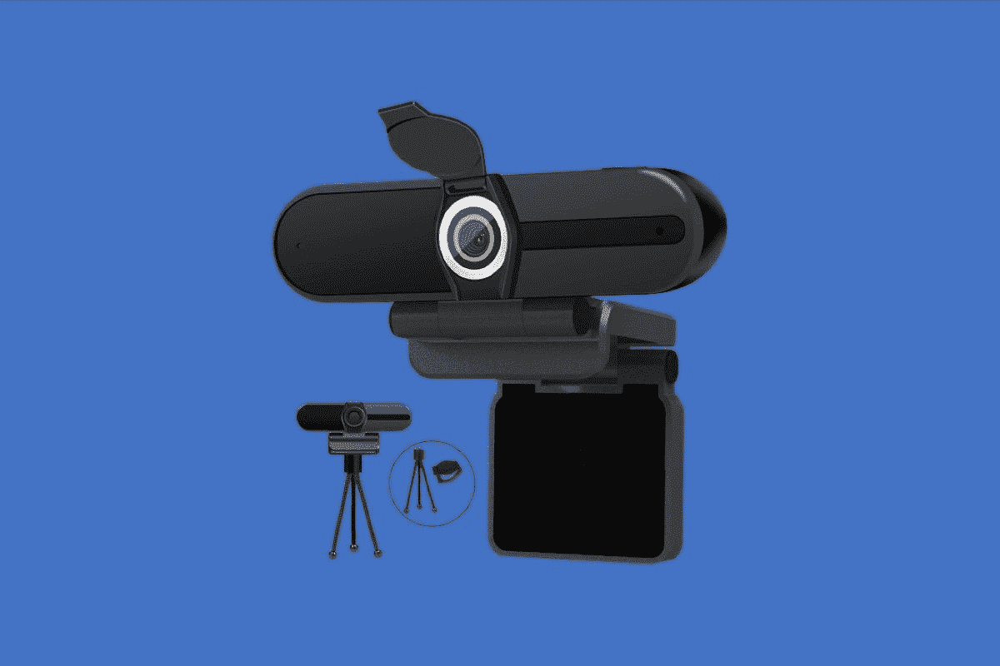
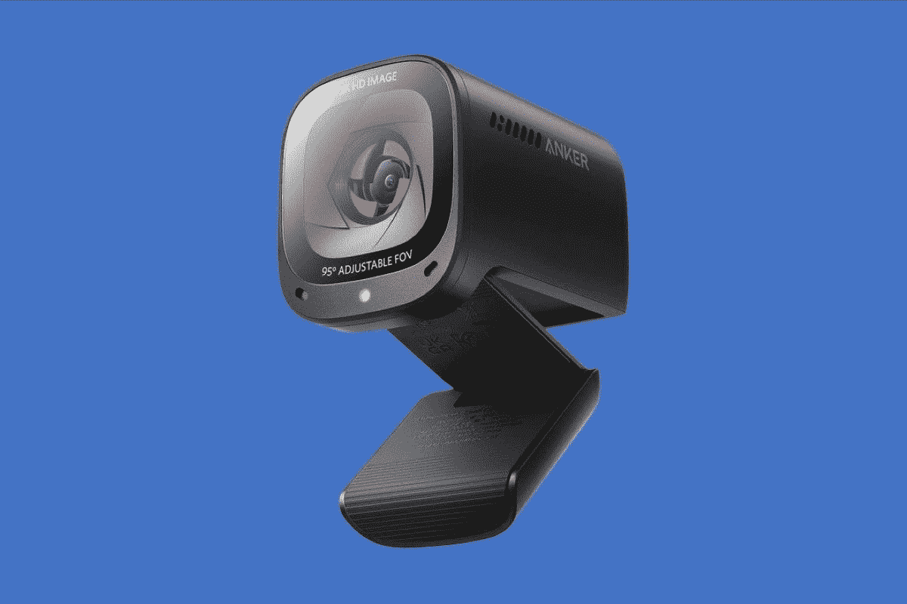
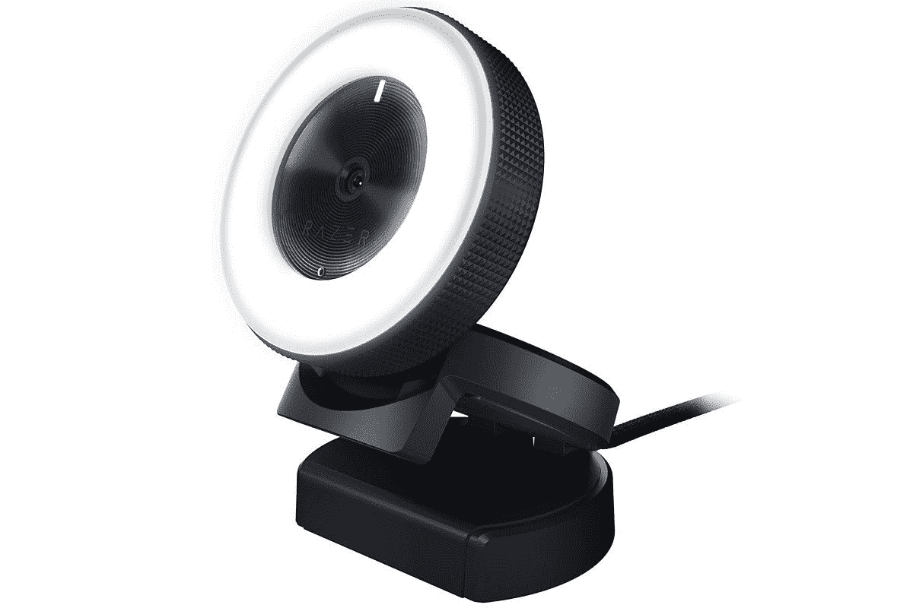
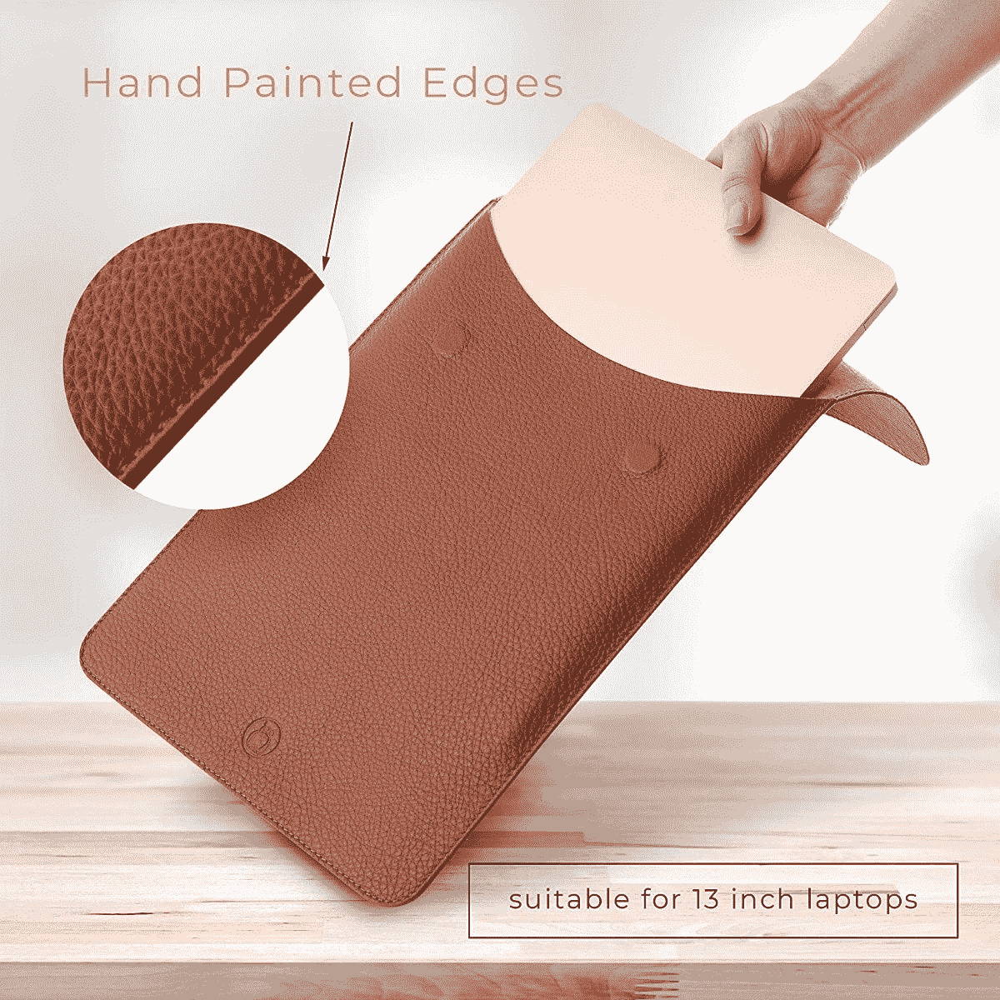
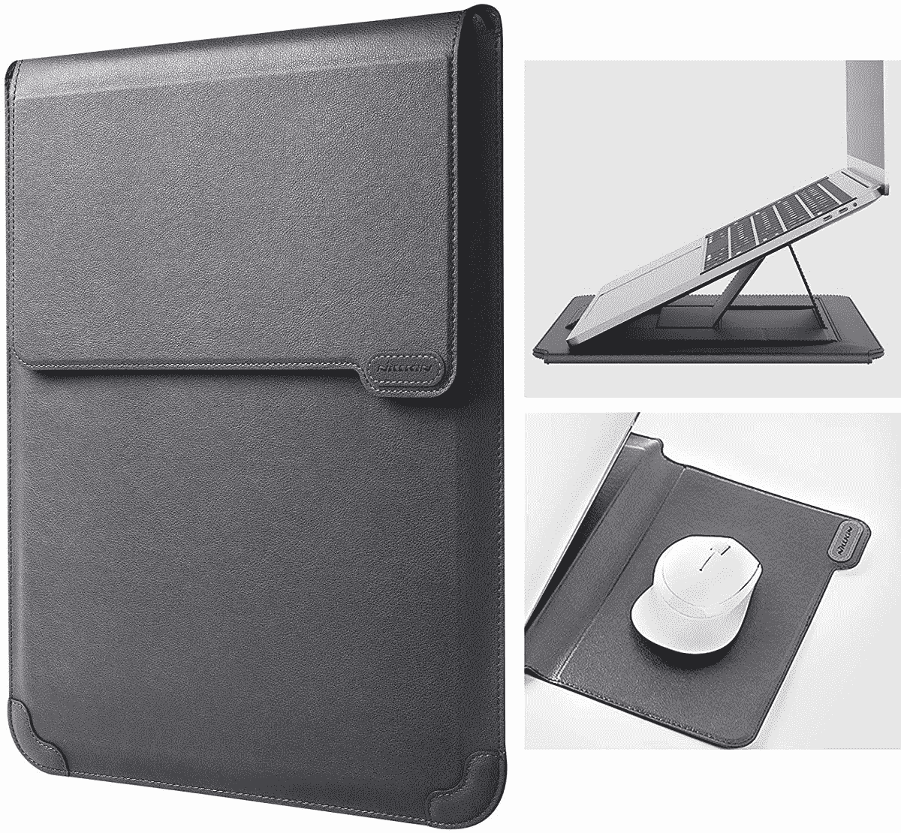

# 2023 年惠普 Chromebook 14 最佳配件

> 原文：<https://www.xda-developers.com/best-hp-chromebook-14-accessories/>

惠普 Chromebook 14 系列拥有各种各样的设备来满足任何需求。如果你最近购买了一台[惠普 Chromebook 14 设备](https://www.xda-developers.com/best-hp-chromebooks/)，你会想要添加一些可爱的配件来增强你的体验。有一个盒子或袖子来随身携带 Chromebook 总是很好的。那些希望将 HP Chromebook 14 用作生产力机器的人也希望获得一个坞站。当然，还有许多其他配件可以考虑——触控笔、网络摄像头等等。

在本指南中，我们将了解目前适用于 HP Chromebook 14 的最佳配件。

**浏览本文:**

## HP Chromebook 14 的最佳坞站

如果你想将 Chromebook 与外部显示器配合使用，你可能需要添加一个扩展坞来增加可用端口的数量。有了一个好的坞站解决方案，你可以大大扩展你的 Chromebook 的多功能性。您可以使用它来连接鼠标、机械键盘、外部存储设备、多台显示器或同时连接所有设备。

最重要的是，有了一些扩展坞，你甚至可以让你的 Chromebook 充电，只要它有一个兼容的 USB Type-C 端口或 [Thunderbolt 端口](https://www.xda-developers.com/best-thunderbolt-docks/)。坞站非常适合学生以及在办公室对接机器的商业用户。

*   <picture></picture>

    Kensing 双显示器扩展坞

    ##### Kensing 双显示器扩展坞

    如果你有几个 USB Type-A 配件，Kensignton Chrombook 扩展坞是个不错的选择。它总共包括六个 USB Type-A 端口，两个 USB 3.0 端口和四个 USB 2.0 端口。此外，它还提供了一个 RJ45 千兆以太网端口、一个 HDMI 端口、一个 DVI 端口以及 3.5 毫米耳机和麦克风插孔。

*   <picture></picture>

    Anker 777 Thunderbolt 4 Dock

    ##### Anker 777

    如果你想要一个 Dock 那就是溢价，那么这款就是了。它由全金属制成，很可能与任何高端 Chromebook 型号

    相匹配
*   <picture></picture>

    Targus USB-C 双视频坞站

    ##### Targus USB-C 双视频坞站

    Targus chrome book 坞站是一款不错的二合一选择，不仅提供了不错的端口选择，还可以兼作一个完整的支架。它包括 4 个 USB 3.0 Type-A 端口、2 个 DisplayPort 端口、2 个 HDMI 2.0 端口、1 个支持 60W 直通充电的 USB Type-C 端口、1 个耳机/麦克风组合插孔和 1 个 RJ45 千兆以太网端口。

*   <picture></picture>

    Baseus 17 合 1 坞站

    ##### Baseus 17 合 1 坞站

    这款坞站可以为您的 Chromebook 提供尽可能多的端口。你将获得 16 个带有两条电缆的端口，一条用于电源，一条直接连接到你的 Chromebook，你甚至可以通过这个坞站为 3K 显示器供电，并享受 USB-A 和 USB-C 端口的大组合，以连接到你最喜欢的附件。

*   <picture></picture>

    io gear Dock Pro 6 合 1 4K 坞站

    ##### io gear Dock Pro 6 合 1 4K 坞站

    如果你正在显示器上使用 Chromebook，那么这款笔记本电脑坞站就是为你准备的。它不仅在侧面有一系列端口，而且它还可以兼作支架，可以将您的笔记本电脑提升到舒适的打字位置。

## 惠普 Chromebook 14 的最佳外接显示器

显示器有各种尺寸，价格范围从相当便宜到极其昂贵。在为 Chromebook 选择外部显示器时，你应该仔细考虑你的使用情况和预算。在这里，我们收集了 4K 性能的最佳显示器，创意专业人士，以及那些希望获得最佳整体效果的人。

*   <picture></picture>

    LG 29wp 60g-B

    ##### LG 29wp 60g-B

    LG 29 英寸超宽显示器对于寻求大量屏幕空间的用户来说应该非常棒。它配备了 29 英寸宽的 IPS 面板，提供全高清(2560 x 1080)分辨率、21:9 宽高比、99%的 sRGB 色域覆盖率、HDR10 和 AMD FreeSync。

*   <picture></picture>

    惠普 U28 4K

    ##### 惠普 U28 4K HDR 显示器

    惠普的 U28 配备了工厂校准的 4K HDR IPS 面板，非常适合工作室工作，它还配备了一系列 I/O 端口。

*   ##### Dell UltraSharp u 2723 QE

    Dell UltraSharp u 2723 QE 是世界上首批使用 IPS 黑科技的显示器之一，提供 2000:1 的对比度，同时仍具有出色的视角。此外，这是一个超级清晰的 4K 面板，它覆盖了 98%的 DCI-P3，并通过了 DisplayHDR 400 的认证。它还可以通过一根 USB-C 电缆连接，提供 90W 的功率，非常容易设置。

*   <picture></picture>

    Arzopa 便携式显示器

    ##### Arzopa 便携式显示器

    如果你需要在任何地方都过双屏生活，Arzopa 便携式显示器就是完美的选择。它通过一根 USB-C 电缆轻松连接，并且它是一个 13.3 英寸的面板，与 XPS 13 具有相同的 16:10 纵横比，使其成为完美的配对。另外，它有非常清晰的 2560 x 1600 分辨率，所以看起来很棒。

*   <picture></picture>

    三星智能显示器 M7

    ##### 三星智能显示器 M7

    如果你想要一台价格相对较低的 4K 显示器，三星智能显示器 M7 绝对值得一试。除了是一款夏普显示器，可以通过单根 USB-C 电缆甚至无线方式工作，它还拥有三星的智能电视软件。即使没有笔记本电脑，你也可以用它来观看网飞和其他服务，它甚至可以在云中运行微软 Office 应用程序。

## 惠普 Chromebook 14 的最佳鼠标

在购买新鼠标来搭配你最喜欢的 Chromebook 时，舒适才是王道。在此列表中，我们将把每个鼠标的舒适操作置于其他高级功能之上。在考虑日常使用后，我们将关注电池寿命、价格点，当然还有与 Chrome OS 的集成。鼠标有各种形状和大小，所以在做出最终决定之前，查看大量选项是值得的。

*   <picture></picture>

    Seenda 2.4G 无线鼠标

    ##### Seenda 2.4G 无线鼠标

    如果您预算有限，Seenda 可以满足您的需求。这款鼠标没有一些花哨的功能，但价格不到 6 美元，设计舒适。这款设备的电池续航时间非常出色。对于那些只是偶尔使用鼠标的人来说，这是一个不错的选择。

*   <picture></picture>

    罗技 M355

    ##### 罗技 M355

    有些鼠标要求你选择自己是左撇子还是右撇子，但罗技 M355 不是。这款鼠标采用超薄扁平设计，非常适合双手灵巧的用户。此外，超薄的外形和超静音的点击使这款鼠标非常适合在工作中使用。

*   <picture></picture>

    I clever 人体工学鼠标

    ##### I clever 人体工学鼠标

    iClever 又多了一个令人心动的选项。这款垂直鼠标具有更引人注目的曲线，以更浅的角度贴合手部轮廓。这款鼠标售价不到 25 美元，带有静音键，非常适合家庭或工作使用。

*   <picture></picture>

    Anker 立式人体工学鼠标

    ##### Anker 立式人体工学鼠标

    另一种流行的外形是立式鼠标设计。这种布局允许您在类似手柄的方向上使用鼠标。许多用户发现这是长时间使用鼠标最舒适的方式。Anker 还将出色的功能集和电池寿命融入了这一独特的设计中。

*   <picture></picture>

    罗技 M570

    ##### 罗技 M570

    罗技的 M570 具有鲜明且可立即辨认的外形。使用鼠标时，很容易发现巨大的蓝绿色轨迹球。如果你在工作中经常滚动屏幕，并且觉得轨迹球很舒服，这是目前最好的选择。这是长时间使用最舒适的鼠标之一。

## 惠普 Chromebook 14 的最佳网络摄像头

随着 Zoom 和微软团队的崛起，一个好的网络摄像头是必不可少的。虽然大多数笔记本电脑都有内置网络摄像头，但质量往往不尽人意。它可能偶尔会完成工作，但建议您为 Chromebook 配备一个外部网络摄像头，以实现视频会议中更专业的外观。如果你有一个 Chromebox 或者你的 Chromebook 连接了一个外部显示器，你可能会寻找能够与你的 Chrome OS 设备完美匹配的网络摄像头。

这里列出了一些适用于 Chromebook 或 Chromebox 的最佳网络摄像头，你可以在各种价位和使用情况下购买。

*   <picture></picture>

    XPCAM 4K 网络摄像头

    ##### XPCAM 4K 网络摄像头

    这款 4K 网络摄像头具有高分辨率传感器，并配有三脚架，因此您可以在通话时保持最佳状态。

*   <picture></picture>

    Anker power conf C200 2K 网络摄像头

    ##### Anker power conf C200 2K 网络摄像头

    Anker power cong C200 拥有 2K 传感器和各种视野。

*   <picture></picture>

    微软现代网络摄像头

    ##### 微软现代网络摄像头

    微软现代网络摄像头是一款现代 1080p 摄像头，支持 HDR，经认证可用于团队。

*   <picture></picture>

    Razer Kiyo

    ##### Razer Kiyo

    Razer Kiyo 是一款功能强大的流媒体相机，内置环形灯，如果你喜欢在黑暗的房间或夜晚进行流媒体播放，这款相机非常理想你可以使用 Razer Synapse 调整各种设置，这样你总是看起来最好。

*   <picture></picture>

    罗技 Streamcam

    ##### 罗技 StreamCam

    罗技 stream cam 是一款出色的网络摄像头，支持 60fps 的 1080p 视频，它包括智能自动对焦和自动曝光等功能。它还为您提供了轻松旋转相机以录制垂直视频的选项，USB Type-C 的使用使其成为没有 USB Type-A 端口的现代笔记本电脑的一个伟大选择。

## HP Chromebook 14 的最佳保护套/包

Chromebooks 被设计成便携式的。为了在外出时保护你的投资，你可以以相当低的价格买一个袖子或包。如果你有一台支持 LTE 的 Chromebook，并且经常旅行，这一点就更加重要了。这些选项中的大多数经常打折，使得交易更加甜蜜。有如此多的选项可供选择，您可以找到符合您个人风格的产品，并为日常工作和娱乐提供功能。

*   <picture></picture>

    尤尼卡皮套

    ##### 尤尼卡皮套

    对于那些想要优雅袖子的人来说，Unika 有很好的颜色选择。这款保护套采用超薄设计，可容纳 13-15 英寸的 Chromebooks。

*   <picture></picture>

    Case Logic 便携包

    ##### Case Logic 便携包

    如果你需要在随身携带时为你的 Chromebook 提供额外的保护，这个包套上的硬壳正好可以做到这一点。同时，内部柔软，可以吸收笔记本电脑移动时产生的任何冲击。

*   <picture></picture>

    尼利金笔记本电脑套带支架

    ##### 尼利金笔记本电脑套带支架

    你想要一个兼作支架的笔记本电脑套吗？Nillkin 提供的价格不到 30 美元。有四种颜色可供选择，你应该能找到一种符合你个人风格的。

*   <picture></picture>

    Bagsmart 笔记本电脑套

    ##### Bagsmart 笔记本电脑套

    想要更有格调一点的东西吗？这款 Bagsmart 袖套设计更加别致，可能正是你想要的。有黑色和粉色可选，可以选择更符合个人风格的。

*   <picture></picture>

    Tomtoc 笔记本电脑单肩包

    ##### Tomtoc 笔记本电脑单肩包

    这款 Tomtoc 包可以很好地保护您的笔记本电脑安全，具有额外的缓冲和加固的边角，它还具有额外的储物袋，因此您可以携带所有的配件。另外，你可以用肩带带着它。

## 惠普 Chromebook 14 的最佳手写笔

通用手写笔倡议(USI)为有源手写笔和支持触摸的设备(如电话、平板电脑以及计算和娱乐平台)之间的互操作通信定义了行业标准。到目前为止，市场上有相当多的实心 USI 笔，但它们比老派的电容式触控笔要贵一些。

如果在您的预算范围内，并且您的设备支持 USI，我们建议您选择下面的 USI 选项之一，否则我们会提供一个预算选项来解决这个问题。

*   <picture></picture>

    惠普 USI 手写笔

    ##### 惠普 USI 手写笔

    很多 USI 手写笔的主要缺点就是处理电池的烦恼。幸运的是，惠普有一支可以通过 USB-C 充电的 USI 笔。这支笔的电池寿命也很长，一般使用时间平均超过 2 周。

*   <picture></picture>

    联想 USI 笔

    ##### 联想 USI 笔

    联想的 USI 手写笔做工精良，拿在手中手感很好。虽然它不像惠普那样容易供电，但在需要更换之前，它应该可以用一块电池维持几个月。它配有一个笔夹，可以帮助您将手写笔固定在背包中。

*   <picture></picture>

    MESO USI 手写笔

    ##### MESO USI 手写笔

    MEKO 的这款 USI 手写笔带有三种不同的笔尖，适用于各种类型的绘图情况。也可以通过 USB-C 充电

*   <picture></picture>

    伊卢梅 USI 手写笔

    ##### 伊卢梅 USI 手写笔

    这是亚马逊上最便宜的 USI 笔之一。它与其他 USI 笔具有相同的压力敏感度，并配有可更换的电池，因此您不必担心充电问题。

*   <picture></picture>

    meta Pen USI 手写笔

    ##### meta Pen USI 手写笔

    这是最舒适的 USI 笔之一。它有一个圆锥形的顶端，不是管状的。它还具有防侧倾设计，超级容易抓握。

这就是我们对惠普 Chromebook 14 最佳配件的总结。希望你现在已经拥有了在课堂上、在家里或在旅途中使用 Chromebook 所需的一切。如果你尝试了我们的一些选择，请在下面的评论区告诉我们它们是如何为你工作的。