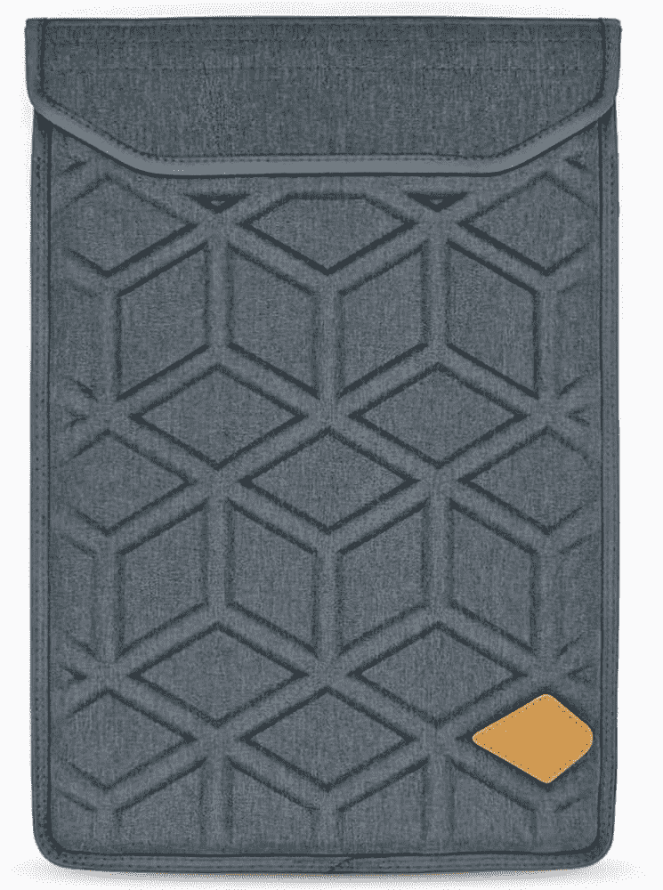
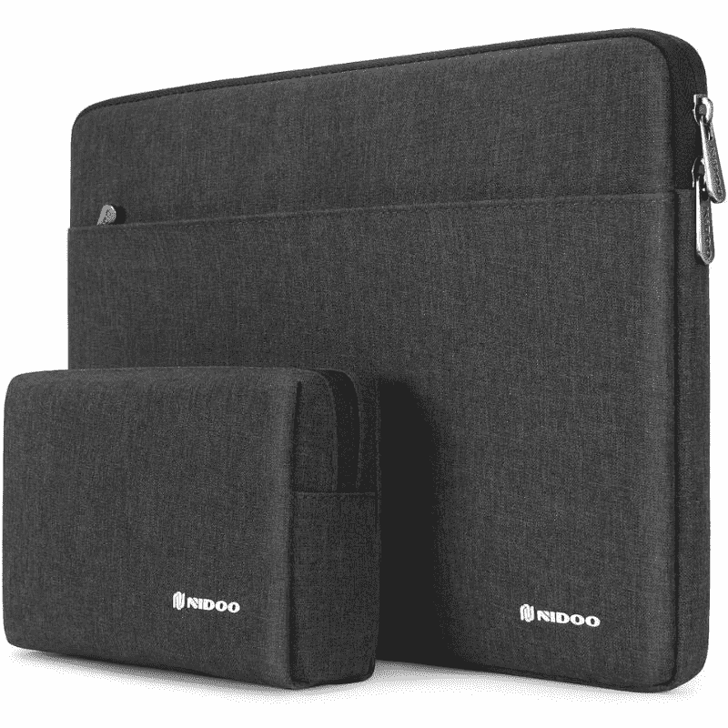

# 2023 年惠普 Chromebook 14 的最佳案例

> 原文：<https://www.xda-developers.com/best-hp-chromebook-14-cases/>

# 2023 年惠普 Chromebook 14 的最佳案例

在本购买指南中，我们将为 HP Chromebook 14 系列产品寻找最佳案例。我们看箱子和包。

日常使用 HP Chromebook 14 会带来一些固有的风险。工作时，您的设备可能会掉落并损坏。Chromebooks 被做成便携的。当你外出时，为了保护你的投资，你可以以相当低的价格买一个袖子或包。如果你有一台[触屏 Chromebook](https://www.xda-developers.com/best-chromebooks-touchscreens/) 并且经常旅行，这就更重要了。这些选项中的大多数经常打折，使得交易更加甜蜜。有这么多不同的保护套和保护套可供选择，你可以找到既符合你个人风格，又兼具日常工作和娱乐功能的保护套。

*   <picture></picture>

    机箱逻辑便携包

    ##### 机箱逻辑便携包

    如果你需要在随身携带时为你的 Chromebook 14 提供额外的保护，这个套筒上的硬壳正好可以做到这一点。同时，内部柔软，可以吸收笔记本电脑移动时产生的任何冲击。

*   <picture></picture>

    尤尼卡皮套

    ##### 尤尼卡皮套

    对于那些想要优雅袖子的人来说，Unika 有很好的颜色选择。这款保护套采用超薄设计，可容纳 13-15 英寸的 Chromebooks。

*   <picture></picture>

    隆多真皮袖套

    ##### 隆多真皮袖套

    隆多真皮袖套采用高品质的工艺，并为想要脱颖而出的人提供多种时尚图案。它也有几种不同的尺寸。

*   <picture></picture>

    Lymmax 防震套

    ##### Lymmax 防震套

    有时候我们都会有笨拙的一两天。有了 Lymmax 防震套，即使您的笔记本电脑掉落，也能得到保护。这种套管有多种颜色可供选择，但仅限于 13-15 英寸的尺寸兼容性。

*   <picture></picture>

    Kinmac 360 度笔记本电脑保护套

    ##### Kinmac 360 度笔记本电脑保护套

    采用硬质塑料外壳，坐垫 y 型内饰，多种不同款式可供选择，Kinmac 笔记本电脑保护套提供了充分的保护，并带有个性化的触感。它也有各种尺寸。

*   <picture></picture>

    Nido 笔记本电脑套

    ##### Nido 笔记本电脑套

    想要额外的空间放你的配件吗？这款 Nidoo 包带有一个单独的袋子，因此您可以携带所有配件，空间更大。它还能让你在旅行时更容易打包。

*   <picture></picture>

    尼利金笔记本电脑套带支架

    ##### 尼利金笔记本电脑套带支架

    你想要一个兼作支架的笔记本电脑套吗？Nillkin 提供的价格不到 30 美元。有四种颜色可供选择，你应该能找到一种符合你个人风格的。

*   <picture></picture>

    Tomtoc 笔记本电脑单肩包

    ##### Tomtoc 笔记本电脑单肩包

    这款 Tomtoc 包可以很好地保护您的笔记本电脑安全，具有额外的缓冲和加固的边角，它还有额外的储物袋，因此您可以携带所有的配件。另外，你可以用肩带带着它。

这就是我们对惠普 Chromebook 14 的最佳外壳和保护套的总结，这是惠普最好的 Chromebook 型号之一。请记住，亚马逊经常对这些产品打折，所以经常留意是明智的。您还可以设置一个页面监视器，以便在价格大幅下降时得到通知。

请告诉我们，你更喜欢哪种 Chromebook 旅行包或保护套。