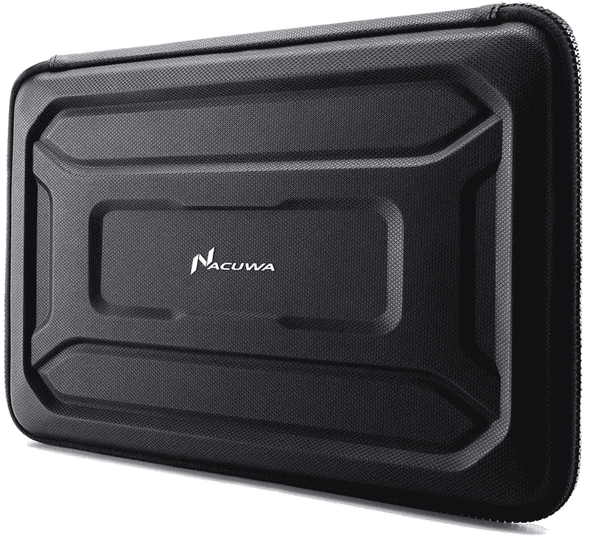
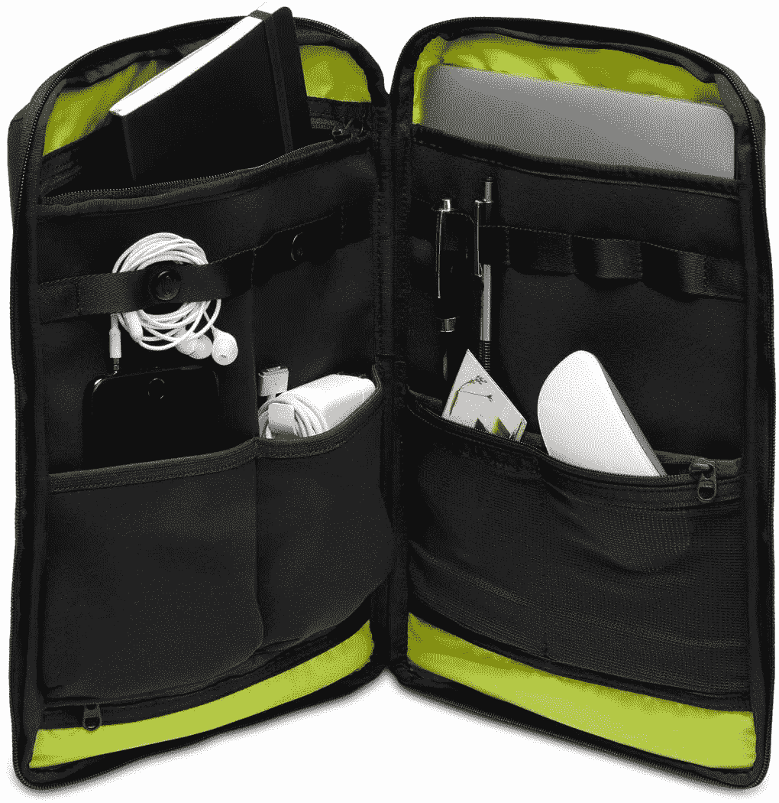
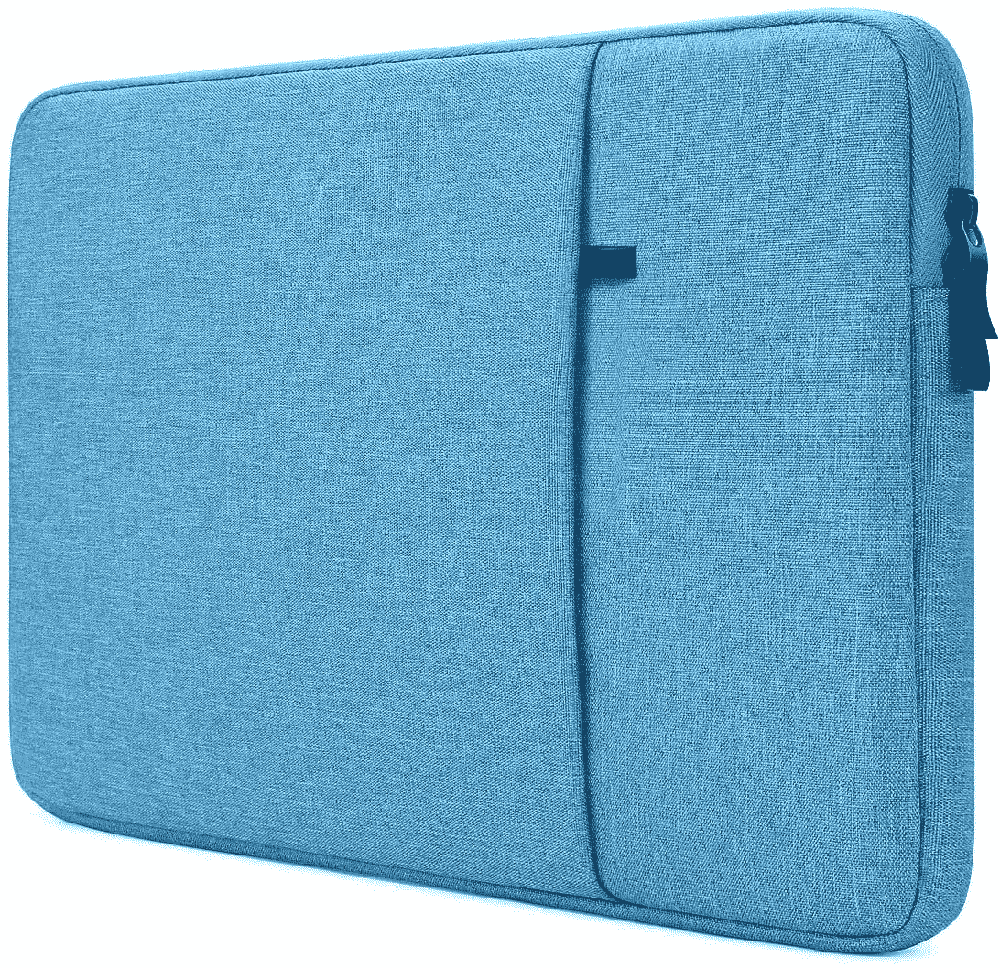

# 2023 年最佳惠普 Chromebook x2 11 款保护套

> 原文：<https://www.xda-developers.com/best-hp-chromebook-x2-11-case-options-unika-waterfield-and-more/>

# 2023 年最佳惠普 Chromebook x2 11 款保护套

在这份购买指南中，我们来看看惠普 Chromebook x2 11 的最佳案例，这是惠普最好的 Chrome 平板电脑之一。

新的惠普 Chromebook x2 11 是一款令人印象深刻的可拆卸 Chrome 操作系统。如果你正在寻找一款可以带键盘使用的[惠普 Chrome OS 平板电脑](https://www.xda-developers.com/best-hp-chromebooks/),这是你不想错过的一款。除了相当高端的规格，Chromebook x2 11 还包括 USI 笔和蜂窝连接。事实上，这是 T2 最好的 Chrome 平板电脑之一。鉴于这款设备的极端便携性，你可能会想获得一个漂亮的惠普 Chromebook x2 11 外壳。我们来看看选项。

说到箱子和袖子，你有很多选择。有些箱子能提供最大程度的保护，但是每天携带起来会很笨重。另一方面，一些惠普 Chromebook x2 11 外壳相当薄，便于携带。如果你想要最薄的选择，选择简单的袖子而不是完整的箱子。当然，您可能会受到较少的保护，但您可以将您的 HP Chromebook x2 11 带到任何地方，并且仍然可以免受刮擦。以下是我们为惠普 Chromebook x2 11 挑选的最佳外壳。

##### 亚马逊基础管理笔记本电脑套

如果你只是想要一个简单的没有装饰的袖子，亚马逊可以满足你。这款保护套的尺寸从 11.6 英寸到 15.6 英寸不等，具体取决于你的 Chromebook 的尺寸。有三种颜色可供选择，价格低廉，如果您只是需要偶尔将 Chromebook 带到户外，请选择它。

 <picture></picture> 

Case Logic Carrying Case

##### 携带案例 13/14 的案例逻辑

如果你需要在随身携带时为你的 Chromebook 15 提供额外的保护，这个袖子上的硬壳可以做到这一点。同时，内部柔软，可以吸收笔记本电脑移动时产生的任何冲击。

 <picture></picture> 

Nacuwa Hard Sleeve

##### 纳库瓦硬套

如果你想要顶级的保护，从 Nacuwa 买这个硬套。这款保护套有多种尺寸可供选择，适用于任何 Chromebook。您还可以获得防泼溅保护，以及几个整理线缆和笔记本充电器的内袋。

 <picture></picture> 

Unika Leather Sleeve

##### 尤尼卡真皮笔记本电脑套

对于那些想要优雅袖子的人来说，UNIKA 有很好的颜色选择。这款保护套采用超薄设计，可容纳 13-15 英寸的 Chromebooks。

 <picture></picture> 

Lymmax Shockproof Sleeve

##### Lymmax 防震笔记本电脑套

有时候我们都会有一两天不顺心。有了 Lymmax 防震套，即使您的笔记本电脑掉落，也能得到保护。这种套管有多种颜色可供选择，但仅限于 13-15 英寸的尺寸兼容性。

 <picture></picture> 

Nillikin Laptop Sleeve with Stand

##### Nillkin 笔记本电脑包，带支架

你想要一个兼作支架的笔记本电脑套吗？Nillkin 提供的价格不到 30 美元。有四种颜色可供选择，你应该能找到一种符合你个人风格的。

 <picture></picture> 

TIMBUK2 Stealth Folio

##### TIMBUK2 隐形对开

如果你需要一个箱子来存放大量的 Acer Chromebook 15 设备，TIMBUK2 Stealth Folio 是完美的选择。您可以获得多个储物格来存放充电器、软件狗等物品。

 <picture></picture> 

Waterfield Designs PC Sleevecase

##### 沃特菲尔德设计电脑机箱

Chromebooks 很难找到奢侈品包，但 Waterfield Designs 提供了一个非常好的定制选项。你可以指定你的 Chromebook 的确切尺寸，他们会为你制作一个由蜡帆布或防弹尼龙制成的定制外壳。这是一个具有惊人建造质量的优质套管。

 <picture></picture> 

NIDOO 14 inch laptop sleeve

##### Nidoo 14 英寸笔记本电脑套

颜色选择在任何配件上都很有趣，但 Chromebook 外壳往往大多是黑色或灰色。NIDOO 14 英寸笔记本电脑保护套有多种颜色，因此您可以表达自己的个人风格，同时保护您的 Chromebook 15。

这就是我们对惠普 Chromebook x2 11 的最佳外壳和保护套的总结，这是[惠普最好的 Chromebook 型号之一](https://www.xda-developers.com/best-acer-chromebooks/)。请记住，亚马逊经常对这些产品打折，所以经常留意是明智的。您还可以设置一个页面监视器，以便在价格大幅下降时得到通知。

请告诉我们，你更喜欢哪种 Chromebook 旅行包或保护套。如果你仍然想购买新的惠普 Chromebook x2 11，请查看下面的链接。这款 Chromebook 在百思买和惠普自己的网上商店都有售。这两个地方的价格是一样的，所以你可以选择哪个零售商最适合你的需求。

 <picture></picture> 

HP Chromebook x2 11

##### 惠普 Chromebook x2 11

惠普 Chromebook x2 11 结合了 Chrome OS 的强大功能和传统平板电脑的便携性。借助可选的 4G LTE 功能，您可以在任何地方工作。这是全新的顶级 Chrome OS 平板电脑体验。