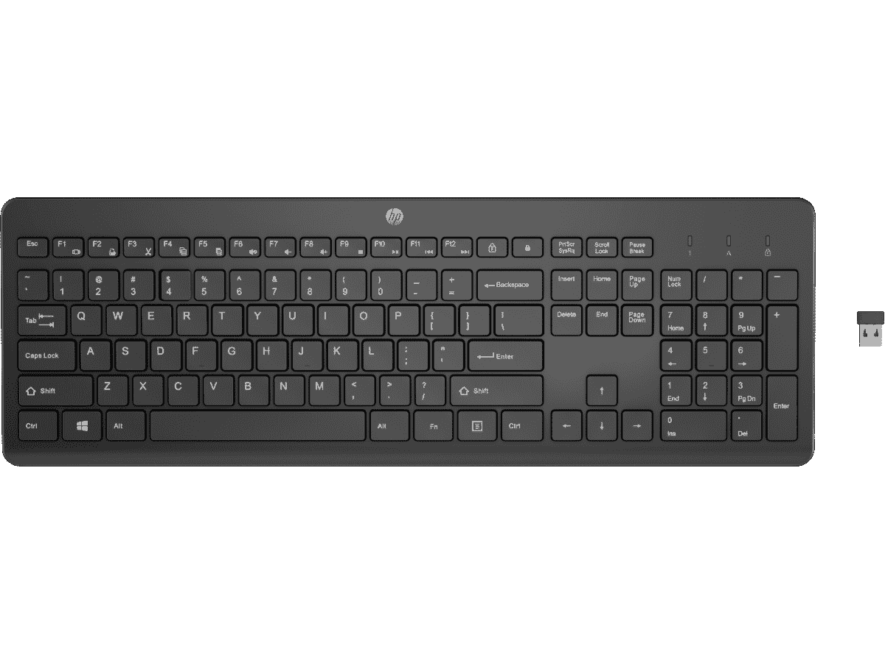
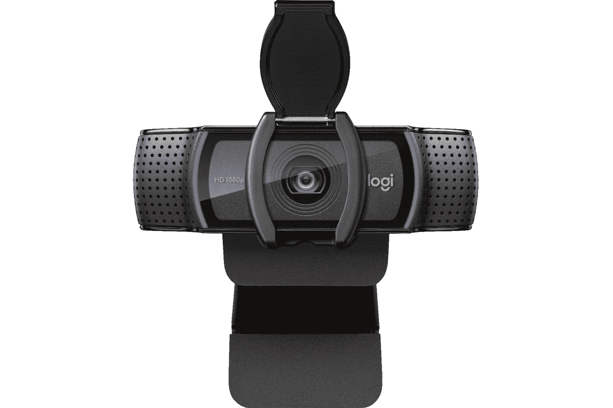
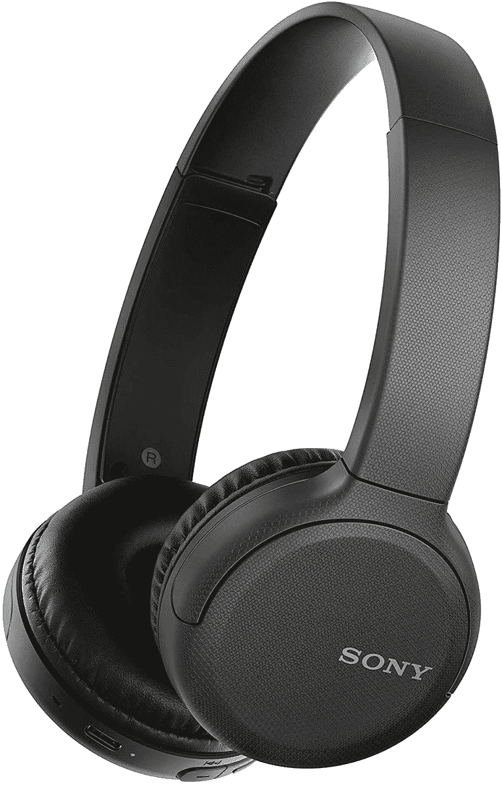
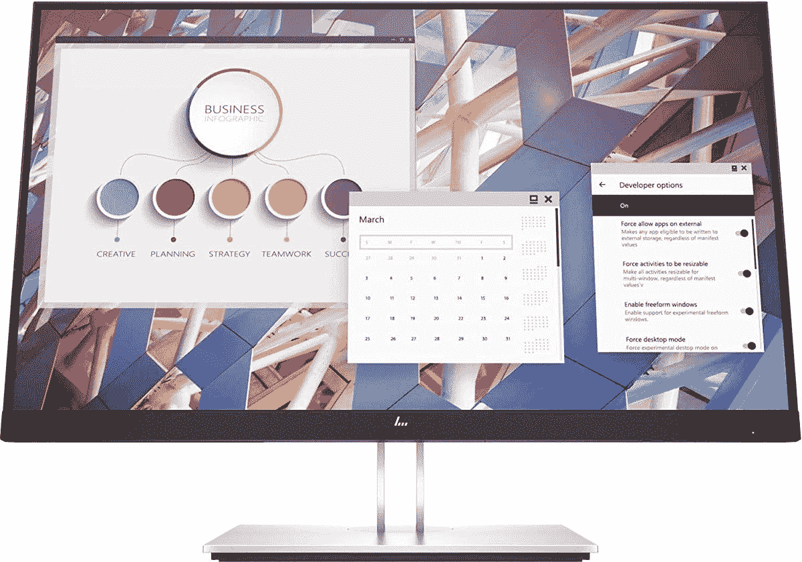

# HP EliteBook 840 Aero 的最佳配件

> 原文：<https://www.xda-developers.com/best-hp-elitebook-840-aero-accessories/>

就商用笔记本电脑而言，[惠普 EliteBook 840 Aero](https://www.xda-developers.com/hp-elitebook-840-aero-review/) 是你今天能买到的最好的笔记本电脑之一。起始重量仅为 2.5 磅，这款[非常轻便](https://www.xda-developers.com/best-lightweight-laptops/)，但它提供的配置选项也让它非常强大。但是，即使是最好的笔记本电脑也可以扩展或改进。配件可以让 HP EliteBook 840 Aero 更好地为您工作，或者只是保护它。

这是一款商用笔记本电脑，因此我们将主要关注有助于提高工作效率的附件。从扩展您的桌面设置到让您在旅途中保持高效，这里有适合每个人的东西。如果你想边玩游戏，你也可以这样做，这要感谢 Thunderbolt 的力量。

## 桌面布置的附件

让我们从能帮助你在家里或办公室更有效率的配件开始。HP EliteBook 840 Aero 有很多端口可供您连接附件，包括 Thunderbolt。这为您提供了许多选择，包括更小的附件、坞站和显示器。

*   <picture></picture>

    惠普 230 无线键盘

    ##### 惠普 230 无线键盘

    想要一个键盘来完成您的办公设置吗？这款全尺寸惠普键盘为您提供了一整套按键，包括一个数字小键盘，并且它使用无线加密狗进行连接，以提供额外的便利。它采用现代设计，适合任何地方。

*   <picture></picture>

    微软蓝牙桌面

    ##### 微软蓝牙键盘

    如果你想要一个完美搭配的鼠标和键盘，微软蓝牙桌面套装是一个绝佳的选择。这两款设备采用了现代和纤薄的设计，键盘是全尺寸的型号，带有一个数字小键盘和一个快速访问办公应用程序的键。

*   <picture></picture>

    戴尔 UltraSharp 4K 网络摄像头

    ##### 戴尔 UltraSharp 4K 网络摄像头

    如果您在笔记本电脑上开很多会议，这款网络摄像头将确保您在几乎任何光线下都看起来很棒，并且具有自动白平衡、自动对焦、可调视野和 4K 索尼 STARVIS 传感器等功能

*   <picture></picture>

    罗技 C920S Pro 高清网络摄像头

    ##### 罗技 C920S Pro 高清网络摄像头

    它可能不是最新的，但如果您需要视频通话的额外质量，罗技 C920S 仍然是一款受人喜爱的网络摄像头。如果您使用多显示器设置，它将是您的 HP EliteBook 840 Aero 的一个很好的附件，因此您可以始终获得最佳角度。

*   <picture></picture>

    Surface 耳机 2

    ##### 微软 Surface 耳机 2

    对于 Windows 上的高级音效体验来说，没有比这更好的了。Surface Headphones 2 拥有时尚的现代设计、基于拨号的音量和 ANC 水平控制、触摸播放控制和高级设计，非常棒。

*   <picture></picture>

    索尼无线耳机 WH-ch 510

    ##### 索尼 WH-CH510

    如果 250 美元的价格有点太高，这款索尼耳机仍然以超薄和现代的设计提供了出色的音质。这款无线耳机已经使用 USB-C 充电，电池承诺一次充电可听 35 小时。

*   <picture></picture>

    雷蛇 Anzu 智能眼镜

    ##### 雷蛇 Anzu 智能眼镜

    雷蛇 Anzu 是一副超级有趣的眼镜，它包括两组镜片——带有蓝光过滤的透明镜片和带有紫外线过滤的太阳镜镜片。他们还在手臂上安装了蓝牙扬声器，在不影响周围环境的情况下为您提供个人音频。

*   <picture></picture>

    惠普 E24 G4 显示器

    ##### 惠普 E24 G4 显示器

    惠普 E24 G4 显示器相当基本，但如果您只是需要一些额外的空间来存放您的工作内容，它仍然是一个不错的选择。24 英寸全高清 IPS 面板为您提供了多任务处理空间，是 HP EliteBook 840 Aero 的绝佳配件。

*   <picture></picture>

    三星 S65UA

    ##### 三星 S65UA Ultra WQHD 显示器

    如果你真的想一次为所有应用程序提供更多空间，这款三星显示器太棒了，它是一款超宽 34 英寸显示器，具有 21:9 的纵横比，超清晰 WQHD 分辨率，1000 英寸

*   <picture></picture>

    HP Thunderbolt Dock 120 w

    ##### HP Thunderbolt Dock 120 w

    仅使用 HP EliteBook 840 Aero 上的端口创建一个完整的桌面设置是可能的，但可能具有挑战性。这款惠普官方坞站增加了许多端口，包括 USB、显示器输出和以太网，因此您可以连接任何您想要的东西。

*   <picture></picture>

    亚马逊基础版 10 合 1 雷电 3 坞

    ##### 亚马逊基础版 10 合 1 雷电 3 坞

    官方的惠普迅雷坞有点贵，所以如果想省点钱，这个亚马逊基础版替代是个稳妥的选择。它包括多个 USB 端口、以太网、显示端口和菊花链支持。

## EliteBook 840 Aero 的移动附件

当然，HP EliteBook 840 Aero 是一款笔记本电脑，虽然您可能会经常在办公室使用它，但它应该是便携式的。借助一些配件，您可以让旅途更加愉快，我们有一些配件您可能会喜欢。

*   <picture></picture>

    Kinmac 360 度笔记本电脑保护套

    ##### Kinmac 360 保护套

    这款 Kinmac 笔记本电脑保护套采用了大量衬垫、防水外壳和防震外壳，非常适合保护您的笔记本电脑安全。但最好的部分是你可以得到的所有不同的图案，从更经典的风格到真正脱颖而出的多彩设计。

*   <picture></picture>

    惠普更新背包

    ##### 惠普更新背包

    如果您带着惠普 EliteBook 840 Aero 旅行，最简单的携带方式可能是放在背包里，这样您就可以腾出双手。这款背包由回收材料和纯皮质制成，还为您提供了放置配饰和其他额外物品的空间，让您可以更舒适地携带任何物品。

*   <picture></picture>

    微软 Arc 鼠标

    ##### 微软 Arc 鼠标

    无论你走到哪里，传统鼠标都能大大提升你的体验，如果你需要更便携的东西，微软 Arc 鼠标是最佳选择。当你把它平放时，它有一个非常薄的轮廓，但当你使用它时，你可以让它弯曲，更符合人体工程学。

*   <picture></picture>

    索尼 WF-1000 xm4

    ##### 索尼 WF-1000XM4

    高级音效体验并不总是需要大耳机。索尼 WF-1000XM4 耳塞通过 V1 处理器提供噪音消除功能，通过波束成形麦克风和骨导传感器提供出色的语音清晰度，等等。此外，它们可以在充电的情况下持续 24 小时。

*   <picture></picture>

    三星 T7 Touch

    ##### 三星 T7 Touch 便携式固态硬盘

    无论您当前的存储是否足够，您想要备份存储以实现冗余，或者您需要与他人轻松共享文件，随身携带固态硬盘总能派上用场。这款三星固态硬盘拥有高达 2TB 的容量和指纹传感器，可以保护您的数据安全。

*   <picture></picture>

    华硕 ZenScreen 便携式显示器

    ##### 华硕 ZenScreen MB16ACV

    双屏对于生产力来说太棒了，那为什么只在家里有它们呢？华硕 ZenScreen 是一款 15.6 英寸的便携式显示器，您可以通过 USB 连接，为您的工作应用程序提供额外的空间。这是一个全高清 IPS 面板，包括一个支架。此外，您还可以连接其他设备。

*   <picture></picture>

    QGeeM USB-C Hub

    ##### QGeeM 12-in-1 USB Hub

    很像第二块屏幕，有时在外出时能够连接一堆外设就很好了。这个小型 USB Type-C 集线器为您的笔记本电脑增加了 12 个端口，包括三个显示输出、以太网和大量 USB。它没有 Thunderbolt 快，但比 Thunderbolt dock 便宜得多，也方便得多。

*   <picture></picture>

    Anker power house II 400

    ##### Anker power house II 400

    有时候你只是想花些时间在户外，但你仍然需要完成工作。有了 Anker PowerHouse，你可以让你的笔记本电脑(和任何其他设备)连续充电几天，这样你就可以随时随地工作。你有大量的 USB 端口，甚至一个完整的交流插座和一个汽车插座来插入你的设备。

## 将您的 HP EliteBook 840 Aero 变成游戏装备

鉴于这是一台商务笔记本电脑，游戏配件不是这里最大的焦点。但是有了 Thunderbolt 的支持，您完全可以通过一些附件将您的 HP EliteBook 840 Aero 变成一台游戏 PC。这里有一些你可能需要的东西。

*   <picture></picture>

    三星 Odyssey G7

    ##### 三星 Odyssey G7

    你可能还想要一台高刷新率的游戏显示器。三星 Odyssey G7 提供了一系列出色的功能，具有 240Hz 的刷新率、1 毫秒的响应时间和四倍高清分辨率。另外，它是 QLED 面板，支持可变刷新率。

*   <picture></picture>

    Xbox 无线控制器

    ##### 微软 Xbox 无线控制器

    虽然鼠标和键盘对于游戏来说也是必不可少的，但你或许可以使用列表中的其他设备。但控制器可能真的会对一些游戏有用，如果你想用 Xbox Game Pass 尝试云游戏，这是玩这些游戏的最佳方式。

* * *

使用所有这些附件或其中的一部分，您可以更好地体验 HP EliteBook 840 Aero。无论您是在办公室还是在路上工作，总有办法让您的笔记本电脑更好地为您服务。这款笔记本电脑甚至可以玩游戏，您可以选择自己喜欢的方式——通过云游戏或添加外部 GPU。

配件使 HP EliteBook 840 Aero 功能极其丰富，但它本身已经是一款出色的笔记本电脑。您可以根据其规格选择大量配置，它是一款轻便的笔记本电脑，可以随身携带。你可以使用下面的链接购买，或者如果你还在寻找其他选择，可以查看我们的[最佳惠普笔记本电脑](https://www.xda-developers.com/best-hp-laptops/)综述。

 <picture></picture> 

HP EliteBook 840 Aero G8

##### 惠普 EliteBook 840 Aero G8

HP EliteBook 840 Aero 是一款轻便的翻盖式笔记本电脑，为企业用户提供了大量配置选项。您可以获得高达 64GB 的 RAM 和 2TB 的存储，以及 5G 支持。有了 Thunderbolt 的支持，您可以进一步扩展它的功能。