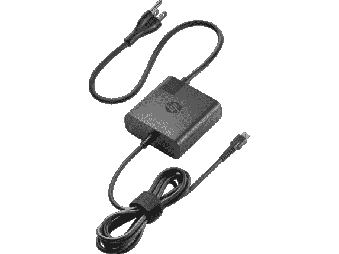
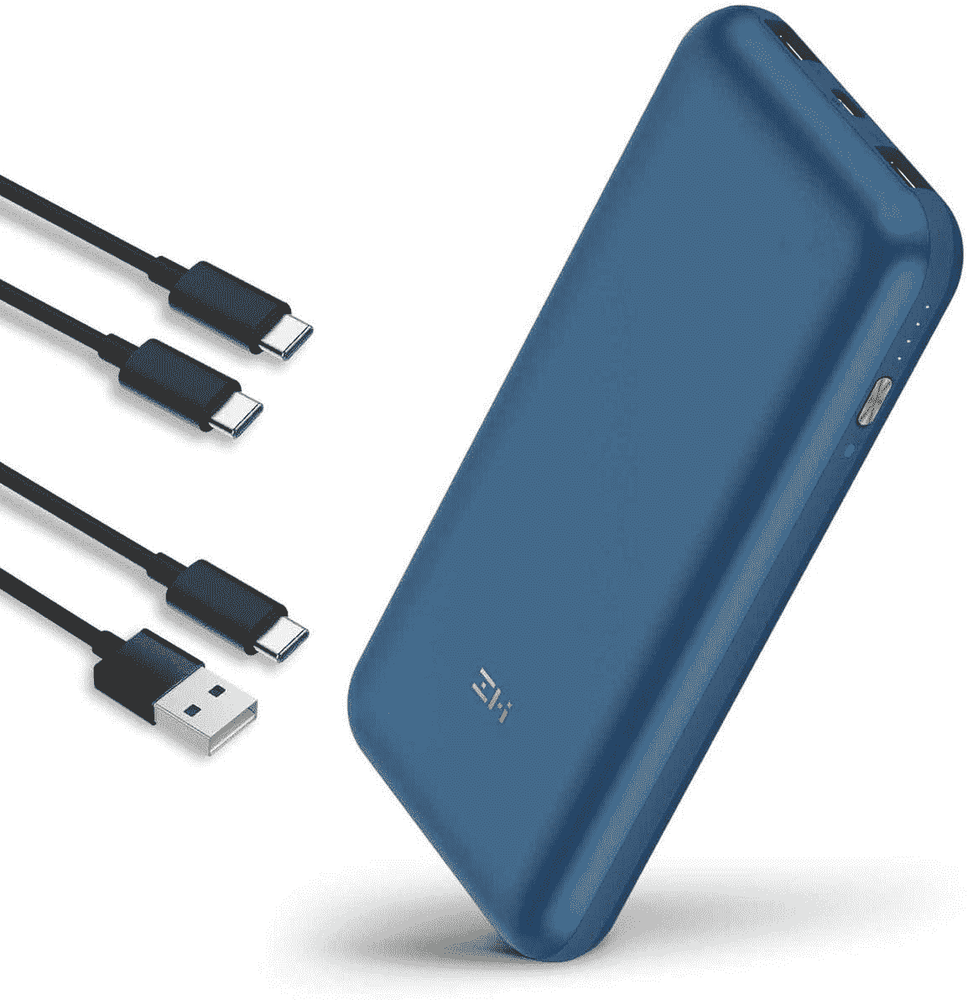

# 2023 年 HP EliteBook 840 Aero 最佳充电器

> 原文：<https://www.xda-developers.com/best-hp-elitebook-840-aero-chargers/>

# 2023 年 HP EliteBook 840 Aero 最佳充电器

需要为您的 HP EliteBook 840 Aero 或其他设备配备一个新充电器，以便在旅途中为其充电吗？以下是给笔记本电脑充电的最佳方式。

购买一台新的笔记本电脑可能非常昂贵，当你购买像[惠普 EliteBook 840 Aero](https://www.xda-developers.com/hp-elitebook-840-aero-review/) 这样的高端[商务笔记本电脑](https://www.xda-developers.com/best-business-laptops/)时，更是如此。这是一款功能强大、重量轻的笔记本电脑，是[惠普最好的](https://www.xda-developers.com/best-hp-laptops/)之一。正因为如此，你自然希望它尽可能长久。所以，当你的充电器坏了或者丢了，你真的想买一台全新的笔记本电脑吗？也许吧。但是更好的选择可能是买一个新的充电器。在本文中，我们总结了一些可以与 HP EliteBook 840 Aero 配合使用的充电器选项。

虽然列表将集中在常规交流适配器，我们也有一些更有创意的建议。我们提供了充电器，您可以在旅途中使用它们为您的笔记本电脑供电，还有一些坞站不仅可以为您的笔记本电脑充电，还可以添加更多端口。

 <picture></picture> 

HP 65W USB-C Power Adapter

##### 惠普 65W USB-C 电源适配器

如果你需要更换充电器，它不会比惠普官方的好多少。与 HP EliteBook 840 Aero 附带的充电器一样，这款充电器可提供 65W 的功率，足以在您使用笔记本电脑时为其充电。

 <picture></picture> 

ZMI zPower Turbo

##### ZMI zPower Turbo 65W 充电器

官方充电器很棒，但价格可能有点高。如果你无法理解支付惠普的要价，这款 ZMI 充电器在一个小包装中提供同样的 65W 功率，这是最便宜的选择之一。此外，它采用紧凑的设计，带有可折叠的尖头。

 <picture></picture> 

Anker PowerPort III Pod Lite

##### Anker PowerPort III 65W Pod Lite

我们都见过那些插座靠得太近，很难插入多个充电器或电源线。Anker PowerPort III Pod Lite 是一款绝对微型的充电器，仍然支持 65W 的功率输出，以保持您的笔记本电脑运行。

 <picture></picture> 

Nekteck 100W USB-C Charger

##### Nekteck 100W GaN USB-C 充电器

您的 HP EliteBook 840 Aero 不需要 100W 充电器，但这并不意味着它不起作用。你可以用它来给你的笔记本电脑充电，但你也有足够的空间，以防你将来需要给更强大的笔记本电脑充电。

 <picture></picture> 

Hyphen-X 100W 4-Port USB charger

##### Hyphen-X 100W 4 端口 PD GaN 充电器

外出旅行时，你喜欢随身携带三个或四个充电器吗？大概不会。这款 Hyphen-X 充电器有四个端口，应该足以同时为你的所有设备充电(尽管它会变慢)。

 <picture></picture> 

HP Thunderbolt Dock 120W

##### 惠普雷电坞站 120 瓦

如果你想要的不仅仅是一个充电器，惠普雷电 3 官方坞站不仅可以为你的 EliteBook 840 Aero 提供电源，它还添加了许多端口，以便你可以在办公桌上连接外围设备和外部显示器，最多两个 4K 显示器。

 <picture></picture> 

Amazon Basics 10-in-1 Thunderbolt 3 Dock

##### 亚马逊基础 10 合 1 雷电 3 坞站

惠普的 Thunderbolt 对你来说是不是有点太贵了？Amazon Basics 提供了一种替代方案，包括多个 USB 端口、以太网、SD 读卡器、DisplayPort 和 Thunderbolt 菊花链，价格低得多。

 <picture></picture> 

ZMI PowerPack 20K Pro

##### ZMI 动力包 20K

所以你在家里有一个可以插电的充电器，但你可以在路上带着它吗？这个 ZMI 电力银行有 20，000mAh 的容量，可以提供高达 65W 的电力。此外，当它连接到您的笔记本电脑时，它可以作为 USB 集线器工作。

 <picture></picture> 

Nekteck 45W USB Car Charger

##### Nekteck 45W USB-C 车载充电器

无论您是在出门前忘记给笔记本电脑充电，还是有人在旁边工作，这款 45W 车载充电器都可以帮助您的笔记本电脑继续工作，尽管它的功率不如 HP EliteBook 840 Aero 的官方充电器。只会充电更慢。

如果你只是需要一个充电器来替换一个有故障或丢失的充电器，那么使用惠普的[官方充电器是不会错的。但是，如果你想在旅途中继续使用你的 HP EliteBook 840 Aero，一个](https://shop-links.co/1749563030359887716?u1=89cf5d1a-97ba-4ccf-9a8c-46177f6650b0)[电源库](https://www.amazon.com/dp/B07N7Z6LSC?tag=xda-2njb9vl-20&ascsubtag=UUxdaUeUpU3784&asc_refurl=https%3A%2F%2Fwww.xda-developers.com%2Fbest-hp-elitebook-840-aero-chargers%2F&asc_campaign=Short-Term)或一个[汽车充电器](https://www.amazon.com/Nekteck-Certified-Charger-Delivery-Included/dp/B075WQQG7C?tag=xda-2njb9vl-20&ascsubtag=UUxdaUeUpU3784&asc_refurl=https%3A%2F%2Fwww.xda-developers.com%2Fbest-hp-elitebook-840-aero-chargers%2F&asc_campaign=Short-Term)可以帮你做到这一点。回到家里， [Thunderbolt docks](https://shop-links.co/1749563031117034981?u1=d013ed37-a9b6-406a-b9b1-ecf69139b264) 可以为你的笔记本电脑充电，并以其他方式扩展你的电脑的功能。

如果你还没有，你可以从下面的链接购买 HP EliteBook 840 Aero (G8)。您可以定制这款配备英特尔酷睿 i7-1185G7 博锐处理器、64GB 内存和 2TB 存储的笔记本电脑，使其成为功能非常强大的商用笔记本电脑。此外，它是一款 2.5 磅的[超轻产品，并有蜂窝连接选项，因此您可以轻松携带它到任何需要工作的地方。](https://www.xda-developers.com/best-lightweight-laptops/)

 <picture></picture> 

HP EliteBook 840 Aero G8

##### 惠普 EliteBook 840 Aero

HP EliteBook 840 Aero 是一款轻便的翻盖式笔记本电脑，为企业用户提供了大量配置选项。您可以获得高达 64GB 的 RAM 和 2TB 的存储，以及 LTE 或 5G 和高性能 CPU 的选项