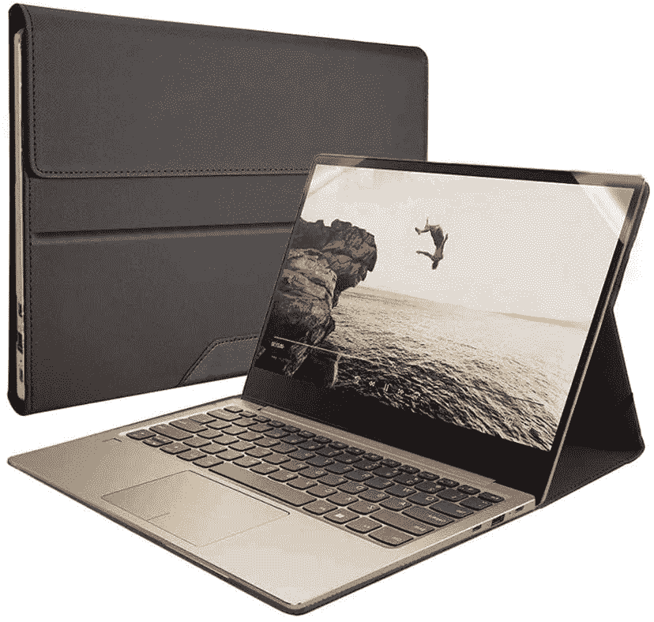
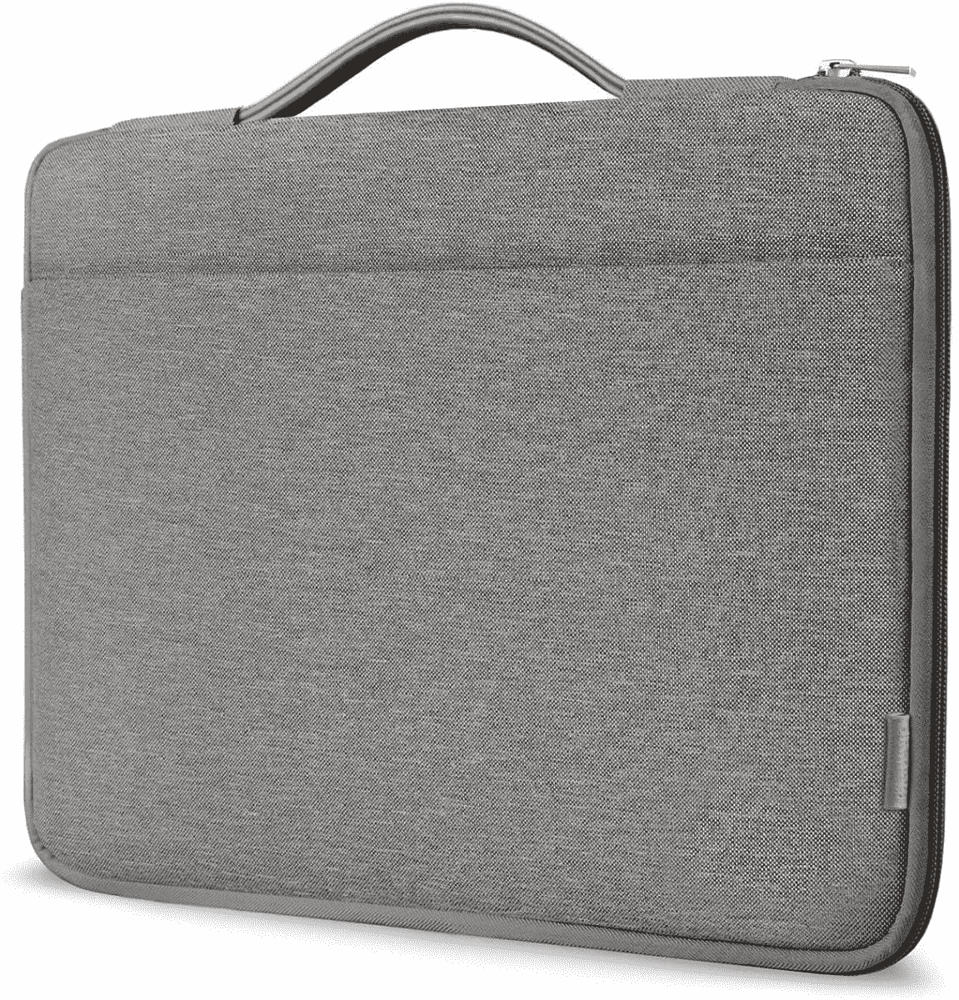
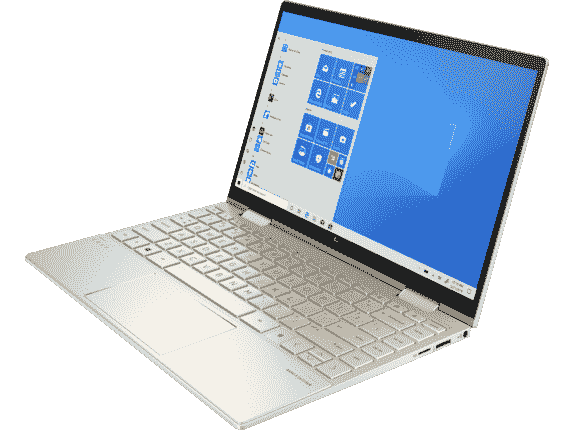

# 2023 年 HP Envy x360 的最佳案例

> 原文：<https://www.xda-developers.com/best-hp-envy-x360-cases/>

# 2023 年 HP Envy x360 的最佳案例

需要为您的 HP Envy x360 准备一个机箱吗？这里有一些你能找到的保护你珍贵笔记本电脑的最好的箱子、袖子和袋子。

惠普是世界上最大的个人电脑制造商之一，生产一些很棒的笔记本电脑并不陌生。在这些产品中，[惠普 Envy x360](https://www.xda-developers.com/hp-envy-x360-13-2022-review/) 是一款价格适中的高端产品。根据我们的榜单，这是惠普生产的 T4 最好的笔记本电脑之一。很自然，你会想要保护这种投资，而最好的方法就是通过案例。为了帮助您，我们收集了一些您可以为 HP Envy x360 购买的最佳案例。

笔记本电脑的外壳，尤其是敞篷车，可能不完全是你所期望的，因为它们仍然需要打开和旋转。需要记住的一点是 Envy x360 有两种尺寸，因此在某些情况下，您需要仔细观察箱子是否合适。其中许多还有不同的尺寸，因此您可以随时选择适合自己需求的一款。

 <picture></picture> 

Honeymoon Case Cover (13-inch only)

##### Honeycase 皮革 Envy 360 盒

如果您想要为您的 HP Envy x360 13 提供时尚纤薄的保护，那么这将非常适合您。它确实可以防止你在使用时向后旋转屏幕，但你可以为你的笔记本电脑获得一个时尚而纤薄的外壳。

 <picture></picture> 

HP Renew Topload 15

##### 惠普更新最高负载 15

这款惠普官方公文包由回收塑料瓶制成，这本身可能就是一个卖点。它有一个经典的海军蓝颜色，配有素食皮革手柄，所以放在哪里都好看。它是为 14 英寸笔记本电脑设计的，但您也可以在其中安装 15 英寸的 HP Envy x360。

 <picture></picture> 

DOMISO 13.3 Inch Shockproof

##### 多米索防震笔记本电脑套

如果保护您的笔记本电脑安全非常重要，DOMISO 的这款坚固外壳可能值得您使用。它有一个坚硬的外壳，里面有很多填充物，可以保护你的笔记本电脑安全。它也有多种尺寸。

 <picture></picture> 

tomtoc 360 Carrying Case

##### Tomtoc 笔记本电脑单肩包

这款 Tomtoc 保护你的笔记本电脑，做起来也好看。它有三种颜色，许多不同的尺寸，周围有许多填充物，在角落里有额外的保护以防意外跌落。

 <picture></picture> 

mCover Hard Shell (15-ed/15-ee only)

##### mCover 硬壳 Envy x360 表壳

如今，笔记本电脑大多采用乏味的颜色，但这款坚硬的外壳可以让您的 HP Envy x360 变得明亮而充满活力，同时提供保护。它是专门为最新型号设计的，但它的优点是可以让你在使用时旋转屏幕。

 <picture></picture> 

mCover Hard Shell (15-ds/15-dr only)

##### mCover 硬壳 Envy x360 表壳

这与上一种情况基本相同，但它是为 HP Envy x360 15 的稍旧型号设计的。它有所有相同的好处，包括丰富多彩的外观，坚硬的外壳，并让你旋转屏幕，这是大多数情况下不会做到的。

 <picture></picture> 

Ytonet Laptop Sleeve

##### Ytonet 笔记本电脑套

保护您的笔记本电脑也让您有机会让它变得更加个性化，这款 Ytonet 保护套有几种很棒的颜色可以做到这一点。它有防水外壳和防震保护，还能给你空间存放配件。

 <picture></picture> 

Kinmac 360 degree protective laptop sleeve

##### Kinmac 360 保护套

很少有案件提供这么多独特的设计，因为这一个金马，有很多风格可供选择。然而，它并没有牺牲保护，配备了大量的缓冲材料、防水涂层和防震框架，以保护您的笔记本电脑免受跌落。

 <picture></picture> 

Inateck Laptop Sleeve Case

##### Inateck 笔记本电脑套

如果你正在寻找更优雅但同样具有保护性的东西，这款 Inateck 外壳提供防震和防水材料，但有几种经典的颜色。这不会让你脱颖而出，但对某些人来说，这是一件好事。

这些是我们认为您可以为您的 HP Envy x360 笔记本电脑购买的最佳机箱，有 13 英寸和 15 英寸两种型号。每个人都有适合自己的东西，所以你一定会找到你喜欢的东西。Kinmac 笔记本电脑套是我一直喜欢的一款，因为它有大量的内部填充物和各种不同的款式可供选择。然而，我也是 [mCover 硬壳](https://www.amazon.com/mCover-15-EExxxx-Laptop-Compatible-Models/dp/B08KTQTWWM/ref=sr_1_3?tag=xda-2479aao-20&ascsubtag=UUxdaUeUpU3436&asc_refurl=https%3A%2F%2Fwww.xda-developers.com%2Fbest-hp-envy-x360-cases%2F&asc_campaign=Short-Term)的忠实粉丝，因为很难找到仍然让你把它们用作敞篷车的敞篷车外壳。这些电脑包可以做到这一点，如果你愿意，它们可以让你的笔记本电脑更加出众。

如果你想买一台新的笔记本电脑，HP Envy x360 是不二之选。它拥有高端的设计和功能，但仍比 Spectre x360 等产品更实惠。如果你想要更便宜的东西，我们有一个[最好的惠普 chrome book](https://www.xda-developers.com/best-hp-chromebooks/)的列表，你可以看看。

 <picture></picture> 

HP Envy x360 13

##### 惠普 Envy x360 13

HP Envy x360 13 是一款价格合理的 13 英寸 2 合 1 设备。它可以与英特尔或 AMD 处理器一起使用，并配置有高端规格。

 <picture></picture> 

HP Envy x360 15 ($310 off)

##### 惠普 Envy x360 15

考虑到其价格，HP Envy x360 15 是一款优质的 15 英寸敞篷车。英特尔和 AMD 都有，而且都有两家公司的最新芯片。