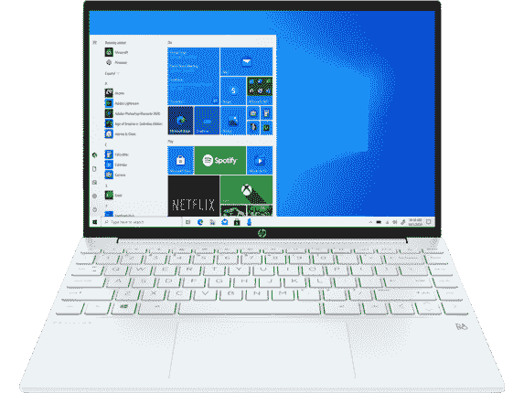
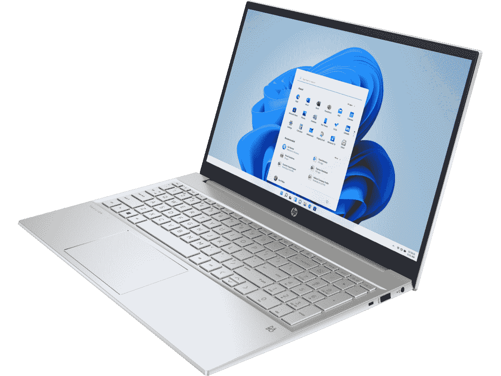
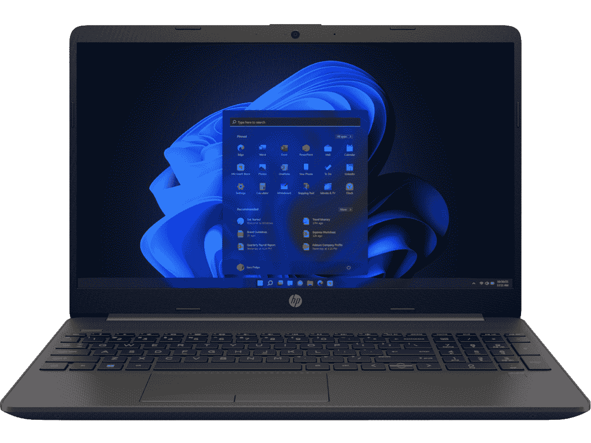
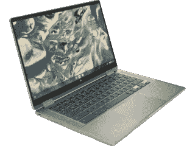
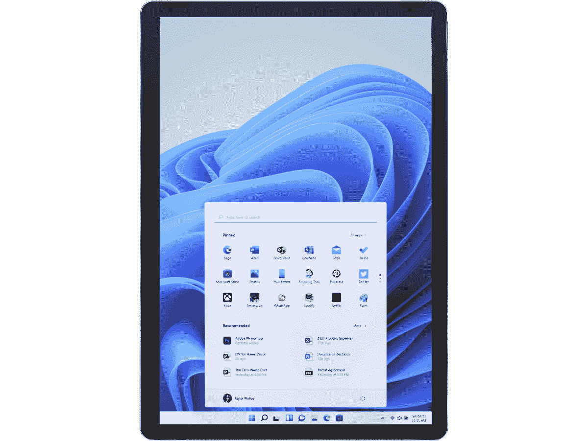

# 2023 年最便宜的惠普笔记本电脑

> 原文：<https://www.xda-developers.com/best-hp-laptops-under-500/>

如今，在众多选择中寻找一款好的笔记本电脑有时会有点复杂。当你试图花尽可能少的钱时，这就更有挑战性了。惠普制造了一些非常棒的笔记本电脑，但是当预算紧张的时候，很难找到一款你买得起的。我们已经收集了一些不到 600 美元就能买到的[最好的笔记本电脑](https://www.xda-developers.com/best-laptops-under-600/)，惠普也出现了几次。但是，如果你对这个品牌非常感兴趣，我们已经收集了惠普产品组合中一些最好的(也是最便宜的)笔记本电脑。

对于这份清单，我们大多试图坚持 600 美元左右的预算，但这并不总是可能的。这些笔记本电脑中的一些只是因为销售才处于那个价格，而一些仍然超过那个数字，只是因为你在那个价格的特定类别中找不到像样的笔记本电脑。这些选项并不意味着与惠普的最佳产品竞争，但有一些便宜的笔记本电脑，它们抓住了基本要素，并提供了良好的整体体验。我们包括了不同尺寸、操作系统和外形的笔记本电脑。这应该能帮你找到符合你需求的东西。

## 最佳综合:惠普 Pavilion Aero

一台笔记本电脑真正给我们带来惊喜的情况并不常见，但[惠普 Pavilion Aero](https://www.xda-developers.com/hp-pavilion-aero-13-review/) 是个例外。它的官方起价为 759.99 美元，这已经是一款出色的笔记本电脑，拥有强大的处理器和出色的屏幕。如今，它的折扣经常低于 600 美元，这使得它很容易成为你以这个价格买到的最好的笔记本电脑之一。

从性能开始，惠普 Pavilion Aero 由 AMD 锐龙处理器提供支持，特别是从 AMD 锐龙 5 5625U 开始，这是一款 6 核 12 线程处理器，加速速度高达 4.3GHz。这是你在这个价格的任何笔记本电脑上都能找到的最好的处理器之一，它配有 8GB 内存和 256GB 固态硬盘。有一些升级的空间，但如果你想保持在 600 美元以下，这将取决于正在进行的销售。不管怎样，你已经在基本模型中获得了很好的体验。

然而，让这款笔记本令人印象深刻的不仅仅是它的内部结构，它的显示屏也很棒。这是一个 13.3 英寸的面板，长宽比为 16:10，比典型的 16:9 显示器高，非常适合工作效率。在这个价格上，这种纵横比已经是罕见的了，但最重要的是，它是全高清+ (1920 x 1200)分辨率，在这个价格上也非常好看。你甚至可以花 30 美元将其升级到 Quad HD+ (2560 x 1600)，这真是太棒了。当你将它与内部规格相结合时，很明显这是我们在这个价格范围内的首选。

在显示屏上方，有一个 720p 的网络摄像头，这是这款笔记本电脑最明显的缺点之一。列表中的大多数笔记本电脑都有同样的问题，但这是值得记住的事情。它也没有 Windows Hello 面部识别功能，但有一个指纹传感器可以用于此目的。

在设计方面还有更多好消息。通常，像这样的廉价笔记本电脑也在这方面偷工减料，但 Pavilion Aero 仍然设法做到了不到 2.2 磅，超级轻，便于携带。此外，它由镁制成，这是高端笔记本电脑上最常见的材料，它甚至有四种不同的颜色可供选择。在这个价位上，几乎所有这些东西本身都令人印象深刻，但同时拥有它们尤其令人印象深刻。

最后，还有港口，我们在这里得到的供应也相当不错。你有一个 USB Type-C 端口，两个 USB Type-A 端口，HDMI 和一个耳机插孔，这对于这种大小的笔记本电脑来说是可靠的。USB 端口不是超级快，但它们支持至少 5Gbps 的速度，所以这是你在这个价格上所期望的。

它显然不是一台完美的笔记本电脑，但惠普 Pavilion Aero 很容易成为这个价格范围内的最佳选择之一，它绝对值得在这个名单上占据首位。

 <picture></picture> 

HP Pavilion Aero

##### 惠普展馆 Aero 13

HP Pavilion Aero 是一款经济实惠的笔记本电脑，具有令人印象深刻的强大规格和轻巧的设计。

## 最佳敞篷车:惠普 Pavilion x360 14

如果你喜欢敞篷车的多功能性，HP Pavilion x360 14 是任何想要便宜但功能强大的笔记本电脑的人的理想选择。尽管它的价格很低，但它配备了最新的英特尔处理器，并且还有其他很棒的东西。

让我们从规格开始。惠普 Pavilion x360 14 配备了英特尔的第 12 代酷睿处理器，这一特定型号配备了酷睿 i3-1215U，它具有六个内核和八个线程。这使得这已经是一个非常强大的笔记本电脑，它甚至包括虹膜 Xe 图形。此外，基本型号配备了 8GB 双通道内存和 256GB 固态硬盘。这是一个很好的组合，它可以很好地处理日常使用。或者，惠普的网站有更强大(也更昂贵)的配置。

令人欣慰的是，全高清显示屏甚至正在成为经济型笔记本电脑的标准配置，Pavilion x360 14 就是这样一个例子。这款 14 英寸的面板具有 16:9 的宽高比，并且具有全高清(1920 x 1080)分辨率，因此对于这种尺寸来说非常清晰。它不是很亮，在 250 尼特，但在室内使用已经足够好了，而且它被康宁大猩猩玻璃 5 覆盖，所以更耐用。当然，因为它是一辆敞篷车，它有一个触摸屏，也支持笔输入。

在显示屏上方，Pavilion x360 包括一个 720p 网络摄像头，这是这个价位的大多数笔记本电脑都应该有的。这可能不会太棒，所以如果会议和在线课程对你很重要，你可能需要一个[外部网络摄像头](https://www.xda-developers.com/best-webcams/)。该相机也不支持 Windows Hello，但如果你想更容易地解锁你的 PC，则有一个指纹读取器。

就设计而言，Pavilion x360 14 是一款价格合理的笔记本电脑的标准配置。这是一个便宜的设备经常偷工减料的领域，它不会像更贵的笔记本电脑那样让人觉得昂贵。它的厚度为 18.8 毫米，因此它不是最薄的笔记本电脑，但也不厚。重量只有 3.35 磅，非常轻巧，便于随身携带。这正是你在这个价格上所期望的。不过，它有三种颜色，所以你至少可以选择最适合你风格的。

不过，Pavilion x360 14 的端口供应充足。它配有一个带充电和显示输出的 USB Type-C 端口，两个 USB Type-A 端口，HDMI 2.1，一个耳机插孔和一个 microSD 读卡器。虽然 Type-C 端口支持充电，但也有一个专有的桶形充电端口，这是默认使用的。这涵盖了你可能有的大部分需求，虽然没有 Thunderbolt 支持，因为这是一个负担得起的设备。但是你可以使用内置端口连接任何你想要的东西。

惠普制造了许多廉价笔记本电脑，但这无疑是最好的选择之一。它具有稳定的性能和多功能的外形，并且不需要做出巨大的牺牲就能获得较低的价格。

##### 惠普展馆 x360 14

2022 HP Pavilion x360 14 配备了第 12 代英特尔处理器，整体规格稳定，几乎对任何人来说都是一款非常划算的笔记本电脑。

## 最佳游戏笔记本电脑:Victus 15t

如果你想要一台惠普的游戏笔记本电脑，不幸的是现在不可能找到低于 600 美元的东西，但 [Victus 15t](https://www.xda-developers.com/hp-victus-15-review/) 仍然可以被认为是一个可靠的预算选择，至少在写作时是这样。它不会给你带来令人兴奋的体验，但它允许你以可玩的帧率运行大多数游戏，这是你对经济型笔记本电脑的最高要求。

从性能开始，Victus 15t 由英特尔酷睿 i5-12450H 驱动，这是一款非常强大的处理器，具有 8 个内核和 12 个线程，加上 4.4GHz 的 boost 速度。对于 GPU，你会得到一个 Nvidia GeForce GTX 1650，这是一款入门级 GPU，但如果你愿意调整一些设置，它仍然可以玩很多现代游戏，对于电子竞技游戏来说，它应该表现很好。默认情况下，这款笔记本电脑还包括 8GB 内存和 256GB 固态硬盘，如果你愿意，你可以在以后升级这些东西。总的来说，这是一个很好的低价游戏的起点，你不能在这个价格上得到更多。

Victus 15t 的显示屏是一个 15.6 英寸的面板，正如笔记本电脑的名字所暗示的那样。它具有全高清分辨率(1920 x 1080)，在这种配置下，它具有快速的 144Hz 刷新率，这意味着你可以享受一些具有额外平滑帧速率的更轻松的游戏。在更注重预算的笔记本电脑中看到这一点非常好。

网络摄像头是游戏笔记本电脑中经常被忽视的东西，当你在这个价格范围内购物时，就更是如此。Victus 15t 配备了另一个 720p 网络摄像头，并且没有任何 Windows Hello 支持，这很不幸，但并不意外。

就设计而言，Victus 15t 对于一款游戏笔记本电脑来说看起来相当干净。虽然你可以找到其他颜色，但这种特定的型号有云母银，这是黑色的另一种说法。它整体看起来相当干净，没有任何 RGB 照明，所以它不一定看起来像一台游戏笔记本电脑。然而，它相当重，重 5.06 磅，厚度也是 23.6 毫米，所以整体而言便携性不是最好的。

这款笔记本电脑的一个突出之处是端口的供应，包括一个 USB Type-C、两个 USB Type-A、HDMI、RJ45 以太网和一个 3.5 毫米耳机插孔，此外还有一个全尺寸 SD 读卡器。你几乎可以将任何想要的东西直接插入这台笔记本电脑，这一点看起来很棒。当然，如果能看到 Thunderbolt 支持就太好了，但在这样一台廉价的笔记本电脑上看到它的缺失并不奇怪。

这不完全是一个糟糕的游戏装备，但如果你想以低廉的价格玩游戏，Victus 15t 是惠普制造的最好的笔记本电脑之一。目前它的售价仅为 680 美元，这是一个很好的价格，但你也可以经常在其他型号上找到折扣，所以值得关注。

##### HP Victus 15t

惠普的这款 Victus 15t 配备了第 12 代英特尔酷睿 i5 处理器和独立 Nvidia 显卡，这意味着您可以通过快速的 144Hz 显示器享受一些游戏。

## 最佳 15 英寸笔记本电脑:惠普 Pavilion 15

如果你喜欢屏幕稍大的笔记本电脑，惠普 Pavilion 15 是该公司产品系列中的另一个不错的选择。正如你所料，最新的型号配备了第 12 代英特尔处理器，你经常可以找到一个非常好的价格，尽管它取决于折扣。

首先，这款 HP Pavilion 15 配备了英特尔酷睿 i7-1255U 处理器，这是一款非常强大的 CPU，具有 10 个内核和 12 个线程，能够毫无问题地处理各种日常任务。如果您的预算允许，还有更强大的酷睿 i7-1260P 选项。你还可以获得 16GB 的内存和 512GB 的固态硬盘，这是一个很好的组合，你真的无法用这个价格的许多其他笔记本电脑获得。这也意味着惠普可能会在某个时候推出更便宜的型号，使这成为一个更好的预算选择。

与列表中的大多数笔记本电脑一样，最新的 HP Pavilion 15 默认配备了全高清显示屏(1920 x 1080)，但当然，它的面板更大，对角线为 15.6 英寸。它仍然相当清晰，这是这个价格下你能得到的最好的，尽管这个分辨率在小屏幕上看起来更好。基本配置是 250 尼特亮度的 IPS 面板，尽管有 300 尼特的更亮配置，如果你想在户外使用笔记本电脑，这可能是一个值得的升级。

与列表中的其他笔记本电脑一样，惠普 Pavilion 15 上的摄像头分辨率为 720p，不支持 Windows Hello 面部识别。然而，它有一个指纹识别器，所以你可以随时使用它来轻松解锁你的电脑。

Pavilion 15 的设计与其他 Pavilion 笔记本电脑非常一致。它试图看起来像惠普更高端的笔记本电脑，但它比你想象中的高端设备更厚更重。这并不是说它太厚了——它的尺寸为 17.78 毫米——重量为 3.86 磅，所以从各方面考虑，它都相当便携。它还有几种颜色可供选择，包括银色、白色、金色、蓝色和蓝绿色，所以你可以得到真正符合你风格的东西。另一个值得一提的是，它的键盘上有一个完整的数字键盘，很好地利用了像这样的大型笔记本电脑的可用空间。

最后，还有港口，15 号展馆满足了你的大部分需求。有一个支持充电和显示端口的 USB Type-C 端口，两个 USB Type-A 端口，HDMI，耳机插孔和 microSD 读卡器。总的来说，您可能想在笔记本电脑上使用的大多数外围设备和显示器都应该能够与 Pavilion 15 一起使用，这要归功于这些端口，而这对于现代笔记本电脑来说并不总是如此。

凭借其低廉的价格、稳定的性能和 15.6 英寸的大显示屏，HP Pavilion 15 是一款非常棒的笔记本电脑，如果您重视没有许多花里胡哨的良好日常体验的话。这是你今天能买到的最便宜的惠普笔记本电脑之一，特别是如果这是你想要的尺寸，尽管你需要在打折时找到它，如果你想要它的价格在 600 美元左右，就像在写作时的情况一样。

 <picture></picture> 

HP Pavilion 15

##### 惠普展馆 15

最新的 HP Pavilion 15 配备了第 12 代英特尔酷睿 i7 处理器和 16GB 内存，尽管你需要利用折扣才能被认为是实惠的。

## 最佳商务笔记本电脑:惠普 255 G8 笔记本

在惠普的产品线中，没有大量廉价的商用笔记本电脑，但由于正在进行的销售，这款 HP 255 G8 仍在我们 600 美元的预算内。惠普 255 G8 笔记本电脑不打折的价格约为 769 美元，但你会发现它经常打折。像这样的商务笔记本电脑的一个好处是它配备了 Windows 11 Pro，因此开箱即可支持 Hyper-V、远程桌面等功能。

转到硬件规格，惠普 255 G8 配备了 AMD 锐龙 5 5500U 处理器，提供了相当不错的性能。它有六个内核和 12 个线程，所以在这台机器上的日常使用应该很棒。这款机型还配备了 16GB 的内存，确保了出色的多任务处理体验，以及 256GB 的固态硬盘存储，这与榜单上其他价格合理的笔记本电脑不相上下。与惠普的一些其他笔记本电脑不同，这是一个单一的配置，所以你不能改变它的开箱即用。然而，笔记本电脑确实有一些升级选项，带有可移动的 SSD 和 RAM 模块，因此您可以稍后升级。

显示器方面，惠普 255 G8 配备了 15.6 英寸全高清(1920 x 1080)。这大约是你在这个价格下的预期，对于大多数使用情况来说，它应该足够清晰，同时还可以在大屏幕上进行一些多任务处理。不幸的是，网络摄像头仍然是 720p，没有 Windows Hello 面部识别，尽管你有一个指纹传感器来弥补这一点。

就设计而言，HP 255 G8 是最基本的，这是您对一款经济实惠的商务笔记本电脑的期望。它有一个近乎黑色的颜色，没有太多的天赋。与我们迄今为止看到的其他笔记本电脑一样，它足够便携，厚度为 19.21 毫米，重量为 3.84 磅。对于 15 英寸的笔记本电脑来说，这并不算太差，尽管它也没有赢得便携性方面的奖项。

端口是商务笔记本电脑脱颖而出的一个领域，但惠普 255 G8 大多坚持基本功能。有一个 USB Type-C 端口，两个 USB Type-A 端口，以太网，HDMI，耳机插孔和全尺寸 SD 读卡器。明确地说，这是一个可靠的设置，它涵盖了您可能有的大多数需求。高端商务笔记本电脑往往包括可选的智能卡读卡器或 LTE，但这里不是这样。值得注意的是，有些配置有时会消失和重新出现，因此将来可能会有额外的选项。

总的来说，HP 255 G8 为经济型商务笔记本电脑提供了最基本的功能。它拥有丰富的端口选择、经典的柔和设计和良好的日常性能。如果你需要一台便宜的笔记本电脑来工作，这是你最好的选择之一。

 <picture></picture> 

HP 255 G8

##### 惠普 255 G8

HP 255 G8 是一款经济实惠的商用笔记本电脑，能够满足您的基本工作需求。

## 最佳 17 英寸笔记本电脑:惠普笔记本电脑 17

如果你是那种总是需要尽可能大的屏幕的人，名副其实的 HP Laptop 17 可能适合你。除了你可能想到的最普通的名字，这款笔记本电脑还有一些优点，如果你想要一个大屏幕，它是一个可靠的选择。

像往常一样，我们将从性能开始，这款机型首先采用 10 核 12 线程的英特尔酷睿 i5-1235U 处理器，对于大多数日常任务来说已经绰绰有余。但是，如果预算允许，您可以选择升级到酷睿 i7。这款机型也是 8GB 内存和 256GB 固态硬盘起步，这是一个坚实的起点。

不幸的是，这款笔记本电脑确实在显示屏方面做了一些手脚。这是一个 17.3 英寸的大面板，但它的分辨率较低，为 1600 x 900，因此不像列表中的其他笔记本电脑那样清晰。您可以选择升级到全高清(1920 x 1080)面板，如果您有预算，我们当然会推荐您。像这样的大显示器保证了更高的分辨率以获得出色的体验，即使它在较低的分辨率下仍然可用。

与名单上的其他笔记本电脑一样，显示器上方的网络摄像头只有 720p，而且没有面部识别支持。事实上，没有 Windows Hello 支持，这是一个令人失望的，即使考虑到较低的价格标签。

在设计上，HP Laptop 17 是最基本的，与列表中的大多数笔记本电脑相似。它有银色和黑色两种颜色，但黑色型号的独特之处在于底盘上有白色斑点，这使它看起来有些独特。由于其尺寸，这是最重的笔记本电脑之一，重 5.25 磅，厚度为 19.8 毫米。它不是超级便携的，但你可能会认为它是一个大的笔记本电脑。

最后，我们来看看端口，这也与列表中的大多数其他笔记本电脑相似。一个 USB Type-C 端口，两个 USB Type-A 端口，HDMI 和一个耳机插孔都是你得到的，考虑到笔记本电脑的绝对尺寸，这不是太令人印象深刻。遗憾的是，额外的空间没有用于容纳任何额外的端口，如以太网。

很难说惠普笔记本电脑在任何方面都是令人兴奋的笔记本电脑，但它以相当低的价格完成了工作。它拥有现代的处理器和规格，与列表中的其他产品相比，大屏幕可能更合你的口味。在这个便宜的价格范围内，它无疑是惠普制造的最好的 17 英寸笔记本电脑之一。

##### 惠普笔记本电脑 17

HP Laptop 17 相当简单，但它涵盖了您可能拥有的大多数基本需求，并且它有一个大显示屏。

## 最佳 Chromebook:惠普 Chromebook x360 14

你不能谈论廉价的笔记本电脑而不提到 Chromebooks 我们的意思是尽可能用最好的方式。Chrome OS 是一个更轻、更便宜的操作系统，这意味着最实惠的笔记本电脑通常运行谷歌的操作系统。惠普 Chromebook x360 14c 就是这种情况，它可能是惠普制造的最好(最便宜)的 Chrome OS 笔记本电脑。考虑到底价，这款敞篷车的硬件相当不错。

在性能方面，惠普 Chromebook x360 14c 非常符合列表中的其他笔记本电脑，或者至少是它们的基本配置。你得到了一个英特尔酷睿 i3-1125G4 处理器，具有 4 个内核，8 个线程，时钟速度高达 3.7GHz。没有升级选项，所以这是你坚持的，但坦率地说，这已经是 Chrome OS 的一个很好的 CPU。你还可以获得 8GB 的内存和 128GB 的固态硬盘来存储，从而获得非常好的 Chrome OS 体验。值得记住的是，与 Windows 相比，Chrome OS 相当轻量级，而且它更多地依赖于基于网络的内容，所以你不需要非常高端的处理器或大量的存储空间。

显示屏也相当不错，是 14 英寸的面板，全高清(1920 x 1080)分辨率。对于这种尺寸的笔记本电脑显示器来说，这已经足够清晰了。此外，这是一款可转换笔记本电脑，因此您可以轻松将其转换为平板电脑，并使用触摸屏做任何您需要做的事情。屏幕也有康宁大猩猩玻璃 5 保护，所以应该还算耐用。

惠普 Chromebook x360 的一个不足为奇的地方是网络摄像头，这是一个 720p 的摄像头，就像列表中的其他笔记本电脑一样。Chrome OS 不支持红外面部识别，所以这不是一个选项，但它实际上有一个指纹识别器，可以更方便地解锁你的电脑和登录你的帐户。

这款笔记本电脑的设计并没有太多独特之处，它只是看起来像一台暗银色的笔记本电脑，如果你想要一些柔和的东西，这很好。它的厚度大约为 18 毫米，重量为 3.35 磅，这大约是你对 14 英寸敞篷车的预期，而且它相当便携。

谈到端口，惠普 Chromebook x360 做得不错。它有两个 USB Type-C 端口，可以处理充电和显示端口，一个 USB Type-A 端口，一个耳机插孔和一个 microSD 读卡器。缺少 HDMI 确实意味着如果你想连接外部显示器，你需要一个适配器，但这是我们在列表中的其他笔记本电脑中没有看到的。

最终，惠普 Chromebook x360 在几个关键领域提供了帮助:首先，它是一款可变形的笔记本电脑，而且价格便宜。此外，这个低价已经包含了全高清显示屏和坚实的规格。如果你是 Chrome OS 的粉丝，或者如果你只是不需要 Windows 所做的一切，这是一个非常棒的价值主张，其折扣价为 479.99 美元。如果你想要便宜的东西，它很容易成为惠普产品线中最好的笔记本电脑之一。

 <picture></picture> 

HP Chromebook x360 14

##### 惠普 Chromebook x360 14C

这是一款经济实惠的 Chromebook 敞篷车，配有全高清显示屏和全面稳定的性能。

## 最佳平板电脑:惠普平板电脑 11

最后，我们为平板电脑粉丝准备了一些东西。如果您想要一台便宜的设备来观看电影和视频，名副其实的 HP Tablet 11 是一款出色的平板电脑，配有固态显示屏和用于通话的出色网络摄像头，也是与家人和朋友保持联系的绝佳选择。

不过先说性能。惠普平板电脑 11 由英特尔奔腾银 N6000 处理器驱动，该处理器具有四个内核和四个线程，最高可达 3.3GHz。这显然不如列表中的其他型号强大，但它仍然可以处理网页浏览和视频通话等事情，这是你将使用该设备的主要目的。您还可以获得 4GB 内存和 128GB 固态硬盘。这对生产力来说不是很好，但是只要你知道硬件的限制，它仍然是很好的。

然而，惠普平板电脑 11 的一大优点是显示屏。这个 11 英寸的屏幕有非常清晰的 2160 x 1440 分辨率，对于这个尺寸来说非常棒。这使得它成为一个很好的随意浏览网页的设备，3:2 的宽高比也有助于这一点，使它更容易在屏幕上显示更多内容，而不必滚动。这也是一个相当明亮的面板，高达 400 尼特。这是一款更注重整体体验而非性能的设备。

作为平板电脑通常意味着网络摄像头比标准笔记本电脑更重要，惠普在这一点上采取了独特的方法。这里只有一个摄像头，是一个 1300 万像素的传感器，比大多数 Windows 平板电脑都要好。这是一个旋转摄像头，因此虽然默认情况下它指向后方，但它可以翻转并面向您，因此您可以以出色的图像质量进行视频通话。

至于设计，这是一款带有可拆卸键盘的平板电脑，因此平板电脑本身非常轻，重量仅为 1.32 磅，厚度仅为 8.13 毫米。但是有一个可拆卸的支架和盖子，增加了重量和厚度。端口是任何平板电脑的缺点，在这里，你只有一个 USB-C 端口和一个 microSD 读卡器。如果你想要开箱即用的连接，平板电脑不是合适的选择，考虑到这款设备有多薄，这并不令人惊讶。令人惊讶的是没有耳机插孔，这可能会使公共场合的媒体消费更加不便。

不过，如果你想要一个轻量级的设备，用于媒体消费、网络浏览或与家人和朋友进行视频通话，这是一个非常棒且非常便宜的选择。只是不要期望多任务处理有出色的性能。

 <picture></picture> 

HP Tablet 11

##### 惠普平板电脑 11

惠普 11 英寸平板电脑是一款经济型设备，但它拥有出色的显示屏和网络摄像头，非常适合休闲网络浏览和视频通话。性能并不惊人，但对于它的用途来说已经足够了。

* * *

这些是我们认为的最好的惠普笔记本电脑，如果你的首要任务是找到便宜的东西。这份清单上有相当多的品种，所以无论你在寻找什么，我们都有适合你的。同样，这些型号中的一些可能只有在你能以折扣价买到时才便宜，而且价格会波动，但不管怎样，它们都是很棒的设备。HP Pavilion Aero 由于其出色的屏幕、稳定的性能和令人惊讶的轻量级设计，仍然是我们的首选，但列表中的其他选项也很棒。

如果您仍在探索其他选择，我们在[我们的经济型笔记本电脑综述](https://www.xda-developers.com/best-laptops-under-600/)中有更多其他品牌的经济型笔记本电脑。有很多选择。