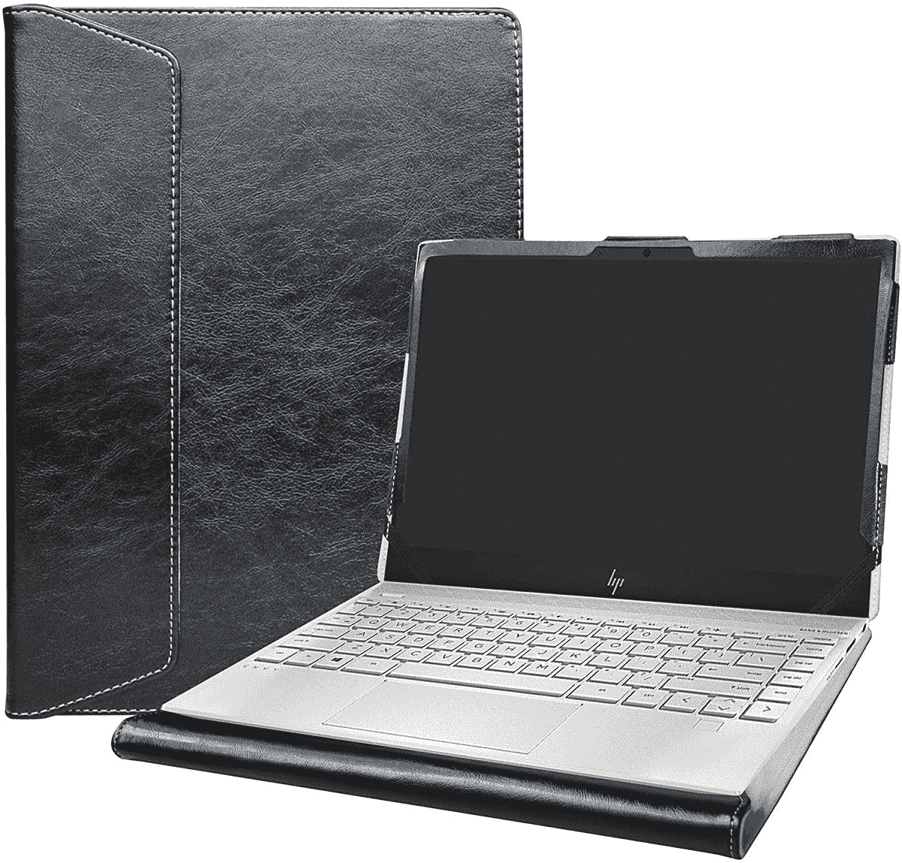
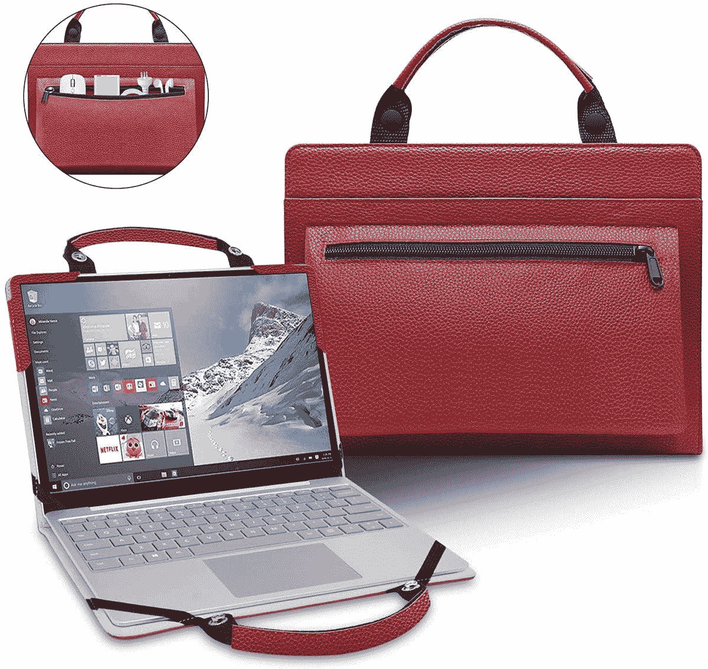
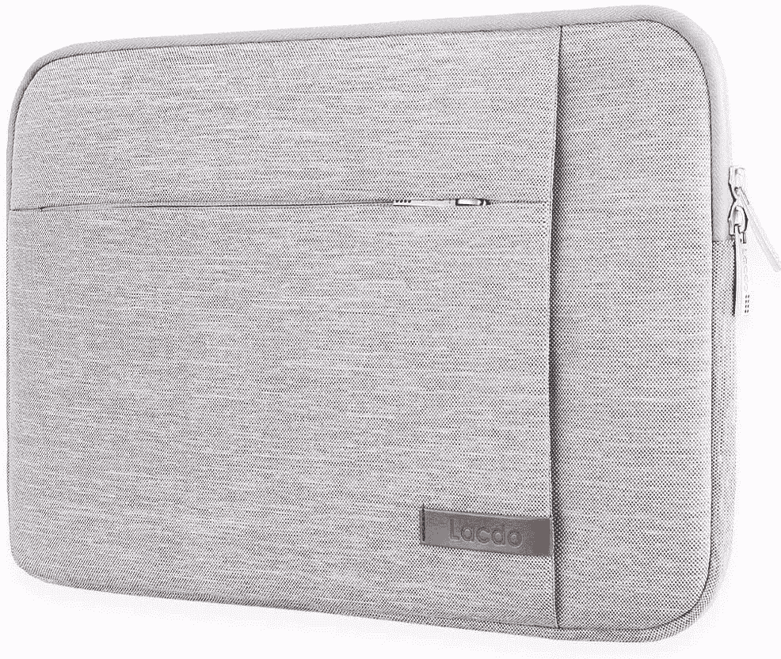
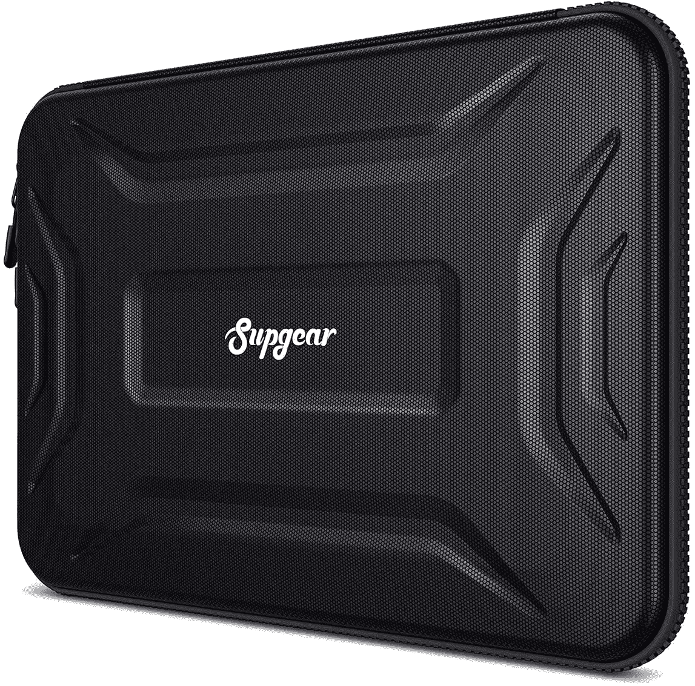
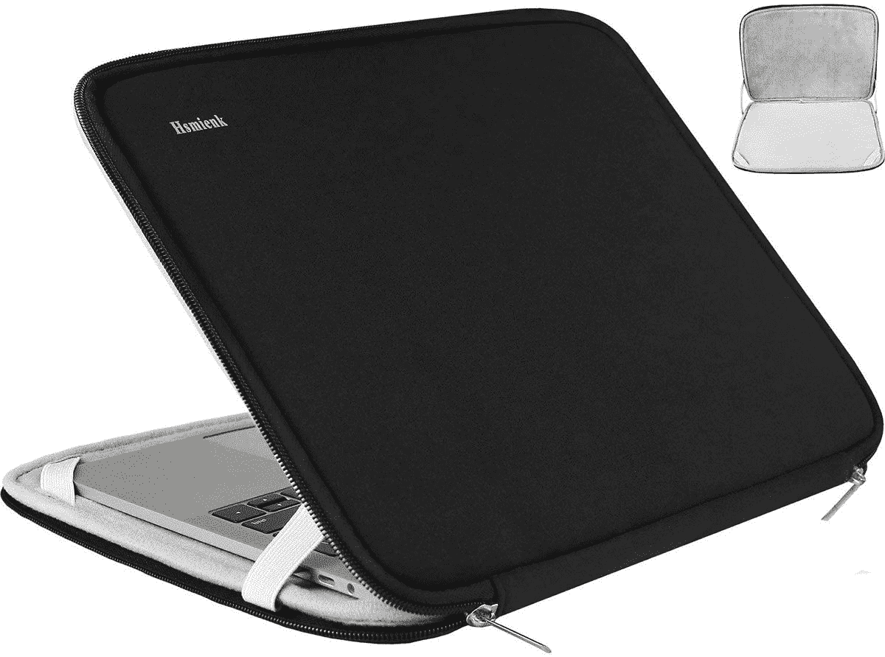
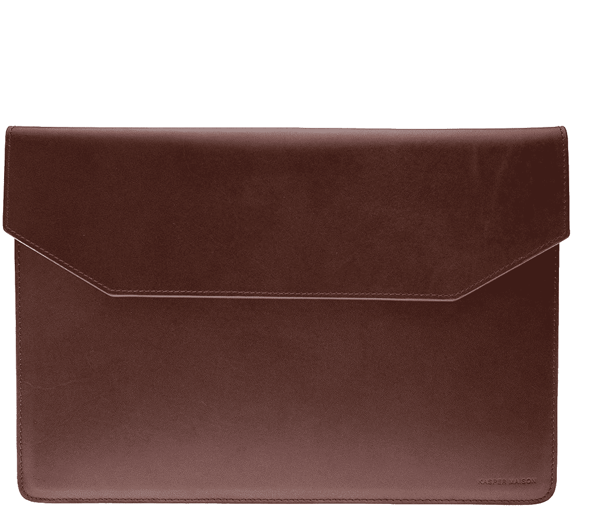

# 2023 年惠普 Pavilion Aero 13 的最佳案例

> 原文：<https://www.xda-developers.com/best-hp-pavilion-aero-cases/>

惠普最新的 [Pavilion Aero 13](https://www.xda-developers.com/hp-pavilion-aero-13-first-impressions/) 是一款物有所值的笔记本电脑，以合理的价格提供了出色的构造和设计。它由镁合金制成，是同类产品中最轻的笔记本电脑之一，重量不到一公斤，同时提供了可以与该公司的 Envy 系列笔记本电脑相媲美的外观。在内部，笔记本电脑采用 AMD 最新的锐龙 5000U 系列处理器，在保持整体 TDP 的同时提供出色的性能。

它可以配备六核锐龙 5 5600U 或八核锐龙 7 5800U CPU，16GB 内存和存储选项高达 1TB PCIe NVMe M.2 固态硬盘。它没有配备 Thunderbolt，但你确实有一个带电源传输和 DisplayPort 1.4 的 USB-C 端口，以及两个 USB-A、HDMI 2.0 和 3.5 毫米音频插孔。至于显示器，笔记本电脑上的 13.3 英寸 IPS 显示器具有 16:10 的纵横比，并提供全高清 1920×1200 或 2K 2560×1600 分辨率，峰值亮度为 400 尼特。

惠普总共提供四种颜色选择——银色、金色、白色和玫瑰金——价格从 750 美元起，最高可达 1130 美元。该笔记本也有望在面向公众发布后立即更新到即将到来的 [Windows 11 更新](https://www.xda-developers.com/windows-11/)。

如果你想保护你的 Pavilion Aero 13，这里有一些最好的选择。

 <picture></picture> 

Alapmk Protective Case

##### HP Pavilion Aero 保护壳

这是 Pavilion Aero 13 的对开风格人造革外壳，可以绑在笔记本电脑上，以防止潜在的损坏，同时提供整洁的专业外观。

 <picture></picture> 

LiuShan 2-in-1 Protective Case

##### 刘珊二合一保护套

专为 Pavilion Aero 13 设计的独特保护套，可兼作手提袋，几乎就像一个小手提包。它还配有一个额外的配件袋和三种颜色可供选择。

 <picture></picture> 

Lacdo Laptop Sleeve

##### Lacdo 360 笔记本电脑保护套

一个简单的织物套，内部经过柔软处理，可保护您的笔记本电脑。它配有防水外部材料和额外的口袋来储存小物品，甚至是一个超薄的平板电脑。

 <picture></picture> 

Supgear Laptop Case

##### Supgear 笔记本电脑保护套

这个外壳上的硬壳可以保护笔记本电脑免受震动和跌落的影响，还可以防尘防水。里面还有额外的口袋，可以存放线缆、充电器和其他配件。

 <picture></picture> 

Tomtoc 360 Protective Laptop Sleeve

##### Tomtoc 360 保护型笔记本电脑单肩包

这是一款强烈推荐的便携包，具有防水的外部织物表面。内部装有衬垫，可提供出色的保护，而内置手柄可用于方便携带。

 <picture></picture> 

Hsmienk Laptop Case

##### Hsmienk 笔记本电脑包

一款经济实惠的便携包，内外均采用柔软面料，确保您的笔记本电脑受到保护，不会被划伤。

 <picture></picture> 

Kasper Maison Leather Sleeve

##### Kasper Maison 皮套

真皮制成的时尚笔记本电脑包，给您一种高级的感觉和质感。它带有一个额外的侧袋，有多种颜色可供选择。

这些是新惠普 Pavilion Aero 13 的一些最佳案例。我们也有一份专门的清单，上面列出了一些最佳配件，还有一份关于如何在家里布置 Aero 13 展馆的 T2 指南。如果你打算购买新的 Pavilion Aero 13，这里有一个专用链接。

 <picture></picture> 

HP Pavilion Aero

##### 惠普展馆 Aero 13

HP Pavilion Aero 13 是一款中档轻型笔记本电脑，采用 AMD 锐龙 5000U 系列处理器。

如果你不喜欢 Pavilion Aero 13，我们也有一个[最佳惠普笔记本电脑](https://www.xda-developers.com/best-hp-laptops/)的列表。此外，看看惠普的[最便宜的笔记本电脑](https://www.xda-developers.com/best-cheap-hp-laptops/)和采用 AMD 锐龙处理器的[最便宜的笔记本电脑](https://www.xda-developers.com/best-amd-ryzen-laptops/)。