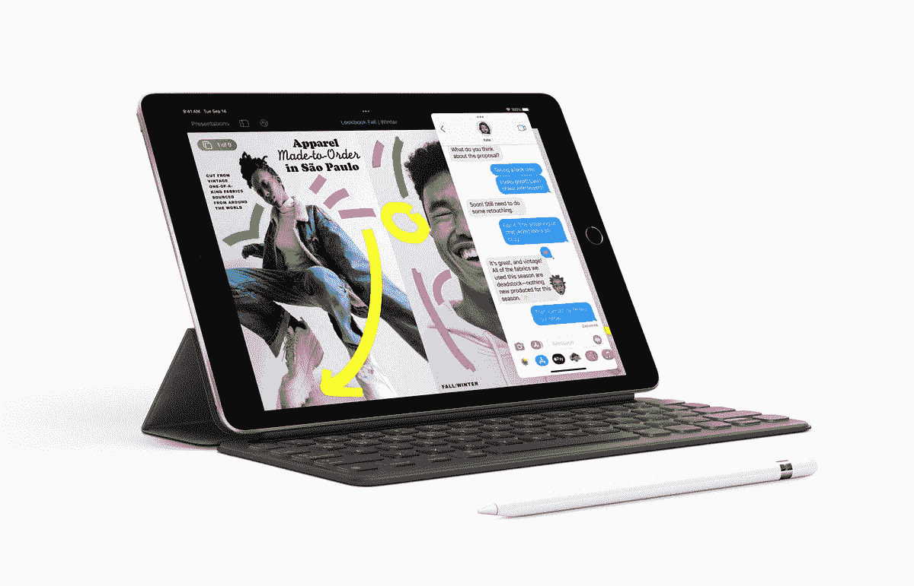

# 2022 年最佳苹果 iPad 9 (2021)交易

> 原文：<https://www.xda-developers.com/best-ipad-9-deals/>

回到 2021 年末，iPad 9 加入了苹果平板电脑这个不断壮大的家族。无论你是学生还是爱好者，都在寻找一款[价格适中的 iPad](http://www.xda-developers.com/best-ipad/) ，这款产品提供了大量的技术和功能——不会让你的钱包空空如也。因此，大约 300 美元，你就可以利用最新的 iPadOS 产品、Apple Pencil 支持、可选的键盘附件等等。如果你不确定在哪里可以找到最好的 iPad 9 交易，我们已经编制了一个全面的列表来帮助你。

## iPad 9 多少钱？

这款 iPad 在美国的入门级价格为 329 美元，自 2021 年 9 月 24 日起上市。下面是 iPad 9 的不同型号及其在苹果商店的价格。

| 

不同的

 | 

规则的

 | 

学生折扣

 |
| --- | --- | --- |
| Wi-Fi，64GB | $329 | $309 |
| Wi-Fi +手机网络，64GB | $459 | $439 |
| 无线网络，256GB | $479 | $459 |
| Wi-Fi +手机网络，256GB | $609 | $589 |

## 最佳 iPad 9 交易

### 苹果在线商店

苹果在线商店有一些你可能在别处找不到的额外好处:

*   学生折扣和优惠——如果你有资格的话。
*   下一次购买苹果电脑时，以旧 iPad 折价 580 美元。
*   在你的 iPad 背面获得一个免费的雕刻。

你已经可以通过苹果在线商店购买 iPad 9 了。如果你是大学生，你可能有资格享受折扣。

 <picture></picture> 

Apple iPad 9

##### 苹果 iPad (2021 年)

iPad 9 是苹果公司的 2021 年平价 iPad。它由 A13 仿生芯片驱动，支持 Apple Pencil 1。通过苹果在线商店，你可以获得一些独家特权，比如免费雕刻。

### 亚马孙

亚马逊与你在苹果商店看到的价格相当——基本款 329 美元。

 <picture></picture> 

Apple iPad 9

##### 苹果 iPad (2021 年)

iPad 9 是苹果公司的 2021 年平价 iPad。它由 A13 仿生芯片驱动，支持 Apple Pencil 1。如果亚马逊是你的零售商的选择，你可以在那里找到一个新的单位。

### 百思买集团

百思买目前有 2021 款 iPad 可供购买。它的价格与苹果商店的价格相当——入门款 329 美元。

 <picture></picture> 

Apple iPad 9

##### 苹果 iPad (2021 年)

iPad 9 是苹果公司的 2021 年平价 iPad。它由 A13 仿生芯片驱动，支持 Apple Pencil 1。如果你更喜欢从百思买购买，那么你同样可以在那里找到 iPad 9。

### Adorama

Adorama 也符合苹果商店的价格标签，你可以只花 329 美元买到 2021 年的平价 iPad。

 <picture></picture> 

Apple iPad 9

##### 苹果 iPad (2021 年)

iPad 9 是苹果公司的 2021 年平价 iPad。它由 A13 仿生芯片驱动，支持 Apple Pencil 1。通过 Adorama，你可以通过 6 个月分期付款，

### B&H

如果这是你选择的零售商，你也可以花 329 美元买到 iPad 9。

 <picture></picture> 

Apple iPad 9

##### 苹果 iPad (2021 年)

iPad 9 是苹果公司的 2021 年平价 iPad。它由 A13 仿生芯片驱动，支持 Apple Pencil 1。你同样可以在 B&H 找到它

### 沃尔玛

沃尔玛目前推出的入门款[售价](https://www.walmart.com/ip/Apple-10-2-inch-iPad-2021-Wi-Fi-64GB-Space-Gray/483978365)仅为 299 美元。这是我们迄今为止看到的 2021 款 iPad 最大的折扣之一。这项交易包括免费送货，所以它会到达你的家门口，只需 299 美元。

 <picture></picture> 

Apple iPad 9

##### 苹果 iPad (2021 年)

iPad 9 是苹果公司的 2021 年平价 iPad。它由 A13 仿生芯片驱动，支持 Apple Pencil 1。沃尔玛也有同样定价 329 美元的这种型号。

### 新蛋

这家零售商正在以 439 美元的价格出售 2021 款平价 iPad。如果你在其他地方找不到它，并且愿意额外付费来得到它，你可以在这里购买。

 <picture></picture> 

Apple iPad 9

##### 苹果 iPad (2021 年)

iPad 9 是苹果公司的 2021 年平价 iPad。它由 A13 仿生芯片驱动，支持 Apple Pencil 1。新蛋公司也仅售 329 美元。

* * *

这些是 2021 年 iPad 9 目前提供的交易。随着更多交易在网上浮出水面，我们将不断更新此页面。请务必稍后回来查看更多信息。如果你对 2022 年的 iPhone 感兴趣，你可能想看看 iPhone 14 目前在[的可用交易。](https://www.xda-developers.com/best-apple-iphone-14-deals/)