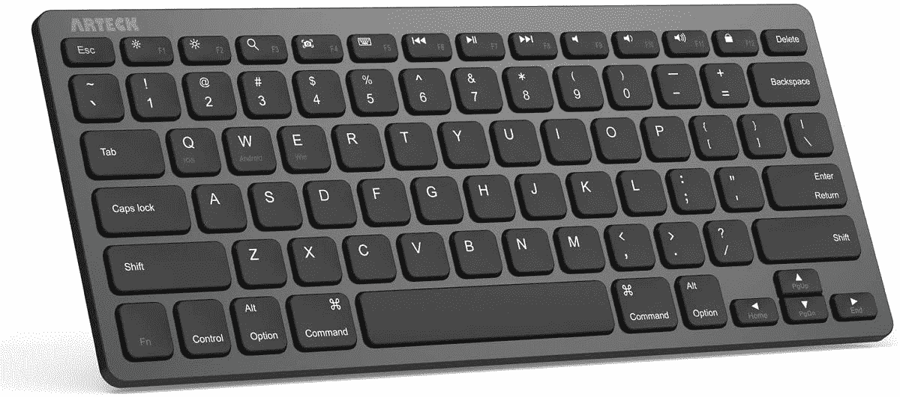
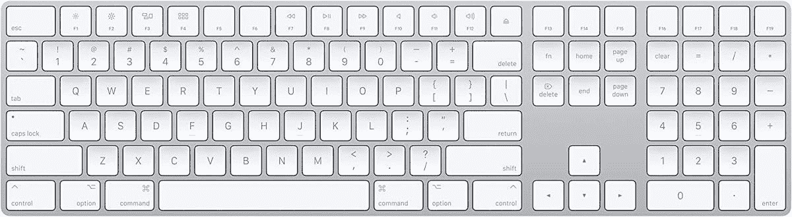
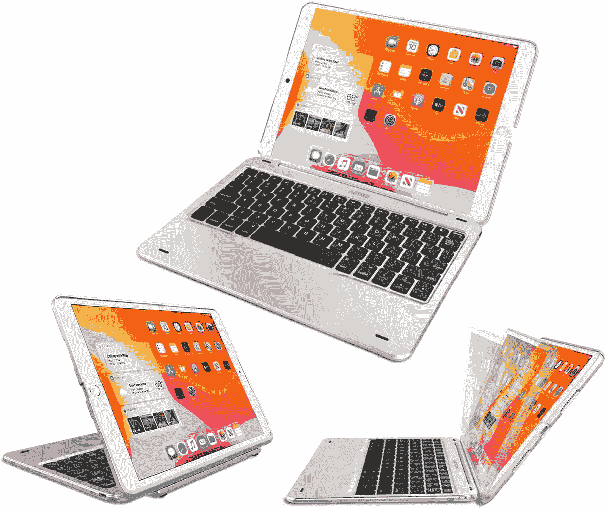
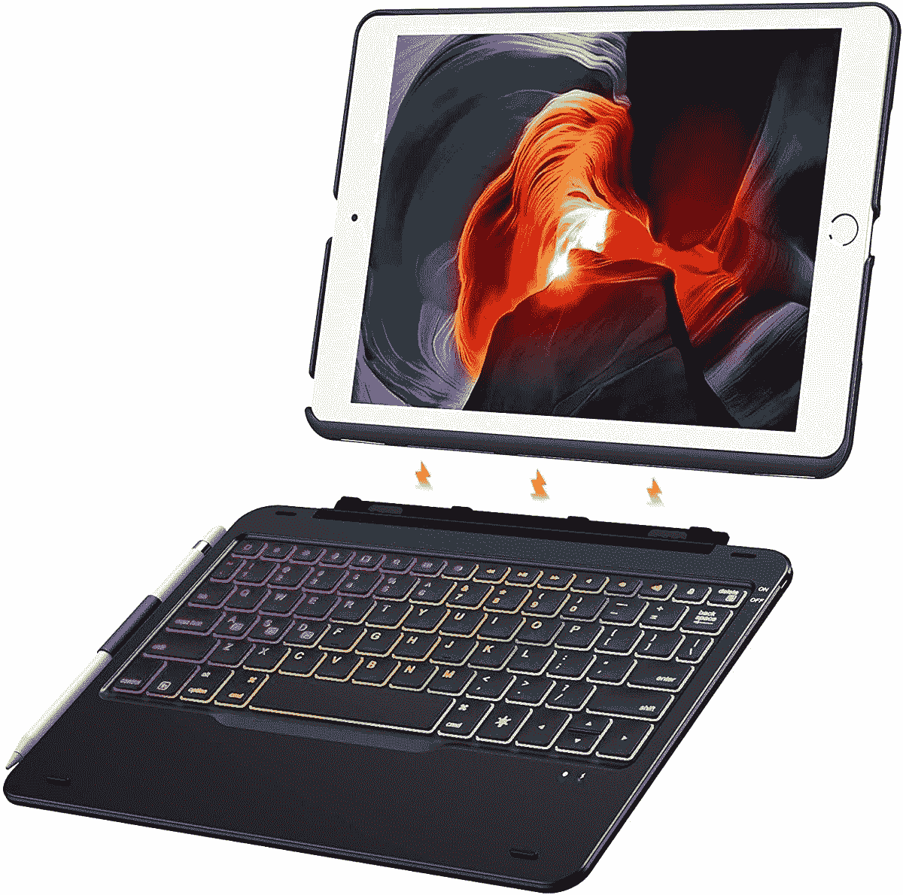

# 2023 年最佳苹果 iPad 9 键盘和键盘套

> 原文：<https://www.xda-developers.com/best-ipad-9-keyboards/>

# 2023 年最佳苹果 iPad 9 键盘和键盘套

苹果 iPad 9 的显示屏很小。这些键盘和键盘套将取代软件键盘，帮助您节省屏幕空间。

价格适中的 iPad 9 早在 2021 年就推出了。尽管如此，它仍然是学生们喜爱的[产品](https://www.xda-developers.com/apple-holiday-gift-guide/)，以低廉的价格提供了可靠的操作系统。虽然它的硬件可能不是苹果最棒的，但它仍然可以完成阅读、写作、涂鸦、消费媒体等工作。不过，如果你依靠它来打字，你可能会注意到内置的 iPadOS 键盘占据了大约一半的屏幕。利用整个屏幕空间的一个简单解决方法是依靠键盘或键盘套，这也可以起到双重保护作用。为了帮助你找到正确的选择，我们编辑了一份苹果 iPad 9 (2021)目前可用的最佳选择列表。

## 最佳蓝牙键盘

*   ##### 雷蛇黑寡妇 V3 Mini HyperSpeed

    如果你正在寻找一款 RBG-巴克利特键盘，这款雷蛇 one 是一个绝佳的选择。它一次充电可提供长达 200 小时的电池续航时间，并提供三种不同的连接模式。因此，你可以依靠蓝牙在 iPad 上打字，然后在游戏电脑上使用时切换到 HyperSpeed Wireless 或 USB-C，以提高可靠性。

*   ##### 苹果魔法键盘

    这是苹果官方的魔法键盘。它有一个优质的构造，当与 iPad 搭配使用时可以完美地工作。它提供了苹果著名的超薄、极简设计。它还包括一个可充电电池，通过 Lightning 转 USB 电缆。

*   <picture></picture>

    罗技 MX 键迷你极简无线照明键盘

    ##### 罗技 MX 键迷你

    这款来自罗技的金属键盘拥有指尖形状的按键，因此打字感觉更加自然。当您的手靠近背光按键时，背光按键会自动亮起，并且灯光会根据您的环境进行调整。

*   <picture></picture>

    Arteck 超薄蓝牙键盘

    ##### arte CK 超薄蓝牙键盘

    这款来自 arte CK 的优雅键盘以实惠的价格提供了体面的功能。它有两种颜色可供选择——黑色和银色。它的电池续航时间很长，所以你不需要担心日常使用几周后会没电。

*   <picture></picture>

    OMOTON 无线蓝牙背光键盘

    ##### OMOTON 无线蓝牙背光键盘

    这款键盘提供七种背光颜色。所以你可以换一种颜色来搭配你的心情。它超薄、轻巧，并包括一个剪刀机制，更容易打字。在键盘的底部，有四个橡胶脚来防止它滑动。

*   <picture></picture>

    带数字小键盘的苹果魔法键盘

    ##### 带数字小键盘的苹果魔法键盘

    这款魔法键盘同样出自苹果，但它提供了一个数字小键盘。对于那些喜欢使用大键盘的人来说，这款键盘是适合你的。它与其他魔法键盘具有相同的高级构造，还包括一个可充电电池。

## 最佳键盘套

*   ##### 罗技超薄对开键盘保护套

    罗技超薄对开键盘保护套可以说是你能为你的 iPad 9 买到的最好的保护套之一。就产品的耐用性而言，这家公司享有很高的声誉。这一款特别提供了 4 年的电池寿命、Apple Pencil 1 支架、三种使用模式等等。

*   <picture></picture>

    arte CK 键盘套

    ##### arte CK 键盘套

    这款超薄键盘套提供了人们熟悉的 Mac 键布局，包含磁性附着机制，充电 2 小时后可使用长达 100 小时。

    T34
*   <picture></picture>

    fin tie 7 色背光键盘保护套

    ##### fin tie 背光 iPad (2021)键盘保护套

    这款保护套从有限公司提供了一款磁性可拆卸的 7 色背光键盘。它有 3 级亮度，7 种不同的背光颜色，以及数百种充满活力的背光变色模式。

如果我个人必须为我的 iPad 9 选择一个键盘或键盘壳，我会选择 Fintie 7 色背光键盘壳。我喜欢它的彩色背光键盘和它的可拆卸性。我可以轻松地从“笔记本电脑”模式切换到平板电脑模式，而不必随身携带额外的重量。这个配置对我来说最有意义。如果你对键盘保护套不满意，那么我们也准备了一份目前最好的 iPad 9 保护套清单。

 <picture></picture> 

Apple iPad 9

##### 苹果 iPad 9

iPad 9 是苹果公司的 2021 年平价 iPad。它由 A13 仿生芯片驱动，支持 Apple Pencil 1。