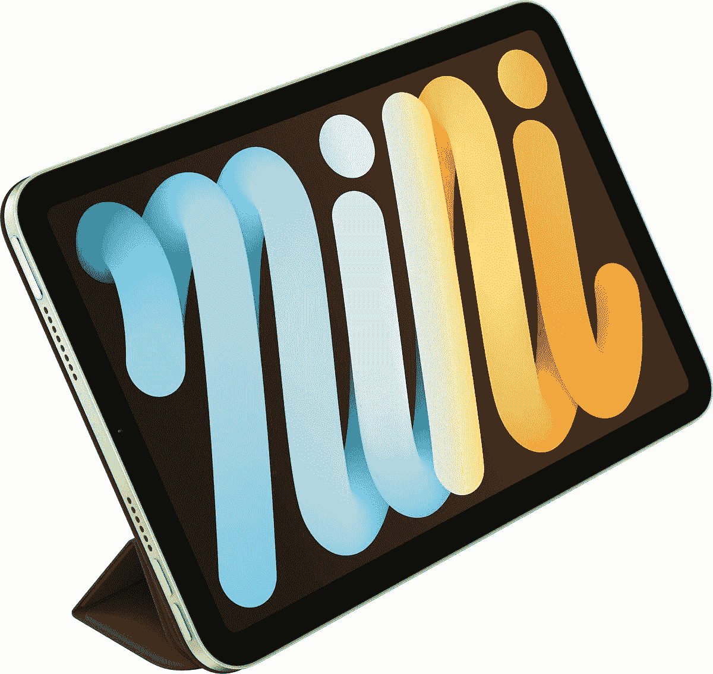
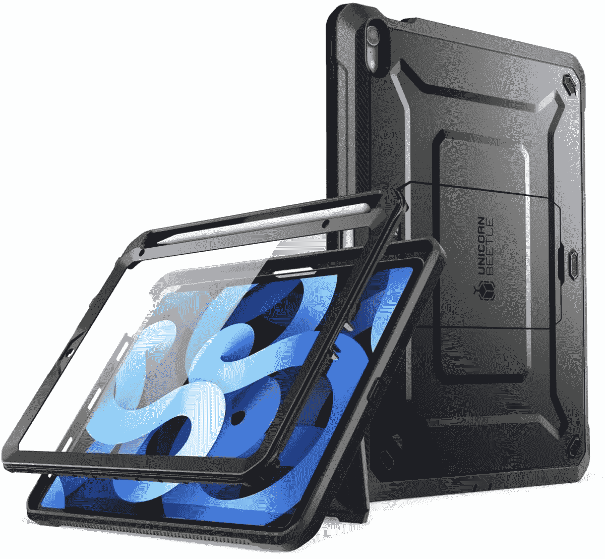
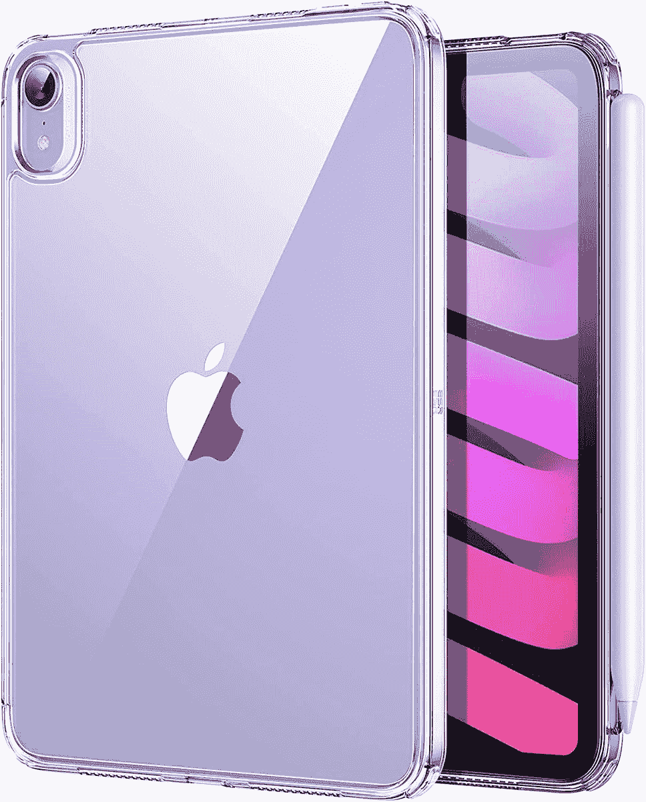
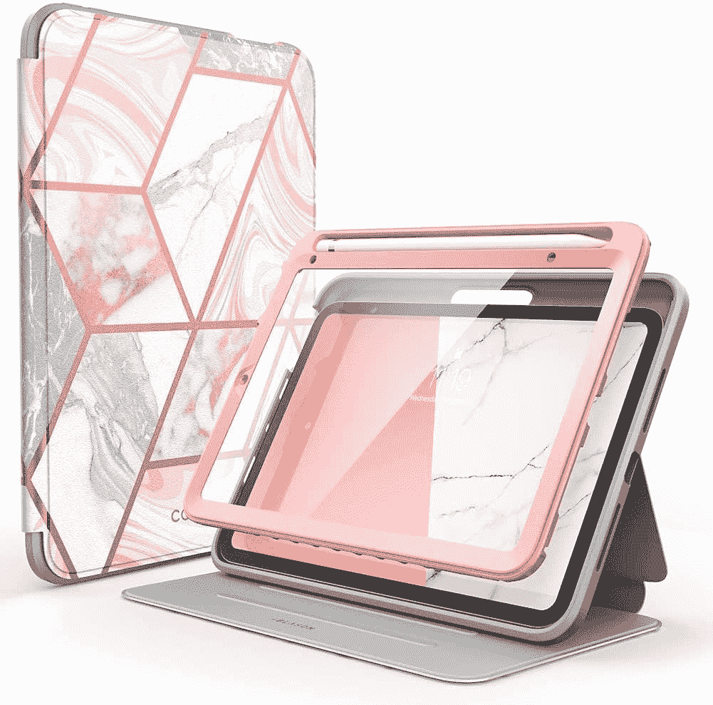
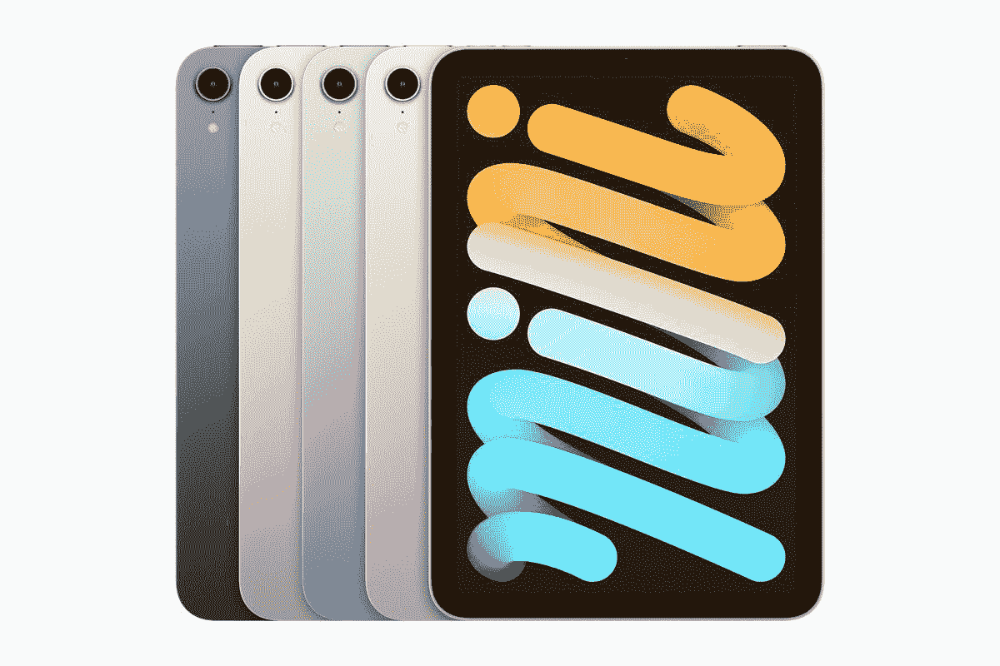

# 2023 年最佳苹果 iPad Mini 6 (2021)保护套

> 原文：<https://www.xda-developers.com/best-ipad-mini-6-cases/>

苹果在 2021 年的加州流媒体活动上发布了 iPad Mini 6 和 iPhone 13 以及 iPad 9。这款 iPad Mini 除了[新颜色](https://www.xda-developers.com/ipad-mini-6-colors/)之外，还受到了新款 iPad Pro 型号的启发，进行了彻底的重新设计。它没有物理主页按钮，并将触控 ID 扫描仪移到电源按钮。如果你还没有买，一定要看看[最好的 iPad Mini 6 交易](https://www.xda-developers.com/best-ipad-mini-6-deals/)。一个紧凑而强大的平板电脑值得保持像你买它的那天一样闪亮。划痕和裂缝只会破坏它干净的美感。因此，我们为您整理了一份最佳 iPad Mini 6 保护套列表，以帮助您将潜在事故中的损失降至最低。

其中一些外壳，如坚固的外壳，可以防止更多的损坏，而其他外壳则提供较弱的保护，以保持简约、干净的设计。你为了另一方面而牺牲什么，取决于你自己。然而，在我们下面列出的一些例子中，你应该能够找到这两个特征之间的平衡。最终，不管它有多轻，有一个保护套总比没有任何形式的保护要好得多。

*   <picture></picture>

    苹果智能对开本保护套

    ##### 苹果智能对开本 iPad Mini (2021)保护套

    有四种不同颜色可供挑选，这款苹果官方智能对开本将保护你的 iPad Mini 6，同时还提供支架模式和自动显示睡眠/唤醒支持。

*   ##### 托罗皮革 iPad Mini (2021)外壳

    如果你正在为你的 iPad Mini 6 寻找一个真皮外壳，这个选项就是你要找的。它有四种不同的颜色可供选择，具有支架模式，支持 Apple Pencil 2，并兼容自动唤醒/睡眠显示功能。

    T34
*   ##### Arteck iPad Mini (2021)外壳

    如果你正在寻找一个键盘外壳，那么 Arteck 的这个选项就是你要挑选的。它可以无线连接到你的 iPad Mini 6，可以提供长达 100 小时的使用时间。令人期待的是，它还可以兼作支架，你可以随时完全拆卸键盘。

*   <picture></picture>

    SUPCASE 独角兽甲壳虫 Pro 系列保护套

    ##### sup Case UB Pro iPad Mini(2021)保护套

    这款来自 sup Case 的坚固保护套带有内置屏幕保护器，所以你的 iPad Mini 6 在 360 级别上更安全。

*   <picture></picture>

    ESR Hybrid Case

    ##### ESR Hybrid iPad Mini(2021)Case

    这款来自 ESR 的经济实惠的 Case 保护你的新 iPad Mini 6 而不打乱你的预算。它纤薄、坚硬、透明，让你的高端 iPad 的标志性设计备受瞩目。

*   <picture></picture>

    i-Blason Cosmo 表壳

    ##### I-Blason Cosmo iPad Mini(2021)表壳

    这款来自 I-Blason 的三折表有两种精致的图案——大理石和海洋。它有一个保护性的前盖，内置屏幕保护器，可以防止划伤，而不会影响灵敏度。

就个人而言，如果我必须为我的 iPad Mini 6 选择其中一个外壳，我会选择 [ESR 混合外壳](https://www.amazon.com/ESR-Hybrid-iPad-Mini-8-3-2021-Clear-iPad-Mini-6th-Generation/dp/B099RZ72N5/?tag=xda-duprbb8-20&ascsubtag=UUxdaUeUpU5267&asc_refurl=https%3A%2F%2Fwww.xda-developers.com%2Fbest-ipad-mini-6-cases%2F&asc_campaign=Commerce)。我喜欢它看起来很简单。它的透明性使它几乎看不见，同时为我的新设备提供基本保护。因此，iPad 保持在前面和中间，由于它是防震的，潜在的跌落不会造成太大的损害。

如果你想要一个键盘套或者对一个[独立蓝牙键盘感兴趣，请看看我们的推荐。](https://www.xda-developers.com/best-ipad-mini-6-keyboards)

 <picture></picture> 

Apple iPad Mini 6th Gen

##### 苹果 iPad Mini (2021 年)

iPad Mini 6 是苹果公司的 2021 款紧凑型 iPad。它由 A15 仿生芯片驱动，支持 Apple Pencil 2。

*你已经买了一台 iPad Mini 6，或者正在考虑买一台？你有没有去找我们推荐的病例？为什么或为什么不？请在下面的评论区告诉我们。*