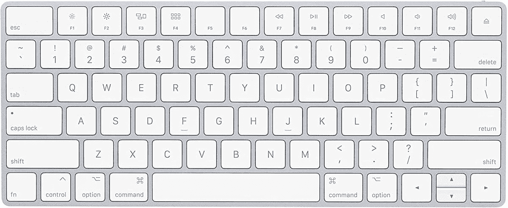
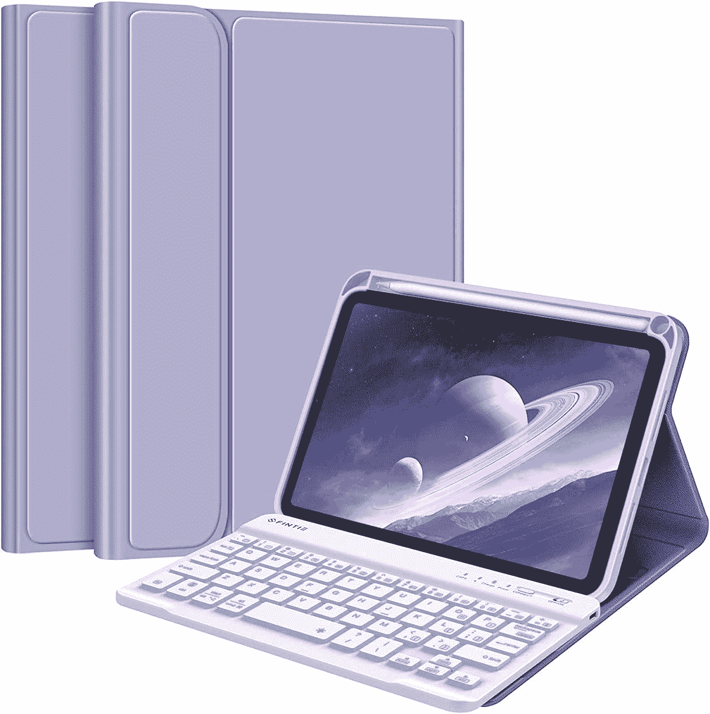
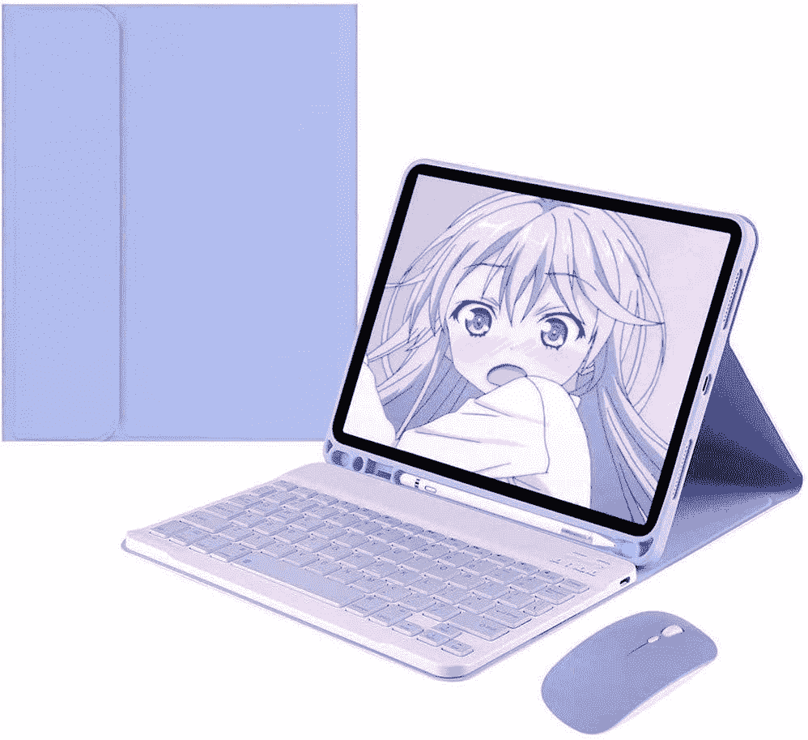

# 2023 年最佳苹果 iPad Mini 6 键盘和键盘套

> 原文：<https://www.xda-developers.com/best-ipad-mini-6-keyboards/>

# 2023 年最佳苹果 iPad Mini 6 键盘和键盘套

iPadOS 原生支持外部键盘输入。在这里，您可以找到适用于 iPad Mini 6 的最佳键盘保护套和独立键盘。

iPad Mini 6 是目前 T2 最好的 iPad 之一。它结构紧凑、功能强大、外观现代。由于其微型设计，您可以轻松地将它随身携带。然而，考虑到它的尺寸，在它上面工作可能是一个挑战，因为内置的软件键盘占据了大约一半的屏幕。幸运的是，这个问题有一个解决方案。依靠外部键盘，你可以利用 8.3 英寸的显示屏，而不必为 iPadOS 键盘牺牲很大一部分。下面你可以找到一些最好的外置独立蓝牙键盘，以及集成键盘的机箱，一举两得。

## 最佳 iPad Mini 6 蓝牙键盘

*   ##### 雷蛇黑寡妇 V3 Mini HyperSpeed

    如果你正在寻找一个 RBG 背光键盘，这款雷蛇 one 是一个绝佳的选择。它一次充电可提供长达 200 小时的电池续航时间，并提供三种不同的连接模式。因此，你可以依靠蓝牙在 iPad 上打字，然后在游戏电脑上使用时切换到 HyperSpeed Wireless 或 USB-C，以提高可靠性。

*   <picture></picture>

    罗技 MX 键迷你极简无线照明键盘

    ##### 罗技 MX 键迷你

    这款来自罗技的金属键盘拥有指尖形状的按键，因此打字感觉更加自然。当您的手靠近背光按键时，背光按键会自动亮起，并且灯光会根据您的环境进行调整。

*   <picture></picture>

    苹果魔法键盘(无线，可充电)

    ##### 苹果魔法键盘

    这是苹果官方的魔法键盘。它有一个优质的构造，当与 iPad 配合使用时，效果非常好。它提供了苹果著名的超薄、极简设计。它还包括一个通过 Lightning 转 USB 电缆的可充电电池。

*   <picture></picture>

    Arteck 超薄蓝牙键盘

    ##### arte CK 超薄蓝牙键盘

    这款来自 arte CK 的优雅键盘以实惠的价格提供了体面的功能。它有两种颜色可供选择，电池续航时间长，因此您无需担心日常使用数周后电量耗尽。

*   <picture></picture>

    带数字小键盘的苹果魔法键盘

    ##### 带数字小键盘的苹果魔法键盘

    如果你需要更多的魔法键盘，这款还提供了一个数字小键盘。对于那些喜欢使用大键盘的人来说，这款键盘是适合你的。它与其他魔法键盘具有相同的高级构造，还包括一个可充电电池。

*   <picture></picture>

    OMOTON 无线蓝牙背光键盘

    ##### OMOTON 无线蓝牙背光键盘

    这款无线键盘提供了七种背光颜色，你可以切换到符合自己心情的颜色。它很薄，很轻，包括一个剪刀机制，更容易打字。在键盘的底部，有四个橡胶脚来防止它滑动。

## 最佳键盘套

*   ##### Arteck iPad Mini (2021)外壳

    如果你正在寻找一个键盘外壳，那么 Arteck 的这个选项就是你要挑选的。它可以无线连接到你的 iPad Mini 6，可以提供长达 100 小时的使用时间。令人期待的是，它还可以兼作支架，你可以随时完全拆卸键盘。

*   <picture></picture>

    fin tie 键盘套

    ##### fin tie 键盘套

    这款来自有限公司的软壳有七种不同的鲜艳图案——包括玫瑰金、星光、大理石等等。无线键盘还可以通过磁性机构拆卸，并且可以独立使用。

*   <picture></picture>

    安梦欣灵带鼠标键盘套

    ##### 安梦欣灵 iPad Mini (2021)键盘套

    这款键盘套自带蓝牙鼠标。iPadOS 引入了鼠标和指针支持，因此这款键盘外壳和鼠标组合让您离笔记本电脑的替代品更近了一步。

就个人而言，如果我必须选择上面列出的产品之一，我会选择没有数字键盘的[苹果魔法键盘](https://www.amazon.com/Apple-Keyboard-Wireless-Rechargable-English/dp/B016QO64FI?tag=xda-3c9lb92-20&ascsubtag=UUxdaUeUpU132&asc_refurl=https%3A%2F%2Fwww.xda-developers.com%2Fbest-ipad-mini-6-keyboards%2F&asc_campaign=Commerce)。我喜欢它的极简设计，它提供了与 iPadOS 的完美集成，并且它可以用我用于 iPhone 的同一根电缆充电。此外，构建质量是可信的和有保证的。

如果你决定买一个蓝牙键盘，而不是键盘套，你可能想看看我们的[iPad Mini 6](https://www.xda-developers.com/best-ipad-mini-6-cases)系列的最佳保护套。毕竟，iPads 是脆弱的玻璃板，如果没有适当的保护，它们很容易被划伤。因此，虽然一个保护套不能完全保护你的 iPad，但它仍然可以将潜在的损害降到最低。无论你是在寻找正式的还是休闲的，多彩的还是单调的，总有一款适合你！

 <picture></picture> 

Apple iPad Mini 6th Gen

##### 苹果 iPad Mini (2021 年)

iPad Mini 6 是苹果公司的 2021 款紧凑型 iPad。它由 A15 仿生芯片驱动，支持 Apple Pencil 2。