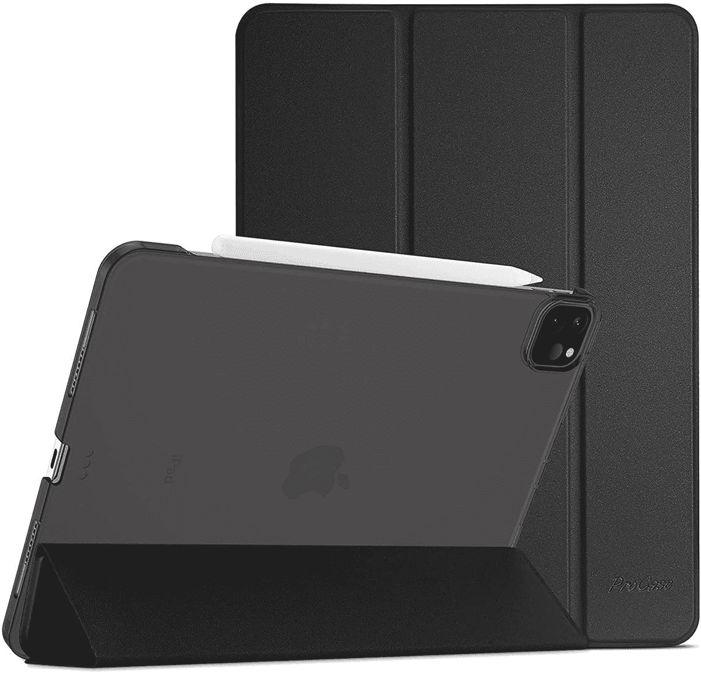
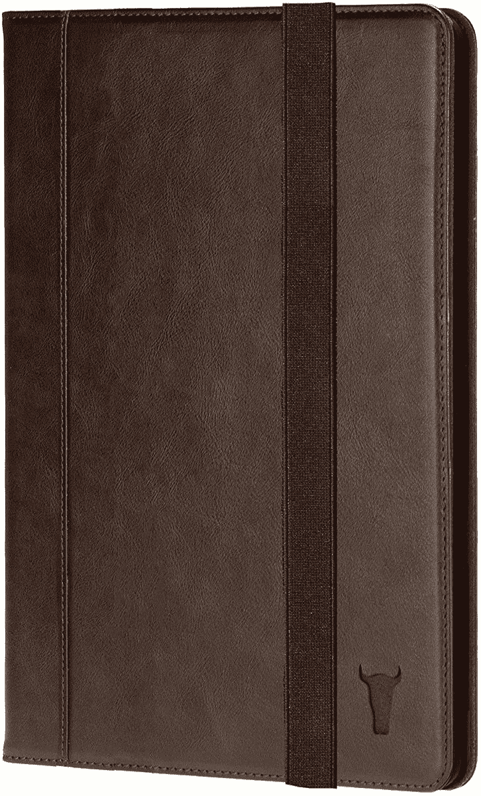
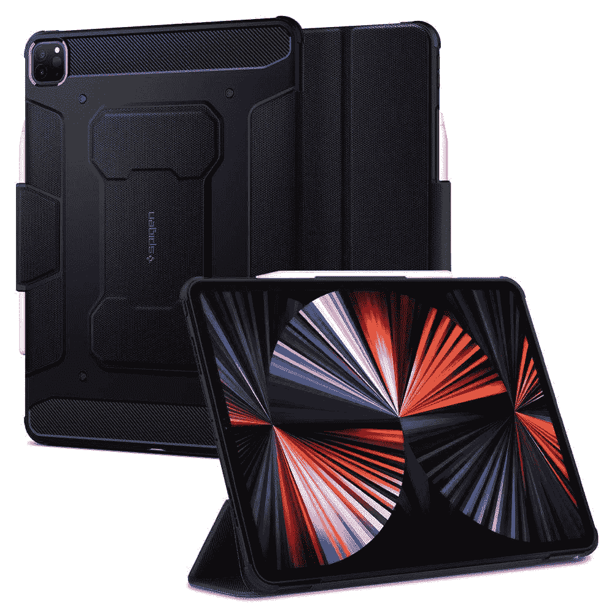

# 2023 年最佳 12.9 英寸 iPad Pro 保护套

> 原文：<https://www.xda-developers.com/best-ipad-pro-cases/>

# 2023 年最佳 12.9 英寸 iPad Pro 保护套

如果你花费超过 1000 美元购买这款平板电脑，你会想要保护它。以下是最好的 iPad Pro 保护套。

2022 年末，苹果在 T2 推出了 11 英寸和 12.9 英寸的 [M2 驱动的 iPad Pro](https://www.xda-developers.com/best-apple-ipad-pro-deals/) 。这一次，除了将芯片从 M1 搬到 M2，并引入了一个 [Apple Pencil](https://www.xda-developers.com/apple-pencil-2-isnt-magic-wand-editorial/) 悬停功能，该公司没有太大变化。除了这些调整，这款平板电脑保留了其前身几乎所有的技术规格。这意味着尺寸是相同的，因此为 [2021 款](https://www.xda-developers.com/ipad-pro-2021-review/)设计的表壳将完美适用于 2022 款，反之亦然。考虑到它的高昂价格，你真的应该投资一箱。否则，一滴就可能让你损失数百美元的修理费。为了简化这个过程，我们挑选了一些目前最好的 12.9 英寸 iPad Pro 保护套。

## M2 M1 最佳 12.9 英寸 iPad Pro 保护套

*   ##### Ztotop iPad Pro 12.9 英寸(2022)保护套

    如果你正在寻找一个多用途的选择，这款保护套提供了全面的保护、支架模式、口袋、皮革构造、四种不同的颜色可供选择等等。它看起来很专业，价格也很合理。

*   ##### fin tie iPad Pro 12.9 英寸(2022)外壳

    如果你正在寻找宇宙、闪亮和充满活力的东西，这款外壳提供了 18 种不同的时尚图案和颜色，为原本沉闷的 iPad Pro 增添了个性。它包括支架模式、Apple Pencil 2 支架、自动唤醒/睡眠显示支持等等。

*   ##### 巴姆比诺 iPad Pro 12.9 英寸(2022)案例

    很多人会认为给一个蹒跚学步的孩子最高端的苹果平板电脑是一个错误。然而，如果你坚持这样做，这种情况下提供了一种抗震构造，可以保护你的 iPad Pro 免受潜在的损坏。它还配有手柄、Apple Pencil 2 支架、肩带、支架模式等。

*   <picture></picture>

    iPad Pro 2021 年 12.9 英寸

    ##### 苹果 iPad Pro 12.9 英寸(2021 年)魔法键盘

    苹果魔法键盘是专门用来挂载 12.9 英寸 iPad Pro 的。它提供了一个流体键盘，保护，支架模式和 USB Type-C 端口。

*   <picture></picture>

    ProCase 智能保护套

    ##### ProCase 智能 iPad Pro 12.9 英寸(2021)外壳

    iPad Pro 12.9 的 ProCase 智能保护套采用半透明磨砂后壳和磁性智能保护套，保护您的平板电脑。smart cover 还可以兼作支架，让您不用手就能欣赏视频。它有四种颜色可供选择。

*   <picture></picture>

    罗技超薄对开本

    ##### 罗技超薄对开本 iPad Pro 12.9 英寸(2021)键盘套

    罗技提供了一种轻薄的键盘套，仍然提供了实质性的保护和可用性。充电和存放 Apple pencil 的便利选项使这款保护套成为移动用户的绝佳选择。

*   <picture></picture>

    Torro 平板电脑保护套

    ##### Torro 皮质 iPad Pro 12.9 英寸(2021)保护套

    如果你想要一个皮质保护套给你的 iPad Pro，这款来自 Torro 的保护套是一个绝佳的选择。它由真皮制成，覆盖了整个设备。这个箱子也可以作为一个支架。

*   <picture></picture>

    Spigen 坚固装甲

    ##### Spigen 坚固装甲 iPad Pro 12.9 英寸(2021)外壳

    采用碳纤维细节和减震层的圆滑设计，Spigen 坚固装甲随时准备迎接日常生活中的不幸。

*   <picture></picture>

    Ringke Fusion Plus

    ##### Ringke Fusion iPad Pro 12.9 英寸(2021 年)保护套

    Ringke Fusion Plus 保护套带有双气囊技术框架，承诺提供比普通保护套两倍的保护。它由 TPU 制成，包括一个苹果笔筒。此外，有挂绳孔，以连接手带或颈带。

就我个人而言，如果我必须从这些 iPad Pro 12.9 英寸的外壳中选择一个，我会选择苹果 Magic Keyboard。它很简约，提供了触控板和键盘，以及 USB Type-C 端口。我每天花几个小时打字，我的 iPad 一直放在我的桌子上。所以这个案子在我的特殊情况下最有意义。

##### 苹果 iPad Pro 12.9 英寸(2022 年)

2022 年 M2 驱动的 iPad Pro 不仅拥有平板电脑中最强大的芯片，还拥有华丽的迷你 LED 面板，变得明亮而大胆。

你打算为你的新 iPad Pro 12.9 买哪个外壳？请在下面的评论区告诉我们。