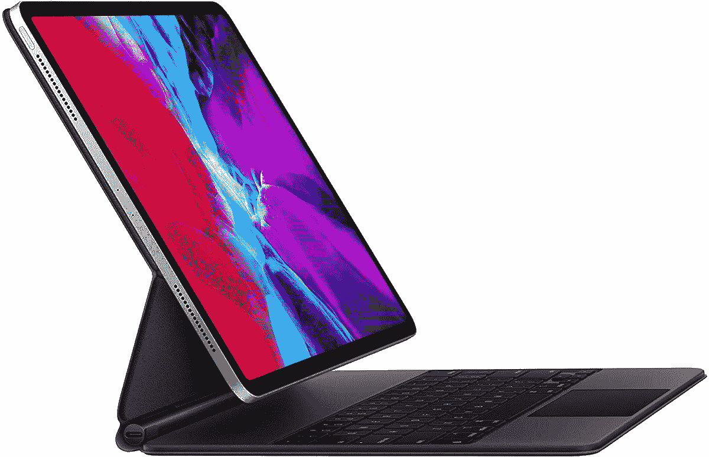
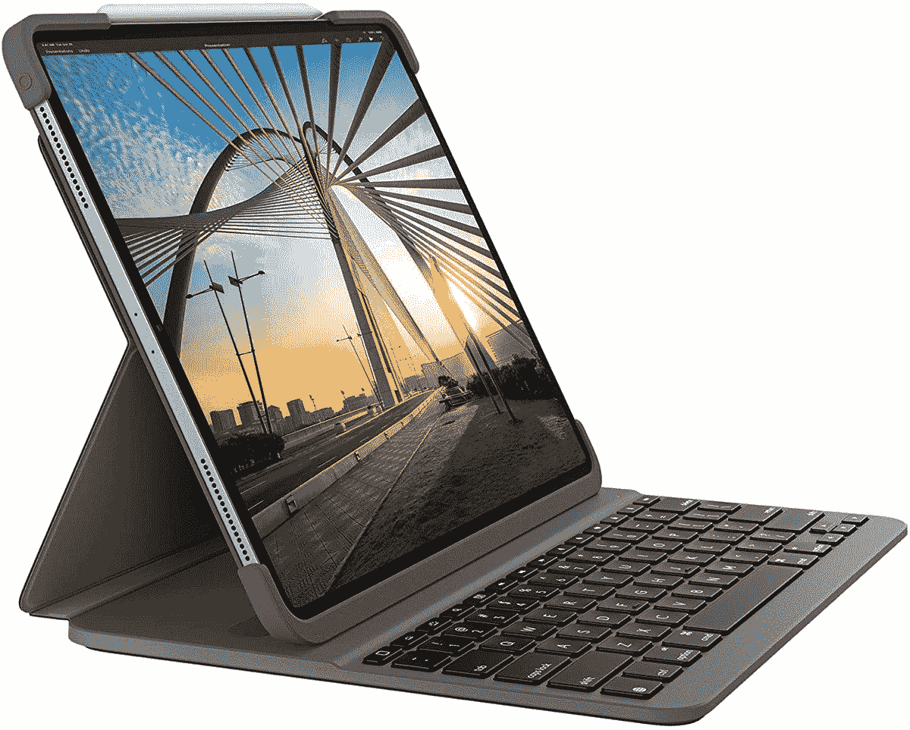
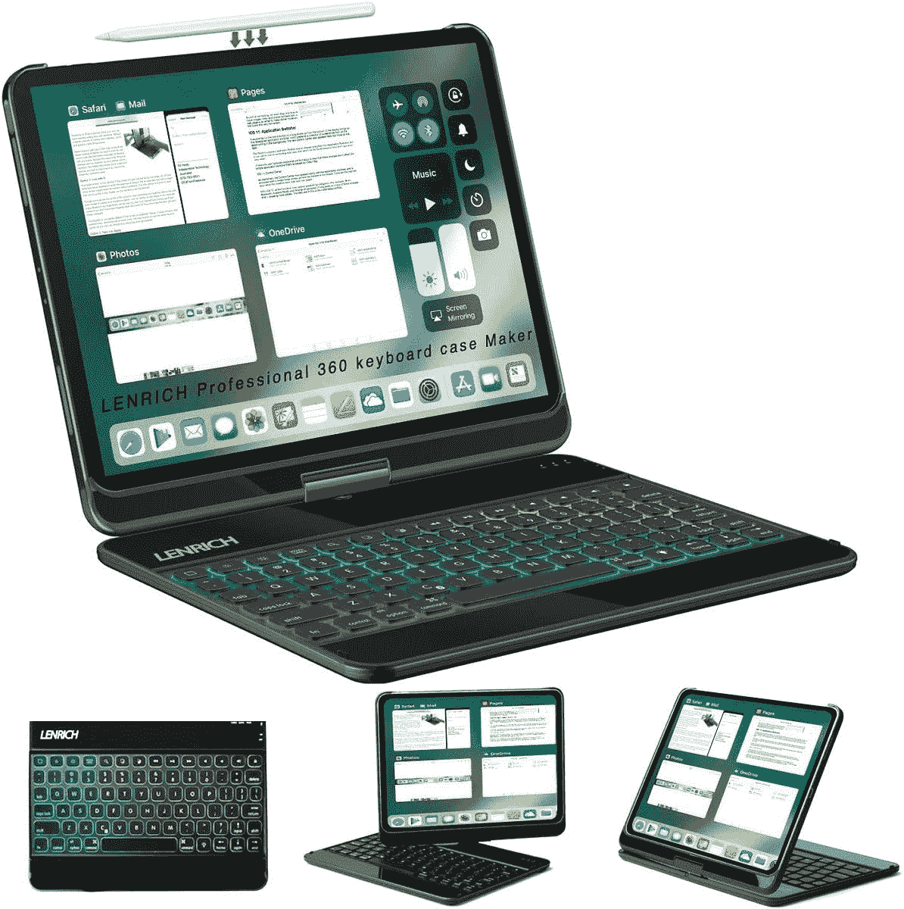
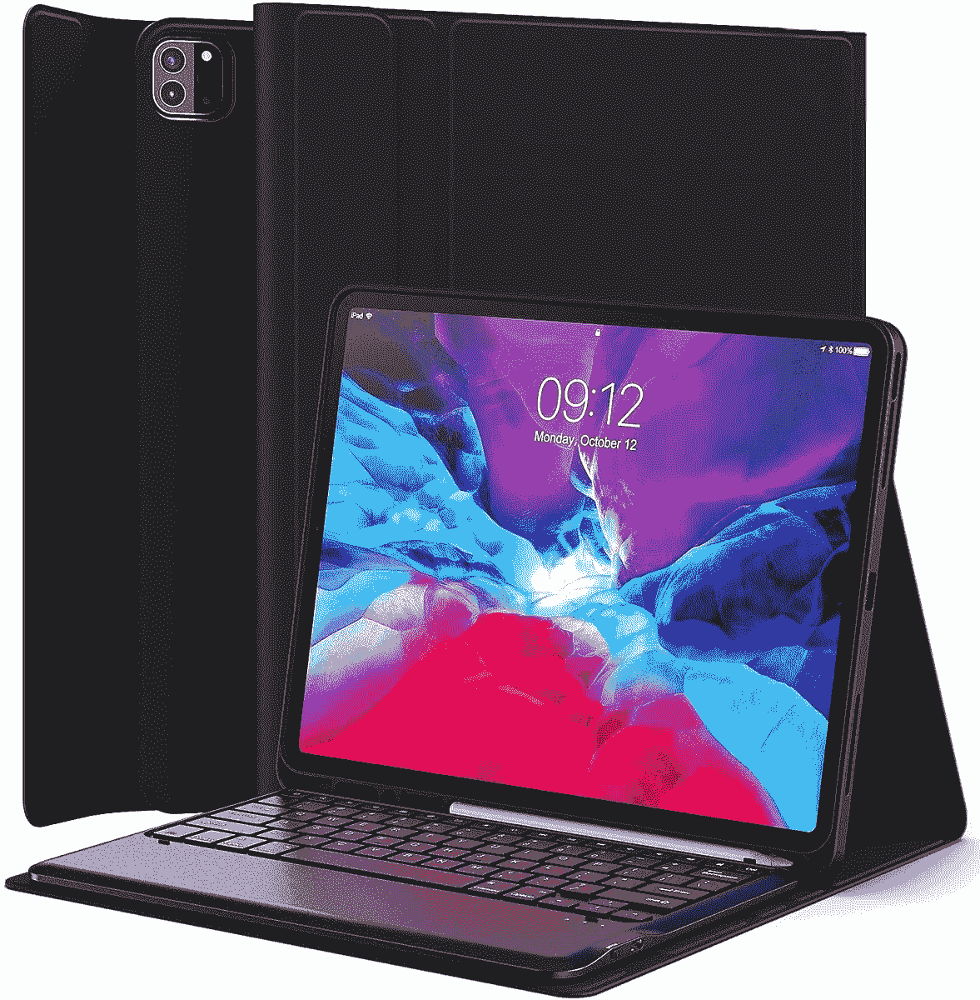
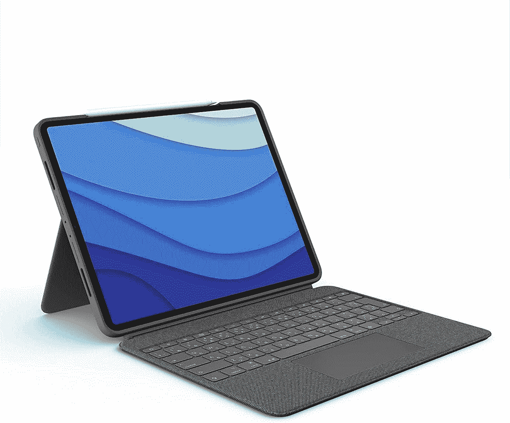
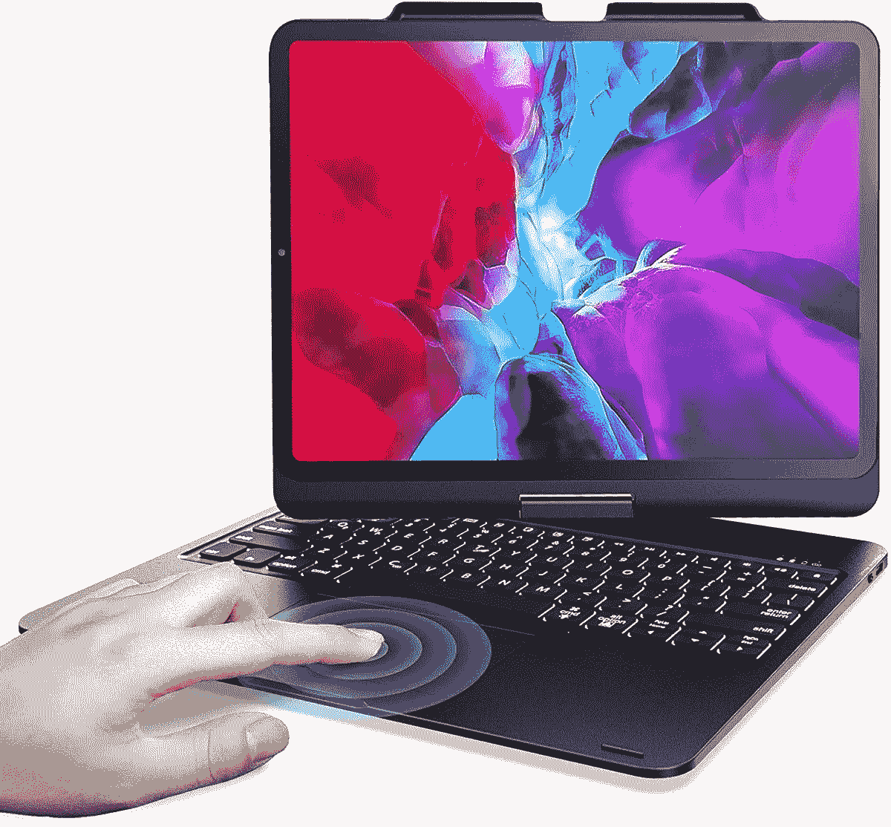
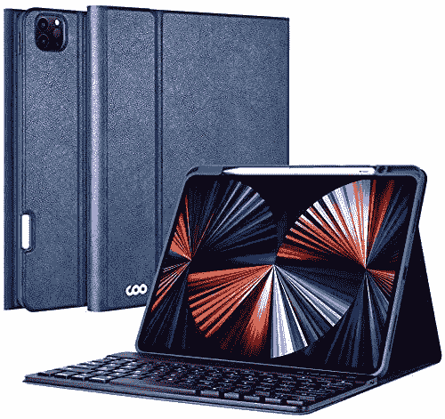
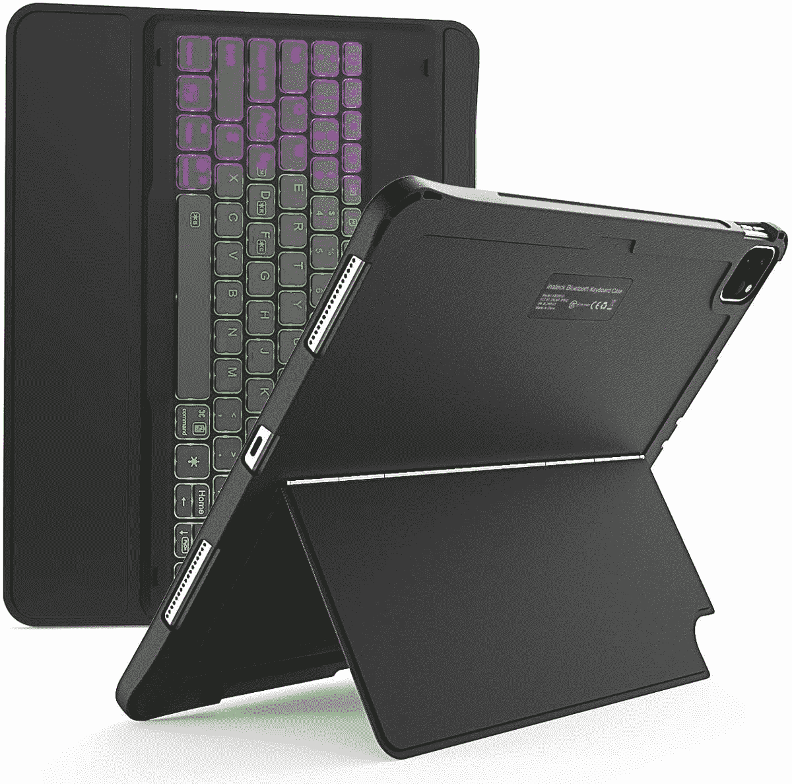

# 12.9 英寸 iPad Pro 2021 最佳键盘套:苹果、罗技等等！

> 原文：<https://www.xda-developers.com/best-ipad-pro-keyboard-cases/>

# 这些是 12.9 英寸 iPad Pro 2021 的最佳键盘套:苹果，罗技，等等！

这是 12.9 英寸 iPad Pro 最佳键盘套的综述，包括各种预算的选项。总结了每个案例的特点。

新的 12.9 英寸[苹果 iPad Pro](https://www.xda-developers.com/ipad-pro/) 无疑是生产力的最佳平板电脑。为了充分利用这款功能强大的平板电脑所提供的一切，您需要将它与键盘外壳配合使用。将 12.9 英寸 iPad Pro 与键盘套配对，可以将您的平板电脑变成移动工作站。在亚马逊上的数百个选项中进行排序可能是一项艰巨的任务，有许多不同功能集的选择。在这篇文章中，我们介绍了一些最好的键盘外壳，并强调了重要的利弊。

请注意，目前型号为 12.9 英寸的 iPad Pro 是该设备的第 5 代。在下面的一些列表中，你会注意到一些品牌还没有更新他们的新一代产品。如果你拥有上一代 iPad Pro，你可以从亚马逊的选项列表中选择正确的型号。同样值得注意的是，第四代和第五代车型的尺寸并不完全相同。虽然你的第四代保护套可能适合新的 iPad Pro，但几乎可以肯定，这种适合度不会那么理想。如果你想升级，一定要[看看我们对新款 iPad Pro](https://www.xda-developers.com/ipad-pro-2021-review/) 的评测。

 <picture></picture> 

Apple Magic Keyboard

##### 苹果魔法键盘

对于苹果的忠实用户来说，这是一个很好的例子。神奇的键盘提供了一流的打字体验。浮动悬臂设计增加了一种风格元素，这是苹果品牌的标志。

 <picture></picture> 

Logitech SLIM FOLIO

##### 罗技超薄对开 iPad Pro 12.9 英寸(2021)键盘套

罗技提供了一个轻薄的键盘外壳，仍然提供了实质性的保护和可用性。充电和存放 Apple pencil 的便利选项使这款保护套成为移动用户的绝佳选择。

 <picture></picture> 

LENRICH Case with Backlighting

##### Lenrich iPad Pro 12.9 英寸(2021)键盘套

这款 iPad Pro 键盘保护套提供了几个独特的功能。除了 360 度旋转功能，您还可以获得 RGB 背光按键。将所有这些放在一起，加上一个可承受的价格标签，您就有了一个赢家。

 <picture></picture> 

Levet Keyboard Case

##### Levet iPad Pro 12.9 英寸(2021)外壳

Levet 键盘保护套提供了强大的跌落保护，并且价格合理。这是我们列表中为数不多的价格低于 50 美元的箱子之一，如果你想在预算范围内获得高质量的产品，请选择这款。

 <picture></picture> 

Logitech Combo Touch

##### 罗技 Combo Touch iPad Pro 12.9 英寸(2021)外壳

罗技公司的这款新产品是专为第五代 iPad Pro 设计的。它提供了一个可拆卸的键盘和一个方便的点击式触控板。这个箱子有点贵，但物有所值。

 <picture></picture> 

KOOWIEN Keyboard Case

##### Koowien iPad Pro 12.9 英寸(2021)键盘套

KOOWIEN 提供了列表中其他案例中的几个功能，但有更多的颜色选择。如果你想要一个 360 度旋转，背光按键和时尚的设计，那么这就是你的情况。

 <picture></picture> 

COO Keyboard Case

##### Coo iPad Pro 12.9 英寸(2021)键盘套

如果电池寿命是你日常工作流程中的一个问题，首席运营官提供了一个很好的解决方案。这款保护套内置可充电电池，电池续航时间长。

 <picture></picture> 

Inateck keyboard case

##### Inatek iPad Pro 12.9 英寸(2021)键盘外壳

如果你在工作中不断改变 iPad 的方向，这款平板电脑是一个很好的选择。Inateck 键盘盒提供了一个非常灵活和稳定的支架。此外，该保护套还提供 RGB 背光按键。

 <picture></picture> 

HOTLIFE keyboard case

##### Hotlife iPad Pro 12.9 英寸(2021)键盘套

这个箱子的价格是我们单子上最低的。虽然价格低于 45 美元，但你还可以获得可拆卸键盘和坚固的跌落保护。

有这么多选项可供选择，你的 iPad Pro 键盘保护套偏好将取决于你个人的可用性目标和预算。罗技的超薄对开本(T1)和组合触摸(T3)提供了高级选项。如果你想直接从苹果获得第一方体验，你可以使用[魔法键盘](https://www.amazon.com/Magic-Keyboard-12-9-inch-iPad-Generation/dp/B0863F794B/?tag=xda-5ikpm8a-20&ascsubtag=UUxdaUeUpU3543&asc_refurl=https%3A%2F%2Fwww.xda-developers.com%2Fbest-ipad-pro-keyboard-cases%2F&asc_campaign=Short-Term)。为了看起来更炫，你可以从 LENRICH 或 Inateck 挑选一个带有 RGB 背光的表壳。

如果预算是你决策中最重要的因素，那就看看《HOTLIFE》和《T2 Levet》的高质量案例吧。当然，完全有可能键盘套不是你想要的。如果你想找一个不带键盘的 12.9 英寸 iPad Pro 保护套，在我们的购买指南中有很多选项可以选择[最好的 12.9 英寸 iPad Pro 保护套](https://www.xda-developers.com/best-ipad-pro-cases/)。

 <picture></picture> 

12.9-inch iPad Pro

##### 苹果 iPad Pro 12.9 英寸(2021 年)

新的 12.9 英寸 iPad Pro 配备了迷你 LED 显示屏和强大的 M1 芯片组，高达 2TB 的存储空间，可选的 5G 和 Thunderbolt 支持。