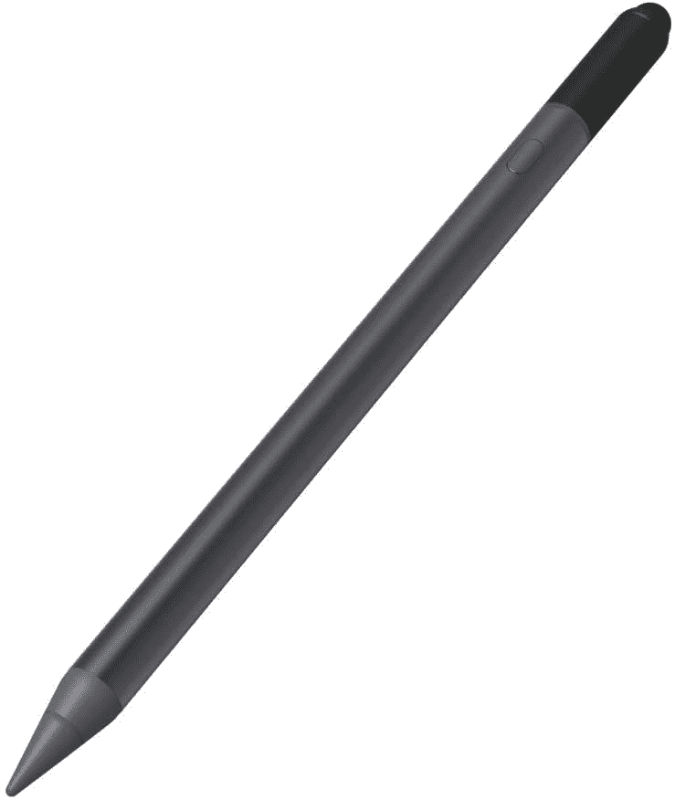
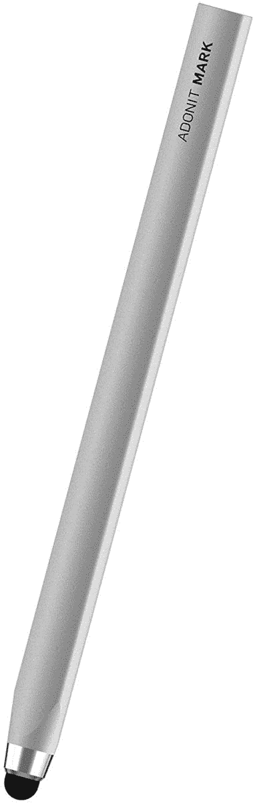
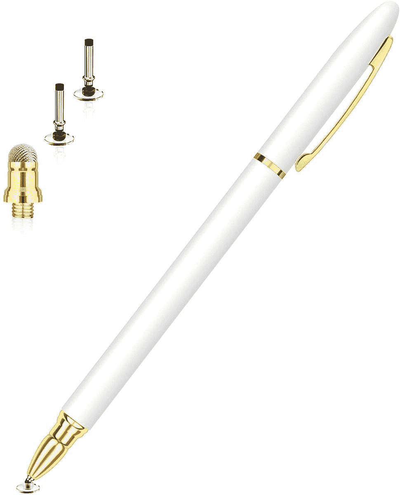
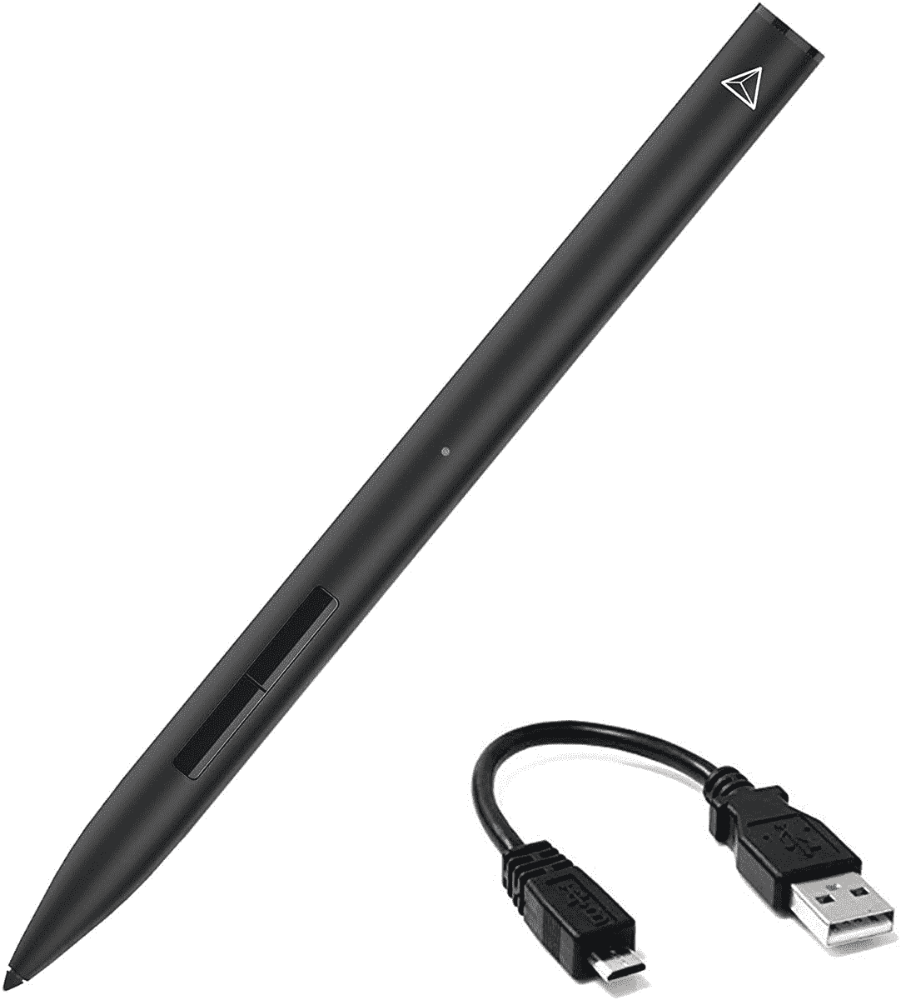
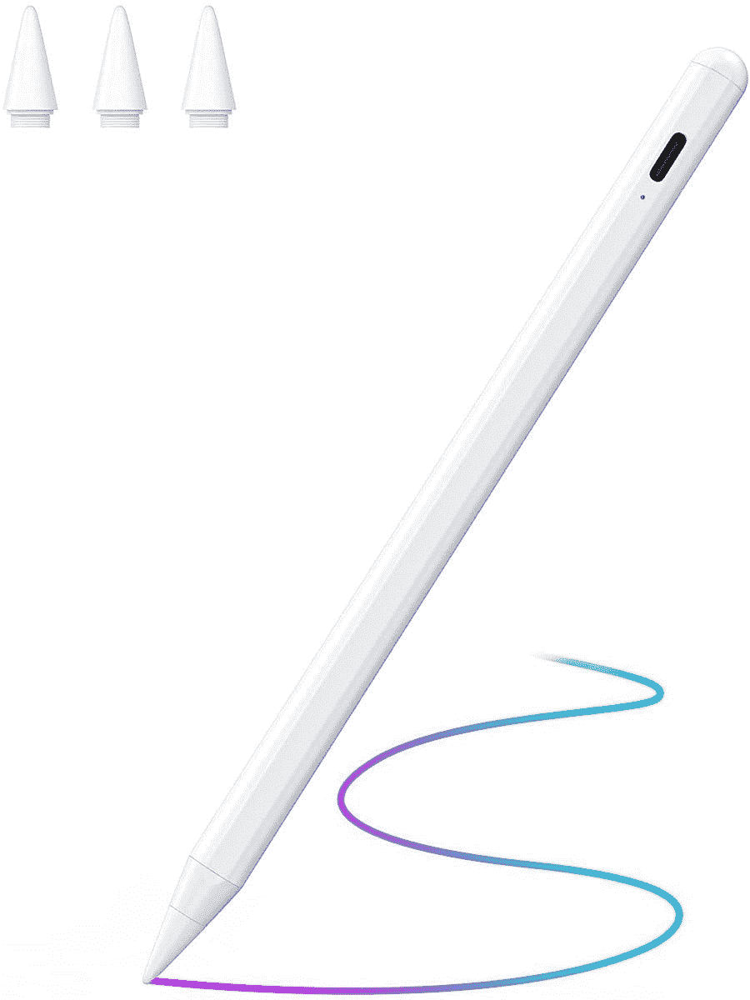
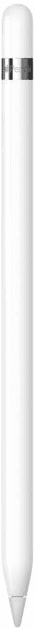
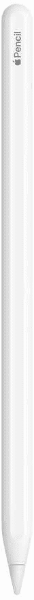
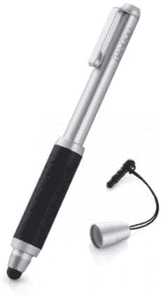

# 2023 年最佳苹果 iPad 触控笔

> 原文：<https://www.xda-developers.com/best-ipad-stylus/>

如果你喜欢画画、素描、涂鸦或者用传统方式记笔记，iPad 手写笔就能派上用场。虽然苹果公司出售其优秀的 Apple Pencil 触控笔，具有专业级的精度和压力灵敏度，但它们相当昂贵，可能不值得每个用户都这样做。因此，市场上有大量的第三方触控笔，价格从几美元到几十美元不等。当然，根据价格的不同，手写笔的功能也会发生变化，但如果你不需要 Apple Pencil 的所有功能，你可以选择更便宜的手写笔。为了帮助你为你的苹果 iPad 选择一个合适的触控笔，我们为不同的预算和用途选择了最好的 iPad 触控笔。

## 最佳 iPad 手写笔

在为您的 iPad 选择触控笔之前，请确保您的选择适用于您的 iPad 型号，因为触控笔通常支持固定数量的 iPad 型号。我们的一些建议是通用手写笔，所以你也可以在 Android 平板电脑、iPhone 和其他智能手机上使用它们。

*   <picture></picture>

    ZAGG Pro 手写笔

    ##### ZAGG Pro 手写笔

    ZAGG Pro 手写笔是新款 iPad 机型的又一选择。它适用于 2017 年以来发布的大多数 iPad。触控笔还可以磁性附着在 iPad 上，并支持大多数 Apple Pencil 应用程序。不幸的是，它还缺少压力敏感度。

*   <picture></picture>

    Adonit Mark

    ##### Adonit Mark

    如果你不需要太多的功能，比如手掌拒绝和压力敏感度，那么 Adonit Mark 是一个不错的预算选项。它不需要电池或与 iPad 配对就能工作。你可以用它来写字或画草图。

*   <picture></picture>

    Meko 二合一手写笔

    ##### Meko 二合一手写笔

    Meko 二合一手写笔是你的 iPad 的又一个不错的预算选择。它适用于任何电容式触摸屏设备，而不仅仅是 iPads。此外，您还可以选择两种吸头——用于精密工作的超薄盘式吸头和用于非精密工作的光纤吸头。

*   <picture></picture>

    Adonit Note Plus

    ##### Adonit Note Plus

    Adonit Note Plus 以明显较低的价格提供了大量 Apple Pencil 功能。你得到手掌拒绝，倾斜支持，和压力敏感性。然而，压力敏感性仅限于特定的应用程序。它通过 USB Type-C.

    充电
*   <picture></picture>

    JamJake 手写笔

    ##### JamJake 手写笔

    JamJake 手写笔相当精准，反应灵敏。它支持手掌拒绝、倾斜功能，甚至可以磁性附着在第三代 iPad Pro 上。此外，手写笔不需要配对，配有可更换的笔尖。

*   <picture></picture>

    Apple Pencil 1

    ##### Apple Pencil

    如果没有一款第三方手写笔能满足你的需求，Apple Pencil 对于 iPad、iPad Air 3、iPad Mini 5 以及老款 iPad Pro 来说是显而易见的选择。它精确、灵敏、压敏，并具有倾斜支持功能。

*   <picture></picture>

    Apple Pencil 2

    ##### Apple Pencil(第二代)

    Apple Pencil 2 适用于较新的 iPad Pro 机型、iPad Air 4 以及 iPad Mini 6 和新款机型。所以如果你喜欢画画，需要专业级的压力敏感度，没有比 Apple Pencil 2 更好的选择了。

*   <picture></picture>

    Wacom 竹制袖珍版

    ##### Wacom 竹制袖珍版

    Wacom 袖珍版可扩展版是一款通用手写笔，也适用于 iPad。它配有一个 6 毫米的尖端，并配有一个可折叠的桶，便于携带。

* * *

这些是你现在能买到的最好的 iPad 触控笔。如你所见，有几个很好的选择。如果你不想花太多钱，ZAGG Pro 手写笔非常棒。但是，如果你需要专业级的精度和压力灵敏度，没有比 Apple Pencil 更好的选择了——选择与你的 iPad 兼容的一代。最后，Adonit Mark 或 Meko 二合一设备将为经济型购买者提供良好的服务。

 <picture></picture> 

Apple iPad Air 5

##### 苹果 iPad Air (2022)

第五代 iPad Air (2022)采用苹果 M1 芯片。它首次支持 5G，并且有一系列美丽的颜色。

你打算为你的 iPad 买哪种手写笔？请在评论区告诉我们。与此同时，如果你对 iPad Pro 感兴趣，请务必查看[我们对 12.9 英寸 iPad Pro (2021)](https://www.xda-developers.com/ipad-pro-2021-review/) 的评测。我们还挑选了[最好的 iPad 型号](https://www.xda-developers.com/best-ipad/)，根据你的需求和预算来购买。