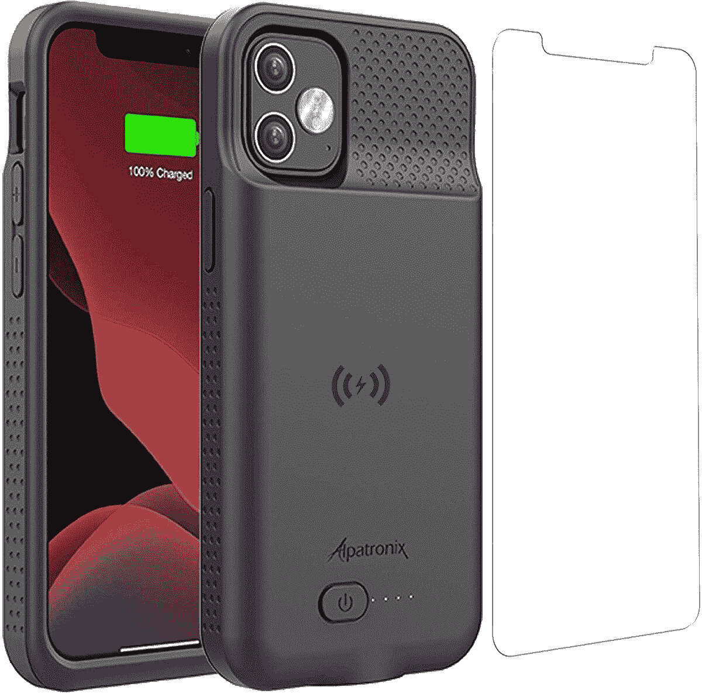
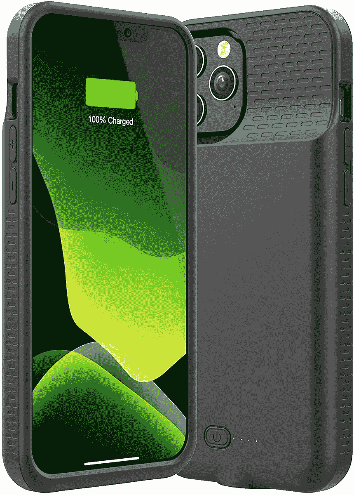
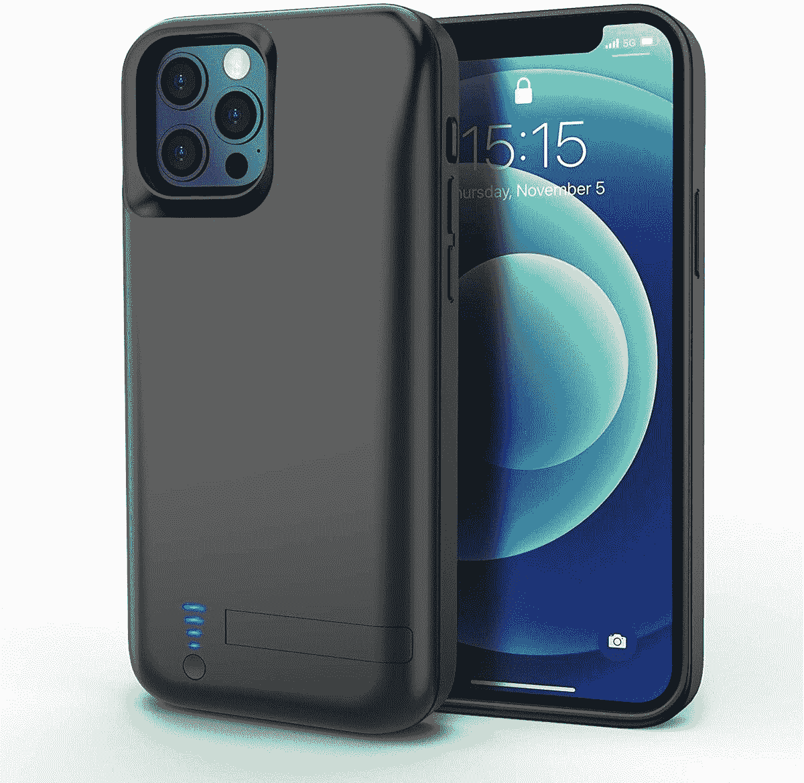
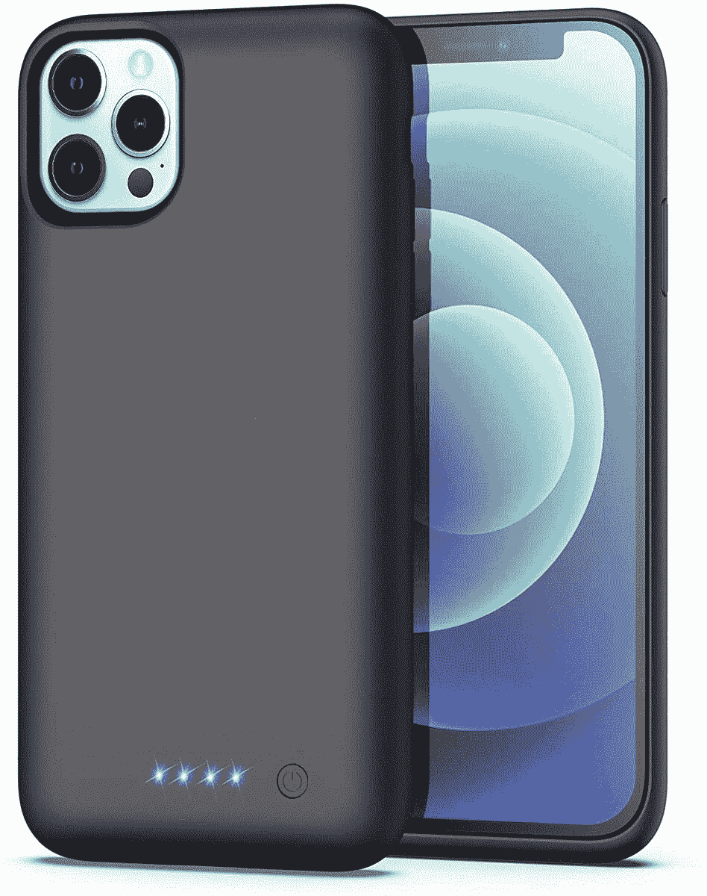
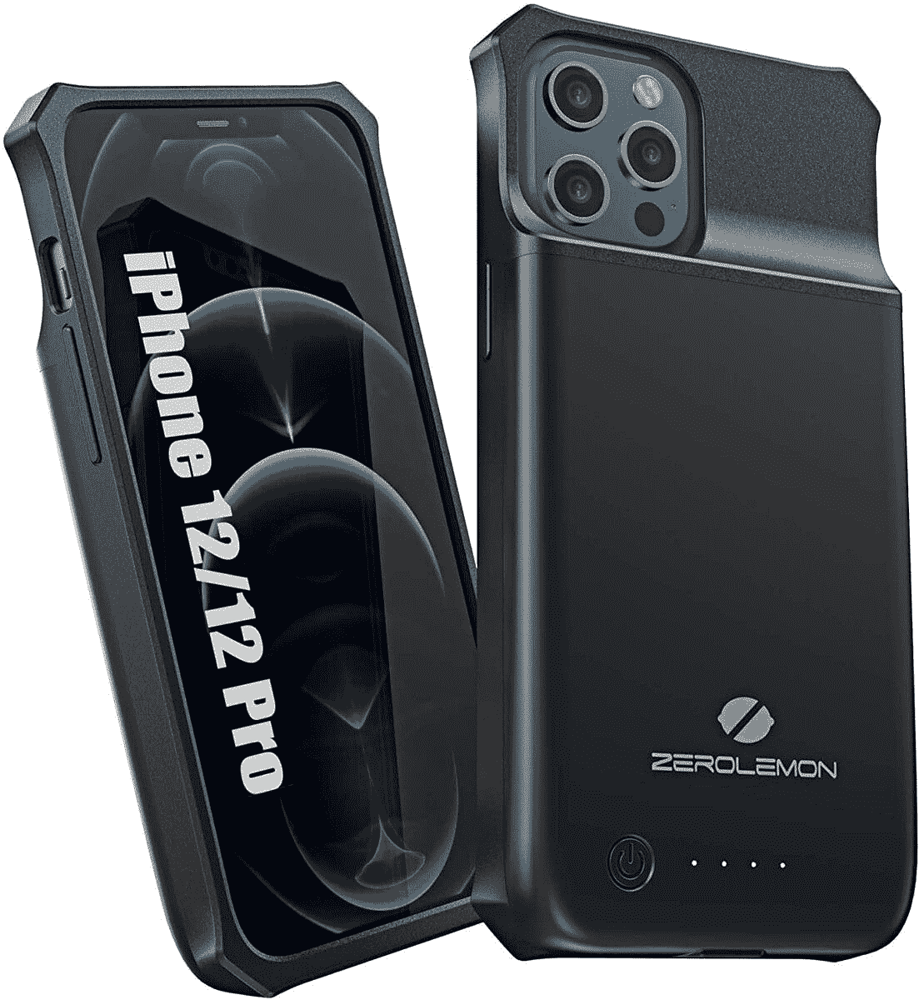
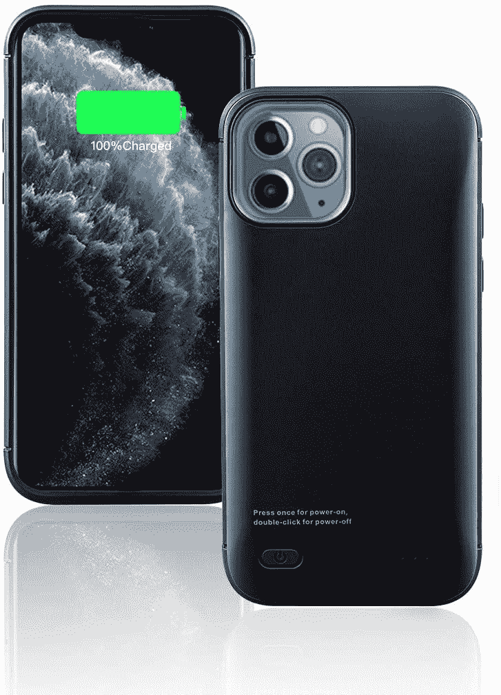
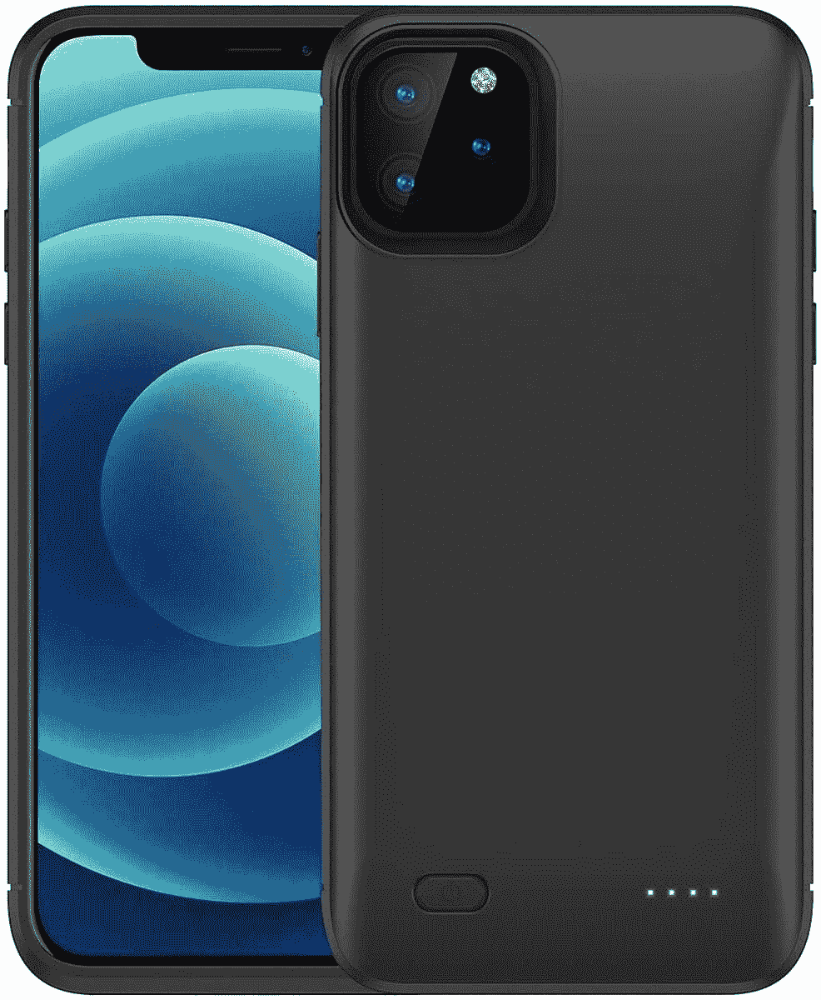
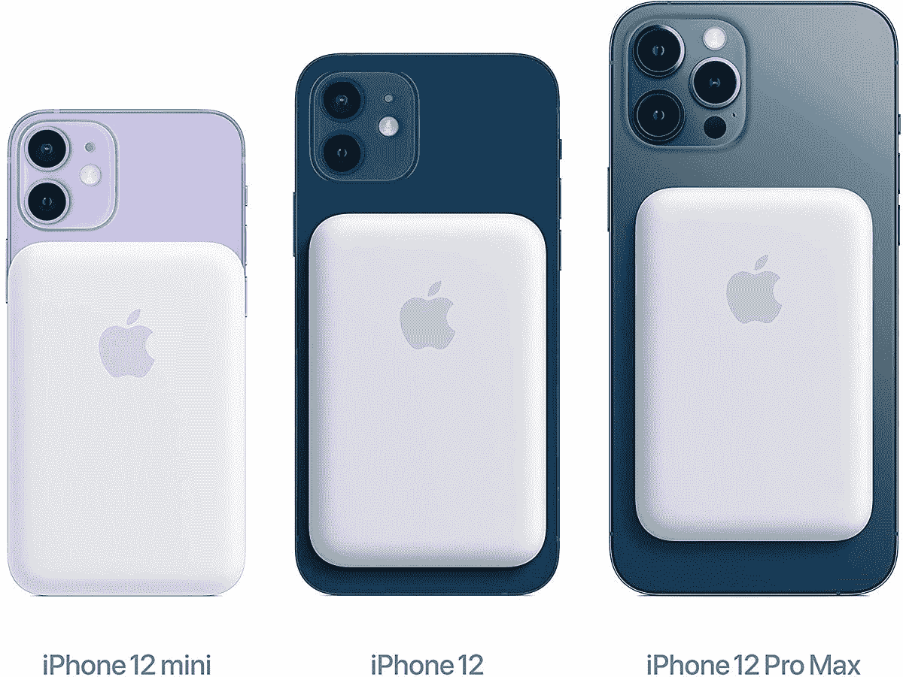

# 2023 年最佳 iPhone 12 电池盒

> 原文：<https://www.xda-developers.com/best-iphone-12-battery-cases/>

iPhone 12 的平均电池寿命是一次充电八小时。虽然许多用户可能对此非常满意，但您可能不满意——尤其是如果您是一个重度用户。如果你度过了漫长的一天，而你又不在电源插座附近，你将需要某种方式给电池充电，直到你回家。这就是为什么你需要一些额外的能量，无论是以便携式充电器的形式还是作为电池组集成在你的 T2 iPhone 外壳中。电池盒是负担得起的电池助推器，连接到你的 iPhone 上，提供几个小时的额外电力，让你继续工作。不过也有不好的一面——有些包可能会很大，阻碍无线充电，苹果 CarPlay 在某些情况下也会受到影响。

但是如果你不介意的话，这里是我们为 iPhone 12 和 iPhone 12 Pro 挑选的一些最好的电池盒。它们便宜、时尚，而且你永远不知道什么时候你会最需要它们。

 <picture></picture> 

Alpatronix

##### Alpatronix iPhone 12 电池盒

Alpatronix 脱颖而出，因为它允许无线充电(与许多其他电池组不同)。用 QI 充电器给你的手机充电，然后电池组会用同一个充电器给自己充电。

 <picture></picture> 

Allezru

##### Allezru iPhone 12 电池盒

这不支持苹果 CarPlay，但它声称可以给你延长电池寿命高达 120%。这相当于 32 小时的额外通话时间。如果你不使用 CarPlay，这将是一个顶级竞争者。

 <picture></picture> 

Zttopo

##### Zttopo iPhone 12 电池盒

Zttopo 采用 TPU 和聚碳酸酯的混合结构，配备 5000 毫安时电池，确保您在一天中永远不会没电。它还有一个支架，可以在观看内容或进行视频通话时腾出双手。

 <picture></picture> 

BOMT

##### BOMT iPhone 12 电池盒

BOMT 的电池盒配有一块 6800 毫安时的大电池，足以为你的 iPhone 充满两次以上。它非常容易安装，并带有安全电路设计，以防止过热，过充和电池短路。

 <picture></picture> 

ZeroLemon

##### ZeroLemon iPhone 12 电池盒

ZeroLemon 为您提供两全其美的服务——无线充电和高达 120%的额外电量。它还与苹果 CarPlay 兼容，苹果 CarPlay 将这个电池盒放在了包的顶部。

 <picture></picture> 

SNSOU

##### SNSOU iPhone 12 电池盒

SNSOU 声称他们的产品可以在比正常电池电压更强的情况下提供高达 180%的电池寿命。它还有一个智能 LED 指示灯，显示你还剩多少电池。唯一的缺点是这个包不支持无线充电。

 <picture></picture> 

MAXBEAR

##### Maxbear iPhone 12 电池盒

不像列表中的其他外壳，它们的全黑配色可能会有点无聊，MAXBEAR 的电池外壳采用了引人注目的蓝白配色。您可以获得一个 7，000 毫安时的大电池，提供高达 150%的额外电量和 CarPlay 支持。

 <picture></picture> 

Jerss

##### 杰斯 iPhone 12 电池盒

没有无线充电或 CarPlay，但 Jerss 提供了强大的电池，可以立即为您的手机充电。LED 灯将随时显示充电进度。您还可以将手机同步到 MacBook，而无需取下电池盒。

 <picture></picture> 

Newdery

##### 纽迪瑞 iPhone 12 电池盒

如果你是 Apple Pay 的经常用户，使用 Newdery 电池组并不意味着必须将电池组戴在手机上或从手机上取下。Apple Pay 非接触式支付仍然可以使用。

 <picture></picture> 

Weijie

##### 韦杰 iPhone 12 电池盒

这款来自韦杰的紧凑型电池盒可让您的电池续航时间延长一倍，而不会增加任何难看的凸起。这个箱子可以通过点击一个按钮来启动，并有离散的 led 告诉你还有多少果汁留在坦克里。

 <picture></picture> 

Tengroad

##### Tengroad iPhone 12 电池盒

就好像这是一场超越他人的比赛，Tengroad 声称他们的电池组可以为你的手机提供 200%的电量。LED 充电灯和无需拆卸即可关闭电池组的能力使其成为一个值得认真考虑的问题。

 <picture></picture> 

Slabao

##### Siabao iPhone 12 电池盒

这有所有通常的电池充电功能。但是 Slabao 的独特之处在于电池组附带了一个支架。因此，当电池充电时，你可以将手机支撑在支架上，不用手就可以观看屏幕。

市面上有这么多 iPhone 12 电池盒，很难找到最好的。但我们相信，你一定会从我们的列表中为你的 iPhone 12 / Pro 找到一个完美的保护套。无论是支持无线充电、Apple CarPlay、Apple Pay，还是能够将 iPhone 同步到 MacBook，每个电池盒都有独特的卖点。有些箱子可能很大。然而，我们确实有一些来自 BOMT、MAXBEAR 和韦杰的产品，它们声称比它们的同类产品体积更小。如果你是一个超级用户，额外电池的优势可能会超过多一点重量的不便。

或者，你也可以看看苹果公司推出的 MagSafe 电池组，它可以直接扣在你的手机上，或者连接到你的 iPhone 12 的任何 MagSafe 兼容外壳上。如果你正在寻找一种无线充电解决方案，只需扣在手机背面，随时可以移除，这是一个不错的选择，但价格昂贵。

 <picture></picture> 

Apple MagSafe Battery Pack

##### 苹果 MagSafe 电池组

苹果公司的 MagSafe 电池组是一种无线充电配件，可以扣在你的 iPhone 背面，在你需要的时候充电。

由于这些保护套可能会一直放在你的 iPhone 上，你会比带着一个便携式充电器安心得多。所以挑一个适合自己需求的，不用担心电量耗尽。