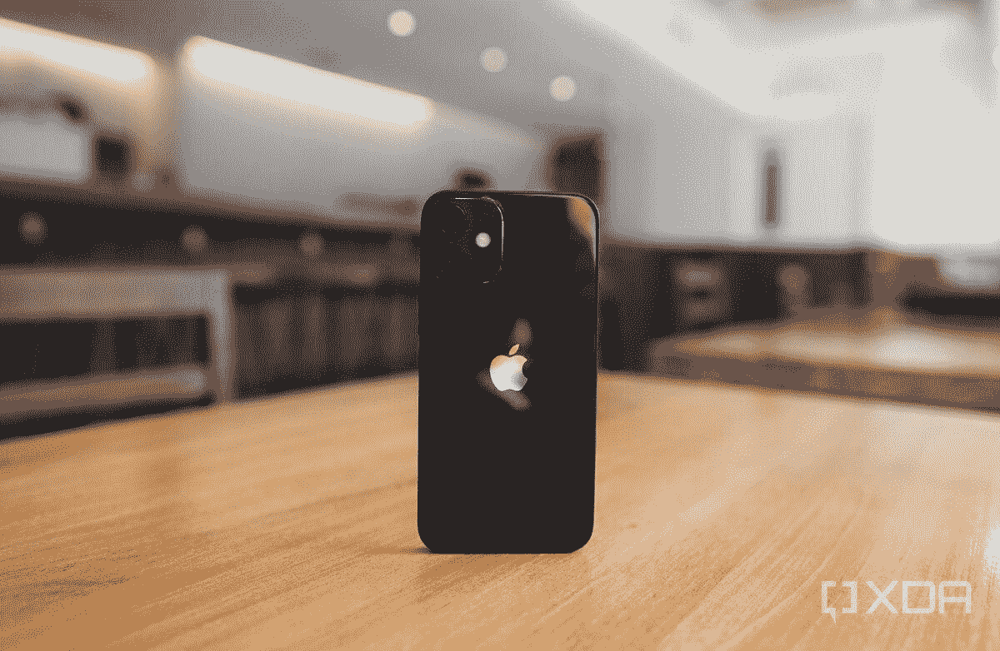

# 2023 年最佳苹果 iPhone 12 迷你保护套

> 原文：<https://www.xda-developers.com/best-iphone-12-mini-cases/>

# 2023 年最佳苹果 iPhone 12 迷你保护套

苹果 iPhone 12 Mini 是一款精致的设备，这些优秀的外壳将有助于保持您的优质智能手机完好无损。

 <picture></picture> 

iPhone 12 Mini

在这一点上， [iPhone 12 Mini](https://www.xda-developers.com/apple-iphone-12-mini-hands-on-preview/) 远不是[最好的 iPhone](https://www.xda-developers.com/best-iphone) ，尤其是在 [iPhone 14 Pro Max](https://www.xda-developers.com/apple-iphone-14-pro-max-review/) 发布之后。尽管如此，如果你找到一个价格合理的单位或者想保留你的小手机，它仍然是一个可靠的选择。如果你想保护你的手机，购买后要做的一件负责任的事情就是为你的 iPhone 12 Mini 买一个保护套。像任何现代智能手机一样，它很脆弱，可能会损坏。为了节省您的时间，我们收集了一些目前最好的 iPhone 12 迷你保护套。

*   ##### ESR 强悍清晰 iPhone 12 Mini case

    编辑推荐

    这款来自 ESR 的 Case 非常适合那些鄙视 Case 的人。它是透明的，有一个干净的，但有些粗糙的角落。因此，它在不隐藏您的 iPhone 12 mini 原始设计的情况下提供了体面的保护。

    T17
*   ##### 超级外壳 UB Pro iPhone 12 迷你外壳

    晋升挑选

    与 Supcase

    合作 Supcase Unicorn Beetle Pro 是你会发现的最坚固的外壳之一。如果你想为你的 iPhone 提供最好的保护，别再犹豫了。

    T37
*   ##### 苹果皮套 iPhone 12 Mini 手机壳

    官方精选

    皮套观感极佳，这款苹果官方手机壳也不例外。它有丰富的质地，并提供了相当数量的保护。它还支持 MagSafe，这是一个额外的好处。

*   ##### OtterBox 通勤 iPhone 12 Mini 手机壳

    高级挑选

    【24.97 美元【39.95 美元Save 14.98 美元

    Otterbox 是手机壳历史最长、最值得信赖的品牌之一。它以增加体积为代价为你的 iPhone 提供了坚实的保护，考虑到它的保护作用，这是合理的。

    T33
*   ##### i-Blason Cosmo 系列 iPhone 12 Mini 保护套

    促销精选

    与 i-Blason

    合作，有三种不同的时尚图案可供挑选，此保护套提供 360 度全方位保护。它非常适合那些需要认真保护和发现黑色案件平淡。

    T55
*   ##### Kckem 电池 iPhone 12 Mini 外壳

    电池挑选

    如果你的 iPhone 12 Mini 的电池续航时间不够长，这款 6000mAh 电池外壳既能保护你的手机，又能为你提供额外的使用时间。它可以提供长达 70 小时的音乐播放或 24 小时的视频流。

正如你所看到的，iPhone 12 Mini 有很多不同的外壳。因此，无论你是在寻找粗犷的还是简约的，你都有可能找到至少一种选择。箱子的好处在于它们通常都比较实惠。因此，你可以购买几款外套，根据不同的需求或服装风格打造不同的外套。如果我个人不得不选择其中一个，我会完全选择 ERS 案例。它既强硬又清晰，让我可以享受手机的原始设计，同时又不损害其安全性。