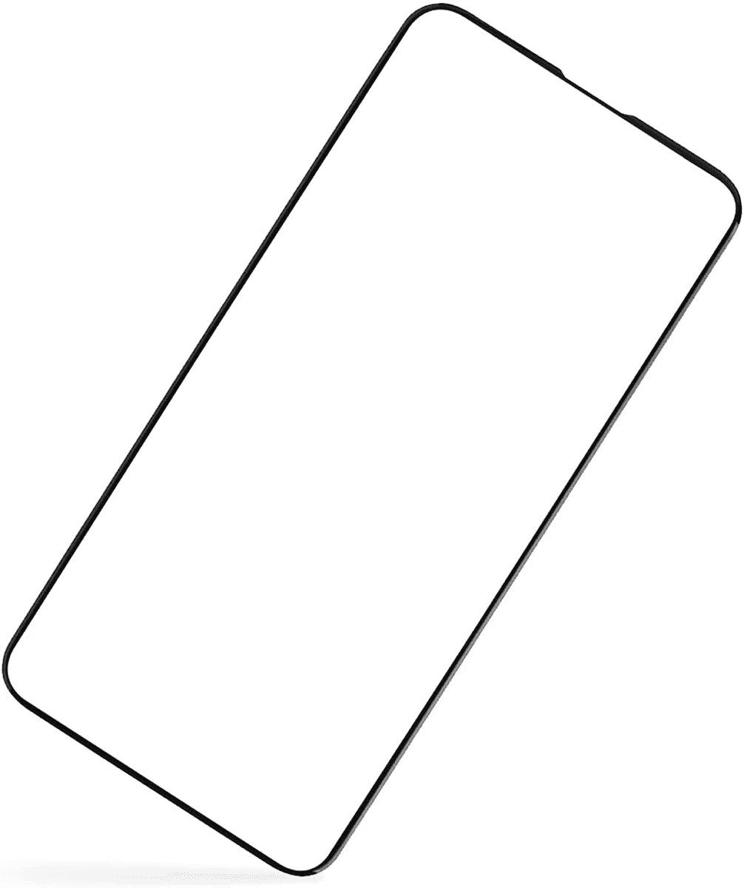
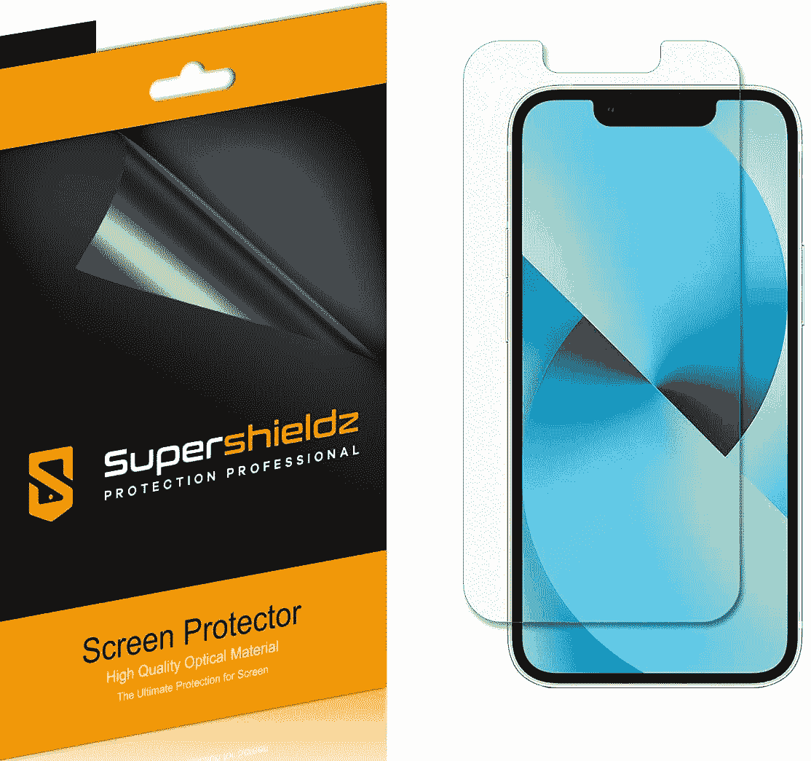
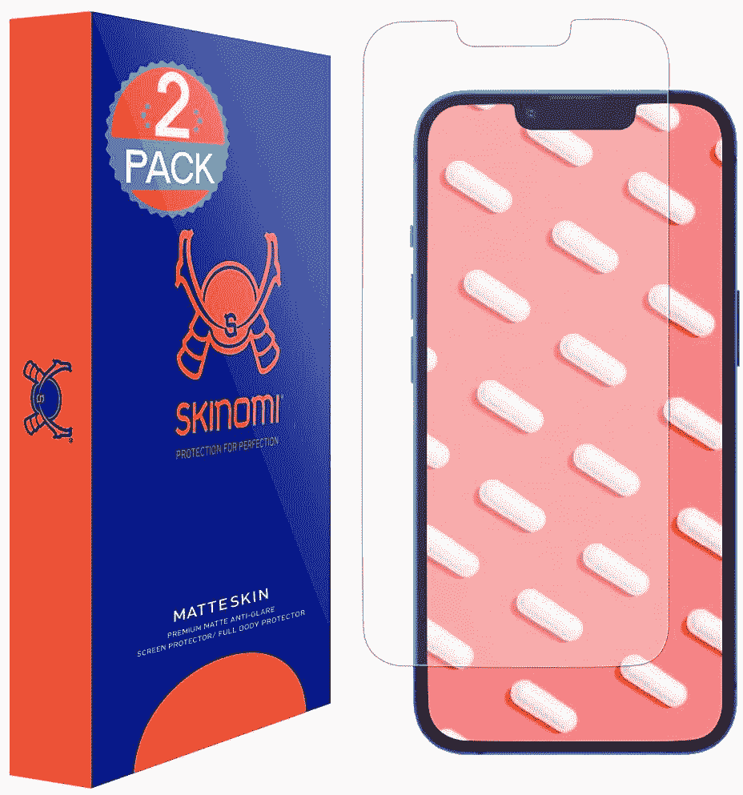
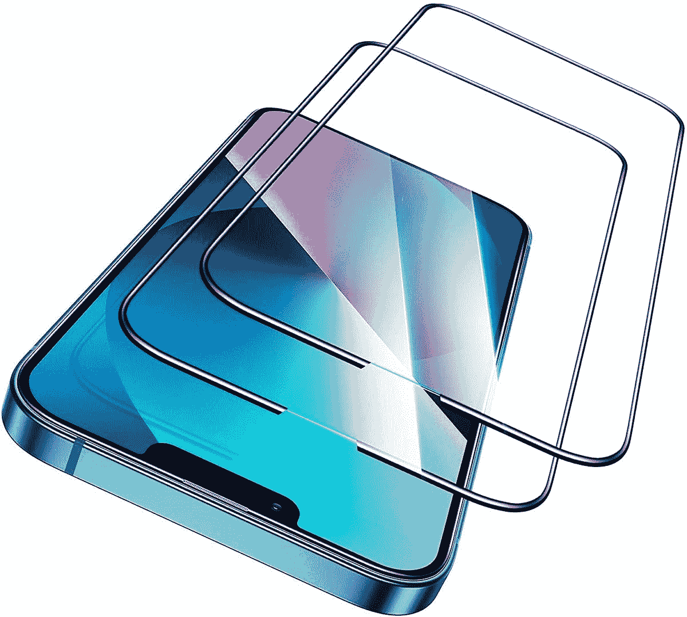
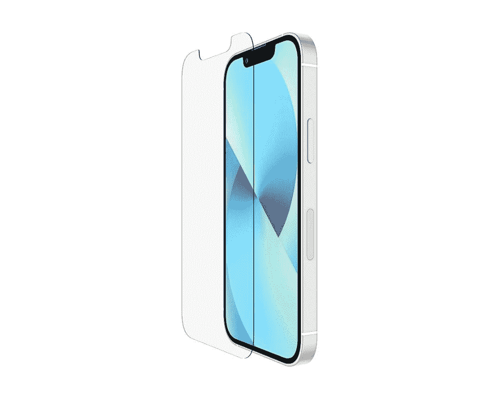
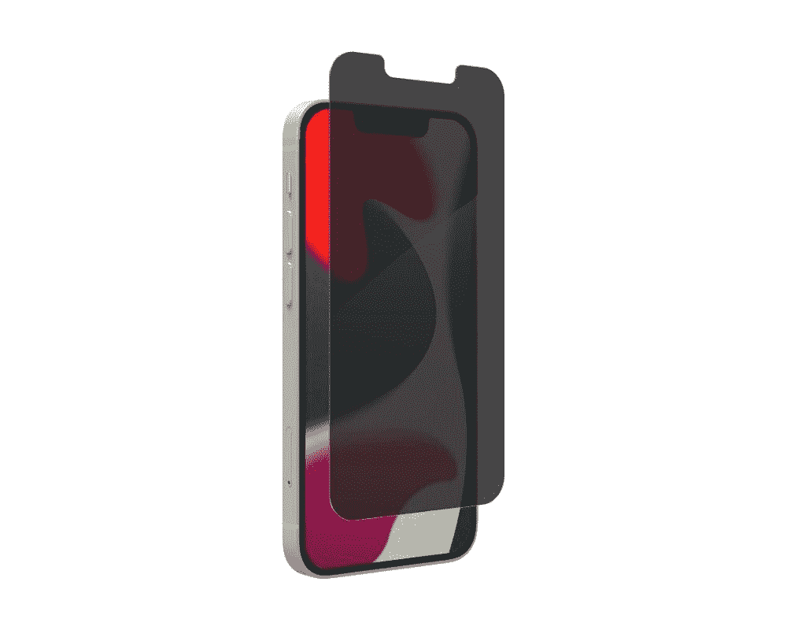
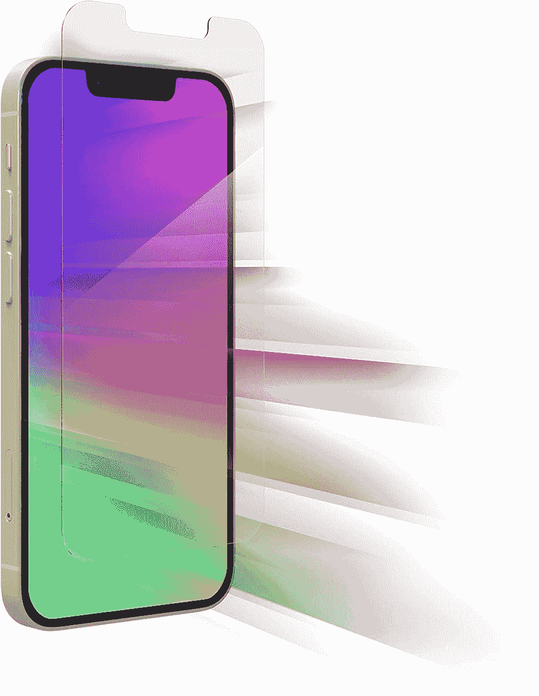
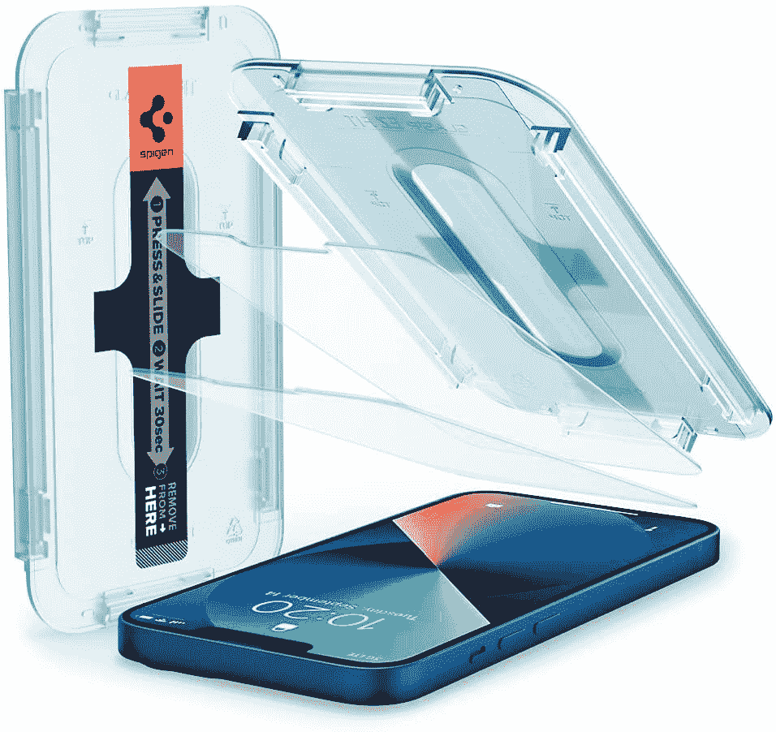
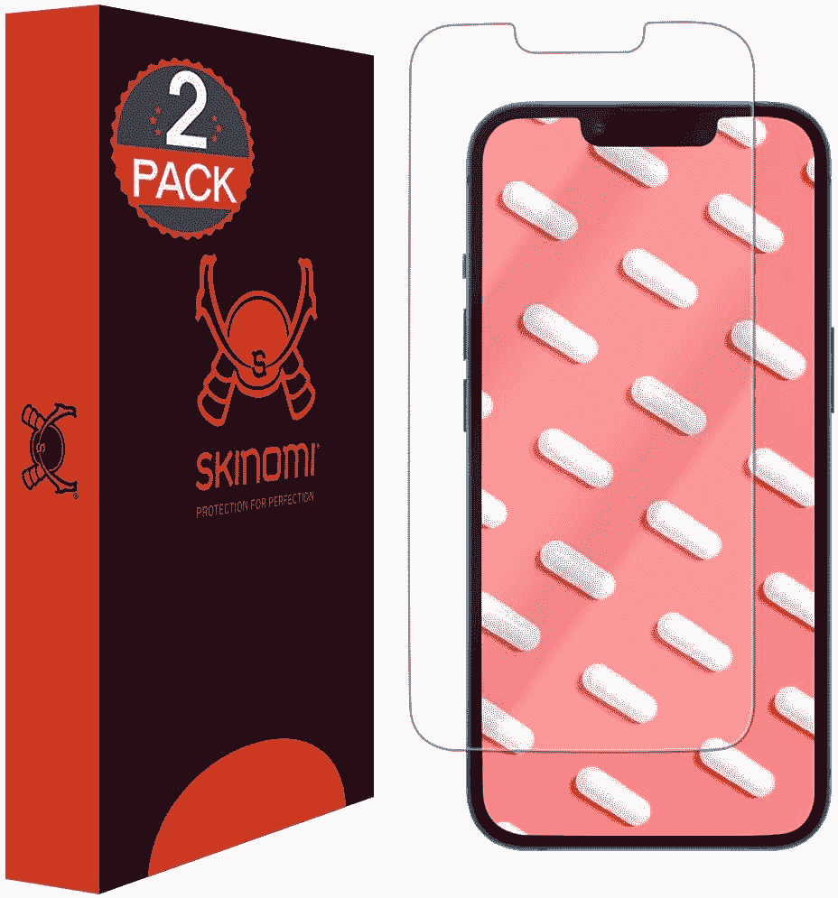

# 2023 年 iPhone 13 Mini 最佳屏幕保护器

> 原文：<https://www.xda-developers.com/best-iphone-13-mini-screen-protectors/>

# 2023 年 iPhone 13 Mini 最佳屏幕保护器

找 iPhone 13 迷你屏幕保护套？我们为手机选择了最好的钢化玻璃、PET 膜和 TPU 屏幕保护。

iPhone 13 Mini 是苹果最新的小型 iPhone，它包含了一系列令人兴奋的新功能。这款手机的一大亮点是其 5.4 英寸的 Super Retina XDR 显示屏，分辨率为 2340 x 1080 像素。此外，该屏幕支持 HDR，色域广，具有疏油涂层，SDR 内容的峰值亮度为 800 尼特，HDR 内容的峰值亮度为 1200 尼特。

苹果还包括一个陶瓷保护罩，以保护屏幕免受刮擦和其他小事故的影响。该公司声称，它比市场上任何其他智能手机玻璃都要坚硬。但是如果你认为这还不足以抵御日常的灾难，你可以安装一个屏幕保护器来进一步保护它。幸运的是，市面上有数百种 iPhone 13 迷你屏幕卫士，我们为您挑选了最好的。

## 最佳 iPhone 13 迷你屏幕保护器

 <picture></picture> 

Totallee Screen Protector

##### Totallee iPhone 13 迷你屏幕保护器

Totallee 的钢化玻璃保护器超薄到 0.02 英寸，覆盖了整个 iPhone 13 迷你屏幕。它还可以很好地处理外壳，保护屏幕免受划痕和其他事故的影响。

 <picture></picture> 

Supershieldz Clear Shield

##### SuperShieldz 宠物 iPhone 13 迷你屏幕保护器

如果你不喜欢钢化玻璃保护套，Supershieldz 屏幕保护套由 PET 薄膜制成。它晶莹剔透，耐刮擦。另外，你会在一个包里得到六个保护者。

 <picture></picture> 

Skinomi Matte Screen Protector

##### Skinomi 哑光 iPhone 13 迷你屏幕保护器

有人既不喜欢钢化玻璃，也不喜欢 PET 膜。如果你是这些人中的一员，这款 Skinomi 哑光屏幕保护器非常适合你。它由 TPU 胶片制成，表面无光泽。

 <picture></picture> 

ESR Armorite

##### ESR Armorite iPhone 13 迷你屏幕保护器

ESR Armorite 是一种坚固的钢化玻璃保护物，可以保护你的 iPhone 13 Mini。它可以承受高达 110 磅的力。屏幕保护器也很容易用提供的套件安装。

 <picture></picture> 

Belkin Screen Protector

##### 贝尔金 iPhone 13 迷你屏幕保护器

Belkin 是一个值得信赖的移动配件名称，该公司为 iPhone 13 Mini 发布了一款出色的屏幕保护器。它非常薄，带有抗菌涂层，可以阻止细菌生长。

 <picture></picture> 

ZAGG InvisibleShield Glass Elite

##### ZAGG 隐形眼镜精英版 iPhone 13 迷你屏幕保护套

如果你不喜欢坐在你周围的人窥探你的 iPhone，ZAGG InvisibleShield Glass Elite 隐私屏幕保护器是一个不错的选择。它有一个过滤器，提供全屏隐私。

 <picture></picture> 

ZAGG InvisibleShield Glass Elite VisionGuard

##### ZAGG 隐形防护玻璃精英 VisionGuard iPhone 13 迷你屏幕保护器

invisible shield Glass Elite vision guard 是 ZAGG 的另一款出色的屏幕保护器。它包括一层过滤高能可见(HEV)蓝光的层，以减少眼睛疲劳。

 <picture></picture> 

Spigen Tempered Glass

##### Spigen 钢化玻璃 iPhone 13 迷你屏幕保护套

Spigen 钢化玻璃保护套配有自动校准套件，安装非常简单。它还被评为 9H 硬度，并有一个疏油涂层。

 <picture></picture> 

Skinomi Screen Protector

##### Skinomi iPhone 13 迷你屏幕保护器

除了哑光屏幕保护装置，Skinomi 还提供带有自我修复技术的常规 TPU 膜。因此，随着时间的推移，它可以自动清除轻微的划痕和磨损痕迹。

* * *

这些都是 iPhone 13 Mini 最好的屏幕保护器。你可以选择钢化玻璃、PET 膜或 TPU 屏幕保护器来保护 iPhone 屏幕。如果你喜欢钢化玻璃保护套， [Spigen 屏幕保护套](https://www.amazon.com/Spigen-Tempered-Protector-designed-Friendly/dp/B095RQPWVY/?tag=xda-3ip9qv3-20&ascsubtag=UUxdaUeUpU5315&asc_refurl=https%3A%2F%2Fwww.xda-developers.com%2Fbest-iphone-13-mini-screen-protectors%2F&asc_campaign=Short-Term)是一个很好的选择。不过，如果你想要一个 PET 膜屏幕保护器，Supershieldz Clear Shield 是比较好的一个。最后，对于那些喜欢 TPU 电影的人来说，Skinomi 有几个合适的保护者。

你打算为你的 iPhone 13 Mini 买哪些屏幕保护？请在评论区告诉我们。如果你想要更多的保护，我们还为手机选择了[最好的保护套。](https://www.xda-developers.com/best-iphone-13-mini-cases/)

 <picture></picture> 

Apple iPhone 13 Mini

##### 苹果 iPhone 13 Mini

iPhone 13 Mini 是苹果最新的小型 iPhone，拥有更好的摄像头、更大的电池和更小的凹槽。