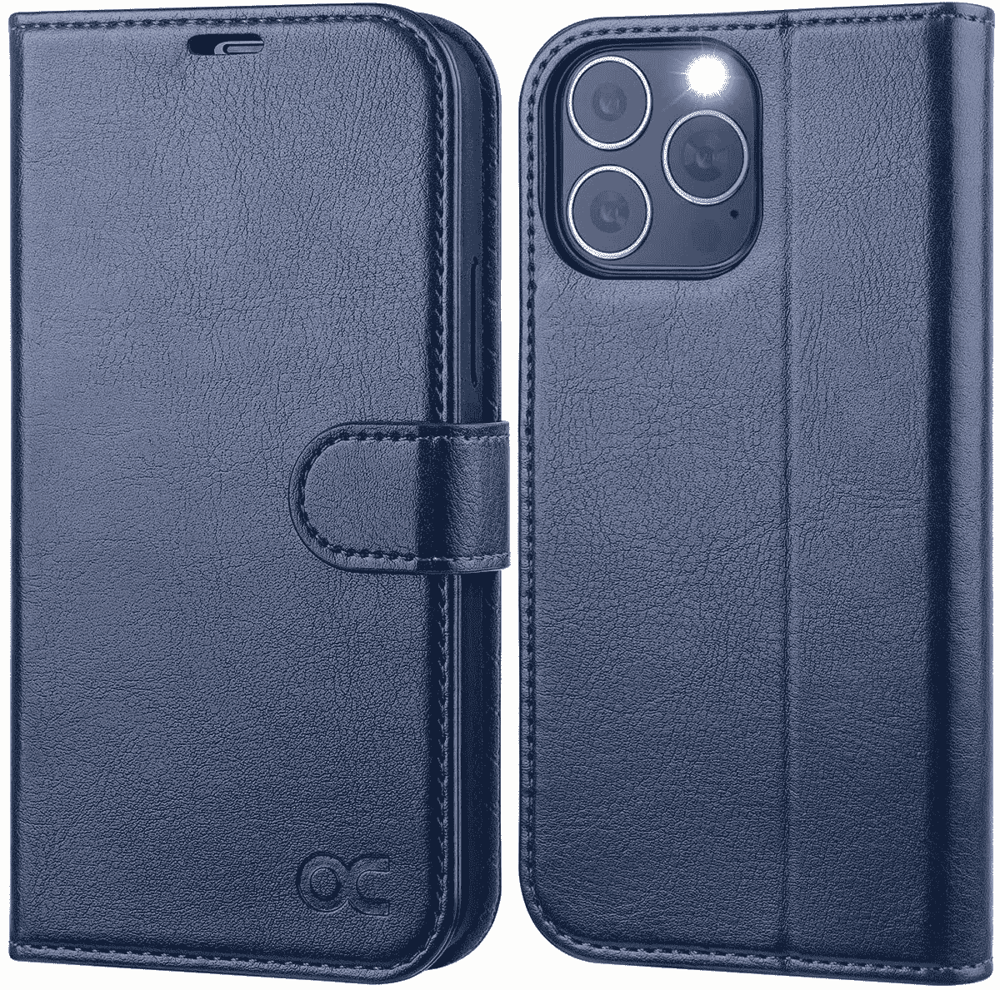
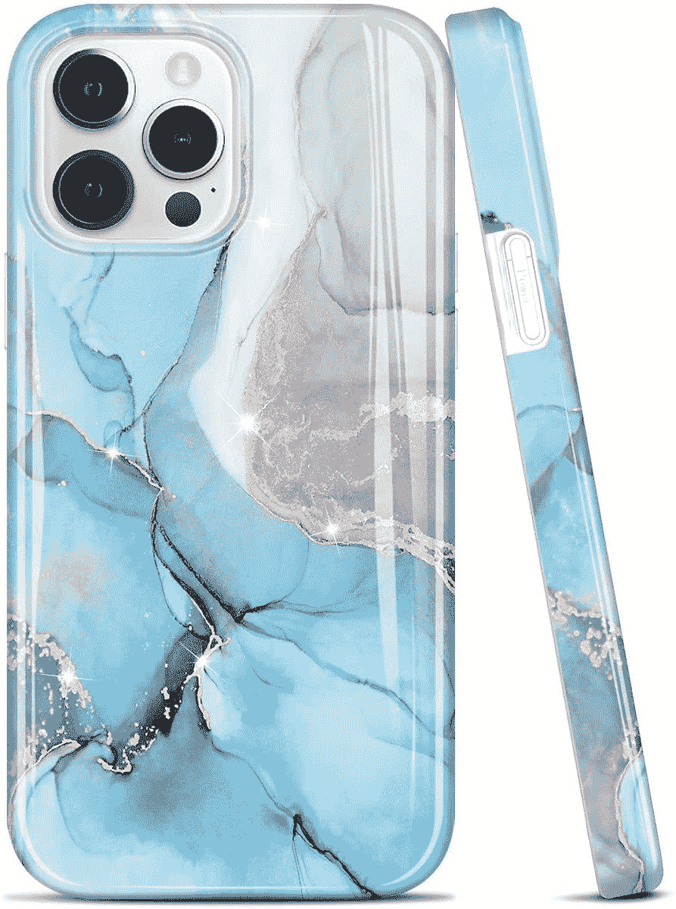
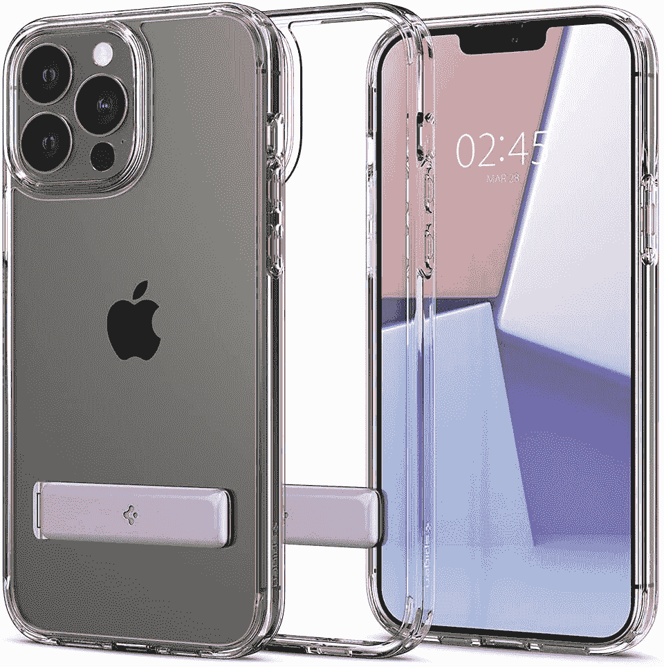
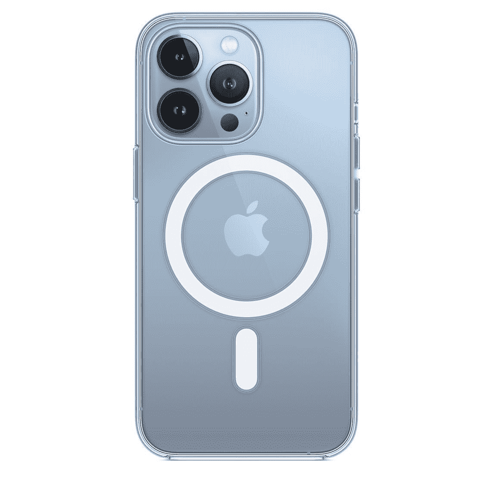
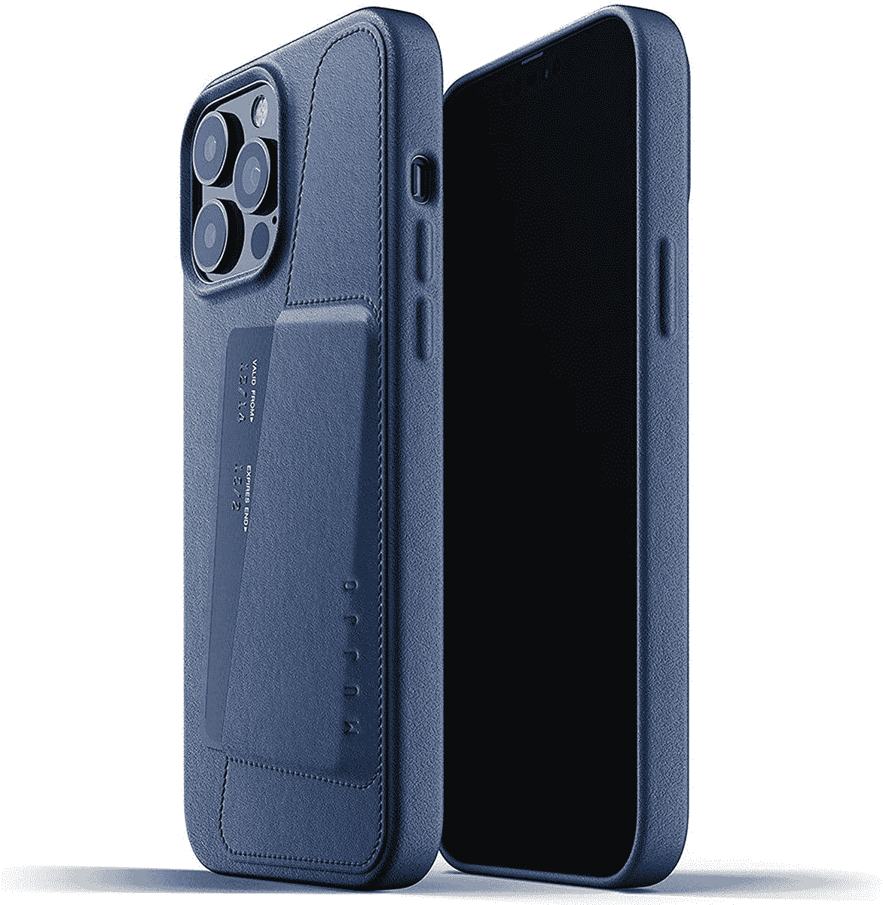

# 2023 年最佳苹果 iPhone 13 Pro Max 保护套

> 原文：<https://www.xda-developers.com/best-iphone-13-pro-max-cases/>

# 2023 年最佳苹果 iPhone 13 Pro Max 保护套

为你的新 iPhone 13 Pro Max 寻找保护套？以下是我们根据不同需求总结的最佳案例！

 <picture></picture> 

Apple iPhone 13 Pro Max

运行在苹果 A15 Bionic 上的 2021 年 [iPhone 13 Pro Max](https://www.xda-developers.com/apple-iphone-13-pro-max-review/) 是目前[最强大的智能手机](https://www.xda-developers.com/best-phones/)之一。虽然我们喜欢苹果的 Pro Max 手机的大屏幕，但它们比普通手机更难握持——所以你肯定会想要一个外壳，无论是为了增加握持力还是防止跌落。

苹果声明 iPhone 13 Pro Max 采用陶瓷盾显示屏。尽管如此，它仍然是玻璃，在撞击时会破碎。你肯定不想花更多的钱去维修，尤其是当你已经在手机上花了一大笔钱的时候。为了帮助您保护您的投资，这里有一些您可以购买的各种类别的最佳 iPhone 13 Pro Max 保护套。我们收集了大量选项，包括透明保护套、坚固保护套、正式保护套，甚至还有增加实用性的保护套，如钱包保护套或支架保护套。挑一个最适合自己的吧！

如果你打算为自己买一部 iPhone 13 Pro Max，我们建议看看[最好的 iPhone 13 Pro Max 交易](https://www.xda-developers.com/best-iphone-13-pro-max-deals/)，帮你省下一些额外的钱。如果你已经买了手机，明智的做法是买一个保护你的 iPhone 13 Pro Max 免受划痕和裂缝的保护。

*   <picture></picture>

    苹果皮套

    ##### 苹果皮套 iPhone 13 Pro Max 皮套

    这是苹果官方带有 MagSafe 的皮套。如果你想给你的 iPhone 13 Pro Max 添加一种优雅和专业的风格，这款保护套将帮助你实现这一目标。

*   <picture></picture>

    Ocase 皮革对开套

    ##### Ocase 皮革对开 iPhone 13 Pro Max 套

    这是一款简单的 PU 皮革对开套，可以存放几张卡片和一些现金。它配有一个磁性翻盖，防止箱子意外打开。

*   <picture></picture>

    大理石防震保护套

    ##### 大理石防震 iPhone 13 Pro Max 保护套

    如果你喜欢手机壳上有独特的设计和图案，这将是一个不错的选择供你考虑。它有大理石饰面，有多种颜色可供选择。

*   <picture></picture>

    Spigen Thin Fit

    ##### Spigen Thin Fit iPhone 13 Pro Max case

    Spigen 是最负盛名的保护套制造商之一，他们的保护套质量普遍非常好。Spigen thin fit 保护套非常纤薄，正如其名称所暗示的那样，能够为您提供最低限度的防刮擦保护。你不能指望保护套保护手机免受跌落。

*   <picture></picture>

    i-Blason Cosmo 系列表壳

    ##### I-Blason Cosmo iPhone 13 Pro Max 表壳

    这款来自 I-Blason 的是给喜欢精致外观的你的。它的背面提供了一个优质的大理石设计，并且它与 MagSafe 兼容。其凸起的摄像头和屏幕挡板也提供了额外的保护。它带有内置的屏幕保护器。

*   <picture></picture>

    sp igen Ultra Hybrid S

    ##### sp igen Ultra Hybrid S iPhone 13 Pro Max case

    sp igen Ultra Hybrid S 是一个清晰的案例，所以你可以用它来炫耀你的新 iPhone 的背面它还有一个支架，可以提供很好的保护。

*   <picture></picture>

    UAG 君主

    ##### UAG 君主 iPhone 13 Pro Max 保护套

    UAG 是坚固耐用保护套的最佳品牌之一。他们的案件提供了坚固的外观和君主系列没有什么不同的终极保护。这是你应该得到的情况，如果你想要一个酷的外观严重的保护。

*   <picture></picture>

    Apple Clear Case with MagSafe

    ##### Apple Clear iPhone 13 Pro Max Case

    这是苹果官方的透明 Case with mag safe。如果你想炫耀你的全新 iPhone 13 Pro Max 的颜色，同时还想享受 MagSafe 功能，这是值得一试的。

*   <picture></picture>

    Mujjo 真皮钱包

    ##### Mujjo 真皮钱包 iPhone 13 Pro Max 手机套

    这是 Mujjo 的一款优雅手机套，背面有一个插槽，可以放几张信用卡。如果你想要一个高品质的盒子，看起来很优雅，甚至可以装一些卡片，你一定可以选择这个盒子。

这些是各种类别中最好的 iPhone 13 Pro Max 保护套。无论您是想要一个不会增加体积并展示 Apple 标志的超薄外壳，还是想要一个保护您的手机免受跌落的坚固外壳，我们都可以满足您的所有需求！挑一个最适合自己需求的，或者挑几个适合不同场合的！

 <picture></picture> 

iPhone 13 Pro Max

##### 苹果 iPhone 13 Pro Max

iPhone 13 Pro Max 是苹果公司 2021 年推出的顶级 iPhone，配有大而出色的摄像头，一个小凹口，120Hz 显示屏。