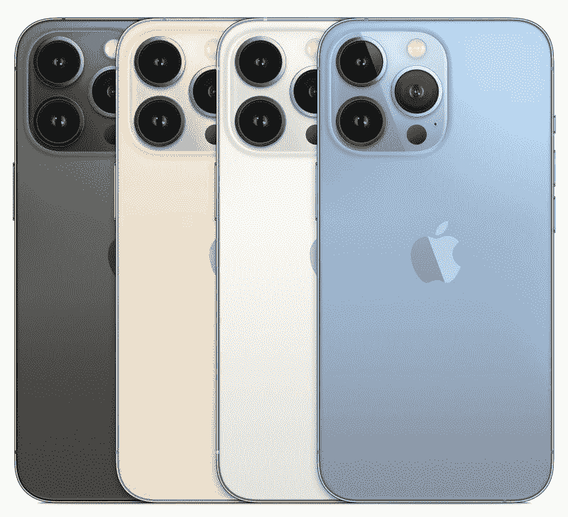

# 2022 年最佳 iPhone 13 Pro 和 iPhone 13 Pro Max 交易

> 原文：<https://www.xda-developers.com/best-iphone-13-pro-max-deals/>

[iPhone 13 Pro Max](https://www.xda-developers.com/apple-iphone-13-pro-max-review/) 和 [iPhone 13 Pro](https://www.xda-developers.com/apple-iphone-13-pro-review/) 是苹果 2021 年的最高端 iPhone。这些智能手机装有 A15 仿生芯片，支持 [iOS 16](http://xda-developers.com/ios-16) 。如果你打算购买去年的 Pro iPhones，你应该知道有四种存储版本，包括 1TB 的型号。您仍然可以获得 128GB、256GB 和 512GB 的大小。目前，苹果 iPhone 13 Pro 和 13 Pro Max 有运营商锁定版本。不过，预计它们将很快从零售商的网站上消失。那是因为随着 [iPhone 14 Pro](https://www.xda-developers.com/best-apple-iphone-14-deals/) 的推出，苹果已经正式停产了它们。这些是你现在能找到的最好的 iPhone 13 Pro 和 Pro Max 交易。

## iPhone 13 Pro 价格多少？

iPhone 13 Pro 和 13 Pro Max 不再广泛供应。他们的原始默认价格如下所示:

| 

储存；储备

 | 

iPhone 13 Pro

 | 

iPhone 13 Pro Max

 |
| --- | --- | --- |
| 128GB | $999 | $1,099 |
| 256GB | $1,099 | $1,199 |
| 512GB | $1,299 | $1,399 |
| 1TB | $1,499 | $1,599 |

## 最佳 iPhone 13 Pro，iPhone 13 Pro Max 优惠

### 美国电话电报公司(American Telephone and Telegraph Company)

新的和现有的美国电话电报公司用户可以在购买 iPhone 13 Pro 和 13 Pro Max 时以旧设备折价，以获得账单积分。你需要分期付款购买手机，以旧智能手机折价，并获得无限制的账单积分计划。根据你的折价物的价值，账单信用会有所不同。

 <picture></picture> 

AT&T

##### 美国电话电报公司(American Telephone and Telegraph Company)

所有五种颜色和存储变体都通过 AT&T 销售。

### T-Mobile

和美国电话电报公司一样，T-Mobile 也放弃了购买 iPhone 13 Pro 和 iPhone 13 Pro Max 的账单积分。您需要获得 Magenta MAX、Magenta Plus、One Plus、Sprint MAX、Plus 或 Premium UNL 服务，并以符合条件的旧智能手机进行交易，才能获得这些账单积分。账单积分的金额也将取决于你的旧手机的折价价值。

 <picture></picture> 

AT&T

##### iPhone 13 Pro Max

你可以从 T-Mobile 订购任何 iPhone 13 Pro、13 Pro Max storage 或 color variant。

### 百思买集团

百思买正在销售 iPhone 13 Pro 和 iPhone 13 Pro Max 的所有美国主要运营商版本。它还提供以旧换新优惠，进一步增加您的储蓄。

 <picture></picture> 

AT&T

##### 苹果 iPhone 13 Pro Max

iPhone 13 Pro 和 Pro Max 的运营商锁定版本可以在百思买购买。

### 亚马孙

你只能从亚马逊购买 iPhone 13 Pro 和 iPhone 13 Pro Max 的 Cricket 无线运营商锁定版本。如果你从网站上订购这两款手机中的任何一款，只要你订阅了长达 24 个月的运营商计划，你的亚马逊礼品卡上每个月都会有 4.17 美元。

 <picture></picture> 

AT&T

##### 苹果 iPhone 13 Pro Max

亚马逊销售 iPhone 13 Pro 和 iPhone 13 Pro Max 的所有颜色选项和存储变体。

* * *

*你打算买哪款 iPhone 13？请在下面的评论区告诉我们。*