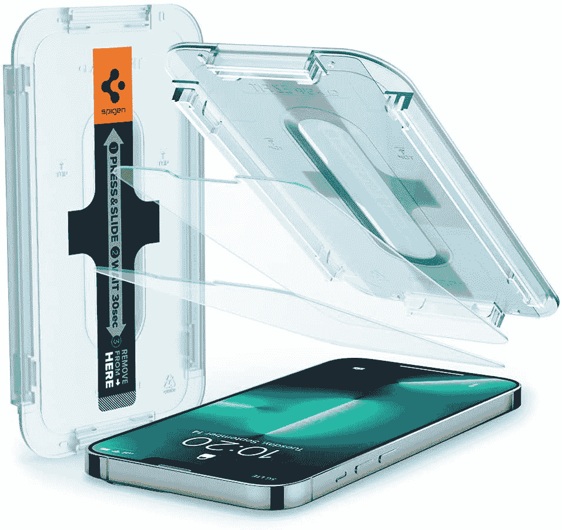
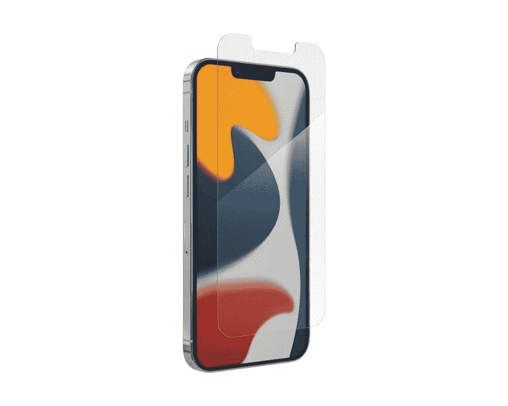
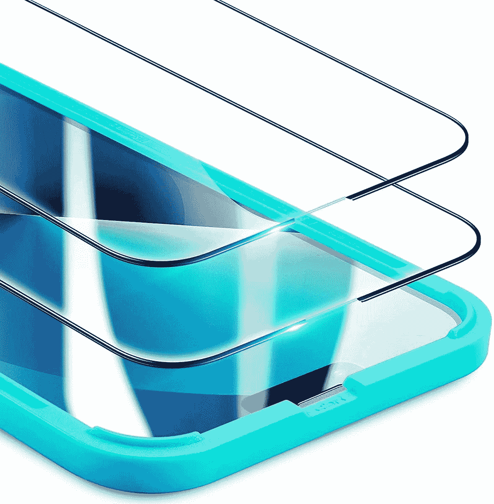
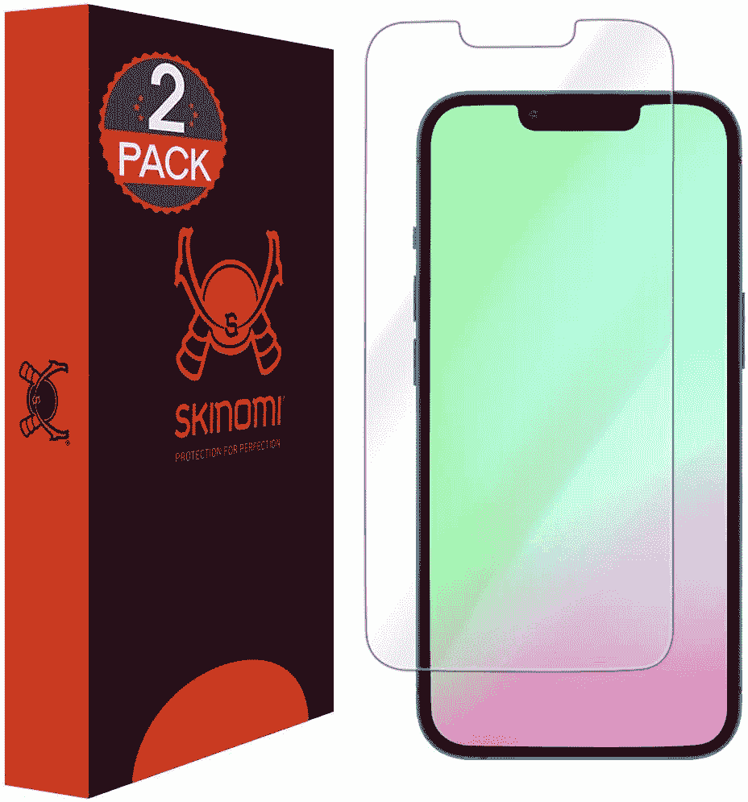
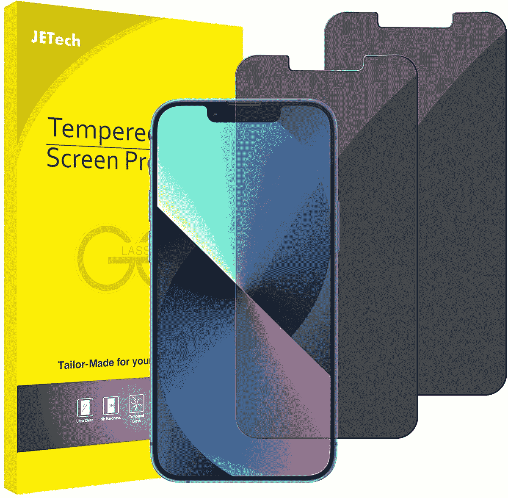
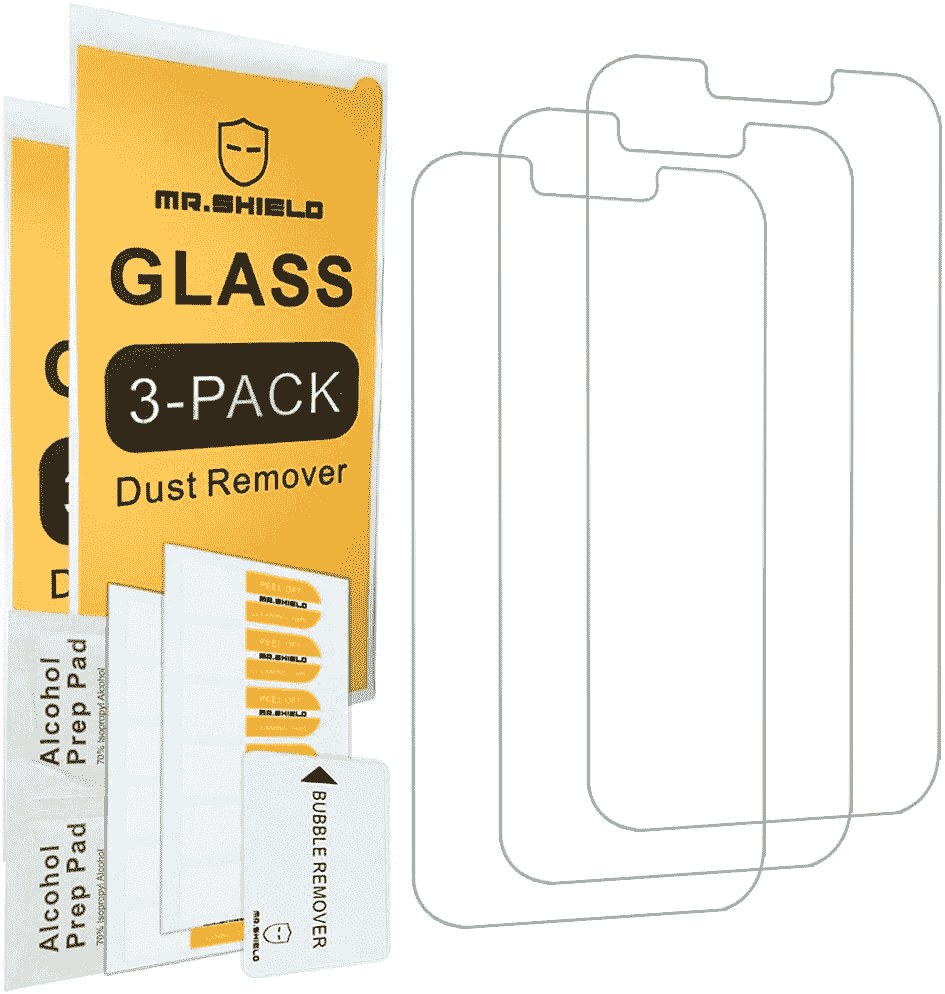
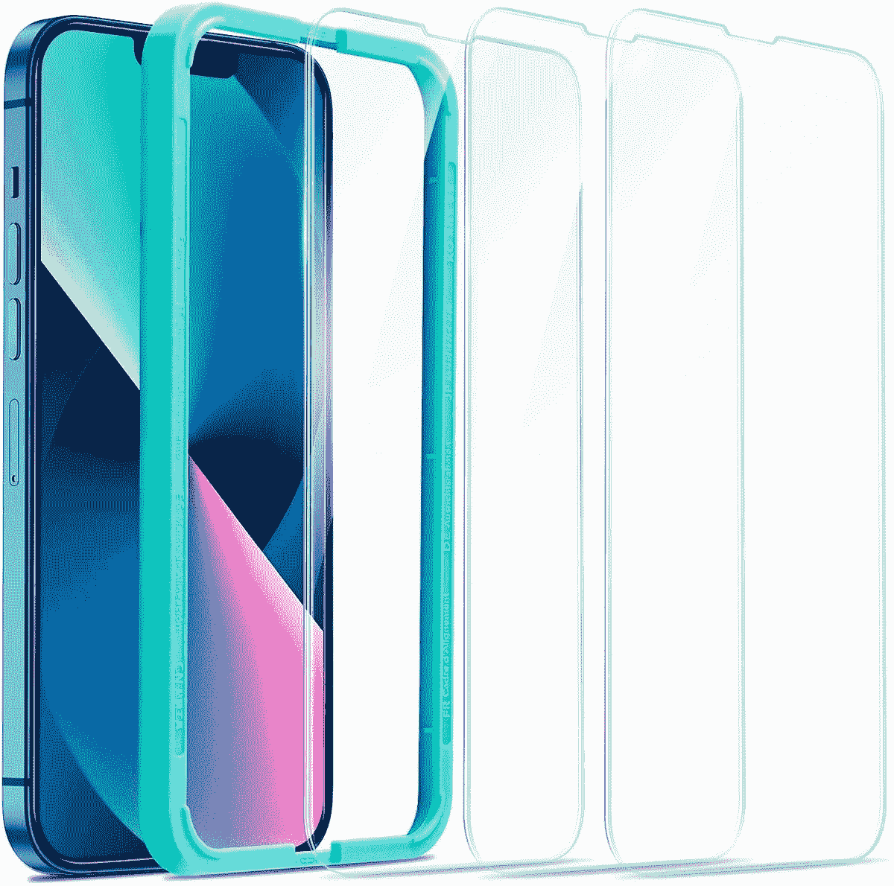
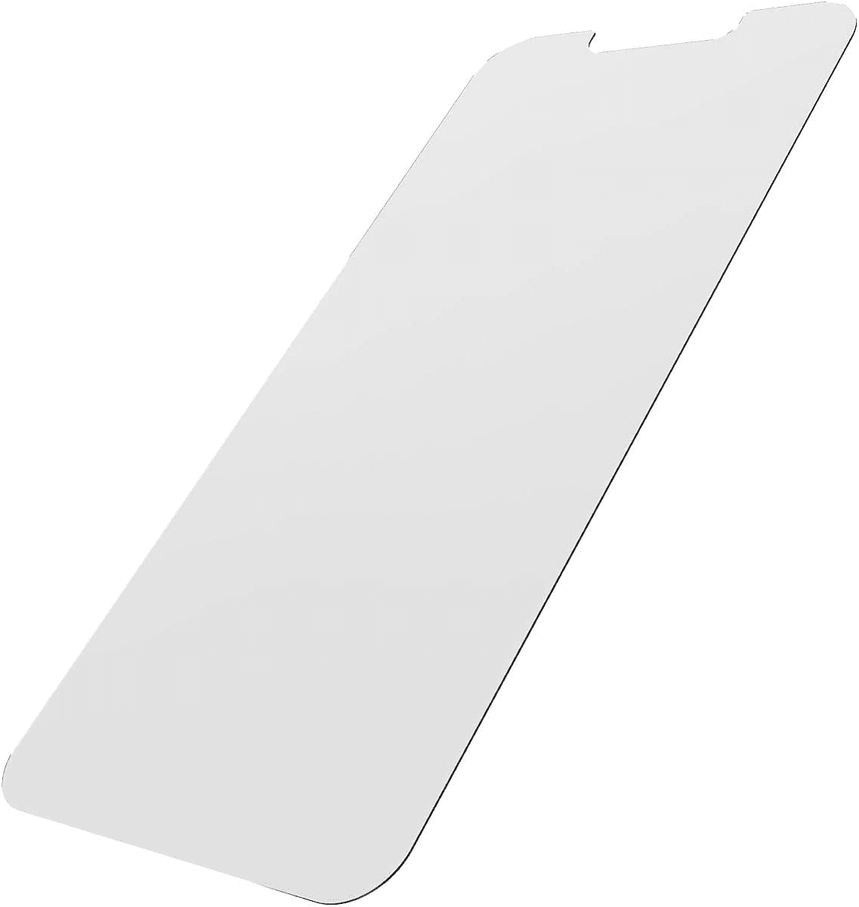

# 最佳苹果 iPhone 13 和 iPhone 13 Pro 屏幕保护器

> 原文：<https://www.xda-developers.com/best-iphone-13-pro-screen-protectors/>

# 最佳苹果 iPhone 13 和 iPhone 13 Pro 屏幕保护器

寻找 iPhone 13 或 iPhone 13 Pro 的屏幕保护套？我们挑选了市场上最好的 iPhone 13 屏幕保护器。

Appel 在 2021 年发布了 [iPhone 13](https://www.xda-developers.com/apple-iphone-13-review/) 和 [iPhone 13 Pro](https://www.xda-developers.com/apple-iphone-13-pro-review/) ，它们采用了充满活力的 6.1 英寸有机发光二极管显示屏。这是一个 2532 x 1170 像素分辨率的超级视网膜 XDR 屏幕，Pro 型号甚至支持高达 120Hz 的刷新率。此外，为了保护这块屏幕，苹果包括了陶瓷盾保护——据说比任何其他智能手机玻璃都要坚硬。

然而，如果这还不够，你想要一个屏幕保护器来保护你的投资，市场上有几个很好的选择。我们已经为你挑选了最好的。请记住，虽然屏幕保护器不一定能保护你的手机屏幕在跌落时不会破裂，但它无疑能够防止轻微的划痕。使用带屏幕保护套的外壳通常可以为您的手机提供最佳保护。

由于这两款设备都有相同的正面显示屏尺寸和附带的尺寸，因此相同的屏幕保护器将适用于 iPhone 13 和 iPhone 13 Pro。请注意，两者之间的外壳是不交叉兼容的——那些需要专门为您现有的手机购买的外壳，但屏幕保护器是交叉兼容的。

## 最佳 iPhone 13 和 iPhone 13 Pro 屏幕保护器

*   <picture></picture>

    斯必根钢化玻璃

    ##### 斯必根钢化玻璃 iPhone 13 Pro 屏幕保护器

    斯必根钢化玻璃保护器自带自动对准套件，安装过程超级流畅。你还可以在包里得到两个保护者。

*   <picture></picture>

    ZAGG InvisibleShield Glass Elite

    ##### ZAGG invisible shield Glass Elite iPhone 13 Pro 屏幕保护器

    ZAGG 以其优质的产品在屏幕保护器行业中享有盛誉，这款 invisible shield Glass Elite 是一款梦幻般的手机钢化玻璃保护器。它很贵，但你可以得到顶级的保护和加固的边缘。

*   <picture></picture>

    ESR Armorite

    ##### ESR Armorite iPhone 13 Pro 屏幕保护器

    除了其优秀的案例之外，ESR 还做出了上乘的屏幕保护器。例如，这种来自 ESR 的 Armorite 钢化玻璃保护器很受欢迎，并且带有易于安装的框架。

*   <picture></picture>

    skin OMI 保护膜

    ##### skin OMI iPhone 13 Pro 屏幕保护器

    并不是所有人都是钢化玻璃保护器的粉丝所以，如果你正在寻找其他的东西，Skinomi 的这款 TPU 保护膜是个不错的选择。它坚韧，自愈，晶莹剔透。

*   <picture></picture>

    JETech 隐私屏幕保护器

    ##### JETech 隐私 iPhone 13 Pro 屏幕保护器

    如果你不想别人坐在你旁边偷听你的电话，JETech 隐私屏幕保护器会很有帮助。它确保 iPhone 屏幕只对直接在它前面的人可见。

*   <picture></picture>

    Mr. Shield 屏幕保护器

    ##### Mr . Shield 钢化玻璃 iPhone 13 Pro 屏幕保护器

    如果你不想在一个屏幕保护器上花太多钱，那么 Mr . Shield 屏幕保护器价格实惠，提供了像样的保护。此外，你可以在包里得到三个保护者。

*   <picture></picture>

    ESR 钢化玻璃

    ##### ESR 钢化玻璃 iPhone 13 Pro 屏幕保护器

    ESR 钢化玻璃保护器非常坚韧，可以承受高达 11 磅的力。它还带有疏油涂层，可以防止指纹污迹。此外，ESR 提供了一个安装框架，以便于应用。

*   <picture></picture>

    IQ Shield 防泡透明膜

    ##### IQ Shield iPhone 13 Pro 屏幕保护器

    IQ Shield 透明膜是 iPhone 13 和 13 Pro 的又一大 TPU 版屏幕保护器。它由高品质材料制成，并提供终身更换保修。

*   <picture></picture>

    tech 21 防冲击玻璃

    ##### tech 21 防冲击玻璃 iPhone 13 Pro 屏幕保护器

    tech 21 防冲击玻璃是另一个伟大的钢化玻璃保护器。它具有先进的抗菌涂层，可以阻止细菌在玻璃上生长。

* * *

这些是市面上最好的 iPhone 13 和 iPhone 13 Pro 屏幕保护套。如你所见，市场上有很多优秀的选择。如果预算没有限制，你可以选择 ZAGG 隐形眼镜精英版。Spigen 屏幕保护器和 ESR Armorite 也是很好的选择。最后，出于预算的考虑，Shield 先生和 Skinomi 提供了两种合适的价格适中的保护器。

*   ##### 苹果 iPhone 13

    iPhone 13 是相当于普通 iPhone 14 的体面之作。它采用相同的处理器，相同的设计，运行相同的操作系统，成本更低。

*   <picture></picture>

    AT&

    ##### 苹果 iPhone 13 Pro

    iPhone 13 Pro 是苹果 2021 年 iPhone 阵容的一部分。它由 A15 仿生芯片驱动，支持 iOS 16。

    T34

你打算买哪个屏幕保护器？比起 TPU 电影，你更喜欢钢化玻璃吗？请在评论区告诉我们。我们还选出了 iPhone 13 的[最佳案例和 iPhone 13 Pro](https://www.xda-developers.com/best-iphone-13-cases/) 的[最佳案例——来看看吧。](https://www.xda-developers.com/best-iphone-13-pro-cases/)