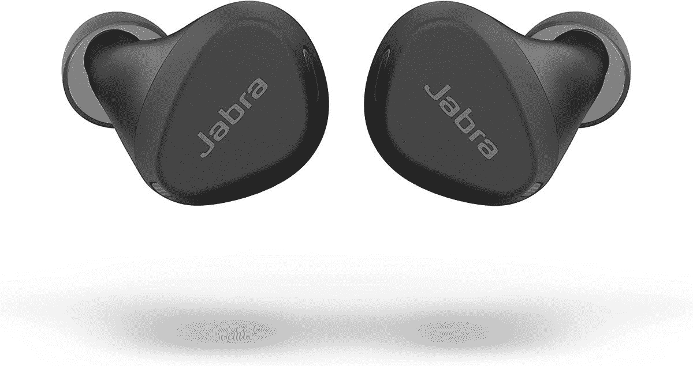
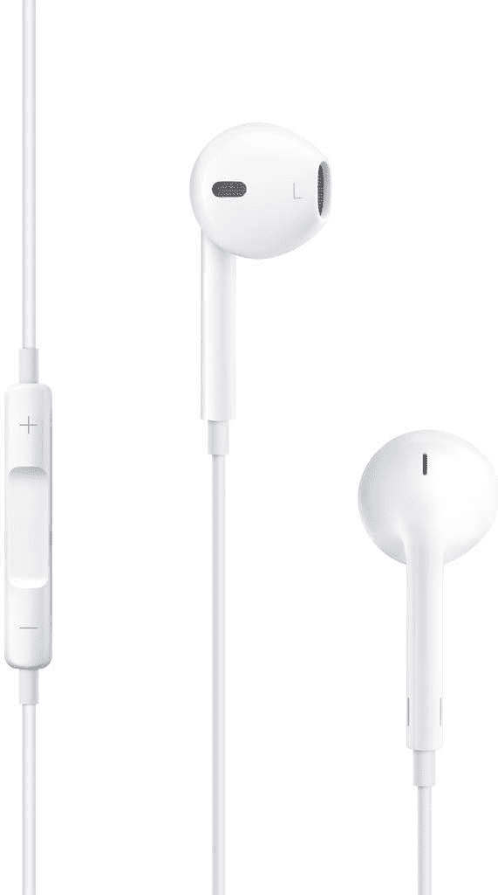

# 2023 年最佳 iPhone SE 3 (2022)耳机

> 原文：<https://www.xda-developers.com/best-iphone-se-3-earphones/>

# 2023 年最佳 iPhone SE 3 (2022)耳机

iPhone SE 3 (2022)没有耳机插孔，盒子里也没有耳机。

iPhone SE 3 是一款小众设备，针对的是那些寻求小包装旗舰性能的人以及那些拒绝放弃旧 iPhone 设计和触控 ID 的人。如果你属于这一阵营，并且最近得到了这款小巧的 iPhone，你可能会注意到它没有 3.5 毫米的音频插孔，也没有捆绑耳机。虽然使用您现有的耳机始终是一种选择，但最好的 iPhone SE 3 (2022)耳机可以提供更好的音频和更好的通话体验。

*   ##### 苹果 AirPods Pro 2

    编辑推荐

    ai rpods Pro 2 可能看起来与他们的前辈一样，但他们带来了许多值得注意的升级，包括新的 H2 芯片组，更好的声音，更好的噪音消除，以及长达 6 小时的连续电池。它们还支持 Spatial Audio 和 Dolby Atmos，以获得更加身临其境的音频体验。

    T13
*   ##### 苹果 ai rpods 3

    ai rpods 3 采用开放式背部设计，坐在你的耳道之外，让你戴上这些耳机几个小时也不会感到不适或疲劳。虽然它们不能阻挡外部噪音，但它们非常适合接听电话和听休闲音乐。它们提供双波束成形麦克风、IPX4 等级、H1 芯片、皮肤检测传感器和长达 6 小时的电池。

*   <picture></picture>

    Beas Studio Buds

    ##### Beats Studio Buds

    Best Value

    Beats Studio Buds 提供了不错的音效，ANC，舒适贴合，长达八小时的续航时间比 AirPods Pro 少了很多。

*   <picture></picture>

    Anker Soundcore Life Q35

    ##### Anker Soundcore Life Q35

    Anker Soundcore Life Q35 价格合理，采用固态规格，提供主动噪音消除，索尼的 LDAC 编解码器，良好的声音，以及长达 40 小时的电池寿命。

*   ##### 苹果 ai rpods Max

    ai rpods Max 是 iPhone 用户最好的挂耳式耳机。这些舒适的耳机由优质材料制成，提供丰富的声音、强大的 ANC、透明模式、空间音频和长达 20 小时的电池寿命。

*   <picture></picture>

    Jabra Elite 4 Active

    ##### Jabra Elite 4 Active

    Jabra Elite 4 Active 是一对相对实惠的专注于锻炼的真正无线耳塞，旨在提高可靠性。有了 ANC 和 IP57 保护，当你计划出汗时，它们是一个很好的选择。

    T34
*   <picture></picture>

    Apple EarPods

    ##### Apple EarPods

    Apple EarPods 有一个照明连接器，所以你仍然可以和现代的 iPhones 一起使用有线耳机。由于其符合人体工程学的开放式设计，这款耳机比其他耳塞式耳机更舒适。还包括用于调节音量、控制音乐播放、接听和挂断电话的内嵌控件，以及用于通话的麦克风。

*   ##### 一加诺德耳塞

    这些一加诺德耳塞是非常便宜的耳塞，性价比很高。除了时尚之外，它们还能发出出色的声音，具有 IP55 等级，一次充电可持续 7 小时。它们还拥有杜比全景声支持和低延迟游戏模式。

任何蓝牙耳机都可以与 iPhone SE 3 (2022)配合使用。然而，我们上面所做的推荐是我们认为最适合 iPhone SE 3 (2022)的耳机。有些直接来自苹果，比如 AirPods Pro 2，所以你会得到像轻松配对和空间音频这样的功能。不过也有其他的，像 Anker Soundcore Life Q35，它会给你很好的声音，而不需要你花费数百美元。

寻找更多推荐？看看 2023 年你能买到的最好的真正无线耳塞。当你在这里的时候，一定要看看[最好的 iPhone SE 3 保护套](https://www.xda-developers.com/best-apple-iphone-se-3-cases/)和[充电器](https://www.xda-developers.com/best-apple-iphone-se-3-chargers/)。

 <picture></picture> 

Apple iPhone SE 3

##### 苹果 iPhone SE 3 (2022)

iPhone SE (2022)是你现在能买到的最实惠的 iPhone。虽然它不是市场上最强大的 iPhone，但它仍然包含了伟大的 A15 仿生芯片，提供了很多价值。