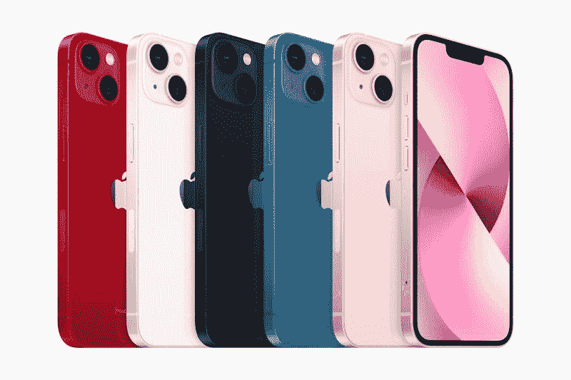
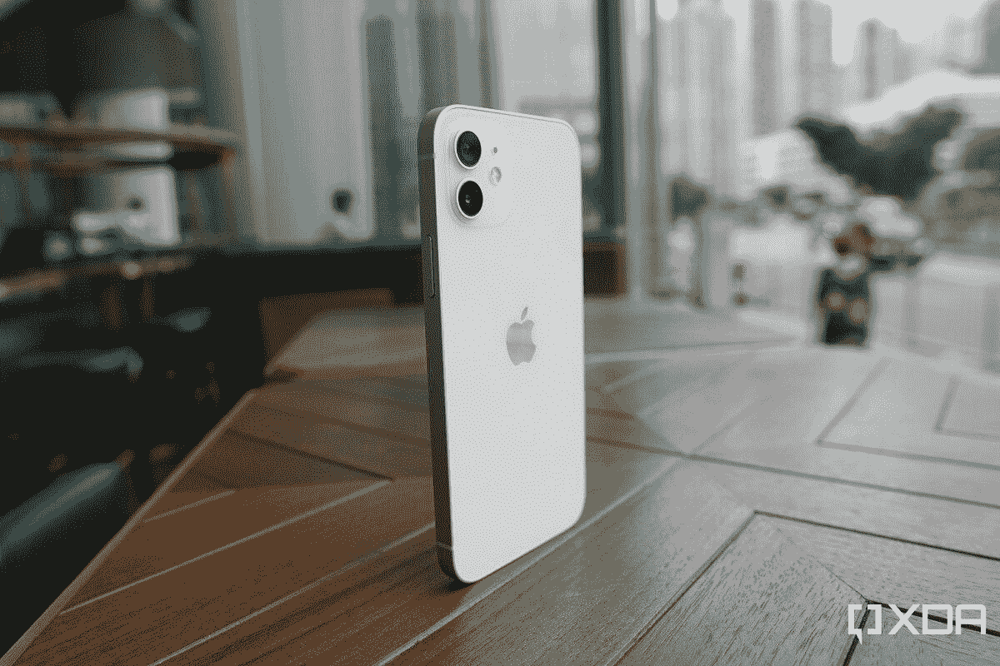

# 2023 年最佳 iPhones

> 原文：<https://www.xda-developers.com/best-iphone/>

iPhone 是世界上最主流、最普遍的智能手机——也许是消费产品，如果你想买一款新手机，无数的选择可能会让你不知所措。默认购买最新的可能很容易，但对一些人来说，购买旧的或不同的型号可能更有意义。有了苹果业内最好的软件更新，你可以买一部旧手机，但仍能获得最新的苹果体验。

我们在 XDA 已经测试了每一部 iPhone，所以这里是我们值得信赖的指南，希望能帮助你做出更明智的决定。如果你想寻找更多选择，我们有关于[最佳安卓手机](https://www.xda-developers.com/best-android-phones/)的推荐，以及一份关于[最佳手机](https://www.xda-developers.com/best-phones/)的综合推荐列表。

## 对大多数人来说最好的 iPhone:iPhone 13

你可能会奇怪，既然 iPhone 14 已经存在，为什么我们还要把 [iPhone 13](https://www.xda-developers.com/apple-iphone-13-review/) 留在这个名单上。这是因为这个类别不一定是金钱可以买到的绝对最强大或最新的手机，而是考虑到功能*和*价格后，普通消费者的最佳选择。它是关于推荐最实用和最有价值的选择，而不是大部分过时或有任何破坏交易的缺陷。此外，如果我们诚实地说，iPhone 14 真的没有比 iPhone 13 带来多少有用的升级，特别是因为它们运行在同一芯片上。

iPhone 13 仍在苹果商店正式销售，现在可以在百思买或亚马逊等零售商那里打折购买，通常比 iPhone 14 便宜 100 美元左右。iPhone 13 的 Apple A15 Bionic 今天仍然非常强大——可以说是与 Android 手机中最好的芯片一样强大 12MP 主摄像头和超宽摄像头即使在 2022 年底也仍然非常强大。在苹果计算摄影的帮助下，iPhone 13 相机在白天和晚上都表现出色，可以在智能手机上拍摄一些最好的视频。你还可以获得令人印象深刻的电影模式，在视频中创造了半令人信服的人工散景。

与更重的 Pro iPhones 或巨大的 Pro Max iPhones 相比，iPhone 13 由带有“陶瓷盾”的铝制机身制成，握起来相对舒适。我们在 XDA 特别喜欢白色模特。

iPhone 14 稍微好一点——它有一个更大的主图像传感器，和一个略胜一筹的 GPU——但老实说，这些改进并不能证明全新一代的合理性，也不能证明价格差异。苹果似乎已经为今年的 Pro iPhones 保留了真正的升级。如果你是一名普通消费者，只想要一部功能强大、拍摄足够好的照片、完成所有社交媒体和工作任务的 iPhone，考虑到价格和价值主张，iPhone 13 仍然是最佳的总体选择。

 <picture></picture> 

Apple iPhone 13

##### 苹果 iPhone 13

iPhone 13 可能已经有一年的历史了，但它仍然非常强大，对于大多数人来说，它是最好的 iPhone，因为他们的智能手机使用不需要专业手机的所有功能。

## 最佳旗舰 iPhone: iPhone 14 Pro Max

如果你想要苹果最新最大的产品，那么 [iPhone 14 Pro Max](https://www.xda-developers.com/apple-iphone-14-pro-max-hands-on/) 是你事实上的选择。但与 iPhone 13 Pro Max 相比 12 Pro Max 只带来了边际改进不同，今年的 14 Pro Max 带来了一些重大升级。你会注意到的第一件事是缺口不见了，取而代之的是一个名为动态岛的切口。之所以这样命名，是因为它不仅仅是一个静态的硬件组件。苹果在切口周围内置了 UI 元素，因此根据动作的不同，动态岛会变形为不同的形状和大小。

例如，播放来自 Spotify 的音乐，这个岛会显示专辑封面和一个随着节拍重击的小音乐栏。启动计时器，你可以看到时钟在现在的长岛内滴答走秒。随着应用程序支持的增长，将会有更多的方式与它互动和玩耍。

在其他地方，iPhone 14 Pro Max 还配备了一个改进的 4800 万像素主摄像头，它使用像素宁滨技术来产生更亮、更细节的图像。超宽相机的图像传感器尺寸也有所增加，以实现卓越的弱光能力。还有一种新的机器学习算法，称为“光子引擎”，有助于改善低光照片。

iPhone 14 Pro Max 还带回了出色的 3 倍长焦变焦，最大变焦可达 15 倍。虽然长变焦(10 倍及以上)，iPhone 14 Pro Max 仍达不到顶级 Android 手机的水平，但我们认为 iPhone 14 Pro Max 可能拥有目前市场上最好的 3 倍变焦镜头。我们还认为 3 倍是比 2 倍或 4 倍(后者用于 Pixel 6 Pro)更理想的短变焦长度。

由于 iPhone 14 Pro Max 是一款非常大的手机，苹果公司还设法加入了一块相当大的电池，这是我们全年测试的旗舰手机中电池寿命最好的一款。iPhone 14 Pro Max 即使有 120Hz 的刷新率，也可以持续一整天 13 个小时，回家时电池电量只有 40-50%。这是多年来第一款不会让我们 XDA 的一些人担心电池问题的 iPhone。

获得最大的 iPhone 的另一个好处是你也可以获得最大的屏幕。这里的 6.7 英寸显示屏看起来令人惊叹，具有极好的视角和最大的亮度。再配上超赞的立体声扬声器，这款手机可以让你在网飞尽情享受。不幸的是，我们 XDA 的一些人也发现这个模型用一只手有点难。但如果你的手很大，或者不介意经常双手握手机，iPhone 14 Pro Max 是最大也是最糟糕的。

 <picture></picture> 

Apple iPhone 14 Pro

iPhone 14 Pro Max 是最大和最糟糕的 iPhone，给你一个新的动态岛，改进的摄像头和史诗般的电池寿命。

## 不喜欢大屏幕的超级用户的最佳 iPhone:iPhone 14 Pro

还记得两年前 iPhone 12 Pro 在 12 Pro Max 中缺失了一些功能吗？苹果现在已经给予了 Pro iPhones 完全的平价，因为 [iPhone 14 Pro](https://www.xda-developers.com/apple-iphone-14-pro-max-review/) 除了物理尺寸(包括电池)之外，与 iPhone 14 Pro Max 完全相同。这意味着，如果你想要苹果公司提供的绝对最好的产品，你不必非得买那种巨大的手机。

iPhone 14 Pro 运行在苹果最新的全功能 A16 仿生 SoC 上，配有一个新的 48MP 主摄像头和一个更大的图像传感器超宽摄像头，另外你还可以获得动态岛，我们刚刚在上面的一段中写过。

新的 4800 万像素相机拍摄像素像素为 1200 万像素的照片，无论白天还是晚上都能产生出色的动态范围。一种新的光子引擎有助于手机在弱光条件下进一步表现出色。像“电影模式”，这就像视频的肖像模式，旧的最爱，回归。

iPhone 14 Pro 的视频性能也得到了提升，这要归功于一种新的“动作模式”，它可以产生更好的稳定性。iPhone 14 Pro 的另一个优点是自拍。苹果的原深感摄像头可以真正了解你的脸，并应用逼真的人像照明和令人信服的数字散景。iPhone 14 Pro 在保持肤色逼真方面也做得很好，不像一些安卓品牌会让我们的皮肤看起来很有弹性。

当然，它的构造是顶级的，前后都有不锈钢框架和陶瓷防护玻璃。虽然我们发现手机的锋利边缘握起来不太舒服，但它看起来是一款令人惊叹的设备。iPhone 14 Pro 的另一个优点是续航。尽管有 120 赫兹的屏幕，这款手机一次充电可以让你坚持一整天。

iPhone 12 Pro 和 12 并没有太大的区别。但是现在，iPhone 13 Pro 明显比 iPhone 13 好。因此，如果你想要一个强大的 iPhone，而不是巨大的尺寸，那么这是一个可以得到的。

 <picture></picture> 

Apple iPhone 14 Pro and Apple iPhone 14 Pro Max

iPhone 14 Pro 在一个对大多数人来说大小合适的封装中带来了新的屏幕设计、新的摄像头和移动设备中最强大的芯片。

## 对大多数人来说最实惠的 iPhone:iPhone 12

如果你的目标是节省一点钱——但你也不想要真正过时的 iPhone SE——那么 [iPhone 12](https://www.xda-developers.com/apple-iphone-12-review/) 是一个不错的选择。即使在两年前，iPhone 12 今天仍然表现很好，其苹果 A14 Bionic 在 2022 年底仍然表现很好。

虽然两年前的 iPhone 12 相机系统失去了 iPhone 13 和 14 系列中引入的一些有趣的功能，如“电影模式”或“动作模式”，但如果你有足够的照明，你仍然有一个强大的双相机系统，可以捕捉非常宽和超宽的图像。在弱光环境下拍摄，这两个镜头都必须比大多数 2022 年旗舰手机更多地恢复到夜间模式，但对大多数人来说这根本不是一个交易破坏者。

按照 2022 年的标准，iPhone 12 的视频性能仍然非常好。期待出色的稳定性和镜头之间的无缝切换中间拍摄。Android 品牌在许多方面已经赶上了苹果，但在视频性能方面，iPhone 仍然是王者。

而且因为苹果给了 iPhone 很大的软件支持，所以即使你买了这个老款的 iPhone，你还是可以运行最新版本的 iOS。在其他地方，你仍然有优质的 iPhone 设计语言，陶瓷盾牌和铝栏杆，加上华丽的 OLED 面板。虽然 2022 年屏幕的 notch 和 60Hz 刷新率感觉现在有点落后。

一些读者可能会嘲笑 iPhone 12 599 美元的价格是“负担得起的”，但请记住，苹果产品通常比其他产品更贵，两年前仍具有旗舰品质的 iPhone 599 美元在这个领域是一个很好的价格。

 <picture></picture> 

Apple iPhone 12

##### 苹果 iPhone 12

如果你想要一部价格合理但仍有旗舰感觉的 iPhone，看看两年前的 iPhone 12 就知道了。

## 最佳小型 iPhone: iPhone 13 Mini

iPhone 13 Mini 不仅仅是小，而是非常娇小。大多数人应该能够将整个设备放在手掌上，用拇指轻松触摸屏幕的四个角落。然而，不要被它精致的外形所迷惑。iPhone 13 Mini 仍然具有与 iPhone 13 相同的冲击力，所以你仍然可以获得 5 纳米强大的 SoC，非常好的主摄像头和超宽摄像头，以及铝栏杆和陶瓷屏蔽保护显示屏玻璃面板。

相机系统与 iPhone 13 相同，所以这意味着你有一个非常强大的双摄像头设置。在拍摄过程中，在广角和超广角相机之间无缝切换，或者瞄准并拍摄任何地方，即使在逆光的情况下，也能获得正确曝光的照片。

这里的电池有点弱——这款手机可能无法支持你度过繁忙的周六的整整 13 个小时，但在你坐在办公桌前的典型工作日，iPhone 12 Mini 的续航能力是不错的。

在软件方面，你可以期待在设置手机的一个小时内下载并运行最新版本的 iOS，一旦设置完毕，iPhone 12 Mini 的软件将像任何新的 Android 或 iPhone 一样运行。这是一部无论你扔什么都不会漏拍的手机。

如果你想要这么小的手机，你真的应该考虑现在抢购，因为苹果显然已经放弃了 Mini 系列。

 <picture></picture> 

Apple iPhone 13 Mini

##### 苹果 iPhone 13 Mini

iPhone 13 Mini 可能是苹果迷你手机实验中的最后一款，所以你现在可能想买了。不要被微小的尺寸所迷惑——这个东西在 2022 年仍然很强大。

## 最佳预算 iPhone: iPhone SE 3 (2022)

如果你想要绝对最便宜的 iPhone(那是没用过的或几年前的)，iPhone SE 3 (2022) 是唯一低于 430 美元的 iPhone。它可能缺乏这里列出的其他 iPhones 的更华丽的全屏设计，但它的尺寸很小，仍然有标志性的圆形 home 键，对于那些仍然喜欢它的人来说，这是按下按钮的触觉。

有了这个型号，你仍然可以获得苹果 A15 仿生，5G 支持，IP67 防水防尘(对于低于 500 美元的手机来说很少见)，以及一个不错的 OIS 单摄像头。像往常一样，视频录制是这款设备的一大优势。这是你现在可以正式购买的最便宜的 iPhones 之一，将获得最长的软件支持。

较小的尺寸也有其吸引力，因为在苹果推出 iPhone 12 和 13 Mini 之前，这是真正不喜欢大手机的人所追求的手机。重量为 144 克，非常便于放在手中或口袋里。

4.7 英寸，750 x 1334 的屏幕不会与列表中的其他 iPhones 竞争，但就其价格而言，它仍然是一个不错的液晶面板，苹果的微调产生了出色的色彩和可接受的最大亮度。你还可以得到立体声扬声器。电池寿命不太长，所以如果你想要一整天都充满信心的东西，请寻找更新的选项。有了这款手机，最好能有卑微的期待。

 <picture></picture> 

Apple iPhone SE 3

##### 苹果 iPhone SE (2022)

iPhone SE (2022)是目前你能买到的最便宜的全新 iPhone。

* * *

## 无论你选择哪一款 iPhone，你都会得到很好的服务

尽管我们在 XDA 对 Android 和该平台带来的所有定制化情有独钟，但我们可以承认，在及时和长期提供软件更新方面，苹果在 iPhone 上做得更好。虽然我们偏爱 iPhone 14 Pro Max 和 iPhone 13，但这份名单上的任何设备都将为您提供良好的服务。