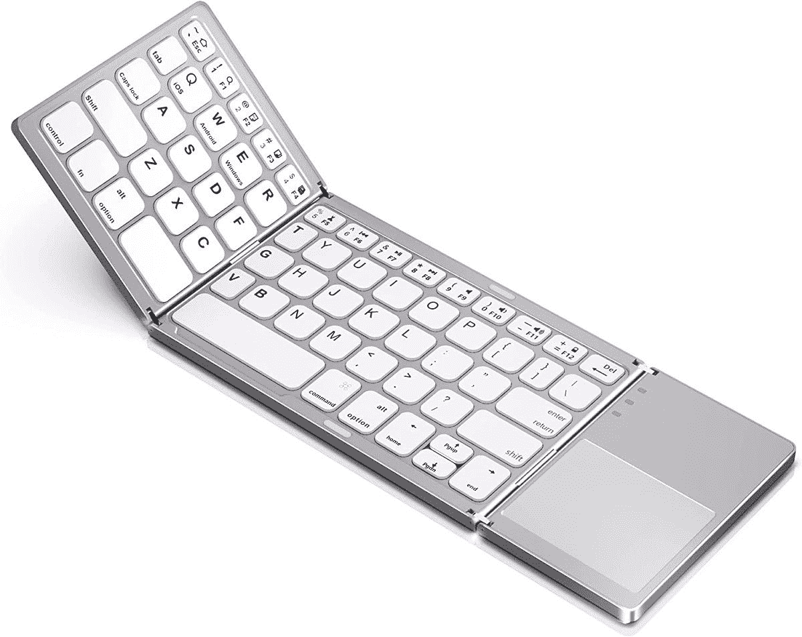
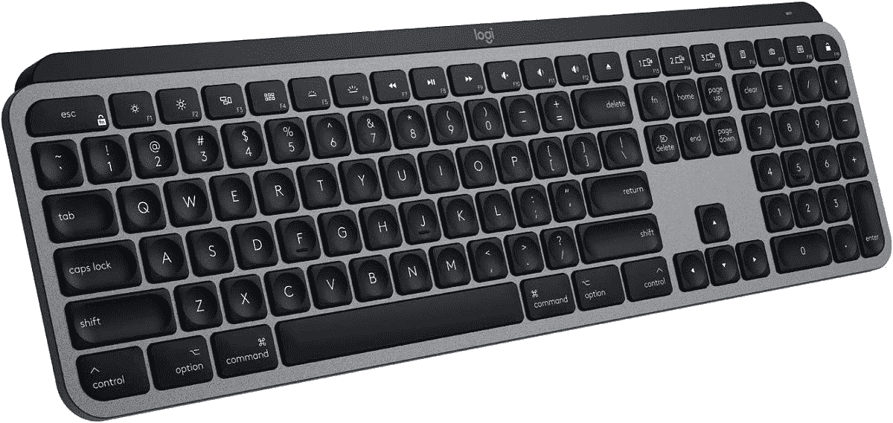
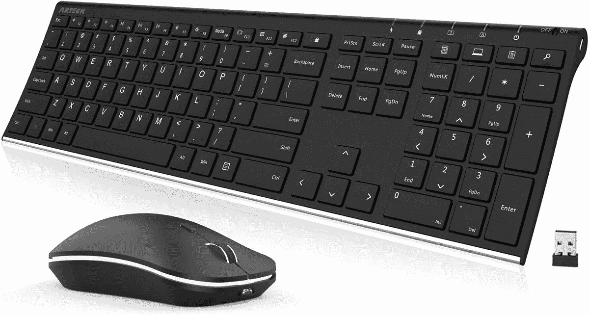
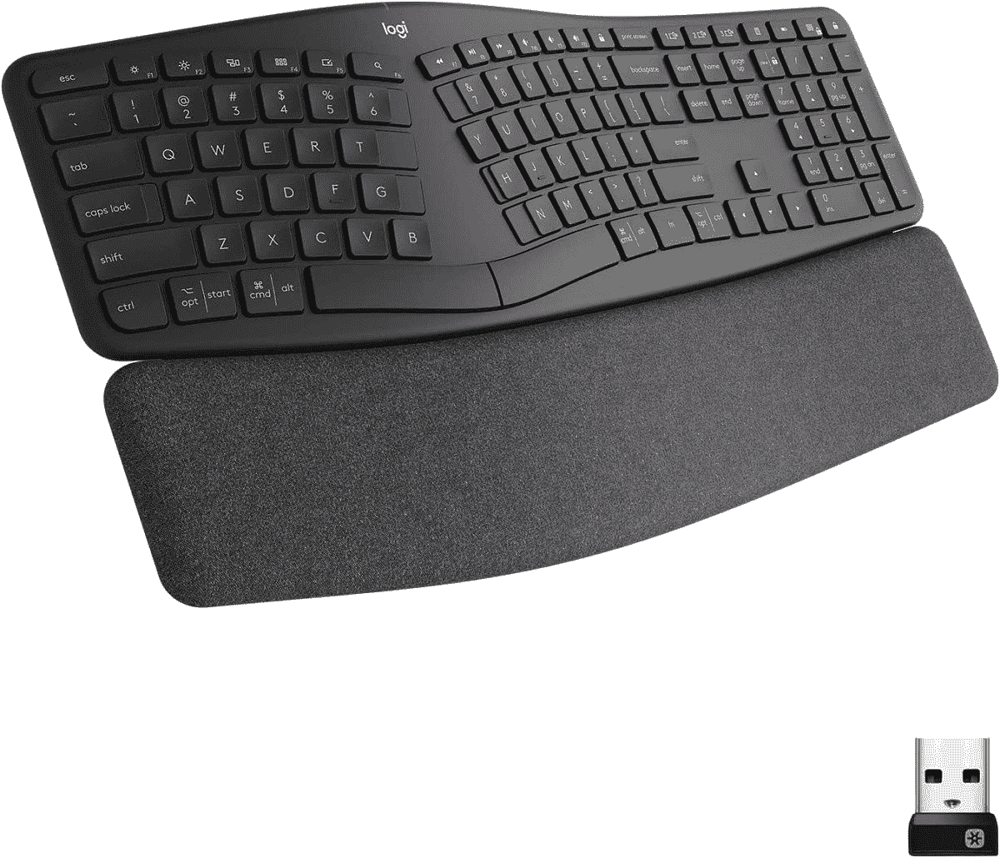
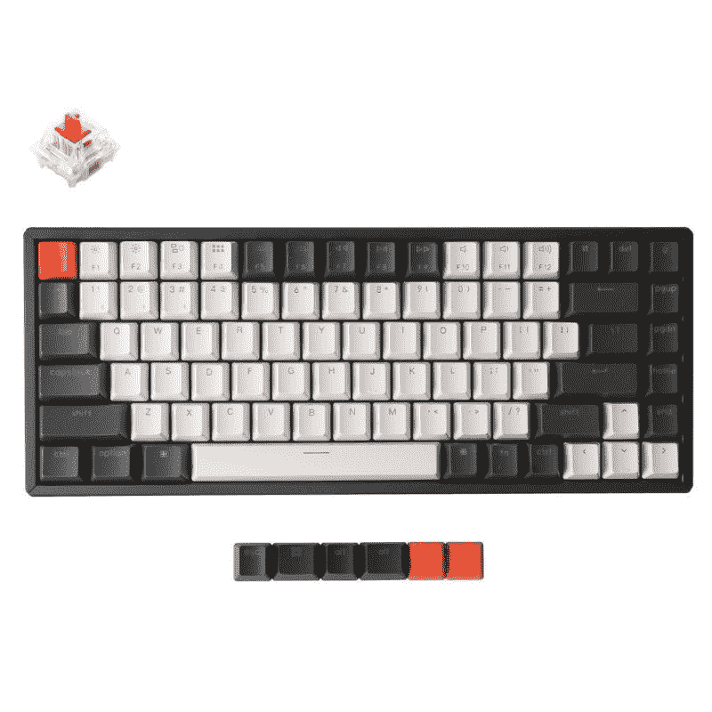

# 2023 年 Chromebooks 最佳键盘

> 原文：<https://www.xda-developers.com/best-keyboards-chromebooks/>

# 2023 年 Chromebooks 最佳键盘

我们为您的 Chromebook 编制了一份最佳键盘列表。讨论了几种不同的价位和设计。

如果你在工作或学校使用 Chromebook，你可以使用一个[扩展坞](https://www.xda-developers.com/best-docking-stations-chromebooks/)和外部显示器。使用外接显示器可以提供更多的屏幕空间，坞站可以为多任务处理提供额外的端口。当然，你需要一个高质量的键盘来完善你的工作站。选择日常使用的键盘时，你会希望既舒适又可靠。选购键盘时，需要考虑一系列人体工程学设计、按键布局和高级功能。在这个列表中，我们将看看各种价位的 Chromebook 的最佳键盘。

首先，没有多少键盘是专门为 ChromeOS 设计的。为了提供多种选择，我们还在列表中包括了为 PC 和 Mac 设计的键盘。请记住，这些键盘仍然可以与 Chromebook 配合使用，使用 F1-12 作为功能键的替代品。此外，请记住，ChromeOS 可以在各种[硬件](https://www.xda-developers.com/install-chrome-os-non-chromebook-pc-tablet/)上运行，因此这些键盘也适用于你的平板电脑或 Chromebox。

*   <picture></picture>

    可折叠蓝牙键盘

    ##### 可折叠蓝牙键盘

    空间上强悍？这款可折叠蓝牙键盘可以与您的 Chromebook 配对，无论您走到哪里。它还有一个内置的触摸板，所以你不需要携带鼠标。

*   <picture></picture>

    罗技 MX 键

    ##### 罗技 MX 键

    罗技 MX 键是花钱能买到的最好的键盘之一。它不仅可以与 Chromebook 配合使用，还具有背光按键，可以连接多达三种不同的设备。

*   <picture></picture>

    Brydge C-Type

    ##### Brydge C-Type

    Brydge C-Type 无线键盘是一款与 ChromeOS 集成的非常时尚的选择。与罗技 K580 一样，顶部有一排 Chrome 功能键。这个键盘上的键移动非常好，提供了令人愉快的日常打字体验。除了所有这些功能，您还可以获得出色的电池续航时间和终身保修。

*   <picture></picture>

    罗技 K380

    ##### 罗技 K380 键盘

    如果你希望你的键盘在桌面上占用更少的空间，可以考虑罗技 K380。这款小巧的无线键盘还提供了同时支持多达三个设备的轻松切换功能。这款键盘几乎可以与任何操作系统兼容，包括 ChromeOS。

*   <picture></picture>

    罗技 K580 ChromeOS Edition

    ##### 罗技 K580 ChromeOS Edition

    如果你正在寻找一款专为 Chromebooks 打造的键盘，这款就是你要找的。它有 ChromeOS 功能键、数字键盘以及谷歌助手键，能够在多个设备之间切换

*   <picture></picture>

    arte CK 2.4G 无线键鼠组合

    ##### arte CK 2.4G 无线键鼠组合

    这款键鼠组合将帮你省钱。你会得到一个全尺寸的无线键盘，以及一个可充电的鼠标。再也不用担心电池了！

*   <picture></picture>

    罗技 Ergo K860

    ##### 罗技 Ergo K860

    整天拿着你的 Chromebook 插在显示器上打字？这个键盘是给你的。它有一个内置的掌托，可以升高到一个舒适的打字角度，减少您键入

    时的疼痛
*   <picture></picture>

    key chron K2 机械键盘

    ##### key chron K2 机械键盘

    key chron K2-V2(热插拔)是目前市面上最好的 tenkeyless 键盘之一。这种机械板最大的优点之一是它可以让你用新的开关替换现有的开关。

希望你能在我们的列表中找到你喜欢的东西。请在评论中告诉我们这些键盘如何为你服务。如果你最喜欢的键盘不在列表中，也请在评论中告诉我们。