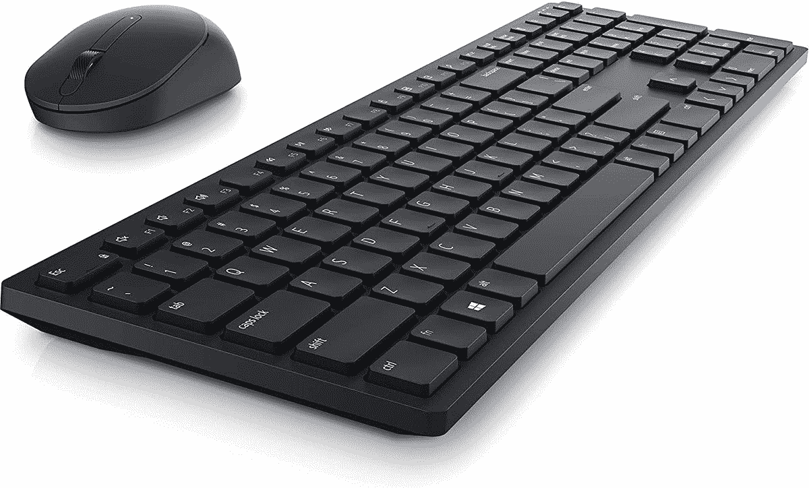
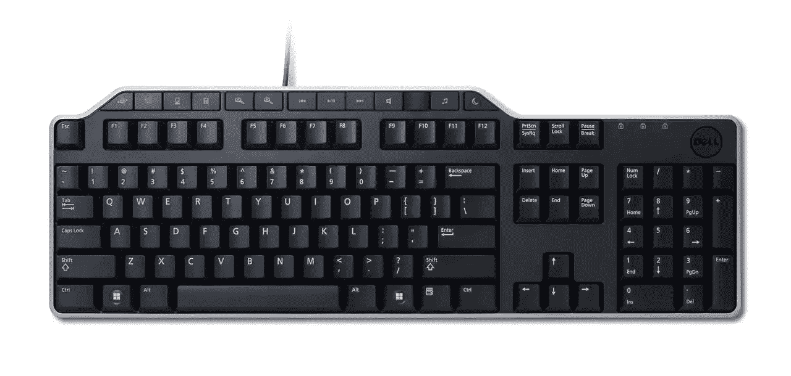
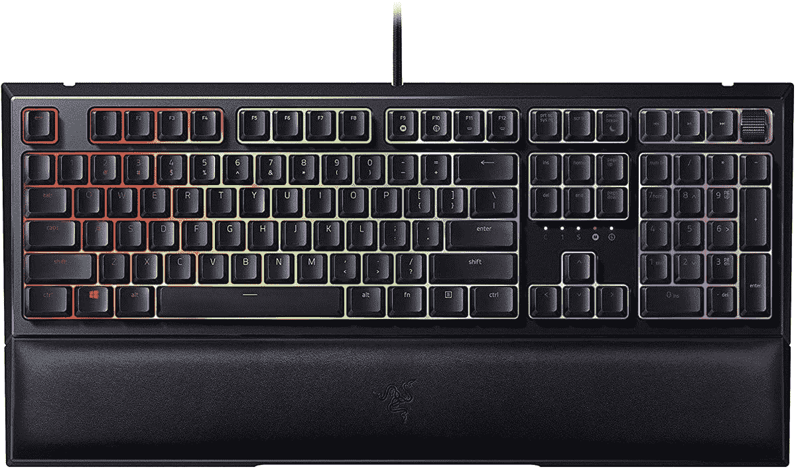

# 戴尔 XPS 13 二合一设备的最佳键盘(2022 年)

> 原文：<https://www.xda-developers.com/best-keyboards-dell-xps-13-2-in-1-2022/>

# 戴尔 XPS 13 二合一设备的最佳键盘(2022 年)

想要一个键盘来搭配您的新 Dell XPS 13 二合一设备吗？这里有一些改善打字体验的最佳选择。

2022 年的[戴尔 XPS 13 二合一设备带来了一些重大变化，特别是外形，现在是一款带有可拆卸键盘的平板电脑，可兼作机盖。虽然官方 XPS Folio 键盘可能是整体移动使用的理想键盘，但它可能并不适合所有人。如果您发现自己想要一些不同的东西，我们已经收集了您可以为 Dell XPS 13 2 合 1 设备购买的最佳键盘来帮助您。](https://www.xda-developers.com/dell-xps-13-2-in-1-2022-review/)

现在，关于 XPS Folio 键盘的事情是，它使用戴尔 XPS 13 2 合 1 底部的引脚进行连接，这使它比蓝牙更可靠，也意味着您不需要担心电池寿命。但因为它是一个专有的连接器，所以没有多少替代选项可以以同样的方式工作。我们必须专注于蓝牙键盘，它应该仍然工作得很好。我们也有一些有线选项，但请记住，为了使用这些键盘，您可能需要使用 use a 型适配器。

*   <picture></picture>

    戴尔 Pro KM5221W 组合套装

    ##### 戴尔 Pro KM5221W 组合套装

    如果您想一次搞定键盘和鼠标，戴尔提供了几个官方套装可以做到这一点。这是其中比较时尚的一款，有一个细长的键盘，上面有你想要的所有按键，还有一个小巧而舒适的鼠标。

*   <picture></picture>

    三星智能键盘三重奏

    ##### 三星智能键盘三重奏

    三星智能键盘三重奏 500 在某些方面是一个相当标准的蓝牙键盘，但除了你的 PC 之外，它还可以与三星的手机和 DeX 功能配合使用。此外，它有一个超薄的设计和几个重音键给它一些个性。

*   <picture></picture>

    key chron K2

    ##### key chron K2

    key chron K2 是一款小巧的机械键盘，带给你更精准、更有触感的打字体验。它不是全尺寸布局，所以如果您想节省桌面空间，并且仍然可以整天舒适地打字，它是一个很好的选择。此外，它还有额外的键帽，可以适用于 Windows 或 macOS。

*   <picture></picture>

    微软 Surface 键盘

    ##### 微软 Surface 键盘

    如果您想要时尚、轻薄、超值的产品来搭配您的戴尔 XPS 13 二合一设备，微软 Surface 键盘是您的完美选择。它拥有 Surface 系列的标志性铂金色，无论放在哪里都很好看，如果你有足够的桌面空间，它的全尺寸布局也非常适合办公使用。

*   <picture></picture>

    罗技 MX Mechanical

    ##### 罗技 MX Mechanical

    如果你想要一个全尺寸的机械键盘，看看罗技的 MX Mechanical 就够了。它有机械开关，但低调的按键和相对较薄的底盘，所以它不会过于笨重，你甚至可以从三种类型的开关中选择。如果你喜欢，还有一个紧凑的布局选项。

*   <picture></picture>

    Arteck 超薄蓝牙键盘

    ##### Arteck 超薄蓝牙键盘

    想要一个便宜的蓝牙键盘吗？Arteck 的这款很受欢迎。它的布局紧凑，非常适合旅行，而且非常薄。标签是为 Mac 设计的，但对于这个价格，我们不会抱怨。

*   <picture></picture>

    戴尔多媒体键盘

    ##### 戴尔多媒体键盘

    想要一个用线缆连接的简易键盘？戴尔的这款正是如此，它采用全尺寸布局，非常适合打字和办公。此外，一排专用的媒体键增加了一些额外的控制。

*   <picture></picture>

    Razer or nata V2

    ##### Razer or nata V2

    Razer or nata V2 是一款有趣的机械键盘和薄膜键盘的混合体，敲起来仍然感觉很棒。这也是伟大的，如果你喜欢 RGB 照明感谢每键 Razer 色度 RGB。不过，这是一个有线键盘。

如果你想为 Dell XPS 13 2 合 1 (2022)购买键盘，这些就是我们的建议。我们知道 XPS Folio 键盘可能是大多数用户的最佳选择，但如果您想要一些不同的东西，这些都是很好的选择。就我个人而言，我有一个 Razer Ornata V2，我喜欢使用这个键盘，所以它得到了我的全面推荐。但是这个列表上的其他选项看起来也很棒。

如果您有兴趣购买 Dell XPS 13 2 合 1 设备，可以使用以下链接购买。如果你想获得 XPS Folio 键盘，最好是开箱即用，因为它只需额外支付 100 美元，而不是单独购买的 150 美元。如果你想看看其他的选择，看看你现在能买到的最好的 Windows 平板电脑，或者如果你想要不同的外形，看看 T2 最好的戴尔笔记本电脑。这个列表中的键盘(除了 XPS Folio)应该和它们中的任何一个都一样好用。

 <picture></picture> 

Dell XPS 13 2-in-1

##### 戴尔 XPS 13 二合一设备

Dell XPS 13 2 合 1 是一款时尚的 Windows 平板电脑，配有清晰的 3:2 显示屏和第 12 代英特尔处理器。你可以用 XPS Folio 键盘来配置它，这可能是获得笔记本电脑体验的最佳方式。