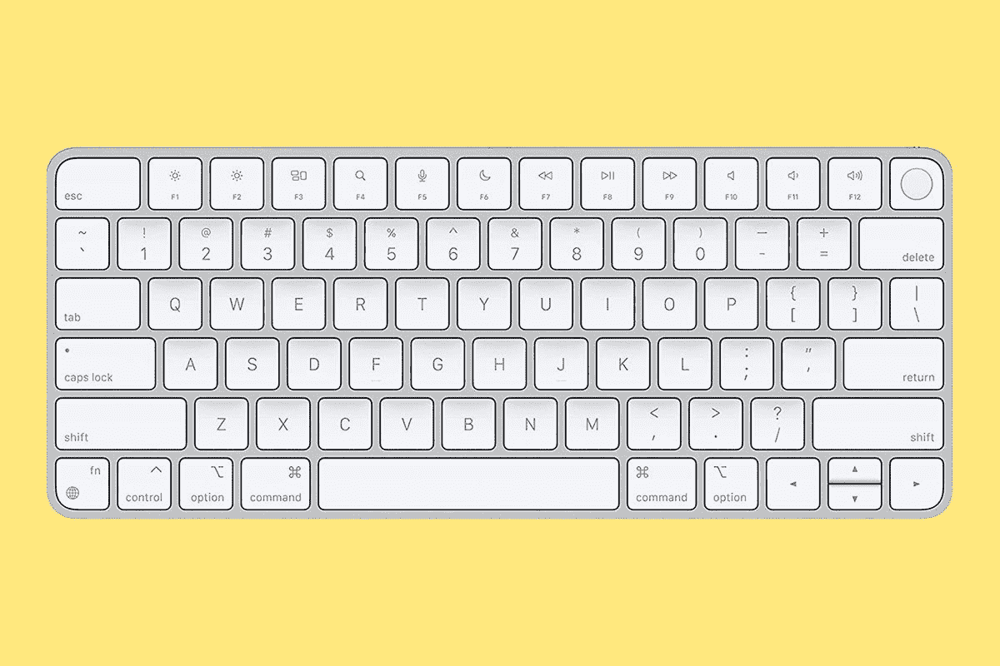
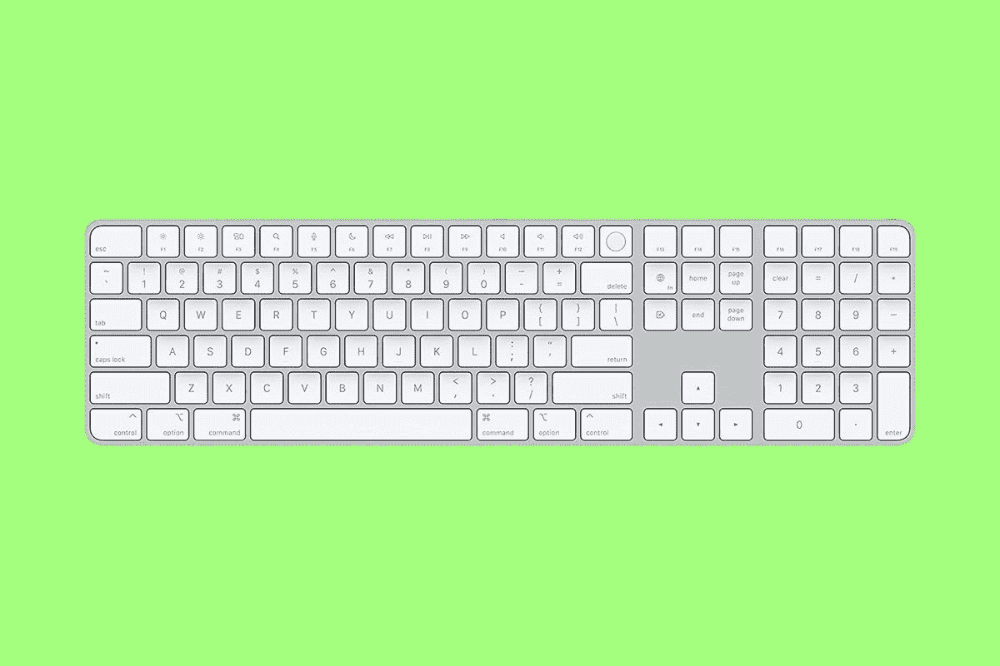
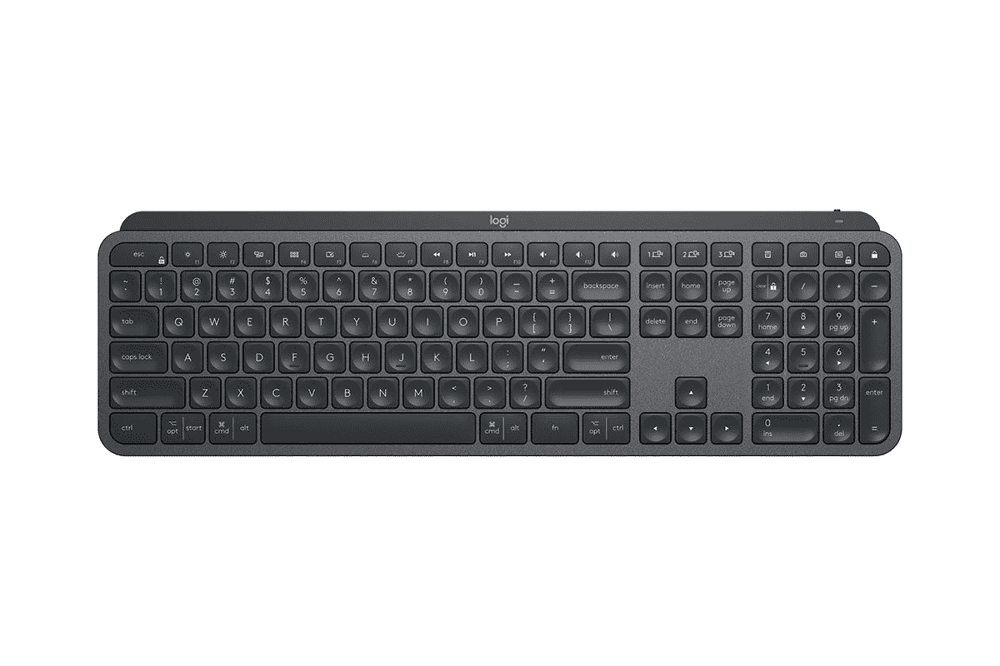
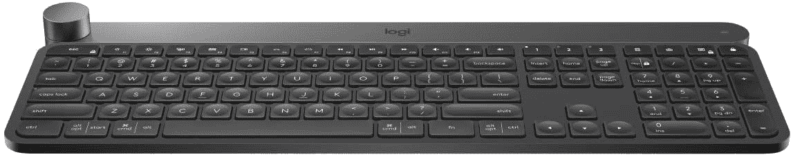
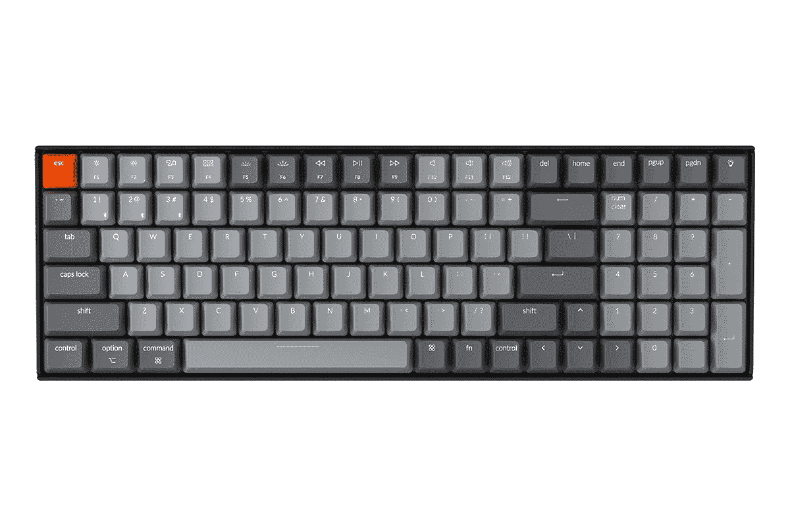
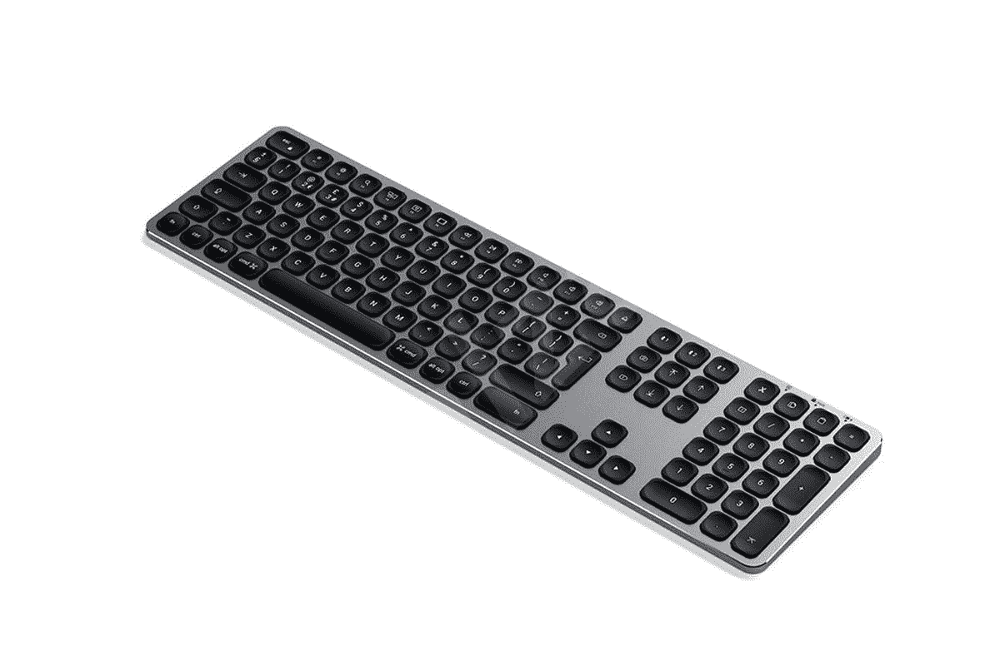

# 2023 年 M1 苹果 iMac 2021 最佳键盘

> 原文：<https://www.xda-developers.com/best-keyboards-m1-apple-imac/>

苹果在 4 月份的春季发布会上发布了新款 M1 iMac，同时发布的还有最新的 iPad Pro 系列。它得到了急需的重新设计，现在由苹果公司去年推出的基于 ARM 的 M1 芯片组驱动。新款 iMac 还配备了 24 英寸 4.5K 视网膜显示屏，功能强大的六扬声器系统，带有三麦克风阵列，并有多达 7 种颜色可供选择:蓝色、绿色、粉色、银色、黄色、橙色和紫色。

如果你有兴趣为自己买一台，M1 iMac 将从 2021 年 5 月 21 日开始接受预购、交付和公开销售。

新的 [iMac 有三种配置](https://www.xda-developers.com/apple-imac-2021-pre-orders/),起价为 1299 美元(₹1,19,900)，8 核 CPU，7 核 GPU 选项，具有 8GB 内存和 256GB 存储空间。还有售价 1499 美元(₹1,39,900)的 8 核 CPU 和 8 核 GPU 选项，也配有 8GB RAM 和 256GB 存储空间。配有 8 核 CPU、8 核 GPU、8GB 内存和 512GB 存储的顶级版本售价为 1699 美元(₹1,59,900).

 <picture></picture> 

Apple 24-inch iMac (2021)

##### 苹果 iMac (2021 年)

新款 iMac 进行了彻底的重新设计，采用了由苹果 M1 硅技术支持的超薄设计，全新的 24 英寸 4K 视网膜显示屏和七种颜色选择。

今天，我们来看看适用于新款苹果 iMac 2021 的最佳键盘:

## 触控 ID 魔法键盘

苹果今年发布了一款新的魔法键盘，其中包括触控 ID。这是 Mac 产品中第一个提供指纹认证的外部键盘，它将提供与新款 IMAC 相同的七种颜色。如果你选择 8 核 CPU 和 8 核 GPU 选项，带触控 ID 的新魔法键盘目前与 iMac 捆绑在一起。然而，如果你选择基本型，你会得到没有触控 ID 的老式键盘。苹果刚刚开始销售带有触控 ID 的魔法键盘和带有触控 ID 和数字键盘的魔法键盘，尽管它仍然只有银色。

 <picture></picture> 

Apple Magic Keyboard with Touch ID

##### 带触控 ID 的苹果魔法键盘

Apple Magic Keyboard 在 iMac 上提供了最佳的打字和可用性体验。

 <picture></picture> 

Apple Magic Keyboard with Touch ID and Numeric Keypad

##### 带有触控 ID 和数字小键盘的 Apple Magic Keyboard

魔术键盘的全尺寸版本提供了类似的体验，并具有专用的数字键盘。

## 罗技 MX 键

罗技是为数不多的为苹果生产高质量配件的品牌之一。MX Keys 是用于新款 iMac 的出色的第三方全尺寸键盘，具有坚固的全金属框架和纤薄的外形。它配有智能钥匙背光，可以根据环境照明条件变化，并使用内置的接近传感器自动打开。按键本身使用剪刀开关，非常安静，而键盘可以通过蓝牙无线连接或使用 USB 接收器。额外支付 70 美元，你可以选择罗技工艺，它与 MX 键一样，但具有完全可定制的表盘，可用于各种使用情况。

 <picture></picture> 

Logitech MX Keys

##### 罗技 MX 键

Logitech MX Keys 是用于 iMac 的最佳第三方全尺寸无线键盘之一，提供出色的薄型按键和强大的功能。

 <picture></picture> 

Logitech Craft

##### 罗技工艺

这与 Logitech MX 键相同，但带有一个可定制各种功能的旋转拨盘。

## 奇克隆·K4

如果你不喜欢低调的键盘，那就看看 Keychrone K4 吧。这是一个与 Mac 完全兼容的无线机械键盘，带有可选的 Gateron 开关，可以配置白色或 RGB 背光和铝制框架。K4 是一个全尺寸的键盘，如果你想要一个更紧凑的选项，你可以试试 Keychron K2。两者都通过 USB-C 提供有线连接，通过蓝牙提供无线连接，而交换机本身可以轻松更换。

 <picture></picture> 

Keychron K4

##### 奇克隆·K4

键盘龙 K4 (v2)是 iMac 最好的机械键盘之一，提供各种按键开关。

## Satechi 铝制蓝牙键盘

这种键盘提供了类似于原始 Apple Magic Keyboard 的优雅外观，采用超薄设计和铝制机箱。据 Satechi 称，它具有“增强的”剪刀式开关键、扩展的键盘布局，以及连接多达三个设备的能力。电池可以持续 80 小时，并且可以使用 USB-C 充电。

 <picture></picture> 

Satechi Aluminum Bluetooth keyboard

##### Satechi 铝制蓝牙键盘

如果你正在为全尺寸的苹果魔术键盘寻找一个第三方的相似物，去寻找 Satechi 铝制蓝牙键盘。

## 罗技 K380

如果你正在为新款 iMac 寻找一款价格实惠的无线键盘，这里还有一个建议。罗技 K380 有多种颜色，外观简洁时尚。蓝牙键盘能够连接多达三个设备，由标准 AAA 电池供电，可持续使用长达两年。我亲自试过这种键盘，虽然圆形键看起来很独特，但它们带有剪刀开关和触觉凸起，所以需要一段时间来适应它们。

 <picture></picture> 

Logitech K380

##### 罗技 K380 键盘

这是您应该为 iMac 购买的最实惠、最小巧的无线键盘之一

* * *

触控 ID 的新魔法键盘可能是名单上最令人兴奋的键盘。但如前所述，它目前仅适用于新款 iMac。据我们所知，该键盘将与所有 Mac 设备完全兼容，尽管触控 ID 功能仅适用于运行 M1 芯片组的设备。要了解更多信息，请查看我的同事做的一个快速解释器，解释新的魔法键盘与触控 ID 的兼容性。