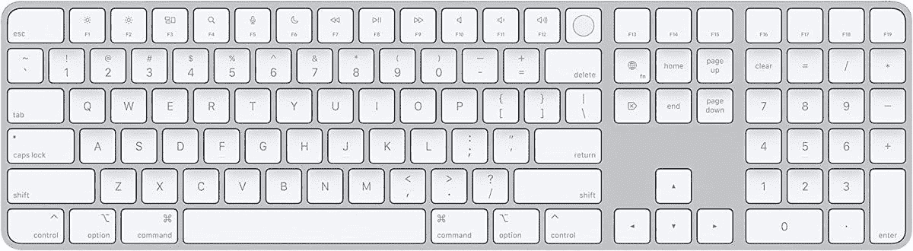
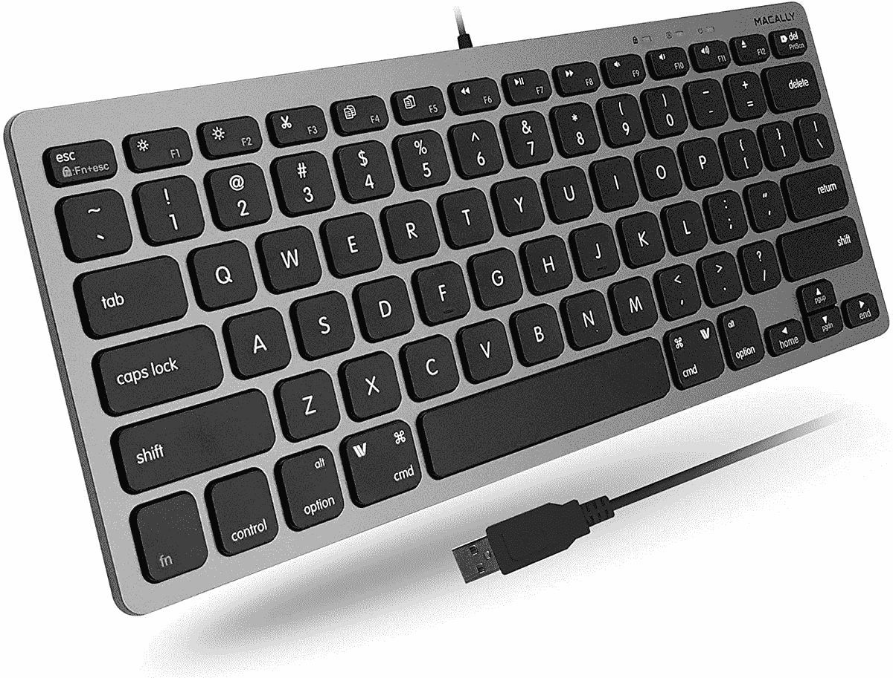

# 2023 年 Mac Studio 的最佳键盘

> 原文：<https://www.xda-developers.com/best-keyboards-mac-studio/>

# 2023 年 Mac Studio 的最佳键盘

Mac Studio 的包装盒中没有键盘。以下是你可以为你的新苹果电脑单独购买的最好的键盘。

苹果一直在努力通过在 Mac 系列中实现自己的芯片来抛弃英特尔芯片。如果你[买一台 Mac](https://www.xda-developers.com/best-macs/) ，它很可能包含 M 芯片中的一个。这是因为该公司已经过渡到大多数可用的模式。开发者们也在为苹果芯片优化他们的[应用，以在](https://www.xda-developers.com/best-apps-apple-silicon/) [macOS Monterey](https://www.xda-developers.com/macos-monterey) 和 [Ventura](https://www.xda-developers.com/macos-ventura) 上提供更流畅的体验。Mac 家族中一个引人注目的新成员是 [Mac Studio](https://www.xda-developers.com/apple-mac-studio-m1-ultra-review/) 。苹果公司在其 Peek 性能活动中展示了它以及无与伦比的 M1 超芯片。尽管它是一台强大的计算机，但它的盒子不包括键盘，你必须单独购买一个。以下是适用于您的新 Mac Studio 的最佳键盘。

*   <picture></picture>

    Apple Magic Keyboard with and numerical Keyboard

    ##### Apple Magic Keyboard with and numerical Keyboard

    这款键盘包含了上一款的所有功能，还附带了一个数字小键盘。它非常适合那些与数字打交道的人。

*   <picture></picture>

    罗技 MX 按键发光无线键盘

    ##### 罗技 MX 按键

    这款无线键盘由罗技提供了舒适的按键设计。它有背光，有一个数字键盘，并提供了一个体面的电池寿命。

*   <picture></picture>

    罗技 K380

    ##### 罗技 K380 键盘

    这款蓝牙键盘最多可以同时连接三台设备。它非常适合那些在多台计算机上进行多任务处理的人。

*   <picture></picture>

    key chron 机械游戏键盘

    ##### key chron K4

    这款机械键盘还支持多达三种设备连接。它是背光的，有有线和无线两种模式。

*   <picture></picture>

    Macally 小型 USB 有线键盘

    ##### Macally 小型 USB 有线键盘

    这款有线键盘提供了纤薄、紧凑的设计。它有三种不同的颜色可供选择——白色、银色和太空灰。

* * *

如果我个人必须为我的 Mac 工作室购买一个这样的键盘，我会选择带有触控 ID 的苹果魔法键盘。这是因为它完全集成了 macOS 并支持触控 ID。我不会买带数字键盘的，因为它太大了，而且我的工作流程不依赖数字。没有额外键盘的那个更简洁，能做我需要它做的事情。

Mac Studio 由苹果 M1 Max 或 M1 Ultra 芯片驱动。采用前一种 SoC 的机型在美国的起价为 1999 美元，而采用后一种处理器的机型起价为 3999 美元。这两种型号都只有银色，并且不包括内置显示器、键盘或鼠标。因此，您必须单独购买自己的配件。不过，值得注意的是，这款台式电脑是面向需要非凡处理能力的专业用户的。普通用户可以满足于更实惠的 MAC。

 <picture></picture> 

Apple Mac Studio

##### 苹果 Mac 工作室

Mac Studio 由苹果 M1 Max 或全新的 M1 Ultra 芯片驱动。它只有银色可选，起价 1999 美元。

*你会为你的 Mac 工作室购买哪种键盘？请在下面的评论区告诉我们。*