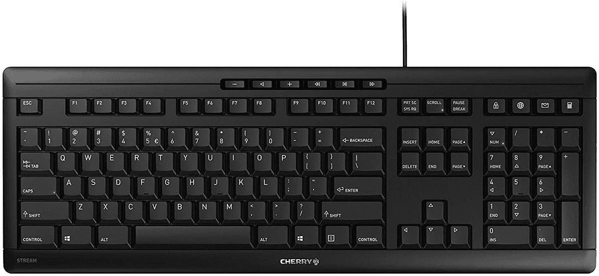
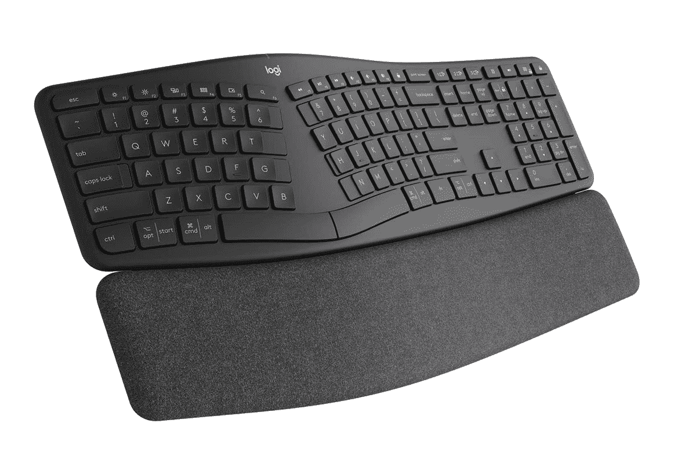
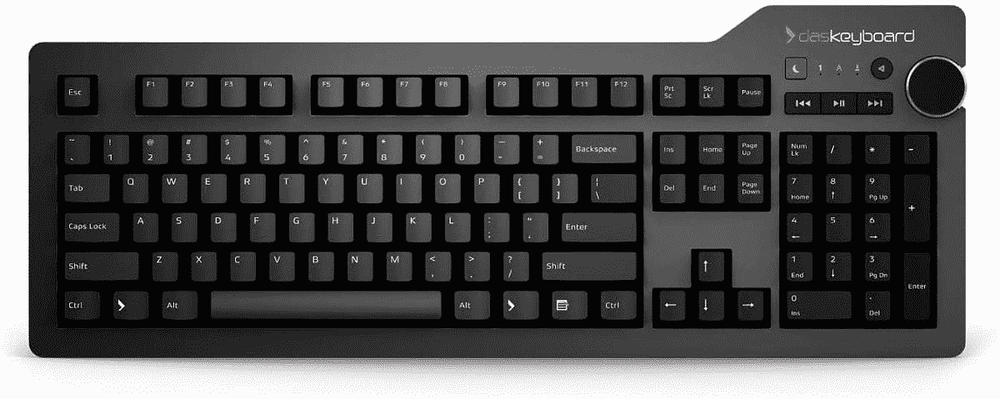
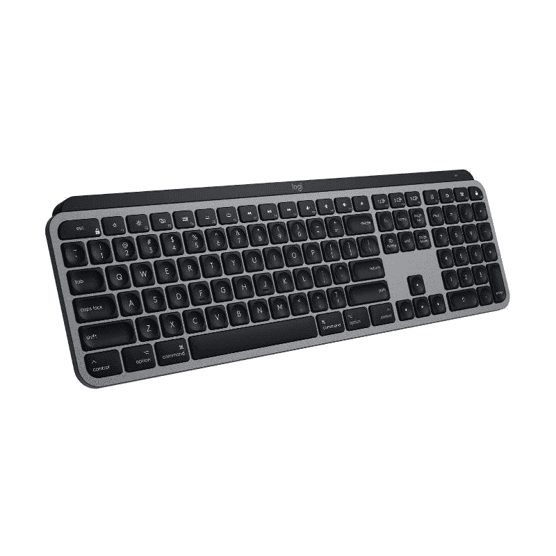

# 2023 年最佳联想 ThinkPad X1 碳键盘

> 原文：<https://www.xda-developers.com/best-keyboards-thinkpad-x1-carbon/>

# 2023 年最佳联想 ThinkPad X1 碳键盘

我们收集了一些最好的联想 ThinkPad X1 碳键盘，以获得可靠的打字体验。查看我们的推荐！

联想在笔记本电脑上提供了一些最好的键盘，尤其是 Thinkpad 系列。它们非常适合打字，因为与 XPS 13 或任何 MacBooks 等其他笔记本电脑的键盘相比，它们的按键感觉更“咔嗒”且行程更长。新推出的 [ThinkPad X1 Carbon Gen 9](https://www.xda-developers.com/lenovo-thinkpad-x1-carbon-review/) 就是一个很好的例子，因为它包括一个制作精良、精确的优秀键盘，并提供 1.5 毫米的按键行程。你可以在我们的完整评论中了解更多信息。

但是，如果你想在躺椅或床上舒适地坐下来，放松一下，使用外置键盘，该怎么办呢？或者是坚如磐石的机械键盘？有很多选项可供选择，我们为联想 Thinkpad X1 Carbon 挑选了一些最好的键盘。

 <picture></picture> 

Lenovo ThinkPad TrackPoint Keyboard II

##### 联想 ThinkPad TrackPoint 键盘 II

ThinkPad TrackPoint Keyboard II 设法在一个紧凑的无线封装中提供我们在笔记本电脑键盘上看到的同样出色的体验。

 <picture></picture> 

Keychron K4 V2

##### 奇克隆·K4

Keychron K4 是一款无线机械键盘，带有热插拔 Gateron 开关选项，可以配置白色或 RGB 背光和铝制框架。

 <picture></picture> 

Razer Pro Type Wireless Mechanical Keyboard

##### Razer Pro 型

Razer 以其游戏外设而闻名，但他们的新 Pro Type 键盘是一种强烈推荐给关心生产力的用户的无线机械键盘。

 <picture></picture> 

Cherry Stream

##### 樱桃溪

来自最受欢迎的键盘开关制造商，Cherry Stream 是一款高度可靠的键盘，与 Cherry 的 SX 剪刀机制开关一起采用低调设计。

 <picture></picture> 

Logitech ERGO K860

##### 罗技 Ergo K860

罗技公司表示，ERGO K860 采用分体设计，旨在改善姿势，减少紧张，并在打字时提供更好的支撑。据说这种倾斜的形状还能减少手腕和前臂的肌肉紧张。

 <picture></picture> 

Das Kayboard 4 Professional

##### Das 键盘 4 专业版

Das Keyboard 4 Professional 是一款构造良好的机械键盘，虽然它缺少背光和宏键等功能，但它仍然是一款出色的高品质机械键盘。

 <picture></picture> 

Logitech MX Keys Illuminated Wireless Keyboard

##### 罗技 MX 键

MX Keys 是一款出色的全尺寸键盘，采用坚固的全金属框架和超薄外形。它配有智能按键背光，而按键使用静音剪刀开关。

 <picture></picture> 

Microsoft Designer Compact

##### Microsoft Designer 紧凑型键盘

这款键盘的设计与苹果的 Magic Keyboard 惊人地相似，设计非常紧凑，经过优化，尽可能地减少了桌面上的空间。它还配有低调的按键和较长的电池寿命。

 <picture></picture> 

Logitech K380

##### 罗技 K380 键盘

罗技 K380 一直是最受欢迎的紧凑型蓝牙键盘之一，对于寻求支持多设备连接的廉价产品的人来说，这是一个很好的选择。

ThinkPad TrackPoint Keyboard II 肯定会成为铁杆 ThinkPad 粉丝的选择，因为它提供了与原始笔记本电脑键盘相似的打字体验，以及良好的老式 track point，专用的左右鼠标键可能会消除对鼠标的需求。如果你正在寻找一个机械键盘，选择 Razer Pro 型。它提供了最佳的打字体验和令人满意的击键体验，橙色的按键开关确保了较低的声音，最大限度地减少了工作时对他人的干扰。此外，我们还有一份 ThinkPad X1 Carbon 的[最佳鼠标列表，如果您正在寻求扩展您的 I/O，这里是 ThinkPad X1 Carbon](https://www.xda-developers.com/mice-thinkpad-x1-carbon) 的[最佳坞站。](https://www.xda-developers.com/docks-thinkpad-x1-carbon)

此外，我们还汇总了您应该在 2021 年购买的[最佳笔记本电脑](https://www.xda-developers.com/best-laptops/)，其中列出了各种选项，包括最新的联想 ThinkPad X1 Carbon。此外，请查看 2021 年采用 USB Type-C 端口的[最佳笔记本电脑](https://www.xda-developers.com/best-usb-c-laptops/)。

 <picture></picture> 

Lenovo ThinkPad X1 Carbon

##### 联想 ThinkPad X1 Carbon Gen 9

新款联想 ThinkPad X1 Carbon Gen 9 采用了更高的显示屏、更宽的触控板，当然还有最新的英特尔第 11 代 Tiger Lake 处理器。