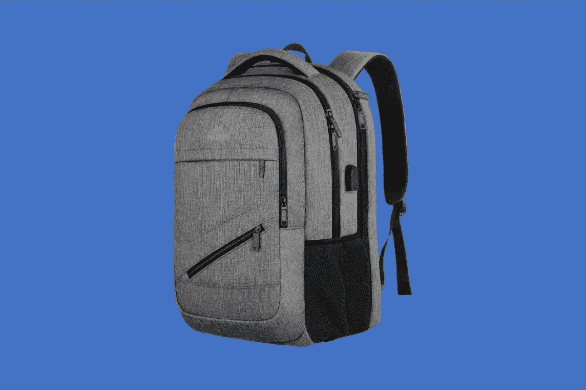
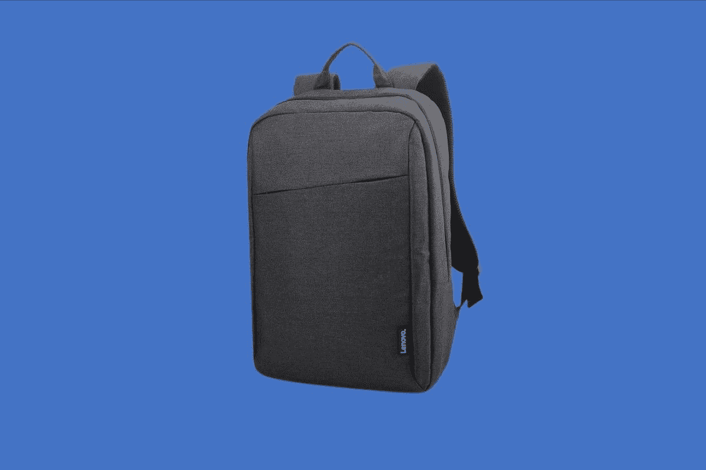
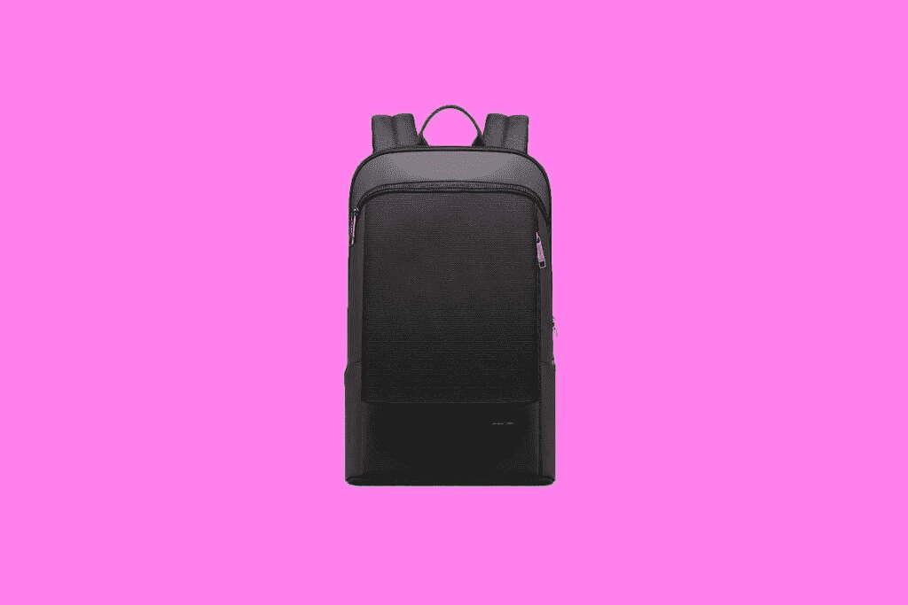
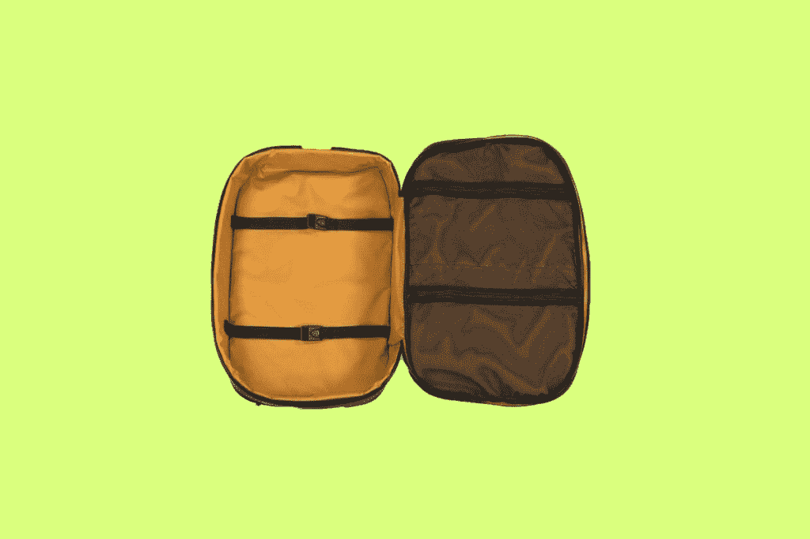
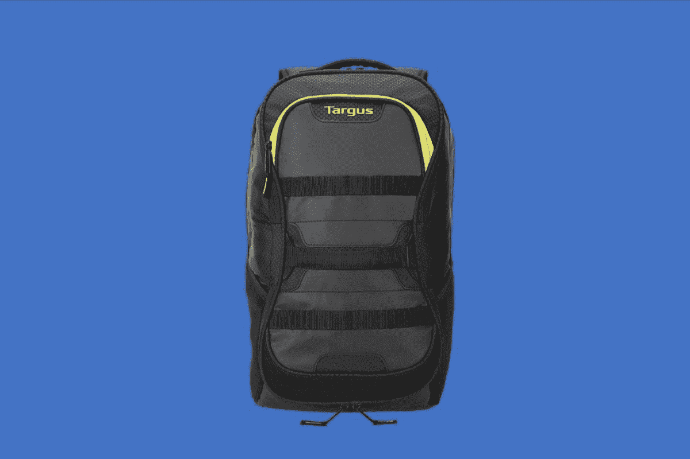
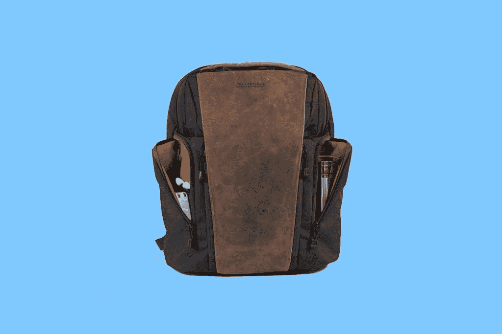
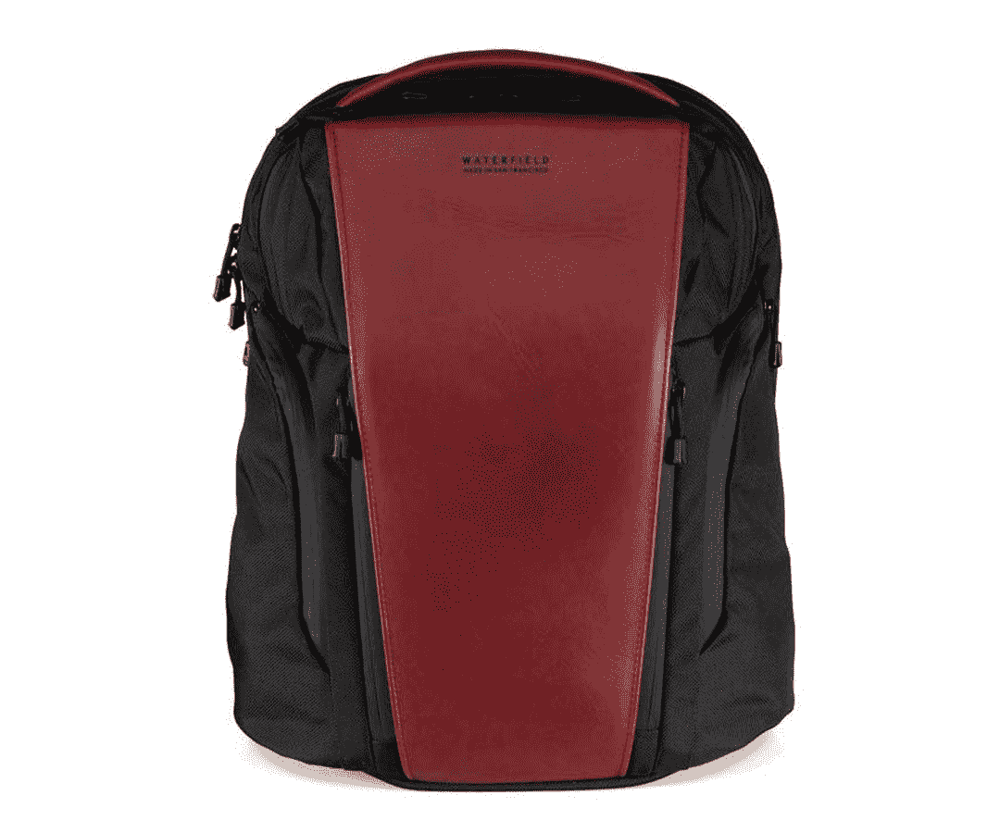

# 2023 年最佳笔记本电脑背包

> 原文：<https://www.xda-developers.com/best-laptop-backpacks-college/>

你生活中最重要的装备[可能是你的笔记本电脑](https://www.xda-developers.com/best-laptops-for-students/)。所以，当你外出时，你可能想用一个笔记本电脑背包来保护它。这些有各种形状、大小和不同类型的材料。因此，当谈到寻找一个伟大的笔记本电脑背包，有很多事情要考虑。

你需要随身携带多少装备？你想要一个不仅能存放办公用品的包吗？记住包包有几种不同的材料，这一点也很重要。许多包可以有多种用途，例如书包和运动包。在这篇文章中，我们将看看各种使用情况下的最佳笔记本电脑背包。

**浏览本文:**

## 最佳整体:马丁旅行笔记本电脑背包

 <picture></picture> 

Matein Laptop Backpad

在我们的列表中，你能买到的最好的整体背包是 Matein 旅行笔记本电脑背包。这是一个你可能没听说过的品牌，但是不要让它欺骗了你。这是一个相当耐用和时尚的背包。它也有很多空间来存放和充电其他设备。而且，如果你经常旅行，它是 TSA 友好的。所有这些的价格是 55 美元，或者打折时是 40 美元。

我们选择这款背包的原因与它的展开方式有很大关系。打包笔记本电脑和其他小工具时，您不必从顶部将其滑入。你可以将这个背包向下展开 90 度或 180 度，并在你的笔记本电脑中滑动，同时看到它的确切位置。这说明了美国运输安全管理局和机场友好和批准的功能，在那里你可以快速打开你的包，展示里面的东西。除此之外，这个包有一个行李带，所以它可以放在行李箱的顶部。这种材料还超级透气，还有一个防盗口袋，非常适合在火车上和旅途中使用。

说到移动，这款设备上甚至还有一个 USB-A 端口。你可以准备好自己的电源，把它放进去，然后布线，这样你就可以在旅途中给手机充电了。甚至还有前袋，可放置钥匙、笔、充电器等所有配件。

 <picture></picture> 

Matein Laptop Backpad

##### Matein 笔记本电脑背包

这是一个很棒的笔记本电脑背包，因为它能够打开来装载它，还有行李带、USB-充电设备端口。

## 最佳廉价笔记本电脑背包:联想笔记本电脑背包 B210

 <picture></picture> 

Lenovo Laptop Backpack

我们选择的许多背包售价都在 30 美元以上或 30 美元左右。如果你需要一个便宜的笔记本电脑背包，那么我们的第二个选择就是你。它来自一个知名品牌，联想，而且它相当圆滑和轻便。笔记本电脑背包由耐用的防水织物制成，因此它可以在雨中保护您的笔记本电脑。它还有一个针织背板，所以当你穿着它时，你的背部会感到舒适。

除此之外，您还可以快速打开前拉链，为笔记本充电器等配件提供额外的储物空间。在里面，你还可以找到单独的口袋来存放手机、名片和其他物品。联想甚至还包括笔记本或教科书插槽，这使得这成为学生的可靠选择。

请注意，这是 15.6 英寸的尺寸。如果您需要更大的笔记本电脑，也可以选择更大的 17 英寸。尺寸为 13.3 x 5.9 x 17.9 英寸，该产品有资格获得亚马逊确认适合，所以你可以使用亚马逊网页来查看你的笔记本电脑是否适合它。

 <picture></picture> 

Lenovo Laptop Backpack

##### 联想笔记本电脑背包

这款笔记本电脑背包是市面上最便宜的背包之一，但它仍然有足够的空间来放置你的设备，以及课本等其他物品

## 最佳轻薄便携背包:博派 15 寸超轻薄

## 

博派超薄背包只有三英寸厚。柔软的法兰绒隔层可以保护多达 15 英寸的笔记本电脑，并可以减少背包和电脑之间的摩擦。背套设计允许背包在行李箱手柄上滑动，便于旅行时移动。这款包的袖子上还有一些隐藏的小技巧，独特的隐藏式双拉链增加了安全性。

不到 60 美元，如果你想要最大的便携性，并且不需要每天携带大量的东西，这是一个很好的选择。该产品唯一的显著缺点之一是，由于 BOPAI 背包非常薄和紧凑，您只能在车厢内放置一台 15 英寸的笔记本电脑。

##### 博派 15 寸超轻薄

BOPAI 超薄背包非常薄，但仍有足够的空间存放您的必需品。它还有一个独特的隐藏式双拉链，以增加里面东西的安全性。

## 最适合旅行:沃特菲尔德航空旅行背包

## 

沃特菲尔德设计公司创造了一些最漂亮的包包。航空旅行背包也不例外。这款背包可以装下两台 15 英寸的笔记本电脑，或者一台 iPad 和一台笔记本电脑，此外还可以存放周末出游所需的所有衣物。这款航空旅行背包专为随身携带的最大尺寸而设计，让您可以将个人物品和技术装备放在两个独立的隔层中。

把你的个人物品放在它自己的专用隔间里。宽敞的内部明亮的黄色衬里有助于照亮内容，以便您可以快速扫描快速检索。开放的空间让你以最有效的方式组装物品。两条结实的带子将所有物品固定到位，让你的衣服保持整洁有序。拉链网布口袋，方便拿取小物品。一个专用的移动办公区有两个笔记本电脑的软垫套和配件袋。非常适合远程工作和周末度假。

虽然这个包很贵，但如果你经常往返于家和学校之间，这个包本身就很棒，而且有很多功能。

##### 沃特菲尔德航空旅行背包

这款航空旅行背包专为随身携带的最大尺寸而设计，让您可以将个人物品和技术装备放在两个独立的隔层中。一个专用的移动办公区有两个笔记本电脑的软垫套和配件袋。非常适合远程工作和周末度假。

## 最适合创意人员:Lovevook 笔记本电脑背包

 <picture></picture> 

Lovevook Business Backpack

对于创作者来说，最好的笔记本电脑背包是 Lovevook 笔记本电脑背包。这是一款专为专业人士和商务人士设计的背包。它的容量超大，尺寸为 18 x 9.5 x 5.5 英寸。厂家注明主隔层可以放衣服，但更重要的是可以放办公用品等物品。至于前面的隔间，它可以容纳创作者可能需要的物品。这包括电源组、鼠标、第二个 iPad 或平板电脑以及其他设备。

当然，创作者是在移动的，为此，你应该很高兴知道这个背包是现成的。它是防水的，由高密度牛津布料制成。还有一个外部 USB 电源端口和一根内部充电电缆，因此您可以在远离电源插座或旅行时更换设备。你只需要给这个设备接上一个电源。Lovevook 甚至还包括一个数据存储袋，所以你可以整理你的电缆，而不只是把它扔在袋子里，弄得一团糟。

我们喜欢的这款背包的较小特征包括行李带，便于将其夹在行李箱中。带衬垫的气垫也能让背包轻松背在肩上。还有一个防盗口袋，你可以把重要的贵重物品藏在里面。

 <picture></picture> 

Lovevook Business Backpack

##### Lovevook 商务背包

这款背包最适合创作者，因为它有大量的存储空间，外部还有一个 USB-A 端口，可以随时为设备充电

## 最佳学校/健身房组合:Targus 大号通勤背包

 <picture></picture> 

Targue Large Commuter Bag

放学或下班后带着笔记本电脑去健身房？你需要一个专门为这两者准备的背包。为此，Targus 大型通勤背包是最佳选择。这是一款相对较贵的背包，售价略高于 90 美元，但也有很多令人喜欢的地方。为了存放健身用品，前隔层可以轻松放入连帽衫、运动裤和其他健身服装，甚至是一个更小的瑜伽垫。背包的侧面也有容纳液体和水的空间。Targus 还指出，有一个带拉链的袋子和可拆卸的洗衣袋，你可以在那里存放你的运动鞋，并把它们与你包里的其他物品分开。

在科技方面，这款背包有专门的平板电脑和笔记本电脑隔层。它可以安装屏幕尺寸高达 15.6 英寸的设备。一定要注意隔层是有衬里和通风的，这样你的衣服和设备就不会散发出汗味。笔记本电脑隔层的底部也是防水的，所以你的笔记本电脑永远不会被弄湿。此外，还有一个内置拉链袋，可以保护您的小型贵重物品，并在您将包放入储物柜时将其隐藏起来。

 <picture></picture> 

Targue Large Commuter Bag

##### Targus 大号通勤包

这个 Targus 背包有足够的空间放你的笔记本电脑和健身用品。这是一个万能背包。

## 最佳专业背包:沃特菲尔德专业行政背包

## 

沃特菲尔德设计公司非常好，他们两次入选我们的名单。专业行政背包是学生向职业阶段过渡的理想选择。这是一个背包，可以放在任何教室或会议室里。它适合您的移动办公室，非常适合共享办公室或没有专用办公桌的远程员工。

职业经理人背包最酷的事情之一是设计的众包性质。Pro Executive 双肩背包展示了当一个产品的开发背后有真正有需求的人时，这个产品是多么有用。我个人为这个包的设计做出了贡献，我已经用我自己的专业行政背包三年多了。说到工艺和优质材料，Waterfield Designs 真是无与伦比。

这款包有很多口袋，两个大的主隔层，还有一个亮黄色的内衬，可以轻松找到包里的小物件。您可以在这个包中放入几台笔记本电脑，笔记本电脑主套的最大长度为 17 英寸，它有豪华的衬垫和保护。我经常把两台笔记本电脑和我的 iPad Pro 放在主车厢里，没有任何问题。如果您正在寻找一款集功能性和精致优雅设计于一身的背包，这款包是您的不二之选。

 <picture></picture> 

Waterfield Pro Executive Backpack

##### 沃特菲尔德专业行政背包

专业背包融合了精致和功能。高度组织的两个主要隔间，战略放置的口袋，和一个可选的行政对开会议。

这些是我们为你挑选的最好的大学背包。每个人都有适合自己的东西。如果你经常往返于家和学校之间，你一定要看看 [Waterfield 航空旅行背包](https://www.sfbags.com/products/air-travel-backpack)。需要最便携装备的学生应该购买[博派 15 英寸超薄背包](https://www.amazon.com/BOPAI-inch-Super-Laptop-Backpack/dp/B07QYF9CW1/?tag=xda-76vsghj-20&ascsubtag=UUxdaUeUpU31631&asc_refurl=https%3A%2F%2Fwww.xda-developers.com%2Fbest-laptop-backpacks-college%2F&asc_campaign=Affiliate)。

让我们知道你今年秋天要带哪个背包去大学。如果你仍然需要找一台笔记本电脑放在你的包里，看看百思买提供的[最好的笔记本电脑。](https://www.xda-developers.com/best-laptops-available-at-best-buy/)