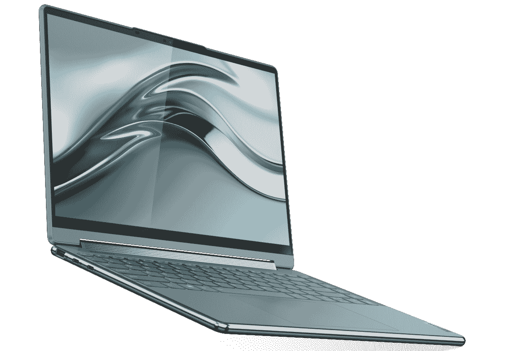
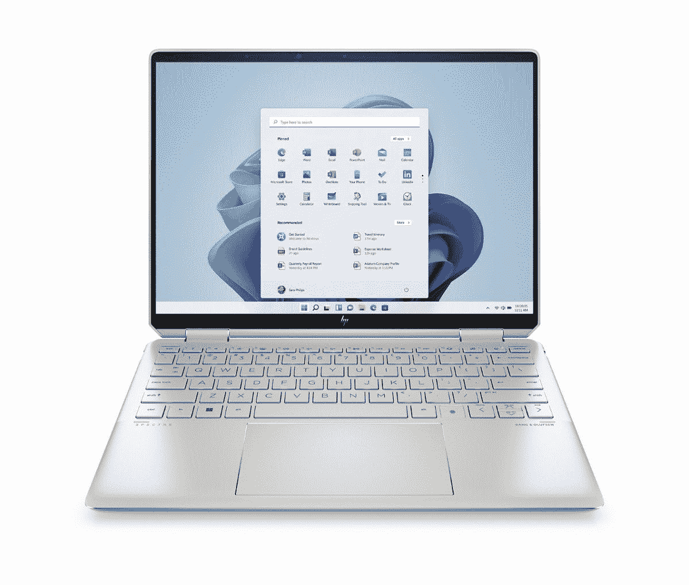
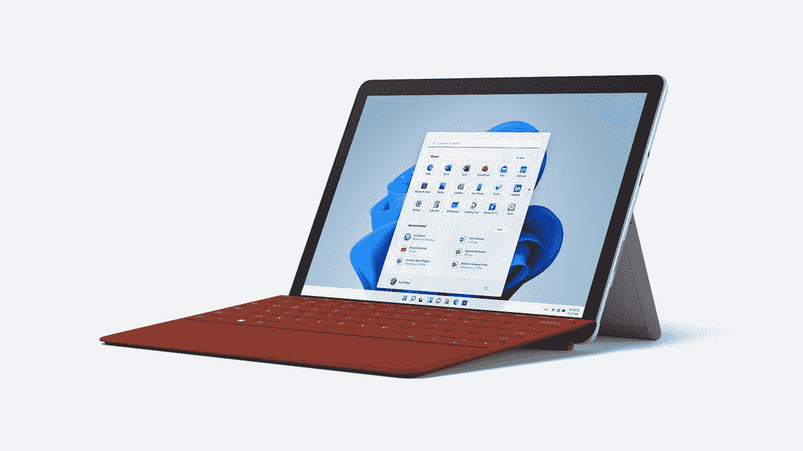
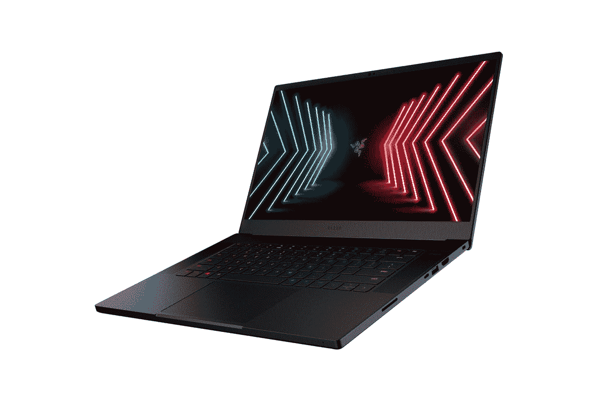

# 2023 年配备 1080p 网络摄像头的最佳笔记本电脑

> 原文：<https://www.xda-developers.com/best-laptops-1080p-webcam/>

在过去的几年里，对优秀网络摄像头的需求显著增加。我们中的许多人现在在家工作，虚拟会议已经变得越来越普遍。即使是与家人共度时光，有时也必须通过虚拟方式完成，因此拥有一个出色的网络摄像头比以往任何时候都更重要。虽然你可以购买[非常棒的外部网络摄像头](https://www.xda-developers.com/best-webcams/)，但这可能是一个笨重的解决方案，所以我们收集了你可以购买的[最好的笔记本电脑](https://www.xda-developers.com/best-laptops/)，它们内置 1080p(或更高)的摄像头，所以你不需要任何外围设备。

值得庆幸的是，在 2023 年，许多公司终于开始意识到优秀网络摄像头的重要性，因此找到拥有优秀摄像头的优秀笔记本电脑变得更加容易。话虽如此，但要选择一个可能要困难得多，所以这里是我们的建议。

## 最佳综合:联想 Yoga 9i

[2022 联想 Yoga 9i](https://www.xda-developers.com/lenovo-yoga-9i-2022-review/) 几乎在各个方面都是一款出色的笔记本电脑，我们在评测中也是这么说的。这可能是联想过去几年中最好的消费笔记本电脑，从设计到显示屏，当然还有顶部的 1080p 网络摄像头，它都做得非常好。

首先，联想 Yoga 9i 采用第 12 代英特尔酷睿处理器，最高可配英特尔酷睿 i7-1280P 处理器。P 系列处理器的 TDP 为 28W，顶级型号拥有 14 个内核、20 个线程，速度提升至 4.8GHz，因此您可以通过这台电脑获得巨大的性能。除此之外，您还可以获得 16GB 的 5200 MHz lpddr 5 RAM 和 1TB 的 SSD 存储，就性能而言，这是一种顶级体验。

这与非凡的显示相结合，至少取决于你选择的选项。这是一个 14 英寸的面板，长宽比为 16:10，这本身已经是一个好消息，因为更高的屏幕对生产力来说是非常好的。基本型号配备了全高清+ (1920 x 1200) IPS 面板，但也有两个令人惊叹的有机发光二极管升级选项。一个是 2.8K 面板(2880 x 1800)，刷新率为 90Hz，因此您可以获得更流畅的体验。另一个是超高清+ (3840 x 2400)选项，为您提供最清晰的图像质量，尽管它有一个更标准的 60Hz 刷新率。这两个都是恒星显示器，所以你最重视什么取决于你。

当然，在显示屏上方是一个 1080p 的网络摄像头，这意味着在视频通话中，你会比使用 720p 摄像头看起来更好。它还支持 Windows Hello 面部识别，因此解锁您的 PC 比以往任何时候都更容易。不过，如果你喜欢的话，你也可以得到一个指纹识别器。

联想 Yoga 9i 的设计是帮助它脱颖而出的另一个因素。虽然以前的型号看起来有点无聊，但 Yoga 9i 采用了这些漂亮的新圆角边缘，使笔记本电脑的寿命更长，握起来更舒适。它看起来很棒，厚度为 15.25 毫米，重量为 3.09 磅，对于全铝敞篷车来说也相当轻薄。它有燕麦色和深灰色两种颜色，看起来都很棒。

来到端口，你得到两个 Thunderbolt 4 连接，一个标准 USB Type-C 端口，一个 USB Type-A 端口和一个耳机插孔。这不是开箱即用的最完整的设置，但您确实可以获得一个用于传统外设的 USB Type-A 端口，并且丰富的 USB Type-C/Thunderbolt 使您可以在需要时轻松添加更多端口。

总而言之，这是你今天能买到的最好的笔记本电脑之一，1080p 网络摄像头只是其中的一小部分。感兴趣的话可以在下面买。

 <picture></picture> 

Lenovo Yoga 9i

##### 联想 Yoga 9i

联想 Yoga 9i 是一款漂亮的笔记本电脑，采用最新的英特尔处理器，具备高端笔记本电脑的所有特质。

## 最佳轻便笔记本电脑:三星 Galaxy Book 2 Pro

如果您想要一台绝对最轻的笔记本电脑，但又不牺牲性能或 1080p 网络摄像头，[三星 Galaxy Book 2 Pro](https://www.xda-developers.com/samsung-galaxy-book-2-pro-360-15-review/) 就是您需要的答案。在最初的 Galaxy Book Pro 给人留下了非常好的印象。它的继任者几乎在每个方面都有所改进，同时保持了可笑的轻薄外形。

在性能方面，三星 Galaxy Book 2 Pro 采用了英特尔第 12 代酷睿处理器，特别是 P 系列处理器。它升级到英特尔酷睿 i7-1260P，它有 12 个内核，16 个线程，速度高达 4.6GHz，因此它可以提供很多性能。按照英特尔的惯例，您可以获得集成的 Iris Xe 显卡来处理较轻的 GPU 工作负载，笔记本电脑还配备了高达 16GB 的内存和 512GB 的固态硬盘，这一切都是您享受顶级笔记本电脑体验所需的。

显示屏也是三星 Galaxy Book 2 Pro 的一大亮点，特别是因为它是唯一一款默认包含 AMOLED 面板的笔记本电脑。除了尺寸之外——因为 Galaxy Book 2 Pro 有 13.3 英寸和 15.6 英寸两种型号——这款显示器只有一种配置，而且是 AMOLED:它有全高清分辨率，对于 13.3 英寸的面板来说足够清晰，对于更大的面板来说仍然很坚固。今年型号的显示屏也比去年的更亮，所以室外能见度应该更好。

自然，笔记本电脑配备了 1080p 网络摄像头，这是上一代产品的又一次显著升级，它的视野也比以前更广。三星还包括一些软件，可以让你在通话中调整自己的形象，这样你就可以对自己的表现充满信心。不幸的是，这款笔记本电脑不支持 Windows Hello 面部识别，因此指纹识别器是您进行生物认证的首选。

设计是三星 Galaxy Book 2 Pro 最令人印象深刻的方面，特别是因为它有多薄和轻。展会的明星是 13.3 英寸的型号，重量仅为 1.92 磅，厚度为 11.2 毫米。即使是 15 英寸版本也只有 11.7mm 厚，2.45 磅重，依然超级可观。这款笔记本电脑在石墨色和银色两种配色中都很好看，后者有一个干净的白色内部，有点更活泼。

至于端口，三星 Galaxy Book 2 Pro 涵盖了基本的，包括一个 Thunderbolt 4 端口，一个标准 USB Type-C 端口，一个 USB Type-A 端口和一个耳机插孔。15.6 英寸的型号也有 HDMI，所以它的设置更加全面。无论哪种方式，考虑到这款笔记本电脑的轻薄程度，这都是一个不错的端口供应。

最终，三星 Galaxy Book 2 Pro 绝对是配备 1080p 网络摄像头的最佳笔记本电脑之一。事实上，它在如此轻薄的机箱中集成了强大的处理器和可靠的端口选择，这是一项工程壮举，几乎不可能不推荐它。

 <picture></picture> 

Samsung Galaxy Book 2 Pro

##### 三星 Galaxy Book 2 Pro

三星 Galaxy Book 2 Pro 是一款非常轻便的笔记本电脑，但仍然拥有高端规格。

## 最适合创作者:MacBook Pro 14 英寸(2023 年)

如果你不太关心外形的花哨功能，而更关心性能，最新的 14 英寸和 16 英寸 MacBook Pro 型号是最好的创造者笔记本电脑。这是一款非常强大的笔记本电脑，但它的效率也令人难以置信，这使它成为当您无法找到电源插座时使用的最佳笔记本电脑之一。

MacBook Pro 的内部结构与其他产品非常不同，因为苹果公司制造自己的处理器。这些笔记本电脑的最新一代配备了苹果 M2 Pro 和 M2 Max 芯片，拥有多达 12 个 CPU 核心(8 个高性能和 4 个高效)和 38 个 GPU 核心。这些产品的性能甚至超过了 M1 Pro 和 M1 Max，这两款产品的能效令人难以置信地强大。您可以期待要求苛刻的任务甚至更快，但电池寿命将一样好。这些笔记本电脑还配备了高达 96GB 的统一内存和 8TB 的固态硬盘，所以你真的不能要求更多。

展示也是非凡的。苹果是首批在其笔记本电脑中使用迷你 LED 面板的公司之一，屏幕后面有 10，000 个迷你 LED，可以提供局部调光。这使得对比度非常高，纯黑色，以及令人难以置信的 1600 尼特的峰值亮度，或 1000 的持续全屏亮度。这也是一个令人难以置信的锐利显示器，14 英寸的型号具有 3024 x 1964 的分辨率，而 16 英寸的版本则高达 3456 x 2244。长宽比略高于 16:10。

可以说，这款显示器最大的败笔在于它的顶部有一个缺口，这是从 iPhone 借鉴来的。至少凹口为 1080p 摄像头留出了空间，该摄像头由苹果的图像信号处理器驱动，可以提供高质量的视频。然而，这里没有 iPhone 上的 Face ID——你必须使用内置在电源按钮中的触控 ID。

MacBook Pro 的设计非常符合你对 MacBook 的预期。它有纯银或太空灰两种颜色，看起来没有什么特别的。MacBook Pro 也不是一款重量轻的笔记本电脑，只有 3.5 磅重。它仍然相当薄，只有 15.5 毫米，但不是你能找到的最便携的笔记本电脑。当然，当你考虑到它有多强大时，这就变得更容易接受了。

不过，说回积极的一面，苹果给 MacBook Pro 14 英寸的端口设置比它的前辈好得多。现在它配备了三个 Thunderbolt 4 端口——尽管不再有英特尔处理器——HDMI、全尺寸 SD 读卡器和一个耳机插孔，对高阻抗耳机的支持有所改善。此外，它还让 MagSafe 支持高速充电。如果你一直在使用 Windows 笔记本电脑，缺少 USB Type-A 端口可能会令人失望，但考虑到 MacBooks 已经多年没有 USB 端口了，这更容易接受。

MacBook Pro 14 英寸是否值得，完全取决于你需要笔记本电脑提供多大的性能。这不是一台便宜的笔记本电脑，但它的速度和效率令人难以置信，有一个神奇的屏幕，并配有一个伟大的 1080p 网络摄像头。

##### 苹果 MacBook Pro (2023)

最新的 MacBook Pro 型号配备了更强大的 M2 Pro 和 M2 Max 处理器，此外，它们还配备了出色的迷你 LED 显示屏和 1080p 网络摄像头。

## 最佳 AMD 笔记本电脑:宏基 Swift Edge

没有多少公司投入大量精力制造超高端 AMD 笔记本电脑，但 Acer Swift Edge 是一个很好的例外。这是一个简单的建议，不仅仅是因为它的网络摄像头，而是因为它周围的一切。

首先是性能，这是由 AMD 锐龙 7 6800U 处理器驱动的，该处理器具有 8 个核心，16 个线程，加速速度高达 4.7GHz。这将在各种日常任务中提供出色的性能，尽管 AMD 处理器在使用电池电源时往往会明显变慢。不仅如此，这款笔记本电脑还配有 16GB 内存和 1TB 固态硬盘，因此您可以获得出色体验所需的一切。

但这款笔记本电脑真正的亮点是 16 英寸的显示屏，长宽比为 16:10。这张大画布带有令人惊叹的 OLED 面板，可以产生鲜艳的颜色和真正的黑色，最重要的是，它具有超高清+ (3840 x 2400)分辨率，非常清晰。这也是唯一可用的配置，因此保证您获得非凡的观看体验。当然，在显示屏上方有一个 1080p 的网络摄像头，具有瞬时降噪功能，这应该可以确保您在会议和通话期间看起来很棒。此型号没有面部识别功能，但您可以使用指纹识别器登录 Windows Hello。

宏碁宣称 Swift Edge 是目前最轻的 16 英寸笔记本电脑，事实上，尽管它的尺寸很大，但重量仅为 2.58 磅，这使得它非常容易在旅途中随身携带。它的厚度也不到 13 毫米，它使用了镁铝合金，尽管很轻，但看起来很高级。

尽管如此薄，Acer Swift Edge 仍然有两个 USB Type-C 端口、一个 USB Type-A 端口和 HDMI，外加一个 3.5 毫米耳机插孔，因此对于这样一个薄设备，您可以获得足够的连接能力。端口都在同一侧，这可能不是最方便的设置，但至少它有这些端口。

Acer Swift Edge 的标价为 1500 美元，具有非凡的价值，尤其是其令人惊叹的显示屏和高级设计。再加上一些可靠的规格，你就有了一台很难错过的笔记本电脑。

##### 宏碁 Swift Edge

Acer Swift Edge 是一款出色的 AMD 笔记本电脑，也是市场上最轻的 16 英寸笔记本电脑。它拥有快速的 AMD 锐龙 7 处理器和令人惊叹的有机发光二极管显示屏。

## 最佳敞篷车:惠普 Spectre x360 13.5

最新一代的惠普 Spectre x360 笔记本电脑对内置的网络摄像头进行了大幅改进，如果这些笔记本电脑之前已经很棒，那么新的 [Spectre x360 13.5](https://www.xda-developers.com/hp-spectre-x360-13-5-review/) 是非凡的。它保留了 Spectre x360 的大部分神奇之处，但在设计上做了一些改变，并配备了更好的网络摄像头，这是显而易见的。

在性能方面，惠普 Spectre x360 13.5 配备了第 12 代英特尔酷睿处理器，但与我们迄今为止看到的大多数型号不同，这些处理器来自 U 系列。它们的 TDP 较低，为 15W，这意味着它们不会那么快，但反过来，它们会让你的电池寿命更长。您可以选择英特尔酷睿 i7-1255U，它拥有 10 个内核、12 个线程，性能内核的时钟频率高达 4.7GHz，因此您仍然可以获得非常稳定的日常任务性能。它仍然包括英特尔 Iris Xe 显卡，除此之外，您可以为这款笔记本电脑配置高达 32GB 的内存和 2TB 的固态硬盘。这是一台彻头彻尾的高级笔记本电脑。

Spectre x360 13.5 更引人注目的一个方面是显示屏，这是一个长宽比为 3:2 的 13.5 英寸面板。这是一个甚至高于 16:10 的长宽比，它是一个非常棒的画布，特别是如果你喜欢画画或手写笔记。此外，如果您想在平板电脑模式下以垂直方向使用笔记本电脑，它会非常棒。基本型号是全高清+ (1920 x 1280)分辨率，您可以添加一个 HP Sure View 反射隐私屏幕来阻止其他人看到您的屏幕。然而，对于大多数人来说，真正的升级是 3K2K (3000 x 2000) OLED 面板选项，它非常清晰，并提供了我们已经提到的有机发光二极管的好处。当然，所有配置都支持触摸和笔输入，因为你可以将它用作平板电脑。

HP Spectre x360 上的网络摄像头可能是这个列表中最好的摄像头之一。是的，它以 1080p 的分辨率记录，但传感器本身具有 5MP 的分辨率，并且它具有一些智能功能，如自动取景和灯光调节，所以你总是保持最佳状态。最重要的是，相机支持 Windows Hello 面部识别，因此解锁您的 PC 比以往任何时候都更容易。

在设计方面，HP Spectre x360 13.5 与以前的 Spectre 型号有很大不同。它保持了双色调美学，既有夜幕黑色，也有新的夜曲蓝色选项。然而，现在它柔和多了——只有笔记本电脑边缘和转轴周围的薄轮廓被涂上不同的颜色。它使设计不那么突出，但它仍然有一个独特的旋转，使其具有吸引力。至于便携性，这款笔记本电脑的厚度刚刚超过 17 毫米，重量为 3.01 磅，因此它的便携性与你对高级铝合金敞篷车的预期差不多。

至于端口，它的设置就像你在这种尺寸的笔记本电脑上所能期望的那样可靠。你有两个 Thunderbolt 4 端口，一个 USB Type-A 端口，一个耳机插孔和一个 microSD 读卡器。其中一个 Thunderbolt 端口以一定角度放置在显示器下方切掉的角落上，如果你的电缆从笔记本电脑的背面或相反侧进入，这使它更容易接触到

Spectre x360 13.5 是一款非常棒的敞篷车，我们没有太多的缺点可以指出。它有一个漂亮的高级设计，一个伟大的显示器，并与最新的模型，最好的 1080p 网络摄像头之一，你会发现在笔记本电脑上。你可以在下面查看一下。

 <picture></picture> 

HP Spectre x360 13.5

##### 惠普 Spectre x360 16

HP Spectre x360 13.5 是一款配备高端处理器、时尚设计和出色的 500 万像素摄像头的敞篷车。

## 最佳平板电脑:Surface Pro 9

Surface 系列产品总是在笔记本电脑中配备一些最好的 1080p 网络摄像头，这一点从未比 Surface Pro 9 更真实。如果你想获得出色的网络摄像头体验，5G 型号特别好，但 Wi-Fi 版本有类似的摄像头硬件。

在内部，Surface Pro 9 Wi-Fi 和 5G 机型之间有一些很大的差异。英特尔型号由最高可达英特尔酷睿 i7-1255U 处理器提供支持，该处理器具有 10 个内核和 12 个线程，加速速度高达 4.7GHz。同时，5G 型号由基于高通骁龙 8cx Gen 3 的微软 SQ3 芯片组提供支持。这也是一款非常强大的处理器，有八个内核，速度高达 3GHz，尽管英特尔型号总体上更快。你也可以配置英特尔版本高达 32GB 的内存和 1TB 的固态硬盘，而 5G 型号分别高达 16GB 和 512GB。

显示屏是 Surface Pro 9 的亮点之一。这是一个 13 英寸的面板，和往常一样，它的长宽比为 3:2。分辨率是 2880 x 1920，所以这是一个非常清晰的屏幕，最重要的是，它有一个 120Hz 的刷新率，可以动态调整。这意味着它可以使动画和过渡看起来更平滑，但它也可以通过在有意义的时候使用较低的刷新率来节省电力。该显示器支持触摸和笔输入，正如你对平板电脑的期望。

在显示屏上方，你会发现一个支持 1080p 视频的 500 万像素摄像头，这是我们在 Surface Pro 系列中已经看到了一段时间的东西。自然也自带 Windows Hello 面部识别。因为是平板电脑，Surface Pro 9 实际上在背面包括了第二个摄像头，现在它是一个 10MP 的传感器，支持 4K 视频。不过，5G 模型有一些独特之处——多亏了微软 SQ3 芯片内部的神经处理单元(NPU)，它可以实现 Windows Studio 效果。这是一组功能，包括背景模糊，眼神交流和面部跟踪，使网络摄像头的体验更好。还有语音清晰度，可以消除通话中的背景噪音，让人们可以更清楚地听到你的声音。

Surface Pro 9 首次推出了几种颜色，尽管它们只在英特尔型号上可用。5G 型号只有白金，但你可以得到石墨，森林和蓝宝石的 Wi-Fi 版本，最后一个看起来特别棒。否则和以前差不多；这款平板电脑厚 9.4 毫米，最轻配置下重约 1.84 磅，不过这不包括键盘，键盘需要单独购买。

与地面设备的通常情况一样，端口的供应并不广泛。你有两个 Thunderbolt 4 端口，所以你可以在这里连接任何你想要的东西，但除此之外，只有一个 Surface Connect 端口。微软实际上取消了这个型号的耳机插孔，如果你希望使用有线耳机，这是一个令人失望的事情。当然，5G 模型具有蜂窝连接，如果你计划在旅途中工作，这是一个很大的优势。

如果你想在一个额外的便携式设备中获得笔记本电脑的功能，加上 1080p 摄像头，Surface Pro 9 是最佳选择之一。另外，它非常便携，所以你可以在任何地方使用它。

*   ##### Surface Pro 9(Wi-Fi)

    Surface Pro 9 搭载第 12 代英特尔酷睿处理器，有史以来首次采用了一系列美丽的颜色。这无疑是最好的平板电脑之一。

*   ##### 带 5G 的微软 Surface Pro 9

    带 5G 的微软 Surface Pro 9 搭载了微软 SQ3 处理器，这使它获得了出色的电池续航时间，并支持毫米波和 6GHz 以下的 5G。

    T17

## 最佳预算平板电脑:Surface Go 3

最后，如果你想要一台价格实惠、仍有 1080p 网络摄像头的笔记本电脑，那么 [Surface Go 3](https://www.xda-developers.com/microsoft-surface-go-3-review/) 就是你的不二之选(即使严格来说它是一台平板电脑)。网络摄像头通常是预算设备首先削减的东西之一，但 Surface Go 3 的摄像头几乎与优质 Surface 平板电脑一样好。

与其他廉价笔记本电脑相比，Surface Go 3 在性能方面做出了一些妥协。它配备了最高可达 3.9GHz 的双核四线程处理器英特尔酷睿 i3-10100Y。基本型号配备了最高可达 3.4GHz 的英特尔奔腾黄金 6500Y。两者都是低功耗处理器，所以虽然性能应该还可以，但肯定会落后于这份名单上的高端笔记本电脑。它还包括高达 8GB 的内存和 128GB 的固态硬盘，如果你负担得起，这是我们推荐的配置。基本型号有 4GB 内存和 64GB eMMC 存储，这不会给你很好的体验。

另一方面，Surface Go 3 的显示屏对于这个价格区间的 Windows PC 来说非常不错。它是一个 10.5 英寸的面板，采用了更高端的 Surface 设备中常见的 3:2 纵横比，这使得它成为极少数没有 16:9 屏幕的经济型笔记本电脑之一。这也是一个全高清+ (1920 x 1280)显示屏，所以就其尺寸而言，它非常清晰，肯定比这个价格的大多数其他笔记本电脑都清晰。作为一款平板电脑，支持触摸和 Surface Pen 也是必然的。

正如我们上面所说，Surface Go 3 也没有牺牲网络摄像头。与 Surface Pro 8 一样，Surface Go 3 也有一个 5MP/1080p 网络摄像头，这是你在这个价格的任何其他笔记本电脑上都找不到的，它还支持 Windows Hello 面部识别。在背面，有另一个摄像头，这次是一个 800 万像素的传感器，也可以录制 1080p 视频。

Surface Go 3 的设计遵循了我们过去(Pro 8 之前)从 Surface 平板电脑中了解到的情况。这是一个薄而轻的镁平板，边缘平坦，允许 Surface Pen 通过磁性附着在侧面。得益于较小的尺寸和镁结构，Surface Go 3 的重量仅为 1.2 磅，厚度也只有 8.3 毫米，因此非常容易携带到任何地方。当然，你可能想添加一个键盘，这是单独出售的，但这并不能改变这是最便携的笔记本电脑之一的事实。

最后，Surface Go 3 的端口供应有限，这是 Surface 设备的常见情况。你有一个 USB Type-C 端口，一个用于充电的 Surface Connect 端口(和可选的坞站)，一个 3.5 毫米耳机插孔和一个 microSD 读卡器。这里也没有对 Thunderbolt 的支持，这正是你所期待的经济型笔记本电脑。虽然这对于平板电脑来说不是一个糟糕的设置，但对于 Windows PC 来说却不怎么样，所以如果你想将有线外设连接到这台 PC 上，你可能需要一些适配器。

尽管如此，Surface Go 3 是一款非常便宜的设备，如果你想要一个便宜的 1080p 网络摄像头，你不会找到另一款笔记本电脑可以做到这一点。然而，你必须记住，键盘是单独出售的，所以如果你想要一个合适的笔记本电脑体验，这是你必须增加的成本。

 <picture></picture> 

Surface Go 3

##### 微软 Surface Go 3

Surface Go 3 是一款经济型平板电脑，它做出了一些明智的选择，提供了一种高级体验，而这个价格范围内的其他笔记本电脑往往会崩溃。

## 最佳游戏笔记本电脑:Razer Blade 15

1080p 网络摄像头非常适合视频会议和通话，但如果你不想花钱购买最好的网络摄像头之一，它也可以用于流媒体。如果你想玩流媒体游戏，为什么不买一台笔记本电脑呢？

[Razer Blade 15](https://www.xda-developers.com/razer-blade-15-2022-oled-review/) 是这份名单上最强大的笔记本电脑之一，配备高达 45W 的英特尔酷睿 i9-12900H，14 个内核，20 个线程，速度高达 5GHz。除此之外，您还可以获得这款配备高达 16GB 内存和 105 瓦功率的 NVIDIA GeForce RTX 3080 Ti 笔记本电脑 GPU 的笔记本电脑，因此您所有的游戏都可以正常运行，您也应该能够流畅地运行它们。除了规格之外，你还可以获得高达 16GB 的 RAM(尽管你可以在事后自己升级)和 1TB 的 SSD，外加一个额外的 M.2 插槽用于存储扩展。

Razer Blade 15 上的显示器有几个变体，但外形规格总是相同的——15.6 英寸的面板，长宽比为 16:9。在那里，您可以选择刷新率为 360Hz 的全高清显示器、刷新率为 240Hz 的四高清显示器或刷新率为 144Hz 的 4K 显示器。您可以根据需要选择更高的分辨率还是更平滑的刷新率。今年晚些时候还将有一款 240Hz 刷新率的四高清 OLED 面板，如果你喜欢有机发光二极管提供的活力和真正的黑色，你可能会喜欢它。根据您的需求，所有这些都是很好的选择，尽管我个人认为四核高清面板在平滑度和图像质量之间取得了正确的平衡。

网络摄像头在游戏笔记本电脑中经常被忽视，但 Razer Blade 15 在显示器上方使用了一个 1080p 摄像头，所以你在这里会得到很好的服务。不仅如此，它还支持 Windows Hello 面部识别，这也是游戏笔记本电脑上经常被忽略的东西。很高兴看到雷蛇没有忽略这些细节。

游戏笔记本电脑有时会有花哨的设计，但 Razer Blade 也做得很好，足以在公共场合使用。这是一台全黑的笔记本电脑，除了盖子上的绿色 Razer 标志，它看起来很棒。唯一的 RGB 灯光在键盘上，但它只透过标签发光，所以它非常微妙，你可以将灯光改为白色，以获得完全干净的外观。考虑到内部的所有功能，Razer Blade 15 的重量为 4.4 磅，这对于内部规格来说一点也不差。它还不到 17 毫米薄，肯定是一个令人印象深刻的壮举。

连接性是 Blade 15 Advanced 的另一个优势。它配有两个 Thunderbolt 端口、三个 USB Type-A (3.2 Gen 2)端口、HDMI 2.1、一个耳机插孔和一个全尺寸 SD 读卡器。在这里你真的没有更多的要求了。

Razer Blade 15 是一款非常强大的笔记本电脑，它不会忽视 1080p 网络摄像头或设计等功能，其他游戏笔记本电脑往往会出现这种情况。你可以在下面的亚马逊找到大多数配置。

 <picture></picture> 

Razer Blade 15

##### 雷蛇之刃 15

Razer Blade 15 Advanced 是一款功能强大的游戏笔记本电脑，配有 1080p 网络摄像头和时尚的设计。

## 最佳商务笔记本电脑:惠普蜻蜓 Folio G3

2022 年，惠普将其所有高端笔记本电脑升级为 500 万像素网络摄像头，这是任何笔记本电脑中最好的摄像头。但到年底，惠普蜻蜓 Folio G3 走得更远，它在多功能和高端设计的基础上配备了一个惊人的 800 万像素摄像头。

不过先说性能。惠普蜻蜓 Folio G3 采用第 12 代英特尔酷睿处理器，特别是 15W 型号。这些处理器具有 10 个内核和 12 个线程，在顶层配置上，即支持博锐的英特尔酷睿 i7-1265U 上，速度提升至 4.8GHz。该笔记本电脑还可以配置高达 32GB 的内存和 1TB 的固态硬盘，因此您不会错过性能或存储空间。

显示屏是这款笔记本电脑的独特之处之一。这是一个 13.5 英寸的面板，长宽比为 3:2，比我们最近在笔记本电脑上看到的 16:10 还要高。基本型号具有全高清+ (1920 x 1280)分辨率，您可以添加 HP Sure View Reflect，这是一个隐私屏幕。如果你想要最好的观看体验，有一个令人惊叹的 3K2K (3000 x 2000)有机发光二极管模型。这是一个可转换的，所以显示器也支持触摸和笔输入。

显示屏上方是 800 万像素的网络摄像头，这可能是任何笔记本电脑中最好的。当你在打电话时，视频分辨率仍然是 1080p，但惠普使用软件 smarts 来跟踪你的面部，并将你保持在画面中。凭借传感器的额外分辨率，它可以直接切入图像，而不会损失任何质量。

惠普蜻蜓对开设计使它更加有趣。成为 folio convertible 意味着惠普在屏幕后面使用第二个铰链，而不是 360 度铰链，这让你可以将显示器拉近你，放在键盘上，或者翻转它。它比典型的敞篷车更方便，也更高档，因为惠普用光滑的人造革材料覆盖了这款笔记本电脑。它的重量只有 3.09 磅，并不是一款非常轻的笔记本电脑，但它绝对适合几乎任何人携带。

这款笔记本电脑的一个潜在缺点是端口选择，它只包括两个 Thunderbolt 4 端口和一个耳机插孔。商务笔记本电脑往往有更多的传统端口，如 USB Type-A 和 HDMI，但这里不是这样，尽管你可以使用 Thunderbolt dock 来扩展你的可能性。

像大多数惠普商用笔记本电脑一样，惠普蜻蜓 Folio 可能会很贵，但如果你觉得它值这个价钱，你可以在下面买。

##### 惠普蜻蜓对开 G3

惠普蜻蜓 Folio 拥有多功能的可转换设计和任何笔记本电脑上最好的网络摄像头之一，而且它看起来很棒。

* * *

这就是我们认为你现在能找到的最好的 1080p 网络摄像头笔记本电脑。我们将联想 Yoga 9i 放在首位，因为它不仅拥有出色的网络摄像头，还拥有强大的规格和令人惊叹的新设计，以及一些出色的显示选项。然而，这里的每一个选项都有其自身的优点，一定会有你喜欢的东西。

如果你不喜欢 1080p 网络摄像头，并且正在考虑其他选择，也可以看看我们的[最佳 15 英寸笔记本电脑](https://www.xda-developers.com/best-15-inch-laptops/)综述。那里有很多很棒的设备。