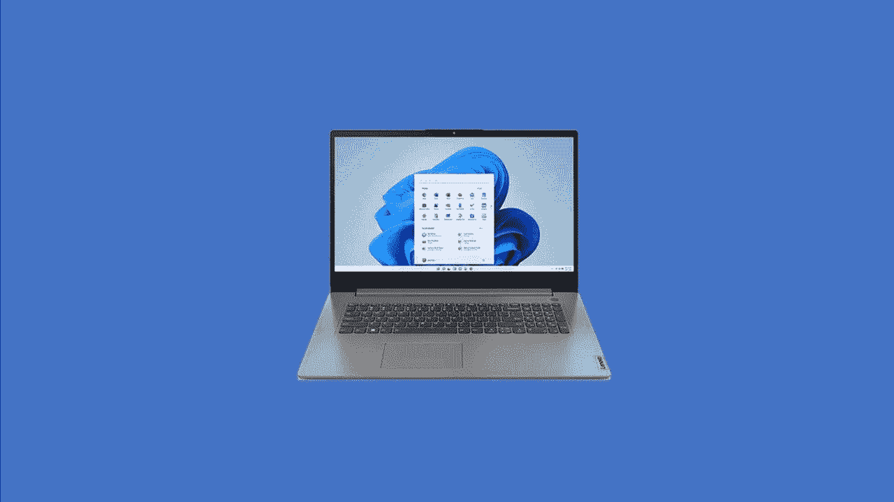
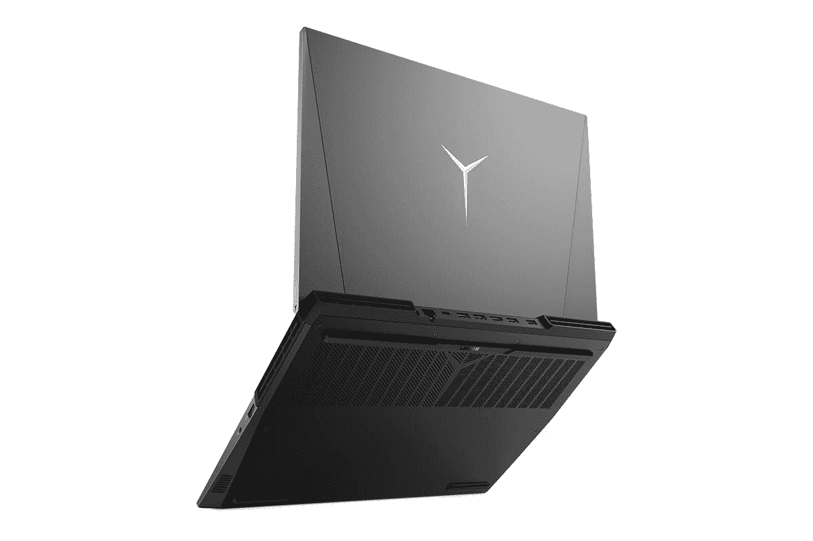

# 2023 年玩《我的世界》的最佳笔记本电脑

> 原文：<https://www.xda-developers.com/best-laptops-for-minecraft/>

自从 2011 年正式发布以来,《《我的世界》》已经成为一款相当受欢迎的游戏，并且由于各种各样的 mod 和变体，它在世界各地拥有坚实的粉丝基础。由于它没有任何既定的目标或指示，它经常被描述为一个没有规则的游戏，这使得它非常适合各个年龄段的人来享受。最棒的是，*《我的世界》*几乎可以在你能想到的每一个平台上使用:包括 Windows、Mac、Linux、手机、平板电脑、游戏机，甚至树莓 Pi。

从技术上来说，这款游戏在 PC 上有三个版本。有游戏的经典 Java 版，基岩版，扩展了对不支持 Java 的平台的支持，还有 Windows 的 *[《我的世界》](https://www.xbox.com/en-us/games/store/minecraft-for-windows/9nblggh2jhxj?rtc=1#activetab=pivot:overviewtab)* 。请注意，截至 2022 年 6 月，基础版和 Java 版已经合并为一个版本，您可以在 Windows 上的微软商店中找到。这仍然是两个独立的《我的世界》版本，但唯一的区别是，你可以在购买《我的世界》时获得其中之一，并可以从发射器访问这两个版本。

虽然你可能认为几乎每一台好的笔记本电脑都应该支持这个游戏，但答案并不简单，尤其是如果你想在《我的世界》上享受光线追踪的话。尽管它看起来很笨重，但《我的世界》会占用很多电脑资源。所以，如果你想玩，看看下面的笔记本电脑选项。

## *《我的世界》*:系统要求

我们来看看游戏对 PC 的要求。对于台式机和笔记本电脑，您可以运行 Java 版本或基础版本。还有 Windows 版本，它提供了与所有其他基础版本的交叉游戏。请注意，无论您选择哪个版本，都建议使用互联网连接。

### *《我的世界》* : Java 和基岩版

| 投机 | 最低要求 | 推荐要求 |
| 中央处理器 | 

*   英特尔酷睿 i3-3210 3.2 GHz/AMD A8-7600 APU 3.1 GHz 或同等处理器

 | 

*   英特尔酷睿 i5-4690 3.5 GHz/AMD A10-7800 APU 3.5 GHz 或同等处理器

 |
| GPU(集成) | 

*   采用 OpenGL 4.4*的英特尔高清显卡 4000 (Ivy Bridge)或 AMD 镭龙 R5 系列(Kaveri 系列)

 |  |
| GPU(独立) | 

*   采用 OpenGL 4.4 的 Nvidia GeForce 400 系列或 AMD 镭龙 HD 7000 系列

 | 

*   采用 OpenGL 4.5 的 GeForce 700 系列或 AMD 镭龙 Rx 200 系列(不包括集成芯片组)

 |
| 随机存取存储 |  |  |
| 硬盘驱动器 | 

*   至少 1GB 用于存储游戏核心、地图和其他文件

 |  |
| 操作系统（Operating System） | 

*   Windows: Windows 7 及更高版本
*   macOS:任何使用 10.9 Maverick 或更新版本的 64 位 OS X
*   Linux:从 2014 年开始的任何现代 64 位发行版

 | 

*   推荐 64 位
*   Windows: Windows 10
*   macOS: macOS 10.12 Sierra
*   Linux:从 2014 年开始有任何现代发行版吗

 |

### *用于 Windows 的《我的世界》*

| 投机 | 最低要求 | 推荐要求 |
| 中央处理器 | 

*   英特尔赛扬 J4105 &#124; AMD FX-4100

 | 

*   英特尔 i7-6500U &#124; AMD A8-6600K

 |
| GPU(集成或分立) | 

*   集成:英特尔高清显卡 4000 &#124; AMD 镭龙 R5

 | 

*   独立显卡:NVIDIA GeForce 940M &#124; AMD 镭龙高清 8570D

 |
| 随机存取存储 |  |  |
| 操作系统（Operating System） | 

*   Windows 10 版本 19041.0 或更高版本

 | 

*   Windows 10 版本 19041.0 或更高版本

 |
| DirectX 版本 |  |  |

如你所见，玩*《我的世界》*不一定需要高端笔记本电脑，但笔记本电脑越强大，你就越能体验《我的世界》。我们建议您购买一台真正的游戏笔记本电脑，或者至少配备最新英特尔酷睿 i5 或 AMD 锐龙 5000 系列处理器、8GB 内存或更大内存的低端笔记本电脑。无论版本如何，这都将确保流畅的体验。

## 《我的世界》最佳游戏笔记本电脑:Acer Nitro 5

名列榜首的是 Acer Nitro 5 游戏笔记本电脑。对于主流游戏来说，这是一款非常受欢迎的游戏笔记本电脑，因为它是[最实惠的](https://www.xda-developers.com/best-cheap-gaming-laptops/)之一，售价为 999 美元。尽管价格低廉，但它配备了你玩*和*微软飞行模拟器 2020 等游戏所需的一切。**

 *在内部，这款宏碁笔记本电脑采用了最新的 12 代英特尔处理器。具体来说，它拥有英特尔酷睿 i5-12500H CPU，12 核 16 线程。对于游戏和玩《我的世界》，CPU 也有高达 4.5Ghz 的提升。然后与 GPU、Nvidia GeForce RTX 3050 Ti 和 16GB 内存配对。存储方面，有一个 512GB 的固态硬盘。正如你所看到的，这都远远超出了建议的规格*《我的世界》，*所以你可以享受光线跟踪和无口吃的游戏。

显示屏是我们喜欢这款笔记本电脑的另一个原因。它拥有 144Hz 的刷新率，确保你在游戏中的动作，如砸砖块和捡东西，看起来和感觉上都很流畅。它只有 FHD 分辨率，但这在这个价格范围内是典型的，对于像《我的世界》这样对图形要求不高的游戏来说已经足够好了。

最后，我们喜欢这款笔记本电脑的外观。笔记本电脑的角上有红色的点缀，键盘上有四区 RGB 照明，键帽上有透明的边缘。你绝对可以在这台笔记本电脑上玩《《我的世界》》。

##### Acer Nitro 5

Acer Nitro 5 是一款价格实惠、功能强大的游戏笔记本电脑，开箱即可使用，并具有一定的可升级性。

## 《我的世界》最佳预算游戏笔记本电脑:华硕 TUF 游戏笔记本电脑 15.6 英寸

如果你没有 1000 美元的游戏笔记本电脑，那么 800 美元的华硕 15.6 英寸游戏笔记本电脑仍然是一个不错的选择。这种笔记本电脑也经常以低于 700 美元的价格出售，所以你可以节省更多的钱。即使价格如此低廉，它仍然拥有出色的显示屏、设计和中档规格，非常适合《我的世界》。

看一下规格，这款宏碁笔记本电脑配备了第 11 代英特尔酷睿 i5-11400H CPU，8GB 内存和 512GB 固态硬盘。它也有一个 Nvidia GeForce RTX 3050 GPU，这是在中端，但与*《我的世界》*是一个低端游戏，它会运行得很好。而且，就像我们的首选，因为这是一个 RTX 显卡，你将获得光线跟踪功能，使你的游戏看起来更真实。

至于显示器，这也是一个标准的 FHD 面板。你不会以这个价格买到高分辨率的显示器。为此，你可以看看下面的 Legion 5 Pro 这样的设备。不管怎样，*《我的世界》*还是挺好的。此外，当您在家时，您可以使用 USB-C 端口将系统插入 4K 外置显示器，享受更高的分辨率。

这也是一款设计非常精良的笔记本电脑。它有一个带黄色按键的独特键盘，这使得它们在深夜游戏期间很容易在黑暗中被发现。然后，笔记本电脑的下侧有超级酷的蜂窝状标记。盖子也是哑光的，并有 TUF 品牌，所以每个看到你用这款笔记本电脑的人都会知道你是一个严重的游戏玩家。

##### 华硕 Tuf 游戏 15.6 英寸笔记本电脑

华硕 TUF 游戏笔记本电脑非常适合像*《我的世界》*这样的中档游戏，这要归功于第 11 代英特尔 CPU、RTX 显卡和 FHD 显示器。

## 面向《我的世界》的经济型 AMD 办公笔记本电脑:Acer Swift 3

到目前为止，我们已经提到了拥有专用 GPU 和强大游戏 CPU 的笔记本电脑。不过，由于《《我的世界》》是一款轻量级游戏，你不需要那么大的力量。像宏碁 Swift 3 这样的普通笔记本电脑也能很好地运行《我的世界》。只是注意不要把期望值设得太高。你不会像在更高级的笔记本电脑上那样获得光线跟踪，但你会获得足够好的性能来享受游戏，没有问题。

我们建议的宏碁 Swift 3 由 AMD 锐龙 7 5700U CPU 提供支持。这是一个八核处理器。它还配有 8GB 内存和 512GB 固态硬盘。正如你所看到的，这完全在运行《我的世界》的建议规格范围内，所以你不会遇到问题，但你可能必须调整图形设置一点，因为这里没有专用的 GPU。

更重要的是，我们想说的是，这也是一台生产力笔记本电脑，所以你可以带着它去学校或工作，偷偷玩一些《我的世界》游戏而不被发现。它有一个简单的银色，没有太多的游戏外观。这甚至可以归结到显示器上，这是一个基本的 14 英寸 FHD 面板，侧面有略薄的边框。

不过，端口正是我们喜欢这款笔记本电脑的地方。如果你打算在家里用它玩游戏，有一个全尺寸的 HDMI 端口，用于连接外部显示器。除了 USB-C 和 USB-A 之外。

##### 宏碁 Swift 3 (AMD)

得益于 8GB 内存和 512GB 固态硬盘，Acer Swift 3 是一款工作效率极高的笔记本电脑，也可以玩游戏。

## 面向《我的世界》的经济型英特尔架构 17 英寸办公笔记本电脑:IdeaPad 3i 

如果你更愿意为《我的世界》购买一台基于英特尔技术的办公笔记本电脑，那么这就是 IdeaPad 3i 的用武之地。我们已经建议了一款 AMD 驱动的笔记本电脑，可以玩《我的世界》，但这款 IdeaPad 3i 也可以在较低的设置下玩游戏，没有问题。它不仅有一个 17 英寸的大屏幕，让您的游戏更加身临其境，而且它还具有英特尔的 Iris Xe 显卡，与旧的英特尔高清显卡相比，它为轻度游戏带来了良好的升级。

让我们先来谈谈驱动这台笔记本电脑的 CPU。它配有英特尔酷睿 i5-1235U CPU。这款 CPU 采用性能和效率内核混合架构，因此总共有 10 个内核。它也可以运行到 4.4 GHz。对于《我的世界》的游戏，这种混合架构意味着 CPU 可以更专注于游戏等密集型任务，而不会降低系统整体速度。是的，你仍然需要在游戏中调低图形设置，因为这款笔记本电脑没有专用的 GPU，但英特尔的 Iris Xe 显卡与笔记本电脑上的集成显卡一样好。12GB 的内存无论如何都会有所帮助，因为它高于 Mojang 为《我的世界》游戏建议和推荐的 8GB。

现在展示更多。虽然我们提到的其他笔记本电脑都配备了 14 英寸或 15 英寸的显示屏，但这款设备的屏幕为 17.3 英寸。这绝对是你会发现的最身临其境的地方之一，因为你会有更多的空间在你的屏幕上看到你在《我的世界》制作的东西，或者你在哪里放置你的积木。屏幕达到 300 尼特的事实也很棒，因为在室内游戏时，你不会有眩光问题。

与我们之前的选择一样，这款笔记本电脑也没有太多让它看起来像游戏设备的地方。它只是在一个黑暗的深渊蓝色选择。但由于这是一台大屏笔记本电脑，所以会相当重。它的重量为 4.49 磅，厚度约为 20 毫米。不过，你确实有很多端口。mix 包括一个 USB Type-C (3.2 Gen 1)端口、2 个 USB Type-A 端口、HDMI、SD 读卡器和耳机插孔。对于那些打算带着这款笔记本电脑去玩游戏的人来说，这里有你需要避免加密狗的一切。

##### 联想 IdeaPad 3i

联想 IdeaPad 3i 是一款非常适合玩《我的世界》的笔记本电脑，这在一定程度上要归功于其 17 英寸的超大显示屏。

## 《我的世界》最好的基于 AMD 处理器的 creator 笔记本电脑:联想军团 5 Pro

我们最后的选择实际上是我们可以推荐的玩《我的世界》的最好的笔记本电脑之一。这是一个非常高端的系统，所以我们把它留到了最后。考虑到接近 2000 美元的价格，这可能会超出大多数人的预算，但购买这款笔记本电脑可以为您带来最佳的游戏体验，甚至更多，尤其是如果您打算使用笔记本电脑执行其他创造性任务。

对于《我的世界》来说，这是一款出色的笔记本电脑的首要原因是它内置的 CPU。这是 AMD 的高端 CPU 之一，AMD 锐龙 9 6800H，它有八个核心。此外，笔记本电脑 CPU 有 8 个内核和 16 个线程。它配有 32GB 的内存，以及英伟达 RTX 3070 Ti 显卡。当[我们测试这台笔记本电脑](https://www.xda-developers.com/lenovo-legion-5-pro-2022-review/)时，我们在测试库的所有游戏中都获得了超快的帧率，包括《我的世界》。我们说这是控制台级别的质量。这就是为什么如果你是一个严肃的内容创作者或《我的世界》游戏玩家，我们强烈建议购买这款笔记本电脑。

除了 CPU，我们真的很喜欢这款设备的显示屏。这是我们用过的最准确的颜色之一。16:10 的宽高比以及 2560 x 1600 分辨率的面板清晰明了，满足了我们的所有需求。这也不应该成为管理《我的世界》的问题。事实上，这是我们列表中所有笔记本电脑中分辨率最高的显示器之一。

整体非游戏风格的设计，以及端口，为我们推荐这款设备的理由画上了圆满的句号。Legion 5 Pro 有一个很棒的 TrueStrike 游戏键盘，带 RGB 照明，但外观过于简单，类似于生产力笔记本电脑。至于端口，笔记本电脑左右两侧都有端口，后面也有。这使得这是一个伟大的机器使用外部显示器和在旅途中。

 <picture></picture> 

Lenovo Legion 5 Pro

##### 联想军团 5 Pro

联想军团 5 Pro 配备了令人惊叹的显示屏，以及强大的 CPU 和 GPU 能力，可以在你能想到的任何设置下运行《我的世界》。

* * *

这些是我们能想到的适合《我的世界》的最好的笔记本电脑。如果你想要最好的体验，我们建议军团 5 专业版。但如果你预算有限，宏碁 Swift 3 或 IdeaPad 3i 非常适合在较低的图形设置下享受《我的世界》。最后，如果你想买一台游戏笔记本电脑，但不想花 1000 多美元玩《我的世界》，那么宏碁 Nitro 5 或华硕 TUF 游戏笔记本电脑非常好。

关于下载，《《我的世界》》的 Java 和基岩版可以从[《我的世界》网站](https://www.minecraft.net/en-us/store/minecraft-java-bedrock-edition-pc)下载，而 Windows 10 版可以从[微软商店](https://www.microsoft.com/store/productId/9NBLGGH2JHXJ)或通过 [Xbox 游戏通行证](https://www.xbox.com/en-US/xbox-game-pass#join)安装。如果你对更多的使用案例感兴趣，而不仅仅是玩《我的世界》，这里是我们列出的[最佳笔记本电脑](https://www.xda-developers.com/best-laptops)，它们提供了更广泛的选择。如果您正在寻找可靠的移动连接，我们已经将您列入了我们的[最佳 5G 笔记本电脑](https://www.xda-developers.com/best-5g-laptops/)名单。*