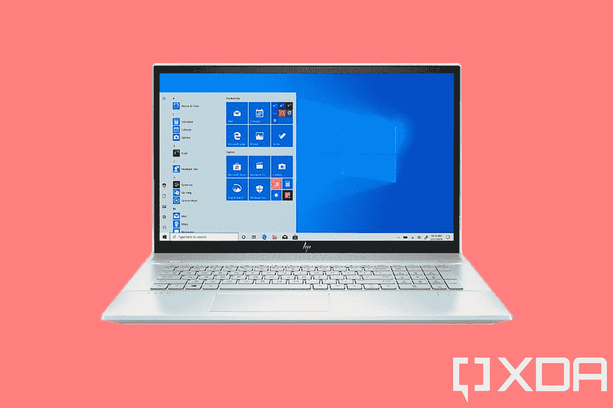
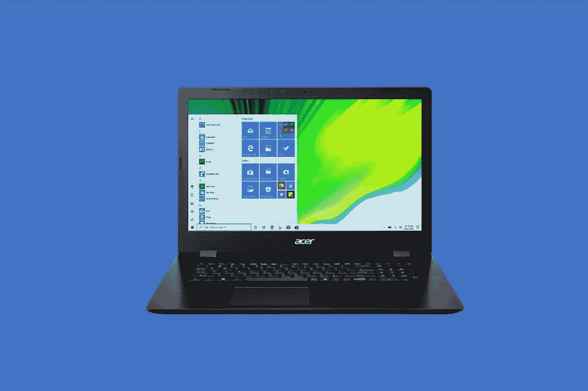
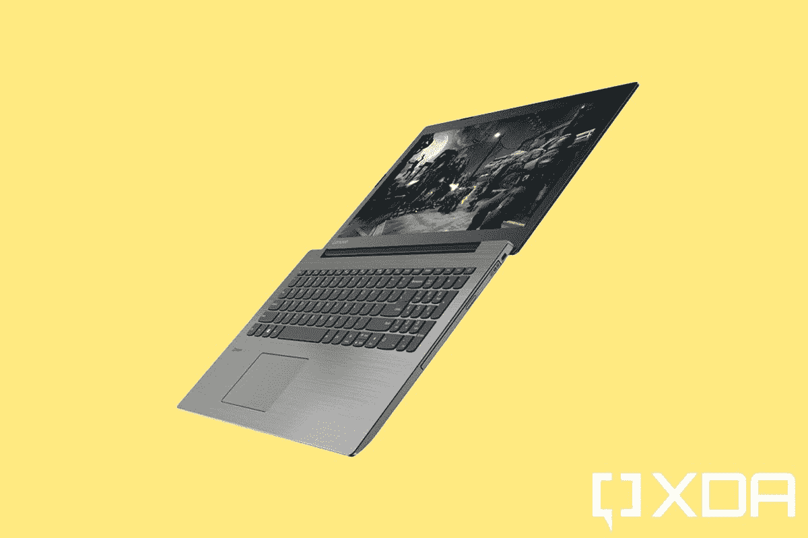
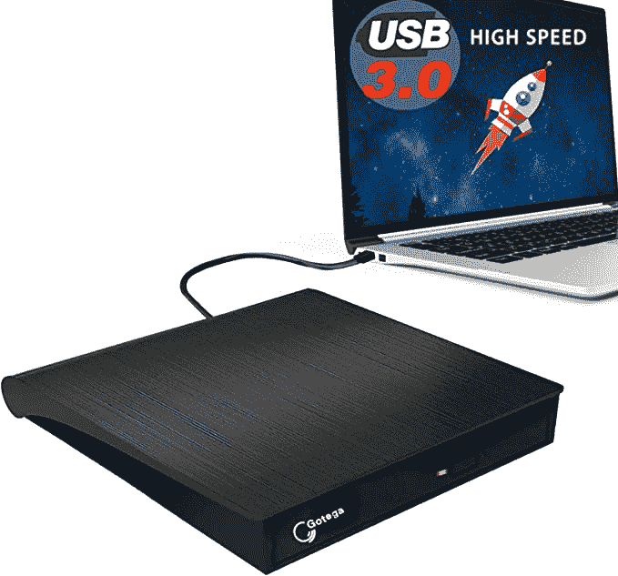

# 2023 年最佳光驱笔记本电脑

> 原文：<https://www.xda-developers.com/best-laptops-with-optical-drive/>

如今，很多人通过互联网在线观看电影和内容。甚至连安装流行应用程序的过程也变得包括下载，而不是基于盒子的 CD。这意味着带光驱的笔记本电脑在 2022 年将变得越来越不常见，尤其是笔记本电脑制造商专注于制造更薄更轻的设备。因此，如果你仍然有 CD、DVD 或蓝光光盘的收藏，你可能会想知道这对于在你的笔记本电脑上播放或使用这些内容意味着什么。

你总是可以使用外置光驱，但是有一小部分老式笔记本电脑仍然有内置光驱。在本指南中，我们将从各种类别中挑选一些最适合你的。不过请记住，由于年代久远，很多笔记本电脑不会有现代或令人印象深刻的规格。但是，这些笔记本电脑仍然出售，我们仍然选择了最好的整体，最好的预算，等等。您也可以通过单击下面的链接导航到您的特定选择。

## 整体最佳:HP Envy 17T

 <picture></picture> 

HP Envy 17T Touch

在我们的列表中，第一款是我们非常喜欢的笔记本电脑，它不仅有内置的 CD/DVD 驱动器，而且这款笔记本电脑是 17 英寸的，所以你最终会沉浸在你正在观看的任何内容中。这款笔记本电脑的另一个好处是它有一个专用的 GPU，尽管它不是最强大的。同样，它变得越来越难找到，但这里有一点关于为什么我们这么喜欢它。

首先进入屏幕，这款笔记本电脑配备了 17.3 英寸 1920 x 1080p 分辨率的显示屏。按照 2022 年的标准，这可能不是人们期待的 4K 或 2.5K 分辨率，但对于基本的多媒体消费，如观看 DVD，它应该可以很好地完成工作。这款笔记本电脑也是触摸的，所以你可以充分利用大屏幕，用手指导航。

现在，看一下规格。这是一个更老的系统，有更老的图形，但如果你的主要目的是用它来浏览网页，观看 DVD 内容，或听 CD，你应该没问题。它配备了 Nvidia MX 250 显卡和英特尔酷睿 i7 CPU。它配有 16GB 的内存和 512GB 的固态硬盘。我通常不会建议使用这些旧规格的笔记本电脑，但由于带光驱的笔记本电脑很少见，这些规格已经足够好了。尽管屏幕很大，但旧规格也有助于电池，因为它的额定时间为 7 小时。

请注意，虽然这台笔记本电脑没有 DVD 刻录机。它只是一个 DVD 和 CD 阅读器，所以记住这一点。你只能读光盘，不能写光盘。它也很重，6.63 磅，16.38 x 11.4 x 1 英寸，但不用担心。我们其他的选择会更好。

 <picture></picture> 

HP Envy 17T Touch

##### 惠普 Envy 17T

惠普 envy 17T 除了 CD 驱动器之外，还有一个 17 英寸的大屏幕。

## 最佳预算:Aspire Aspire 3

 <picture></picture> 

Acer Aspire 3

我们列表中的下一款是 Aspire 3。这又是一台 17 英寸的笔记本电脑，你可以在 2022 年买到。再说一次，由于许多笔记本电脑几年前就不再配备 CD 驱动器，这是你能找到的最后一批现代产品之一。规格和整体设计也不会令人印象深刻，但对于一台 550 美元的笔记本电脑来说，很难抱怨。我们再深入一点，好吗？

这是一个复杂的过程，建议在 2022 年使用像这样的旧规格笔记本电脑，但如果 CD 驱动器是必须的，那么这就是要走的路。你找不到一台配有第 12 代 CPU 的笔记本电脑可以驱动光驱。这就是为什么这款设备有一个更老的第 10 代英特尔酷睿 i5 CPU，总主频可达 3.6GHz。你还会发现一个总共 8GB 的内存和一个 NVMe 固态硬盘。这种组合应该可以满足你的基本需求，比如网络浏览，但除此之外，你可能需要满足于一台没有光驱的新笔记本电脑，而是购买一个外置阅读器。

就显示器而言，1080p 是这款笔记本电脑首次发布时的标准。虽然笔记本电脑本身有一个 17.3 英寸的显示屏，但分辨率将达到 1920 x 1080。你可能不会体验到电影中清晰的细节，但你仍然可以享受基本的东西。如果您打算使用这款设备来提高工作效率，您也有足够的空间来并排堆叠窗户。

就端口而言，这个时代的笔记本电脑有很多。它包括 2 个 USB 2.0 端口、1 个 USB 3.2 Gen 1 Type-A 端口、1 个耳机(耳机和麦克风组合)端口、1 个 RJ45 以太网端口和 1 个 HDMI 1.4 端口。你肯定不需要加密狗。

就重量而言，这是一个沉重的设备，对于带光驱的笔记本电脑来说是典型的。增加的重量是笔记本电脑制造商停止生产 CD 驱动器的原因。总之，这款笔记本电脑重 6.17 磅，尺寸为 16.5 x 11.4 x 0.97 英寸。它很难随身携带，所以你可能想看看我们的下一个选择，这是 15 英寸。

 <picture></picture> 

Acer Aspire 3

## 最佳 15 英寸笔记本电脑:联想 IdeaPad 330

 <picture></picture> 

Lenovo IdeaPad 330 Laptop

第三款是 15 英寸的笔记本电脑，联想 IdeaPad 330。这是我们能找到的唯一一台仍在销售的 15 英寸笔记本电脑。这是 2019 年的产品，所以规格不会是最好的，但如果你只需要一台笔记本电脑作为光驱来使用旧的 CD 或 DVD，它仍然可以完成工作。请继续阅读了解更多信息。

这款笔记本电脑采用了第八代英特尔酷睿 i5-8250U，在 2022 年对于网页浏览等日常任务来说并不是那么糟糕。该笔记本电脑还配备了 8GB 内存和 1TB 硬盘存储。这比固态硬盘慢，但大空间意味着你可以在笔记本电脑上存储你的文档、重要照片和其他东西——当不把它用作 CD 或 DVD 播放器时。一些型号还配备了可选的 Nvidia 显卡，所以如果你找到了这些显卡，你也可以远离轻度游戏，就像 *CS: Go* 一样。

就显示屏而言，这款笔记本电脑配备了 15 英寸的 FHD 显示屏。像我们的其他选择，这是 1920 x 1080 的分辨率。同样，它没有现代 15 英寸笔记本电脑那么高的分辨率，但对于基本功能来说，它还是不错的。请注意，显示器两侧是一些扬声器。这款笔记本电脑配有杜比音频扬声器，可以让音乐听起来更好，尤其是用 CD 播放的时候。如果音频对您很重要，那么我们建议您购买这款笔记本电脑。

和往常一样，我们也想以谈论港口作为结束。对于 2019 年的笔记本电脑来说，这是一个令人震惊的消息。它有一个 USB-C 端口。它不是 Thunderbolt，但你将能够毫无顾虑地将更新的固态硬盘等现代事物连接到该设备。

 <picture></picture> 

Lenovo IdeaPad 330 Laptop

##### 联想 Ideapad 330

联想 IdeaPad 330 是一款带有光驱的 15 英寸笔记本电脑

正如你所知，2022 年不会有太多笔记本电脑配有光驱。这主要是旧设备，许多新的笔记本电脑制造商不再将该技术包括在内。您可以购买外置光驱，并通过 USB-A 或 USB-C 将其连接到新的笔记本电脑([我们评选出了最佳新笔记本电脑](http://xda-developers.com/best-laptops/))上。如果这款笔记本电脑适合您，我们下面提供的外置光驱是一款非常棒的选择。或者，您可以查看我们的[专用指南](https://www.xda-developers.com/best-optical-drives/)了解更多信息。

 <picture></picture> 

Gotega External CD/DVD Drive for laptops

##### Gotega 笔记本电脑外置 CD/DVD 光驱

这是一款非常适合现代笔记本电脑的外置光驱。