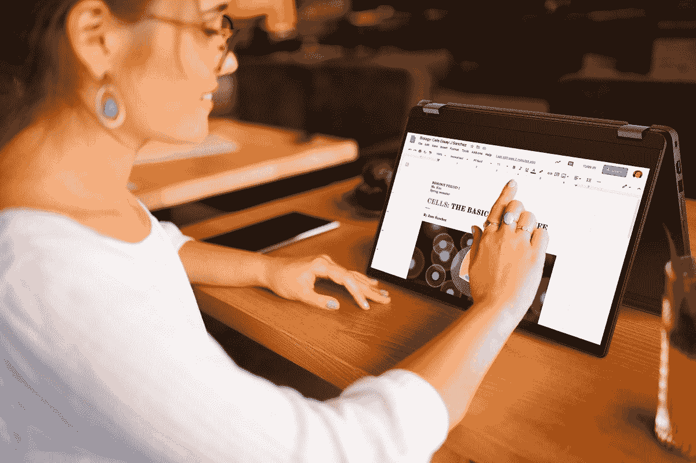
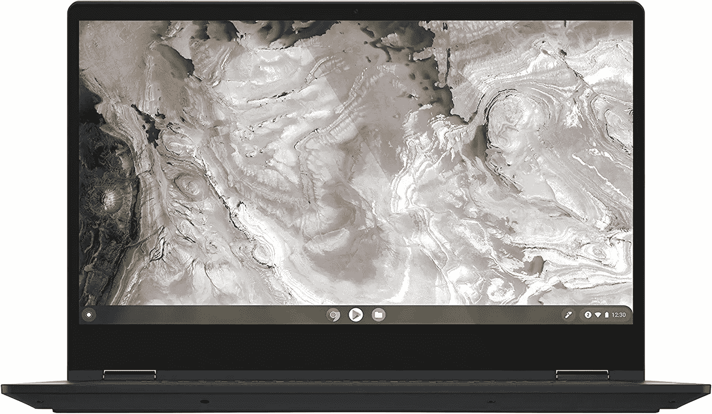
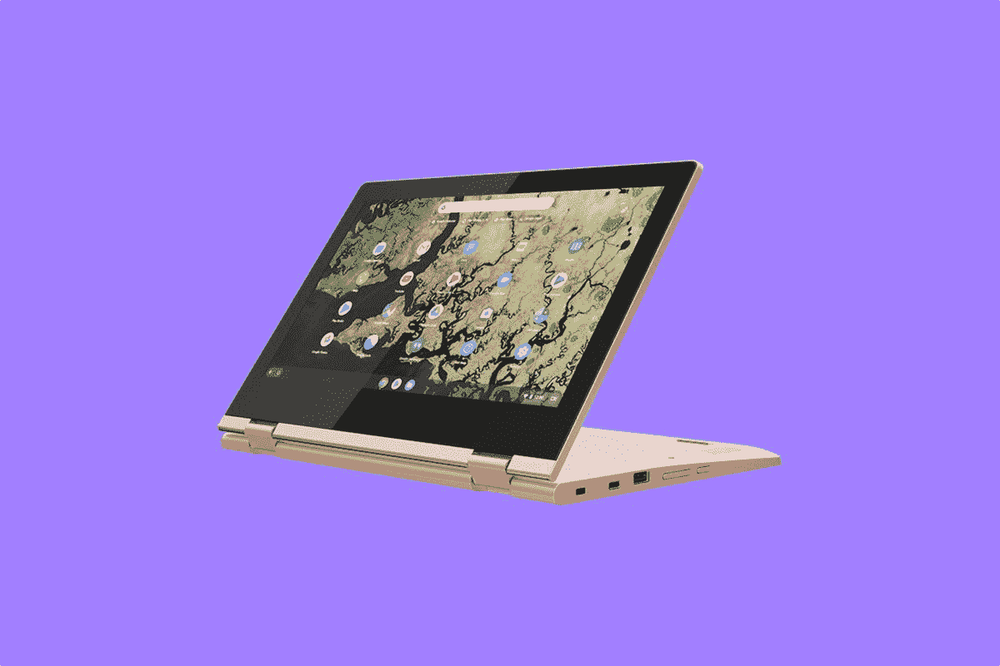
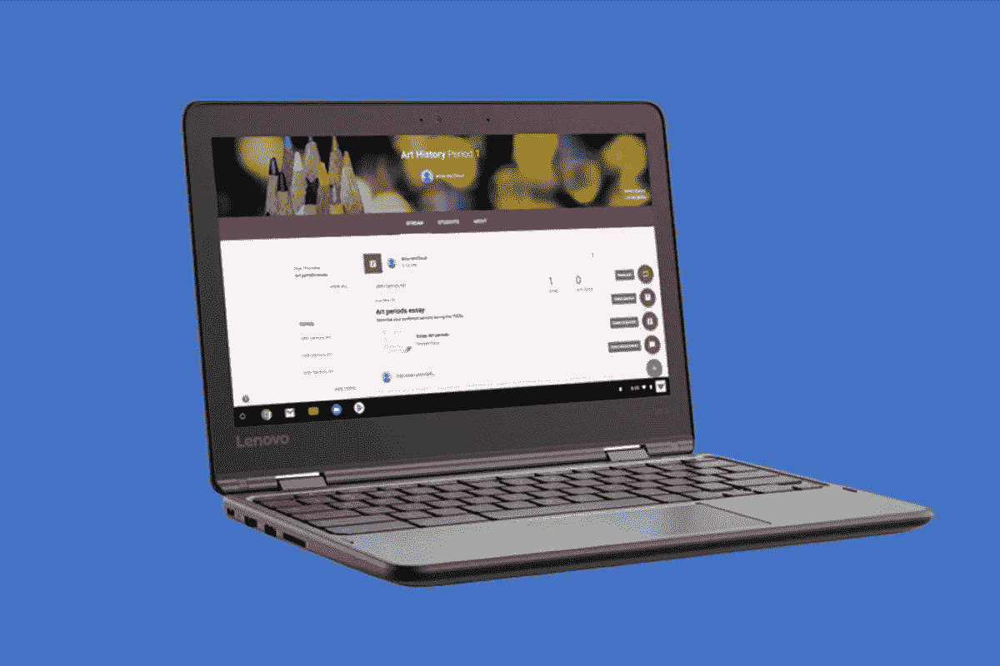

# 2023 年最佳联想 Chromebooks

> 原文：<https://www.xda-developers.com/best-lenovo-chromebooks/>

联想不仅生产了一些[最好的 Windows 笔记本电脑](https://www.xda-developers.com/best-lenovo-laptops/)，也生产了一些[最好的 chrome book](https://www.xda-developers.com/best-chromebooks/)。它是世界上第二大 Chromebook 制造商，仅次于惠普。这主要是因为联想在 Chromebook 设备方面提供了很多选择。你会发现运行 ChromeOS 的传统笔记本电脑、2 合 1 设备、平板电脑，甚至紧凑型迷你电脑。综上所述，如果你正在寻找一款适合你的 Chromebook，那你来对地方了。我们从不同类别中收集了八款我们最喜欢的联想 Chromebook 设备。

## 整体最佳:联想 Flex 3i Chromebook

 <picture></picture> 

Lenovo - Flex 3i Chromebook 15.6 Inch

2022 年联想有很多很棒的 Chromebooks。在我们的列表中排在第一位的是一个已经存在了一段时间并且在百思买非常受欢迎的产品。是联想 Flex 3i Chromebook。这款 Chromebook 结合了我们在理想的 ChromeOS 设备中寻找的许多东西，价格不超过 1000 美元。它有一个伟大的显示，体面的性能，一个优秀的键盘，也是完全可转换的。

我们将首先了解这款 Chromebook 的规格。配备英特尔赛扬 N4500 CPU 和 4GB 内存，您可以轻松加速许多基本工作流程。即使内存很少，这也是事实，因为 ChromeOS 的效率是众所周知的。存储可能是较慢的 eMMC 类型，但在 ChromeOS 上，许多文件都存储在云中，所以这应该不是一个大问题。在谷歌 Play 商店上使用 Android 应用程序和玩基本的 Android 游戏也应该会很顺利，因为这款设备由英特尔 UHD 显卡驱动。

这款 Chromebook 的另一个优点是键盘。在 500 美元以下的 Chromebooks 上很少看到全尺寸键盘，这正是你在这种情况下会得到的。你可以在主键盘旁边找到一个数字键盘，这有助于在谷歌工作表中轻松处理数字。这个价格的唯一缺点是键盘没有背光，所以你必须在灯光下完成大部分工作。深渊蓝的颜色选项和键盘很好，会让你与人们通常拥有的灰色和黑色笔记本电脑区分开来。

现在，进入 15 英寸显示屏本身。配备全高清(1920 x 1080)分辨率显示屏，您的内容在屏幕上看起来非常棒。您将不再担心空间问题，可以将窗户并排堆放，轻松完成工作。由于 16:9 的宽高比，大屏幕也非常适合观看电影和电视节目。流式传输时，您的内容不应被信箱化。这可能是你无论如何都想做的事情，因为这款 Chromebook 可以转换为平板电脑，以及用于多媒体消费的帐篷模式，电池额定为 10 小时。联想甚至将显示屏和设备的边角进行了圆角处理，使其握起来更加舒适。

至于其他规格，这款联想 Chromebook 有很多旗舰 chrome book 通常没有的出色端口。你会发现一个 HDMI 端口，2 个 USB 3.1 型端口和一个 USB C 型端口。这意味着你可以抛弃加密狗，随身携带设备，而不需要知道哪些配件可以使用，哪些不可以。

##### 联想 Chromebook Flex 3i

联想 Flex 3i Chromebook 拥有出色的显示屏，完全可转换，并结合了我们在完美的 Chromebook 中寻求的许多东西。

## 最佳平板电脑:联想 Chromebook Duet 5

Chromebooks 不再仅仅是笔记本电脑，ChromeOS 平板电脑也越来越普遍。你现在能买到的最受欢迎的产品之一是 Chromebook Duet 5。这款产品的定价为 500 美元，正如我们在评论中发现的[，它带来了大量的金钱。你得到了一个真正充满活力的有机发光二极管显示器，支持可选的手写笔，一个出色的性能 SoC，和一个可拆卸的键盘。](http://www.xda-developers.com/lenovo-ideapad-duet-5-chromebook-review/)

为该产品提供动力的是第二代高通骁龙 7c 处理器。这不像你在普通 Chromebook 中找到的典型的英特尔或 AMD 芯片。相反，它是基于 ARM 的。这就是为什么我们发现在我们的审查期间使用它相当令人愉快。像沥青 9 这样的安卓游戏没有任何延迟，日常网页浏览也很流畅。这使得它非常适合游戏。

这种芯片也有助于延长电池寿命。在我们的测试中，尽管有机发光二极管显示屏通常会消耗大量电池，但我们在使用该设备时仍能完成一整天的工作。

通常，Chromebook 平板电脑有一个轻薄廉价的键盘作为可选购买。但是，键盘开箱即可轻松舒适地连接到 IdeaPad Duet 5 显示器上。在我们的复习时间里，我们可以舒适地在膝盖上使用 IdeaPad Duet 5，而不会感到沮丧，甚至可以完成长篇博客文章。这个设备可以让你在学校或工作一整天都没有问题。

基于 Chrome 网络浏览器，你可以从谷歌 Play 商店下载多媒体应用，平板电脑也非常适合多媒体和绘图。如果你买了它，IdeaPad Duet 5 会让这些任务变得相当有趣。联想没有在包装盒中为您提供 USI 手写笔，但当我们使用它时，我们发现它非常适合在谷歌的草书应用程序中记笔记。除此之外，IdeaPad Duet 2 还配有 16:9 的 OLED 面板。这一比例非常适合观看电影和消费媒体。这也是你可能想做的事情。在我们的测试中，这款显示器拥有超乎想象的亮度、出色的视角和准确的色彩还原。即使是扬声器也很棒，因为它是四阵列设置。

但是，尽管我们已经说过 IdeaPad Duet 5 的所有优点，但它在某些领域是有限的。板上没有耳机插孔，所以蓝牙耳机或 USB-C 到 3.5 mm 耳机适配器将是你的选择。也只有两个 USB-C 端口，因此您需要购买一个加密狗来连接显示器和 USB 驱动器。

##### 联想 Chromebook Duet 5

联想 Chromebook Duet 拥有充满活力的有机发光二极管显示屏和宽敞的键盘，是 ChromeOS 平板电脑的出差族

## 最佳敞篷车:Flex 5i 13 Chromebook

就像 Windows 笔记本电脑一样，Chromebooks 采用 2 合 1 可转换外形。目前，你可以买到的最好的产品之一是联想 Chromebook Flex 5i。这款 Chromebook 很像我们的首选，但要好得多，这就是我们在这个地方保留它的原因。英特尔酷睿 i3 CPU 选项的速度也快得多。所有这些的价格是 550 美元。

联想 Chromebook Flex 5i 的伟大之处在于处理选项。它包括第十代英特尔酷睿 i3 处理器，以及 4GB 内存选项。与此同时，存储容量为 64GB。这非常适合日常工作流程，以及流媒体和多媒体。一般来说，英特尔酷睿 i3 处理器比普通 Chromebooks 中的基本赛扬处理器快得多。如果你可以在其他零售商那里找到它，这款 Chromebook 也可以选择英特尔酷睿 i5 处理器，这将为你带来更大的性能提升。

除了内部的 CPU 之外，这款 Chromebook 非常坚固。它是用铝设计的，经得起时间的考验。该设计的一部分还包括背光键盘。这有助于在晚上学习后期使用 Chromebook Flex 5i。键盘的额定键程为 1.4 毫米，对于这种尺寸的 Chromebook 来说已经相当不错了。

现在看展示，有很多喜欢的。虽然大多数廉价的 Chromebooks 都有模糊的分辨率，但这款是全高清 1920 x 1080 分辨率。您将能够在此设备上享受观看电影和其他内容的乐趣，因为内容应该清晰明了。新增的触摸和笔支持是加分项，因为你可以注释 PDF 文件，或激发你内心的艺术家，并在谷歌 Play 商店的应用程序中绘图。请记住，这支笔是单独出售的。标准分辨率显示屏也有助于延长电池寿命，因为这款 Chromebook 的额定时间为 10 小时。

联想 Chromebook Flex 5i 的另一个伟大之处与端口有很大关系。此设备上的选择将有助于您继续工作。该组合包括两个 USB 3.1 Gen 1 Type C 端口、一个 USB 3.1 Type-A 端口和一个音频插孔。你可以在需要时用 USB-C 给这款 Chromebook 充电，这是一个好处，因为你可以在旅途中使用 PD 便携式电源充电。

 <picture></picture> 

Lenovo Flex 5i Chromebook

##### 联想 Chromebook Flex 5i

联想 Flex 5i Chromebook 是最好的二合一设备之一，具有均衡的处理能力和出色的显示屏。

## 最佳廉价 Chromebook:联想 Chromebook C340

 <picture></picture> 

Lenovo Chromebook C340 2-in-1

并非所有的 Chromebooks 都必须是 500 美元，如果你在小预算内购买一台，那么联想 300e Gen 2 笔记本电脑是一个很好的选择。这可能不是最花哨的 Chromebook，但它的价格在 150 美元至 200 美元之间。您仍然可以获得传统 2 合 1 可转换 Chromebook 的出色外形。

看看这款 Chromebook 背后的东西，你会得到一款英特尔赛扬 N4000 处理器。它配有 4GB 内存和 64GB eMMC 存储。同样，正如我们提到的类似预算的 Chromebooks，你可能无法在这款设备上执行更高要求的任务，但对于基本的网络浏览和多媒体消费来说，你会很好。ChromeOS 通常可以很好地处理像这样的低功耗 CPU。

就设计而言，这款设备可能会引人注目。你会发现它要么是铂金灰，要么是沙粉色。沙粉色选项将有助于您从众多颜色单调的黑色笔记本电脑中脱颖而出。就重量和尺寸而言，这是一款非常紧凑的设备。它的尺寸仅为 11 x 8 x 0.7 英寸，重 2.65 磅。这比一张纸还少。

转到显示屏，借助高清宽视角 IPS 显示屏，您可以清晰地欣赏和分享所有喜爱的电影和视频。触摸屏让您可以直接在屏幕上点击或拖动文件，实现简单、直观的交互。不要忘记，谷歌 Play 商店是您获得生产力和娱乐的门户。从您登录的那一刻起，数以百万计的应用程序就在您的指尖，您将享受丰富的游戏、音乐、电影、电视、书籍等内容。

在其他地方，Chromebook C340 可以轻松连接到其他设备，这要归功于它的两个超快 USB-C 3.1 Gen 1 端口、两个 USB-A 3.1 Gen 1 端口和一个音频插孔。内置 802.11ac Wi-Fi 和蓝牙 4.2 使无线连接变得轻而易举。

总的来说，如果你需要超便携的东西给孩子，或者自己短途旅行时携带，这是一款非常便宜的 Chromebook。这款机器外观时尚，运行速度足以完成基本任务，能够毫无问题地满足您的所有媒体消费需求。联想绝对知道如何打造一款质量可靠、性能出众的 Chromebook。

##### 联想 Chromebook C340

与大多数紧凑型 Chromebook 不同，C340 Chromebook 采用了精致的银色表面，提供了一种高级感。除了在教室工作，它也是一个很好的在家工作的选择，有一个 720p 网络摄像头和两个 2W 扬声器。

## 最适合教育:300e Chromebook 第二代

 <picture></picture> 

Lenovo 300E Chromebook 2nd Gen

Chromebook 在教育领域很受欢迎，如果你想要一台这样的设备，联想 300e Chromebook 第二代是学生或家庭使用的最佳选择。它是专门为教育市场设计的，结构坚固，便于携带，体积小巧，价格不到 300 美元。

300e Chromebook 第二代的设计使其成为理想的教育设备。它坚固耐用，配有橡胶保险杠、加固端口和铰链，以及机械锚固键。这意味着它能够经受住学生们可能带来的冲击和敬畏。联想甚至将其抗摔性评为 29.5 英寸，这是一张课桌的高度。哦，键盘是防溅的，所以它可以抵抗水和其他液体。

除了设计，这款 Chromebook 的规格非常适合在没有干扰的情况下完成作业。它配备了 AMD A 系列处理器、4GB 内存和 32GB eMMC 存储。学生可以像打开工作表一样打开谷歌 Chrome 和谷歌 G 套件应用程序。不要忘记前置的 720p 网络摄像头和两个扬声器，这对于在 Google Hangouts 聊天和关注录制的讲座来说足够体面。

作为敞篷车，这也是一个多功能的教育设备。它可以在笔记本电脑、平板电脑、帐篷或支架模式下使用，使协作变得简单。学生可以在笔记本电脑模式下记笔记，在平板电脑模式下使用触摸屏，或者将设备置于帐篷模式下观看教学视频。所有这一切都可以放心完成，因为该设备的电池额定工作时间长达 10 小时，并且具有低功耗的 1366 x 768 分辨率显示屏。没有笔的支持，但是，这是这个设备的一个缺点。

学生们也会经常将许多配件连接到他们的 Chromebook 上，对于这一点，300e Chromebook 第二代相当不错。它有一个广泛的端口和设备侧面的音量滑块。该列表包括 USB-C、USB-A、HDMI、耳机插孔和全尺寸 SD 读卡器。在 Chromebooks 上很少看到全尺寸的 SD 卡阅读器，这将有助于存储扩展或存储和移动文件。

在学校管理 Chromebook 的 IT 管理员可以轻松地管理这款 chrome book。它通过了谷歌 Play 商店和 Chrome 网上商店的认证。像 Tinkercad、GeGebra、LucidChart、Jamboard、WeVideo 等教育应用程序都针对这款设备进行了优化。

##### 联想 Chromebook 300e

联想 300e Chromebook 第二代采用坚固耐用的设计，非常适合在教育领域使用。

## 最适合企业的产品:ThinkPad C14 chrome book Enterprise

 <picture></picture> 

ThinkPad C14 Chromebook Enterprise

最近，许多企业已经让人们转向专门为企业设计的 Chromebooks。对于 IT 管理员来说，Chromebooks 更容易管理，当用于销售业务或可能在家工作的员工时，Chromebooks 还有其他好处。联想为此设计了一款新的 ThinkPad Chromebook，它就是 ThinkPad C14 chrome book Enterprise。

这是联想最强大的 Chromebooks 之一，其规格通常与 Windows 笔记本电脑相同。它配备了第 12 代英特尔酷睿 i5-1245U 博锐处理器。它配有 8GB 内存和 256GB PCIe 固态硬盘。对于要求苛刻的工作流程和繁重的多任务处理，这些规格确保您能够完成大量工作。这些 CPU 配有 10 个内核和 12 个线程，比典型的基于英特尔酷睿 i3 的 Chromebooks 要多。博锐处理器还意味着您也将获得安全选项，IT 管理员将能够部署和远程管理设备。

这款 ThinkPad 甚至内置了谷歌设计的 Titan-C 安全芯片，可以帮助保护最终用户的身份，确保系统的完整性。这是在网络摄像头隐私快门和可选的指纹识别器之上的。

在设计上，这款 Chromebook 类似于传统的基于 Windows 的 ThinkPad。它有一个耐用的底盘，传统的 ThinkPad 触控板，中间有一个 ThinkPoint 小块。当然，你也不能忘记传统的 ThinkPad 背光键盘。

重量方面，这款 Chromebook 相当便携，8.54 x 12.81 x 0.88 英寸，3.5 磅。像大多数 ThinkPad 品牌的产品一样，这款产品也符合 MIL-STD 810H 标准。它将经受住时间的考验。

使用 ThinkPad C14 chrome book Enterprise 的显示屏，您将获得 14 英寸的全高清分辨率。联想提到该面板也具有宽视角，因此您的内容看起来会很亮。在显示器的顶端呢？这是一个 1080p 网络摄像头，确保您在所有通话中都保持最佳状态。即使是面向用户的扬声器也应该让你沉浸在会议中。

以端口结束，有很多可以帮助避免被束缚在加密狗中。你将获得 USB-C Gen 1、Thunderbolt 4、2 个 USB Type-A 端口、一个 microSD 读卡器、HDMI 2.0 和一个耳机/麦克风组合。你甚至可以为 4G LTE 蜂窝数据添加 SIM 卡，这在 Chromebooks 上并不总是可行的。

##### 联想 ThinkPad C14 Chromebook

ThinkPad C14 chrome book Enterprise 拥有企业所需的一切，包括博锐处理器、安全芯片等

## 最佳便携式 Chromebook:联想 Chromebook Duet

 <picture></picture> 

Lenovo Chromebook Duet

我们的指南以最佳便携式 Chromebook 结束。到目前为止，我们已经接触了许多优秀的设备，但大多数都是较大的设备。如果你需要尽可能紧凑的 Chromebook，那么有[联想 Chromebook Duet。](https://www.xda-developers.com/lenovo-ideapad-duet-3-chromebook-review/)

这是一款非常小的 Chromebook，配有 10 英寸 IPS 触摸屏，重量刚刚超过一磅。如果你将其与我们名单上的其他 Chromebooks 进行比较，它们的重量超过 3 磅，厚度为 0.7 英寸，你就会看到差异。

便携性的另一部分归结于键盘。如果你喜欢，你也可以附上附带的键盘外壳磁性和拉出一个支架打字。所有这些都是在您不将该设备作为独立的平板电脑用于游戏或多媒体时完成的。键盘套为输入文档、滚动网页以及将 Duet Chromebook 用作笔记本电脑提供了空间。这一切都与它很容易放在一个包里。

虽然你可能不会在这款设备上进行大量的多任务处理，但对于第一款 Chromebook 来说，内置的联发科 Helio P60T 处理器非常棒。众所周知，Android 应用程序可以在 Duet 上完美运行，主要是因为使用的 SoC 是基于 ARM 的，就像你的 Android 手机一样。即使是 Chrome 也应该运行流畅，因为该设备有 4GB 的内存。

联想 Chromebook Duet 由于电池续航时间长，因此更加便携。联想对它的评分高达 10 小时。当然，这是在显示器亮度非常低的情况下混合使用的评级。额定为 400 尼特，您会希望尽可能提高亮度，以充分利用这款平板电脑，让网页和媒体栩栩如生。

不过，总体生产率还有其他一些负面因素。板上只有一个 USB-C 端口，也没有耳机插孔。因此，您需要确保使用蓝牙耳机或加密狗来观看电影和其他多媒体。其次，严重的多任务处理可能会大大降低这款设备的速度。为此，你可以随时升级到更大的版本，如联想 IdeaPad Duet 5 Chromebook。

 <picture></picture> 

Lenovo Chromebook Duet

##### 联想 Chromebook Duet

联想 Chromebook Duet 是第一款很棒的 Chromebook，具有可拆卸键盘、触摸屏、笔支持和不错的 Android 应用性能等特性

而那些都是你能买到的最好的联想 Chromebooks。如果你真的想要最好的，你很难不选择 Flex 3i Chromebook，因为它在 1000 美元以下就有足够的价值。对于那些喜欢平板电脑外形的人来说，有 Chromebook Duet 5，配有有机发光二极管屏幕和键盘。对于那些从事商业和企业任务的人来说，ThinkPad C14 具有 Windows 笔记本电脑的外观和感觉，但却拥有最新的英特尔 CPU 和 ChromeOS 的强大功能。无论您有什么需求，总有一款联想 Chromebook 适合您。