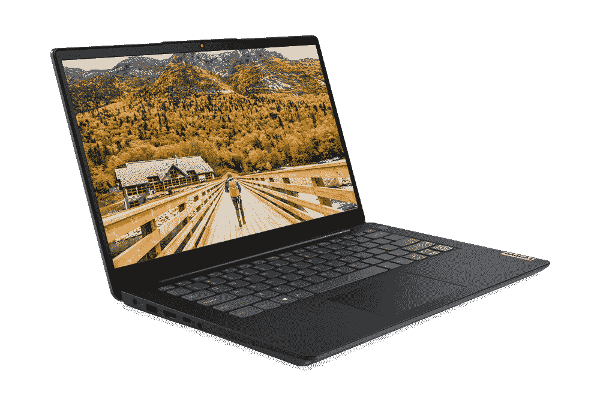
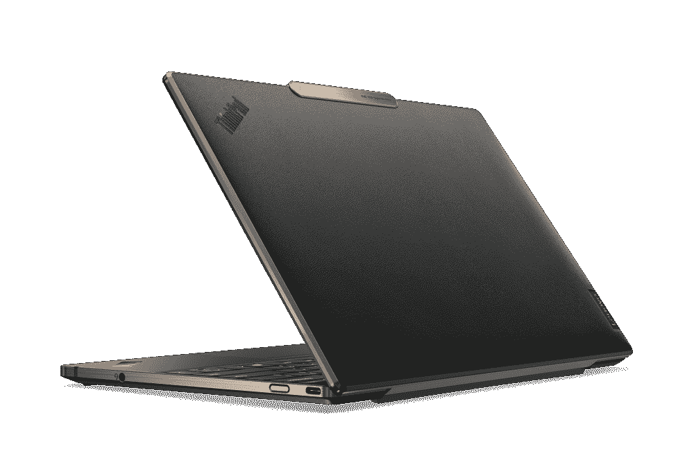
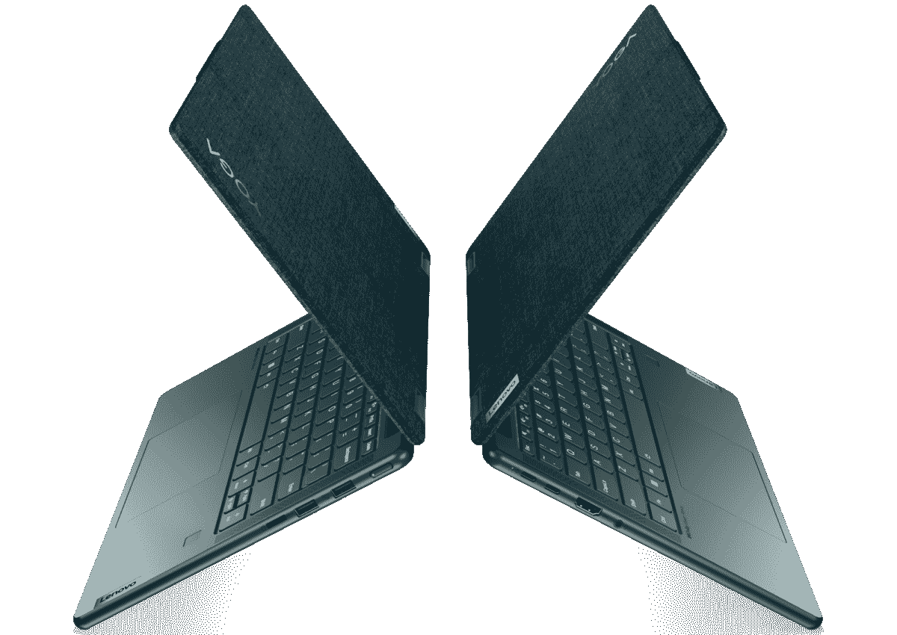

# 2023 年最佳联想笔记本电脑

> 原文：<https://www.xda-developers.com/best-lenovo-laptops/>

联想是世界上最受欢迎的笔记本电脑品牌之一，在商业用户中尤其如此。虽然其他公司也可以制造一些伟大的设备，但联想位居榜首并不奇怪。该公司生产一些你能买到的最好的笔记本电脑，没有一款比 ThinkPad 系列更具标志性。联想 ThinkPad 系列极具标志性，包含一些出色的笔记本电脑。然而，在本文中，我们将超越 ThinkPads，重点介绍不同产品线中你能买到的最好的联想笔记本电脑。

联想的产品阵容中不乏选择，如果你正在寻找最适合你的产品，可能很难找到你想要的。因此，我们在精选的类别中收集了最佳选项，所以无论你是谁，你一定会找到你喜欢的东西。作为补充说明，该列表中所有基于 Windows 的笔记本电脑都附带了 [Windows 11](https://www.xda-developers.com/windows-11/) 。

## 最佳综合:联想 Yoga 9i

联想最具标志性的产品系列可能是 ThinkPad 系列，说实话，它的消费者笔记本电脑并没有那么受欢迎。但是随着 2022 年的 [Yoga 9i，这种情况可能会改变——或者至少应该改变，因为这是一款绝对令人惊叹的笔记本电脑。](https://www.xda-developers.com/lenovo-yoga-9i-2022-review/)

它始于性能，这是你对 2022 年高端笔记本电脑的期望。它由英特尔酷睿处理器提供支持，特别是来自新 P 系列的处理器，这意味着您可以获得多达 14 个内核和 20 个线程，假设您使用酷睿 i7-1280P 型号。不过，每种配置都有足够的性能，并且您还可以获得集成的英特尔 Iris Xe 显卡来处理一些轻型 GPU 工作负载，包括玩一些旧游戏。除此之外，该笔记本电脑配备了高达 16GB 的内存和 1TB 的固态硬盘，这是您获得出色体验所需的一切。

但显示屏确实是这款笔记本电脑最好的部分之一。这是一个 14 英寸的面板，长宽比为 16:10，值得庆幸的是，联想在 2022 年将做得更多。更高的屏幕有助于提高工作效率，即使是基本型号也是如此，它具有全高清+ (1920 x 1200) IPS 面板。但升级是它的趋势:你可以选择 2.8K (2880 x 1800) OLED 面板，它有更平滑的 90Hz 刷新率，或者选择超清晰的超高清+ (3840 x 2400)面板，这也是有机发光二极管，但刷新率为 60Hz。这两款显示器都非常棒，你可以选择更清晰的分辨率还是更平滑的刷新率。您还可以通过 soundbar 铰链获得出色的声音体验。

网络摄像头不断传来好消息，这是一个 1080p 传感器，支持 Windows Hello 面部识别。这不仅意味着您可以获得视频通话和会议的稳定图像质量，而且您还可以轻松解锁笔记本电脑，几乎无需做任何事情。如果你不喜欢，还有一个指纹识别器，所以你有几个选项来解锁你的电脑。

联想还真的用最新的迭代改进了 Yoga 9i 的设计。以前的型号看起来很无聊，但现在，这款笔记本电脑有了漂亮的弯曲边缘，赋予了它更多的生命。大多数表面是平的，但这些弯曲的边缘给了它恰到好处的风格，而且它们与可用的颜色选项也很搭配。这也是一款非常便携的笔记本电脑，重 3.09 磅，厚度仅为 15.2 毫米。对于全铝笔记本电脑来说，这还不错。

最后，我们有端口，考虑到目前大多数高端笔记本电脑提供的功能，它们实际上并不可怕。你有三个 USB Type-C 端口，其中两个支持 Thunderbolt 4，一个 USB Type-A 端口，外加一个耳机插孔。这涵盖了大多数基础知识，虽然 HDMI 端口将受到欢迎，但它与竞争对手的高端笔记本电脑一样好，甚至更好。

在我们的评论中，我们称联想 Yoga 9i 为最佳消费者笔记本电脑，因此我们毫不犹豫地将其列为该榜单的首位。这是一台非凡的个人电脑，当然也是联想制造的最好的笔记本电脑之一。

##### 联想 Yoga 9i

联想 Yoga 9i 是一款漂亮的敞篷笔记本电脑，具有顶级配置和出色的显示屏。

## 最佳经济型笔记本电脑:联想 IdeaPad 3i 15 英寸

想买些实惠又能满足基本需求的东西吗？联想 IdeaPad 3i 是一款价格合理的出色笔记本电脑，无论您是偶尔在家使用还是学生，它都将为您的日常使用提供足够的性能。值得关注的交易，因为它可以使这台笔记本电脑更容易使用。

IdeaPad 3 有几个版本，采用 AMD 或英特尔处理器，但我们专注于英特尔型号，因为它们拥有最新的英特尔硬件。它配备了英特尔酷睿 i3-1215U，这是一款六核八线程处理器，能够提升到 4.4GHz。对于入门级笔记本电脑来说，这是非常可靠的，除此之外，你还可以获得 8GB 内存和 512GB 固态硬盘，这对于这个价格范围内的东西来说是非常棒的。您将有足够的空间来存放文件，并获得稳定的性能。

使用 IdeaPad 3i，您还可以获得开箱即用的稳定显示体验。这是一个 15.6 英寸的面板，具有典型的 16:9 纵横比和全高清分辨率。这并不令人惊讶，但这正是你在这个价格范围内对笔记本电脑的期望，而且它工作得非常好。值得注意的是，这个型号还包括一个触摸屏，这也是这个价格的一个很好的补充。在 300 尼特的情况下，在室外看这个显示器可能有点困难，但在室内使用就很好了。

网络摄像头通常是廉价笔记本电脑首先牺牲的东西之一，这里也不例外。联想 IdeaPad 3i 配有一个 720p 高清摄像头，还算耐用，但并不令人印象深刻。它也不包括 Windows Hello 面部识别，尽管如果你想轻松解锁你的电脑，电源按钮上有一个内置的指纹识别器。

像这样的经济型笔记本电脑没有引起太多关注的另一点是设计。IdeaPad 3i 的厚度勉强达到 20 毫米以下，重量为 3.59 磅。它不是特别轻或薄，但它可能更糟，而且它肯定仍然是便携式的。这款笔记本电脑有深渊蓝和风暴灰两种颜色可供选择，这两种颜色都比较柔和，但深渊蓝的整体看起来确实不错。

接下来是端口，这里的连接范围非常广泛。你有两个 USB Type-A 端口(一个 USB 2.0，一个 USB 3.2 Gen 1)，一个 USB Type-C (3.2 Gen 1)，HDMI，SD 读卡器和耳机插孔。这确保您可以连接大多数类型的外围设备，如果您正在购买这个价格范围内的笔记本电脑，您可能不会寻找比这里更好的东西。

您可以使用以下链接购买 IdeaPad 3i。我们的目标是低于 600 美元的价格标签，以此作为预算选择，这款笔记本电脑在写作时符合这一要求，但价格可能会有所不同。你可以随时查看 AMD 的型号，看看它们现在是否更便宜。

 <picture></picture> 

Lenovo IdeaPad 3i

##### 联想 IdeaPad 3i

联想 IdeaPad 3i 是一款非常实惠的笔记本电脑，具有全面可靠的性能，价格也不会超出预算。

## 最佳商务笔记本电脑:ThinkPad X1 Carbon Gen 10

ThinkPad X1 Carbon 是 ThinkPad 系列中运行时间最长的系列，很少有笔记本电脑像这一款一样具有辨识度。如果你需要一台轻便、功能强大的商务笔记本电脑，那么你应该看看最新一代的 [ThinkPad X1 Carbon Gen 10](https://www.xda-developers.com/lenovo-thinkpad-x1-carbon-gen-10/) 。

从性能开始，我们正在考虑高达英特尔酷睿 i7-1280P 的第 12 代英特尔酷睿处理器，这款处理器具有 14 个内核和 20 个线程，能够提升至 4.8GHz。除了凭借 28W TDP 成为超极本上最快的 CPU 之一，它还包括 Iris Xe 显卡，因此您可以运行一些以 GPU 为中心的工作负载。此外，ThinkPad X1 Carbon Gen 10 配备了高达 32GB 的内存和 2TB 的固态硬盘。如此大的内存容量应该可以保证您永远不会希望有更多的内存，无论是用于视频或照片编辑、复杂的编码项目，还是处理大型数据库。此外，这也是足够的存储空间。

接下来是显示屏，它是一个 14 英寸的面板，长宽比为 16:10。与典型的 16:9 显示器相比，这种更高的格式为您提供了更多的垂直空间(尽管略低于 3:2 显示器)。根据你的选择，这个展示也可以很棒。这里的基本配置相当简单，全高清+面板(1920 x 1200)，没什么更值得注意的。然而，你可以添加一个触摸屏，一个隐私保护装置(让你周围的人看不到屏幕)，选择一个稍微清晰的 2.2K (2240 x 1400)屏幕，或者选择一个更高端的选项。这包括一个新的 2.8K (2880 x 1800) OLED 面板选项，由于有机发光二极管的通常优势，它既清晰又充满活力，如果你想要绝对清晰的图像，还可以选择超高清+ (3840 x 2400) IPS 面板。

第 10 代机型的新功能是 1080p 网络摄像头，默认情况下，大多数配置中都包含该摄像头。这意味着更好的视频通话和会议质量，这对于混合工作时代的商务笔记本电脑来说意义重大。您还可以获得可选的 Windows Hello 红外面部识别功能，并从那里选择一个支持计算机视觉的 MIPI 网络摄像头，这意味着笔记本电脑可以检测到您何时离开或靠近它，因此它会自动锁定并在需要时唤醒，以保护您的数据安全并随时准备使用。

关于 ThinkPad X1 Carbon 的设计，没有太多可以说的，除了它确实是你所期待的。这是一款带有红色口音的黑色笔记本电脑，包括经典的 TrackPoint 和触摸板上方的重复鼠标按钮等功能。这就是 ThinkPad 的精髓所在，无疑会觉得似曾相识。然而，它仍然是一款现代笔记本电脑，因此它的厚度仅为 15.36 毫米，重量为 2.48 磅。这是目前最轻的笔记本电脑之一，非常适合移动办公人员。

在端口方面，ThinkPad X1 Carbon 也毫不逊色。它有两个 Thunderbolt 4 端口，两个 USB Type-A，HDMI 2.0b 和一个耳机插孔。像往常一样，商用笔记本电脑有蜂窝连接选项，包括 LTE Cat 16 和 5G 选项。这款笔记本电脑还集成了磁贴功能，这意味着即使在关机的情况下，您也可以在笔记本电脑丢失的情况下找到它。

不言而喻，但联想 ThinkPad X1 Carbon 是市场上最好的商务笔记本电脑之一，你真的不会错。

##### 联想 ThinkPad X1 碳第 10 代

联想 ThinkPad X1 Carbon 是一款集现代功能于一身的经典商务笔记本电脑。它具有高端性能、高度可配置的规格和出色的连接选项。

## 最佳 AMD 商务笔记本电脑:联想 ThinkPad Z13

您将看到推荐的大多数商用笔记本电脑，尤其是高端市场的笔记本电脑，都采用了英特尔处理器。但是联想试图用新的 ThinkPad Z13 系列来改变这种情况，该公司全力以赴使这款笔记本电脑成为最好的笔记本电脑之一。坦率地说，你可能更喜欢 ThinkPad X1 Carbon，这是有充分理由的。

首先，联想 ThinkPad Z13 采用 AMD 锐龙 Pro 6000 系列处理器，最高可配锐龙 7 Pro 6860Z。这是锐龙 7 Pro 6850U 的略微增强版本，具有 8 个内核和 16 个线程，但它可以提升到 4.73GHz。它是一个 15W 处理器，所以在性能方面与英特尔的 P 系列不太一样，但反过来，它应该会给你更好的电池效率。这些 AMD 处理器还配备了新的 AMD 镭龙 680M 集成显卡，比英特尔的 Iris Xe 强大得多。您还可以获得高达 32GB 的 6400 MHz lpddr 5 RAM 和 1TB SSD 存储。这是一款非常高端的笔记本电脑。

显示器也是如此。这是一个 13.3 英寸的面板，长宽比为 16:10，就像联想 2022 年的大多数笔记本电脑一样。基本型号是全高清+ (1920 x 1200)面板，触摸支持是一个可选的升级。然而，最大的升级是 2.8K OLED 面板，提供了更清晰的图像和有机发光二极管显示器典型的鲜艳颜色和真正的黑色。您确实错过了一些选项，如隐私屏幕，一些商业用户可能会喜欢，但这对大多数人来说仍然是一个很好的显示。

你还会得到一个很棒的网络摄像头，这是一个 1080p 传感器，具有 f/2.0 光圈和 Windows Hello 面部识别功能。有两种选择:一种是混合 RGB 和 IR 摄像头，另一种是 RGB 和 IR 分立传感器。拥有两个独立的传感器意味着图像质量会更好，但你一定会在相机上看起来很棒。

设计是 ThinkPad Z13 的真正卖点，主要是因为它看起来不太像 ThinkPad。它保留了红色 TrackPoint 和一些 ThinkPad 徽标等标志性元素，但现在，你不会在触摸板上看到重复的鼠标按钮。相反，按钮内置在触摸板中，你可以这样点击它们。它现在看起来更现代了，你可能喜欢也可能不喜欢，但我相信它是 ThinkPad 家族急需的新鲜空气。它还有多种颜色可供选择，其中一种是经典的黑色纯素皮革外壳。至于便携性，这款笔记本电脑的厚度为 13.99 毫米，起始重量为 2.63 磅，因此非常便携。

这种非常薄的机箱的一个缺点是，它只适合 USB Type-C 端口，你可以得到两个端口，外加一个耳机插孔。然而，ThinkPad Z13 再次成为首批支持 USB4 的 AMD 笔记本电脑之一，这意味着每个端口都有 40Gbps 的带宽，因此它可以驱动多个显示器和其他高速外设。这就像有一个 Thunderbolt 端口，但你不需要英特尔处理器。当然，也有可选的蜂窝连接，但你需要坚持使用 LTE，因为不幸的是，5G 还没有提供。

总而言之，在联想的笔记本电脑中，ThinkPad Z13 当然是我个人最喜欢的。这是一款漂亮的笔记本电脑，具有顶级的设计、顶级的性能和出色的显示屏。此外，它标志着 ThinkPad 家族的重大转变。

 <picture></picture> 

Lenovo ThinkPad Z13

##### 联想 ThinkPad Z13

联想 ThinkPad Z13 是联想最具现代感的 ThinkPad，它采用高端 AMD 锐龙处理器。

## 最佳游戏笔记本电脑:联想军团 5 Pro(第 7 代)

仅仅因为联想以其商用笔记本电脑而闻名，并不意味着该公司不能制造出一流的游戏笔记本电脑。联想 Legion 5 Pro 是一款功能强大的游戏装备，拥有您所期望的所有性能，对于那些既想玩游戏又想拥有笔记本电脑便携性的人来说，这是一个绝佳的选择。我们推荐 AMD 变体，因为基于英特尔技术的 Legion 5i Pro 尚未提供高端显卡，所以这是更好的选择。

从性能开始，联想军团 5 Pro 是该榜单上第一款采用 AMD 处理器而不是英特尔处理器的笔记本电脑，它配备了锐龙 7 6800H。这是一个 45W 的处理器，具有八个内核和 16 个线程，加上高达 4.7GHz 的加速速度，使它成为笔记本电脑上最强大的 CPU 之一。您可以将它与最高配备 150 瓦 TGP 的 NVIDIA GeForce RTX 3070 Ti 搭配使用，这是一个非常强大的设置，可以毫无问题地处理几乎任何现代游戏。你还可以添加高达 32GB 的 DDR 5 RAM——对于大多数现代游戏来说已经足够了——以及高达 1TB 的存储空间，不过如果你想以后添加更多，还有一个额外的 M.2 插槽。

如果你喜欢玩游戏，它的显示屏也很不错，但也适合一些生产力工作。它有 16:10 的宽高比，并且有一些配置选项。基本型号是一个全高清+ (1920 x 1200)面板，刷新率为 165 赫兹，亮度为 300 尼特。您可以升级到四高清+ (2560 x 1600)面板，它具有相同的刷新率，但高达 500 尼特，或者如果您的配置可以处理，您可以选择更平滑的 240Hz 刷新率。这两个选项都很棒，如果你想要一台更实惠的笔记本电脑，基本型号也是可用的。

这款笔记本电脑的一个缺点是它的网络摄像头，只有 720p，不包括 Windows Hello 的红外摄像头。事实上，你在这台笔记本电脑上没有任何形式的生物认证，这在今天是一个败笔。从好的方面来看，那些担心隐私的人确实得到了一个内部断开网络摄像头的开关，以完全关闭它。

至于设计的其余部分，这对于游戏笔记本电脑来说是相当标准的事情。这是一款很重的笔记本电脑，重 5.49 磅，但厚度仍不到 20 毫米，所以并不厚。它有风暴灰色的配色，没有太多的 RGB 照明，如果你不想太显眼，你可能会喜欢。键盘是背光的，但 RGB 照明也是可选的。

就端口而言，笔记本电脑的后部容纳了大多数端口，包括两个 USB Type-A 端口，一个带有 DisplayPort 和 135W 功率传输的 USB Type-C 端口，HDMI 2.1 和 RJ45 以太网，以及专有的充电端口。在右侧，有另一个 USB Type-A 端口和耳机插孔，在左侧，还有两个 USB Type-C 端口，具有 DisplayPort Alt 模式(但不充电)。有很多端口，其中很多都在背面，这样您就可以舒适地使用游戏鼠标之类的东西，而不会有电缆从侧面伸出来碍事。

总的来说，对于任何对游戏感兴趣的人来说，这都是一款非常棒的笔记本电脑，不仅仅是在家里，在任何地方都是如此。它不是最便携的——无论是因为它的重量还是电池寿命——但如果你需要性能，Legion 5 Pro 有它。

 <picture></picture> 

Lenovo Legion 5 Pro

##### 联想军团 5 Pro

联想 Legion 5 Pro 是一款功能强大的游戏笔记本电脑，采用 AMD 和 NVIDIA 的最新硬件，加上 16 英寸的高显示屏。

## 创作者的最佳笔记本电脑:联想 ThinkPad X1 Extreme Gen 5

高性能对游戏很有用，但也可以用于专业人士，特别是内容创作者。如果您对此更感兴趣，那么[联想 ThinkPad X1 Extreme](https://www.xda-developers.com/lenovo-thinkpad-x1-extreme-gen-5-review/) 是您的不二之选，因为它将令人难以置信的性能与 ThinkPad 系列特有的可定制性和业务功能融为一体。

让我们从性能开始，因为这是这款笔记本电脑的重点。ThinkPad X1 Extreme Gen 5 配备了第 12 代英特尔酷睿 H 系列处理器(45W 型号)，您可以通过最高配置英特尔酷睿 i9-12900H 博锐 CPU 来获得它。是的，这是一个能够提升到 5GHz 的 14 核 20 线程 CPU，所以你可以放心，几乎任何你想做的事情，你都可以做到。即使要求苛刻的视频编辑任务也不会是一个大问题。但这还不是全部，你还可以添加一个 16GB 显存的 NVIDIA GeForce RTX 3080 Ti 显卡。虽然这不是一台游戏笔记本电脑，但如果需要的话，它肯定可以处理它。在大多数配置中，它还配备了高达 64GB 的 RAM 和 2TB 的 SSD 存储。如果你得到一个较弱的 GeForce RTX 3050 Ti GPU，你可以通过两个 M.2 插槽获得高达 4TB 的存储，但其他配置因为更强的 GPU 而删除了一个插槽。

你可以为显示器选择几个不同的选项，它们都很棒。首先，这是一个 16:10 的面板，正如我们已经提到的，更高的纵横比有利于提高工作效率。在一些应用程序中，您可以看到更多文本、更多网页内容和更多 UI 元素。基本配置是一个四高清+ (2560 x 1600)面板，这对于笔记本电脑显示器来说已经足够清晰了，即使是像这样的大显示器。如果你真的想把它作为一台游戏笔记本电脑，还有一个 165Hz 刷新率的新选项。如果你需要更多的像素，你可以升级到超高清+显示屏(3840 x 2400)，这将亮度水平提高到 600 尼特(从 400)，并增加了对杜比视觉和 DisplayHDR 400 认证的支持。您也可以在此面板上添加触摸屏，但不是 Quad HD+版本。

显示屏上方还有一个 1080p 的网络摄像头，因此会议和视频通话不成问题，您应该在会议和视频通话期间看起来很棒。这款笔记本电脑还支持 Windows Hello 面部识别，这要归功于一个混合红外传感器，此外还有一个指纹识别器。

凭借所有这些强大的规格，ThinkPad X1 Extreme 比列表中的大多数笔记本电脑都要重，起始重量为 4.14 磅。然而，它可能会更糟，它的厚度不到 18 毫米，这仍然令人印象深刻。它只是一台令人印象深刻的笔记本电脑，将大量功能集成到一个相对纤薄的机箱中。除此之外，它拥有你所期待的 ThinkPad 的所有设计元素，黑色的表面和红色的点缀给了它你可能熟悉的标志性外观。

ThinkPad X1 继续通过其端口覆盖所有底座，包括两个 Thunderbolt 4 端口、两个 USB Type-A 端口、一个 SD 读卡器、HDMI、一个耳机插孔和一个专有充电端口。您将准备好连接任何开箱即用的东西。对于移动连接，ThinkPad X1 Extreme 还允许您添加蜂窝网络支持。或者至少，它会在某个时候出现，因为这个选项似乎还不可用。将只有 5G 可用，只有当你获得配备英伟达 GeForce RTX 3050 Ti 的型号时，你才能获得它。同样，更强大的 GPU 占用了机箱内太多的空间。

这是一款非常强大的笔记本电脑，采用了令人印象深刻的超薄设计，虽然有点贵，但在性能方面绝对是一流的。如果你想要一台可以处理任何事情(包括一些游戏)而不引起太多注意的 PC，联想 ThinkPad X1 Extreme 是最好的笔记本电脑之一。

 <picture></picture> 

Lenovo ThinkPad X1 Extreme Gen 5

##### 联想 ThinkPad X1 至尊版

联想的 ThinkPad X1 Extreme 是你能找到的最强大的商务笔记本电脑之一。凭借英特尔最新的 H 系列处理器、NVIDIA RTX 显卡以及高内存和存储配置，您别无所求。

## 最佳 AMD 敞篷车:联想 Yoga 6

一家公司投入实际精力设计 AMD 驱动的笔记本电脑并不常见，但如果你是 AMD 的粉丝，联想 Yoga 6 是一款非常棒的敞篷车。它重量轻，外观独特，一定会吸引眼球，拿在手里感觉棒极了。

先说那个性能吧。联想 Yoga 6 配备了 AMD 的锐龙 5000 系列处理器，最高可达锐龙 5 5700U。它不再是 AMD 的最新硬件，但这仍然是一个非常快的处理器。它仍然是一个 8 核 16 线程的 CPU，加速速度高达 4.3GHz，因此您在处理所有日常任务时不会缺乏性能。此外，AMD 镭龙处理器为您提供稳定的集成显卡。其余的规格都配备了高达 16GB 的内存和 1TB 的固态硬盘，这是一个非常好的整体体验的秘诀，这是一个可以持续很长时间的笔记本电脑。

不过，Yoga 6 的最新版本对显示屏进行了一些大的改变。嗯，这只是一个大的变化，但它是一个重大的变化。现在，它的长宽比为 16:10，很高兴看到联想将这一功能引入其更主流的笔记本电脑。这是一个全高清+ (1920 x 1200)面板，你不能再高了，但你不需要。在这个价格范围内，这仍然是一个非常好的屏幕，尤其是对于完成工作来说。

在这个显示屏上面，还有另一个巨大的变化。旧的 720p 网络摄像头已经被新的 1080p 传感器取代，这是我们很高兴看到的另一个功能，可以渗透到更便宜的笔记本电脑上。这款相机的图像质量比以前好得多，最重要的是，您现在可以使用 Windows Hello 面部识别功能，因此解锁您的电脑比以往任何时候都更容易。指纹识别器也还在，在这么便宜的笔记本电脑上你很少能看到这两种选择。

联想 Yoga 6 最独特的方面可以说是它的设计。当然，这是一辆敞篷车，只有一种颜色，叫做深青色。你也可以买一个织物覆盖的盖子，它看起来与市面上的任何其他笔记本电脑都不一样，摸起来也更好。不过这是可选的，如果你愿意，你可以用一个普通的金属盖子来得到它。对于今年的迭代，联想采用了与我们在顶部提到的 Yoga 9i 相同的设计语言，在机箱四周都采用了弧形边缘。就便携性而言，Yoga 6 的厚度为 17.36 毫米(带织物盖)或 17.45 毫米(带金属盖)，重量为 3.02 磅，因此它是一款易于随身携带的设备。

至于端口，鉴于其尺寸，2022 年的联想 Yoga 6 有一个非常好的设置。你有两个 USB Type-C 端口，两个 USB Type-A 端口，HDMI，一个耳机插孔和一个 microSD 读卡器。对于这么小的笔记本电脑来说，这是非常令人印象深刻的，它确实涵盖了大多数用户的所有基本需求。

如果你是一个 AMD 的粉丝，但你仍然想要一个独特的高端设计，同时又易于携带的笔记本电脑，联想 Yoga 6 是一个简单的选择。之前的版本已经很坚固了，但是最新的型号解决了它所有的缺点，是联想产品线中最好的笔记本电脑之一。

 <picture></picture> 

Lenovo Yoga 6

##### 联想 Yoga 6

联想 Yoga 6 是一款出色的 AMD 驱动敞篷车，具有时尚的高端设计和出色的日常性能。

## 最佳 Chromebook:联想 IdeaPad 游戏 Chromebook

chrome book 如今越来越受欢迎，联想也推出了一些很棒的产品。目前你能找到的最好的一款是联想 IdeaPad 游戏 Chromebook，虽然它被称为游戏笔记本电脑，但它对任何人来说都很棒。

这款机型配备了第 12 代英特尔酷睿 i5-1235U 处理器，可以提供六个内核和八个线程。这并不算高端，但对于日常使用来说非常好，尤其是使用 ChromeOS 这样的轻量级操作系统。这个型号还包括一个漂亮的 8GB 内存和 256GB 的固态硬盘存储，这可能比你在 ChromeOS 上需要的更多，而且它非常快。

这款 Chromebook 最棒的部分之一是显示屏，这是一个 16 英寸的大面板，长宽比为 16:10，非常适合各种工作效率。分辨率为 2560 x 1600，因此非常锐利，平滑的 120Hz 刷新率使您在使用笔记本电脑时一切都感觉更流畅。另外，它的亮度达到了 350 尼特，所以室外能见度应该比这个价格范围内的许多笔记本电脑都好。在显示器上方，有一个 1080p 全高清网络摄像头，如果你打算在这台笔记本电脑上参加会议和视频通话，这是一个好消息。

在设计方面，联想 IdeaPad 游戏 Chromebook 采用了相当基本的风暴灰色配色，它并不太在意看起来是否时尚。你可以在键盘上用四个照明区域获得 RGB 照明，所以至少有一点天赋。它重 4.1 磅，厚 19.95 毫米，所以它不是最便携的机器，尽管这是这个价格的预期。

你也有充足的葡萄酒供应。有两个 USB Type-C 端口，两个 USB Type-A 端口，一个耳机插孔和一个 microSD 读卡器。缺少 HDMI 有点令人失望，但你可能不会太有兴趣在像这样的入门级笔记本电脑上使用第二个显示器。

从各方面考虑，联想 IdeaPad 游戏 Chromebook 在价格上是一款不错的笔记本电脑。在撰写本文时，它的价格不到 600 美元，对于您在这里得到的东西来说，这个价格一点也不差。

##### 联想 IdeaPad 游戏 Chromebook

联想 IdeaPad Gaming Chromebook 是一款非常强大的笔记本电脑，具有快速的性能和清晰的显示屏，而且非常流畅。它对任何人来说都很棒，尽管它是作为游戏设备来销售的。

* * *

这些是我们为你挑选的今天能买到的最好的联想笔记本电脑。联想 Yoga 9i 是我们的首选，因为它是我们喜欢在笔记本电脑中看到的一切的完美融合。它具有顶级的性能、漂亮的设计、令人惊叹的显示选项等等。那个很难出错。但是每个人都有不同的需求，所以这里每个人都有一点点东西，你一定会找到你喜欢的其他东西。

如果联想不是你想要的，为什么不看看其他品牌最好的笔记本电脑呢？我们列出了[最佳戴尔笔记本电脑](https://www.xda-developers.com/best-dell-laptops/)，以及[惠普笔记本电脑。](https://www.xda-developers.com/best-hp-laptops/)这些也是非常受欢迎的品牌，你也不会错。