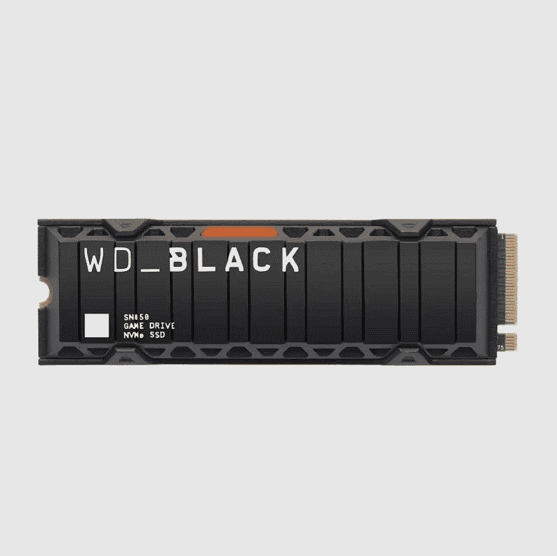
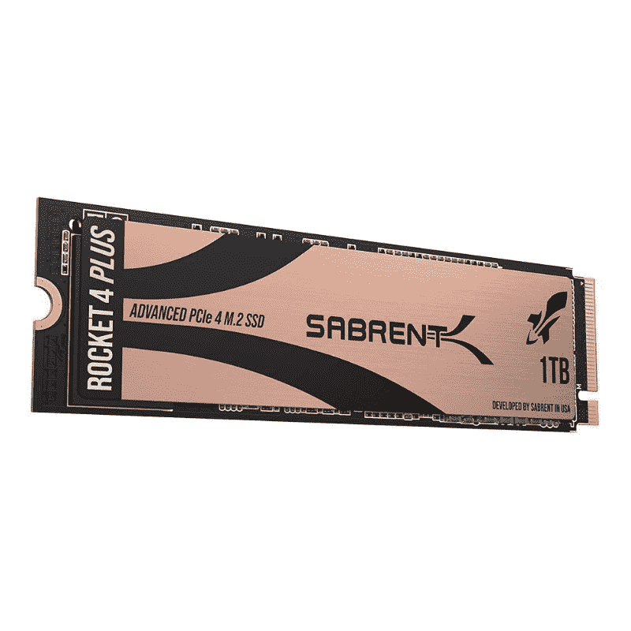
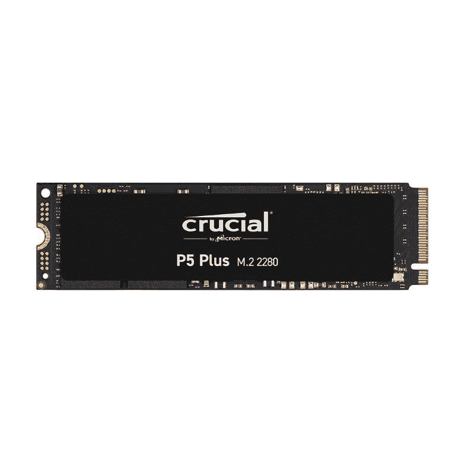
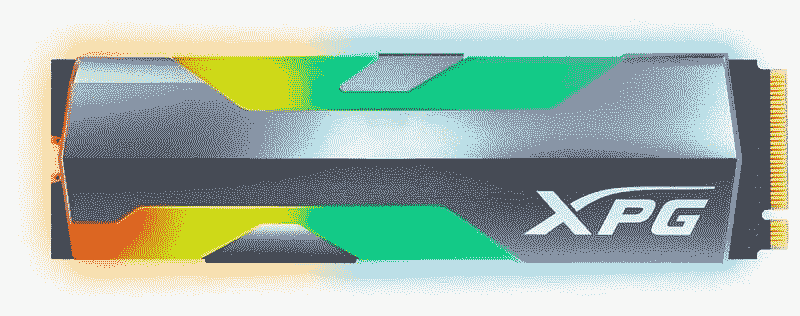
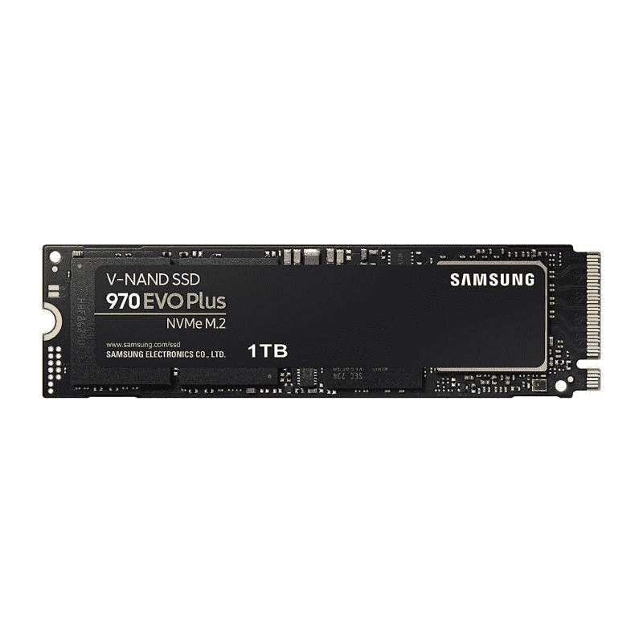
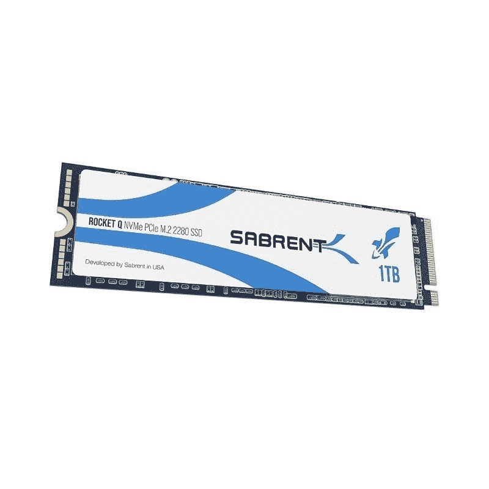

# 2023 年最佳 M.2 固态硬盘

> 原文：<https://www.xda-developers.com/best-m-2-ssd/>

第一次安装新的固态硬盘，或者更换旧的固态硬盘，是你可以对电脑进行的最有效的升级。固态硬盘升级不会花费您太多的成本，安装时间也不长，并显著改善您的计算体验。这是一种屡试不爽的给计算机注入新生命的方法。

然而，选择正确的固态硬盘可能有点复杂。市场上广泛提供容量从 250GB 到 8TB 的 M.2 驱动器。如今，它们已经成为笔记本电脑的标准，但在台式机领域也越来越受欢迎。现在很多高端主板都有两个以上的 M.2 插槽。M.2 Type-2280 是笔记本电脑和台式机主板中最常用的尺寸。

虽然基于 SATA 的固态硬盘非常适合基本工作负载，但我们建议您选择支持 NVMe 的 based M.2 固态硬盘。NVMe(非易失性存储器快速)是用于实现 PCIe 的协议。这些固态硬盘比 SATA 更快，因为它们往往与您的电脑通话速度更快。如果您的日常工作负载涉及游戏、大型文件传输、视频、高端照片编辑、代码转换等，这些就是您应该寻找的驱动器。说到容量，我们也建议您尽可能大。

这个想法是要有足够的存储空间来存放一个全新的 Windows 11 和几个你最常用的应用程序或最常玩的视频游戏。SATA 固态硬盘仍然更适合大容量存储，因为它们通常更经济实惠，容量更大。主板上的 SATA 连接器也比 M.2/PCIe 多。对于任何系统来说，一个好的平衡是将 NVMe SSD 作为启动驱动器(如果您的硬件支持)，并将 SATA 驱动器作为额外的存储空间。

我们在这个系列中包括了 PCIe 第三代和第四代 NVMe 固态硬盘。虽然包括新固态硬盘在内的 PCIe 第五代外设预计将在不久的将来推出，但它们的数量有限，价格昂贵。

## 最佳整体奖-西部数码黑色 SN850

| 

规格

 | 

西部数据黑色 SN850

 |
| --- | --- |
| **容量** | 250GB、500GB、1TB、2TB |
| **外形尺寸** | M.2 2280 单面 |
| **传输接口** | PCIe 4.0 x4 / NVMe 1.4 |
| **顺序读/写** | 7000 兆字节/秒/5300 兆字节/秒 |
| **保修** | 5 年 |
| **耐力** | 高达 1，200TBW |

Western Digital Black SN850 硬盘是我们为您挑选的目前市场上可以买到的最佳固态硬盘。SN850 继承了上一代 SN750 的优点，成为性能最佳的硬盘。它使用 PCIe 4.0 接口，利用两倍于其他 PCIe 3.0 驱动器的理论带宽限制。SN850 可以在顺序传输中达到 7，000MB/s 的读取速度和 5，300MB/s 的写入速度，从而脱颖而出。

SN850 驱动器有 500GB、1TB 和 2TB 容量，带或不带散热器。众所周知，这种特殊的驱动器运行起来有点热，尤其是在负载情况下，所以我们建议使用某种散热器来控制您的驱动器温度。如果您认为普通散热器的变体过于昂贵，您也可以选择使用第三方散热器。该驱动器采用 M.2 2280 单边外形，配有一个 NVMe 控制器、一个动态随机存取存储器芯片和两个闪存封装。SN850 由专有的基于 Arm 的多核八通道 PCIe 4.0 x4 NVMe 固态硬盘控制器供电，WD 喜欢称之为 WD_BLACK_G2。它建立在 TSMC 的 16 纳米 FinFET 技术之上。

WD 的 Black SN850 还具有一个改进的 SLC 缓存实现，称为 nCache 4.0。它支持混合 SLC 缓存，这类似于三星的涡轮写，但容量更大。WD Black SN850 还具有许多安全机制，如多级低密度奇偶校验(LDPC) ECC 引擎、内部 SRAM ECC、ECC 方案中的端到端数据路径保护等。所有这些功能确保驱动器上的数据始终安全。

该驱动器的额定容量还可承受每 500GB 容量高达 300TB 的写入，在 2TB 变型中可承受高达 1，200 bw 的写入。该公司还支持黑色 SN850，并提供五年保修。这些保修索赔更符合大多数制造商为其固态硬盘提供的服务，这很好。正如我们之前提到的，建议您为 SN850 配备散热器，即使是在通风良好的机箱内。众所周知，这款硬盘比市场上的其他固态硬盘运行更热，负载下可达 75°C 以上。

尽管在 PCIe 第四代派对上迟到了，但西部数字公司的 Black SN850 凭借在性能排行榜上的领先地位，成功登上了最佳下一代固态硬盘的榜首。对于那些希望为 PS5 增加更多存储空间的人来说，这也是一个很好的选择，因为索尼已经在控制台上实现了固态硬盘存储扩展。SN850 是索尼为 PS5 推荐的首批固态硬盘之一。

PCIe 4.0 完全是关于速度的，而西部数字黑色 SN850 在这方面很棒。这可以说是目前最值得购买的 M.2 固态硬盘，我们预计，至少在下一代 PCIe 5.0 硬盘问世之前，它将一直位居榜首。

 <picture></picture> 

Western Digital Black SN850

##### WD 黑色 SN850 NVMe M.2 固态硬盘

Western Digital Black SN850 是目前市场上性能最好的 PCIe 4.0 NVMe M.2 固态硬盘，具有令人印象深刻的连续读/写速度。

## 亚军:三星 990 专业版

| 

规格

 | 

三星 990 专业版

 |
| --- | --- |
| **容量** | 1TB、2TB、4TB |
| **外形** | M.2 2280 |
| **传输界面** | PCIe 4.0 x4，/ NVMe 2.0 |
| **顺序读/写** | 7，450MB/s / 6，900 MB/s |
| **保修** | 5 年 |
| **耐力** | 最高 2，400 吨体重 |

三星的 990 Pro 是该公司最新的高端 NVMe 固态硬盘，取代了旧的 980 Pro。它的顺序读取速度高达 7，450MB/s，写入速度高达 6，900MB/s，是整个系列中速度最快的固态硬盘，但价格也是 WD Black SN850 的两倍左右。对于那些需要以价值为代价的性能的人来说，990 Pro 是您的最佳选择。

在技术上，990 Pro 与 980 Pro 非常相似，但有几处改进。最重要的是，它的效率比 980 Pro 高 50%，这对笔记本电脑极其重要，因为更低的功耗意味着更长的电池寿命。990 Pro 还针对微软的 DirectStorage API 进行了优化，该软件旨在降低游戏的加载时间。

990 Pro 只有 1TB、2TB 和 4TB 三种容量，每种容量都有带或不带散热器的变体。带散热器的型号比不带散热器的型号贵 20 美元，但如果你安装 SSD 的设备已经有了 SSD 散热器，那么你可能不需要带散热器的版本。由于其 5 年保修和每 TB 600 tbw 的耐用性(这意味着 4TB 型号的最大 2，400TBW)，这款 SSD 将持续很长时间，如果没有，您可以要求三星更换。

它不是革命性的，但当它是你能买到的最快的固态硬盘时，它也不需要。由于它的价格，它没有得到我们的最终推荐，但如果你能支付价格，你可以获得金钱可以买到的最好的 SSD。

三星最新、最快的固态硬盘 990 Pro 真正推动了 PCIe 4.0 存储的极限。

## 伟大的多面手-萨布伦特火箭 4 加

| 

规格

 | 

萨布伦火箭 4 加

 |
| --- | --- |
| **容量** | 1TB、2TB、4TB |
| **外形尺寸** | M.2 2280 双面 |
| **传输接口** | PCIe 4.0 x4 / NVMe 1.4 |
| **顺序读/写** | 7，200 兆字节/秒/ 6，900 兆字节/秒 |
| **保修** | 5 年(需要注册) |
| **耐力** | 高达 2，800TBW |

Sabrent Rocket 4 Plus M.2 SSD 即使不比它更好，也和它的领导者一样出色。它与 WD Black SN850 竞争，同时为您节省了一些构建其他核心组件的资金。也就是说，您仍然可以获得相同级别的一般性能，这使得它甚至适用于高端构建。Sabrent Rocket 4 Plus 的峰值读取速度为 7，100MB/s，写入速度为 6，600MB/s，在综合基准测试中的表现优于许多其他 M.2 固态硬盘。不过，在现实世界的测试中，它落后于 SN850。

萨布伦特火箭 4 加使用新的群联 E18 控制器。这是流行的群联 E16 控制器的后续产品，该控制器在第一代 PCIe 4.0 驱动器上运行。它有 1TB、2TB 和 4TB 三种容量，五年保修，分别适用于 700TBW、1，400TBW 和 3000 TBW 耐力。容量和保修选项都更符合市场上大多数其他 M.2 固态硬盘的要求。该驱动器也有微米 NAND 闪存和 SK 海力士 RAM 的高速缓存。

Sabrent 还会给你一份 Acronis True Image 的拷贝，帮助你转移当前的安装。这是一个很好的补充，特别是如果你想切换你的操作系统或引导驱动器。该公司的火箭控制面板也很好地记录了你的驱动器的运行状况。Sabrent 最近一直在拓展存储驱动器的界限。除了火箭 4 Plus，Sabrent 的其他驱动像火箭 4，火箭 Q 等。在市场上同样受欢迎。我们还将 Sabrent Rocket Q 驱动器添加到该系列中，作为那些希望购买高容量驱动器的人的最佳选择。

Rocket 4 Plus 的运行温度比 WD Black SN850 低，这使得它非常适合安装在运行温度通常更高的迷你 ITX 建筑中。Sabrent 使用定制的散热器来安装硬盘，这种散热器非常适合安装在电脑上。对于那些想将它安装在 PS5 内部的人来说，还有一个单独的更薄的散热器。

我们还建议去看看常规的 Sabrent Rocket 4 drive。这是一个价格合理的 PCIe 4.0 驱动器，性能良好，成本略低。它还具有 500GB 的容量，这是 Rocket 4 Plus 所不具备的。

 <picture></picture> 

Sabrent Rocket 4 Plus

##### 萨布伦火箭 4 加

Sabrent Rocket 4 Plus 是 WD Black SN850 固态硬盘的可行替代产品。

## 最超值的 PCIe 4.0 米 2 固态硬盘-至关重要的 P5 Plus

| 

规格

 | 

至关重要的 P5 以上

 |
| --- | --- |
| **容量** | 500GB、1TB 和 2TB |
| **外形尺寸** | M.2 2280 单面 |
| **传送接口** | PCIe 4.0 x4 / NVMe 1.4 |
| **顺序读/写** | 6600 兆字节/秒/5000 兆字节/秒 |
| **保修** | 5 年 |
| **耐力** | 高达 1，200TBW |

至关重要的 P5 Plus 是那些寄希望于价值承诺而非最高性能的产品之一。该硬盘针对特定的工作负载和可靠性进行了优化，而不是试图同时在所有方面都出类拔萃。虽然它可能无法提供最佳性能，但我们认为它仍能满足要求苛刻的工作负载，实现可靠一致的吞吐量。关键是使用内部的关键 NVMe 架构控制器这些棍子。它采用八通道设计，利用 LPDDR4 DRAM 来加速 FTL 管理。500GB 和 1TB 型号使用 1GB 的 DRAM，2TB 型号使用 2GB。

至关重要的 P5 Plus 的顺序读写速度分别为 6600 MB/s 和 4000 MB/s。它与列表中的其他一些驱动器不尽相同，但它将有助于驱动高端游戏系统。P5 Plus 记忆棒提供五年保修，2TB 版本的耐用性高达 1，200 TBW。低容量斗杆的耐用性减半。这不一定是一个问题，在大多数 M.2 固态硬盘中常见。

P5 Plus 硬盘的一大亮点是它支持 TRIM、S.M.A.R.T .数据报告和基于 TCG OPAL 2.0 规范的 AES 256 位全磁盘加密。加密将保持数据安全，并且驱动器也符合 Windows BitLocker。Crucial 提供了该公司自己的 SSD 工具箱和一些克隆软件，以帮助从现有的驱动器转移。我们认为这是一个很好的补充，它增加了价格的价值。

至关重要的 P5 Plus 介于最好的 PCIe Gen3 和更新的 PCIe Gen4 硬盘之间。它没有最快的读/写速度，但它在优化工作负载方面与最佳产品竞争，例如您将在 [PCMark 10](https://benchmarks.ul.com/pcmark10) 中找到的产品。Crucial 还依赖于 Micron 替代栅极架构的使用，该架构将电荷陷阱与该公司的 CMOunder 阵列技术相结合。新的替代栅极存在单元间电容耦合问题减少、电阻水平降低等问题。所有这些都有利于 P5 Plus 随着时间的推移提高可靠性和耐用性。

我们仍然认为一些较新的 PCIe 4.0 驱动器，如 Sabrent Rocket 4 Plus，在原始性能方面更胜一筹。但是，与市场上的高端驱动器相比，Crucial 对寿命的强调使其成为一个令人信服的选择。总的来说，我们认为至关重要的 P5 Plus 已经在我们的系列中赢得了一席之地，对于那些想要一辆 PCIe 4.0 而又不想花大价钱的人来说，它是一个可靠的选择。根据您追求的容量，它会削弱大多数高端性能驱动器。

 <picture></picture> 

Crucial P5 Plus SSD

##### 至关重要的 P5 加固态硬盘

至关重要的 P5 Plus 不是市场上最快的 PCIe 4.0 固态硬盘，但就其带来的性能和功能而言，它的价格很合理。

## 最佳 RGB M.2 固态硬盘- XPG Spectrix S20G

| 

规格

 | 

XPG·斯佩崔克斯 S20G

 |
| --- | --- |
| **容量** | 500GB，1TB |
| **外形尺寸** | M.2 2280 单面 |
| **传输接口** | PCIe 3.0 x4 / NVMe 1.3 |
| **顺序读/写** | 2500 兆字节/秒/1800 兆字节/秒 |
| **保修** | 5 年 |
| **耐力** | 高达 600TBW |

我们认为，任何涉及存储设备的列表如果不包含 Adata 都是不完整的，这就是为什么我们决定将这款 M.2 RGB SSD 添加到组合中。XPG·斯佩克特里克斯不是在竞争最快的车手。反而是来带 RGB 的。它是我们系列中唯一一款具有 RGB 照明的固态硬盘，非常适合已经充满色彩的游戏构建。

XPG Spectrix S20G 也是名单中外观较好的驱动器之一。事实上，我们认为它比本系列中提到的大多数其他固态硬盘都更好看，即使在你关灯的时候。它采用双色设计，融合了拉丝铝和磨砂塑料。当系统打开时，塑料部分会亮起。虽然不仅仅是 RGB。外壳下面有一个散热器，可以控制驱动器的温度

S20G 有 500GB 和 1TB 两种配置，顺序读写速度分别为 2500 MB/s 和 1800 MB/s。如果有更多的存储选项就好了，但对于大多数仍在寻求为 PC 添加旧的 PCIe 3.0 存储的用户来说，这已经足够了。S20G 基于 PCIe 3.0 接口，这就是为什么读/写速度相当令人印象深刻。该驱动器支持 SLC 缓存和主机内存缓冲，可实现 160K/190K IOPS 的随机读/写速度。S20G 棒还受益于 LDPC(低密度奇偶校验)纠错码技术，可以检测和修复更大范围的数据错误。

与至关重要的 P5 Plus SSD 类似，XPG S20G 也采用 AES 256 加密技术，以确保数据的安全性和完整性。Adata 表示，这些驱动器有五年的保修期，额定功率为 600TBW。驱动器的工作温度通常取决于 RGB 固态硬盘的照明效果。XPG 表示，这种驱动器可以在 0 摄氏度到 70 摄氏度之间的任何温度下工作，这与其他产品更加一致。

XPG S20G M.2 PCIe 3.0 固态硬盘专为游戏设计的事实在其风格中得到了清晰的体现。我们希望 Adata 发布了一个带有 PCIe 4.0 界面的更新版本，以满足该领域不断增长的需求。也就是说，当谈到支持 RGB 的固态硬盘时，你的选择相当有限。这里的根本问题似乎是照明设置对整体性能的影响。

 <picture></picture> 

XPG SPECTRIX S20G

##### XPG·斯佩崔克斯 S20G

XPG Spectrix S20G 是该系列中唯一配备 RGB 灯的固态硬盘。

## 最佳 PCIe 3.0 M.2 固态硬盘-三星 970 EVO Plus

| 

规格

 | 

三星 970 EVO Plus

 |
| --- | --- |
| **容量** | 250GB、500GB、1TB、2TB |
| **外形尺寸** | M.2 2280 单面 |
| **传送接口** | PCIe 3.0 x4 / NVMe 1.3 |
| **顺序读/写** | 3500 兆字节/秒/3200 兆字节/秒 |
| **保修** | 5 年 |
| **耐力** | 高达 1，200TBW |

虽然最新一代的 PCIe 3.0 M.2 固态硬盘无法与较新的 PCIe 4 硬盘相媲美，但我们认为，如果你不太担心追求尖端性能，它们仍然值得购买。2022 年市场上不会缺少基于 PCIe 3.0 的固态硬盘，但在这方面，三星 970 EVO Plus 是我们的选择。在新一代硬盘到来之前，970 EVO Plus 取代了非常受欢迎的 970 EVO 硬盘，成为主流的 PCIe 3.0 固态硬盘。它配备了 V5 闪存，提供了 3，500MB/s 的顺序读取速度。

由于采用了 TurboWrite 高速缓存，970 EVO Plus 固态硬盘具有不同的顺序写入速度。它基于缓存内存中有多少数据。三星 970 EVO Plus 提供 250GB、500GB、1TB 和 2TB 容量，续航能力分别为 150 TBW、300 TBW、600 TBW 和 1200 TBW。它们采用 M.2 2280 单面外形，配有三星的 Phoenix 控制器。

三星在 Phoenix 控制器上添加了镍涂层，并在 PCB 背面添加了薄铜膜，以帮助散热。三星 970 EVO Plus 型号配备了该公司先进的动态热防护实施。它会强制驱动器在限制生效之前在顺序写入期间传输更多数据。这一特殊功能消除了使用复杂散热器散热的需求。

三星 970 EVO Plus drive 有很多值得喜欢的地方。由于三星卓越的固态硬盘技术，970 EVO Plus 即使在当今 PCIe 4.0 硬盘的世界也是一款理想的固态硬盘。它们不如市场上较新的固态硬盘高效，但它们非常适合那些用较慢的存储解决方案升级旧机器的人。在我们的测试中，970 EVO Plus 的峰值读写速度分别约为 3400 MB/s 和 3150 MB/s。

三星 970 EVO Plus 仍然被认为是处理棘手工作负载的最佳产品之一，这就是为什么我们认为它是目前市场上最好的 PCIe 3.0 M.2 SSD 之一。作为上一代产品，三星 970 EVO Plus 也没有以前那么贵了。它仍然是一个非常棒的驱动器，可用于经济型台式机或笔记本电脑升级。

 <picture></picture> 

Samsung 970 EVO Plus SSD

##### 三星 970 EVO Plus 固态硬盘

对于那些不追求尖端 SSD 技术的人来说，三星 970 EVO Plus 仍然是一款出色的 PCIe 3.0 SSD。

## 替代 PCIe 3.0 米 2 固态硬盘-西部数据蓝 SN550

| 

规格

 | 

西部数据蓝 SN550

 |
| --- | --- |
| **容量** | 250GB、500GB、1TB |
| **外形尺寸** | M.2 2280 单面 |
| **传送接口** | PCIe 3.0 x4 / NVMe 1.3 |
| **顺序读/写** | 2400 兆字节/秒/1750 兆字节/秒 |
| **保修** | 5 年 |
| **耐力** | 高达 600TBW |

Western Digital Blue SN550 也有其妥协之处，但我们决定将其添加到我们的系列中，主要是因为它以最低的价格提供了可靠的性能。作为 WD 的主流 NVMe 固态硬盘，蓝色 SN550 为经济型购物者提供了难以置信的价值。事实上，这是推出时最受欢迎的 M.2 驱动器之一，可以肯定地说，它已经成功地在游戏中保持了自己的名字。它有 250GB、500GB 和 1TB 三种容量。

蓝色 SN550 驱动器的额定顺序读写速度分别高达 2，400 MB/s 和 1，750 MB/s。需要记住的一点是，250GB 容量的驱动器在写入方面只能达到 950MB/s。因此，我们认为最好是购买 500GB 或 1TB 的变体，以从该设备中获得最佳价值。固态硬盘支持 Trim、S.M.A.R.T .数据报告、多档 ECC 方案以及各种其他标准闪存管理技术。所有这些都有助于保持 NAND 闪存的长寿。WD 表示，蓝色 SN550 驱动器提供五年保修，额定最大容量可承受高达 600TB 的写入。

西部数据还巧妙地将固态硬盘上的组件分开，以更有效地分配和散热。它防止热量从一个部件传递到另一个部件，以确保驱动器的平稳运行。这使得这种特殊的固态硬盘不再需要复杂的散热器。据说温度远低于可接受的限度，甚至在负载下也是如此。WD 的蓝色 SN550 击败了 QLC 的 NAND 驱动器，如英特尔的 SSD 665p 和关键的 P1。它甚至主导了 Corsair Group MP33，这是另一种无内存固态硬盘，当超过其缓存时会受到很大影响。我们宁愿有一个缓慢但可靠的表演者，而不是当你用重锤敲打它时它会跪下来的东西。

总的来说，WD Blue SN550 是多年来市场上最稳定的 M.2 固态硬盘之一。它可能不是最快的固态硬盘，但它非常适合用作经济型 PC 的主存储。在某些情况下，蓝色 SN550 也证明比更高级的 WD 黑色 SN750 响应更快。它是一个非常棒的固态硬盘，可以用作启动驱动器，也可以用于转储不太常用的数据。

 <picture></picture> 

Western Digital Blue SN550

##### WD Blue SN550 NVMe M.2 固态硬盘

Western Digital Blue SN550 固态硬盘物超所值。我们认为它是预算游戏构建的完美选择。

## 最佳高容量 M.2 固态硬盘-萨布伦火箭 Q

| 

规格

 | 

萨布伦火箭 Q

 |
| --- | --- |
| **容量** | 500GB、1TB、2TB、4TB、8TB |
| **外形尺寸** | M.2 2280 双面 |
| **传送接口** | PCIe 3.0 x4 / NVMe 1.3 |
| **顺序读/写** | 3300 兆字节/秒/2900 兆字节/秒 |
| **保修** | 5 年 |
| **耐力** | 高达 1，800TBW |

一个 M.2 SSD 的最大容量是多少？随着 Rocket Q 系列驱动器的推出，Sabrent 为这个问题提供了一个令人震惊的答案。Rocket Q 是全球首款采用 M.2 外形规格的 8TB 固态硬盘。是的，你现在可以购买一个 8TB 存储的 Rocket Q M.2 SSD，永远不用担心《使命召唤:现代战争》的大小不断增长。不过，安装费用会很高。毕竟，它的存储容量是大多数现代 M.2 硬盘的两倍。

在 Sabrent Rocket Q 到来之前，2.5 英寸 SATA 固态硬盘是您添加超过 2TB 存储空间的选择。即使是这些驱动器也被限制在大约 4TB 的容量，也比不上 NVMe 固态硬盘的速度。没有一家制造商准备好通过将 QLC NAND 与 8 通道 NVMe 控制器配对来推出高性能和高容量的 QLC M.2 NVMe 驱动器来突破界限。

Sabrent 通过将群联 E12S NVMe 控制器与美光的 96L QLC NAND 闪存配对，推出了 Rocket Q -一款面向所有数据囤积者的高性能和高容量怪兽。Sabrent Rocket Q 提供 500GB、1TB、2TB、4TB 和 8TB 的容量。Sabrent 表示，Rocket Q 驱动器的最大顺序读写速度分别可达 3200 MB/s 和 3000 MB/s。但是，写入速度取决于动态写缓存。

随着 SLC 写缓存在大型传输过程中耗尽，写性能开始下降。这是 QLC 闪存最大的缺点之一。说到权衡，Rocket Q 与 TLC 固态硬盘相比，续航能力也较低。不过，Sabrent 为这些硬盘提供了五年的保修期。然而，这些缺点很容易被它的 8TB 容量所掩盖。它面向一组非常特定的用户，这些用户不去追求最快的驱动器，而是专注于为他们的使用情形购买更高容量的驱动器。

唯一真正的缺点是相关的价格标签。一台 8TB 的 Sabrent Rocket Q 将花费你 1500 美元——一台游戏笔记本电脑的平均价格。英特尔的 Optane SSD 905P 是唯一一款价格如此之高的驱动器，但它的容量远不及 8TB。这使得 Rocket Q 成为该系列中最贵的 M.2 SSD，但我们认为它非常值得这个要价。Rocket Q 是同类产品中唯一的 M.2 NVMe 固态硬盘，价格不菲。只要工作负载在缓存限制内，Sabrent Rocket Q 就会像宣传的那样执行，其他任何东西都无法与之相比。

 <picture></picture> 

Sabrent Rocket Q SSD

##### 萨布伦火箭 Q 固态硬盘

Sabrent Rocket Q 是业界容量最高的 NVMe 固态硬盘，存储容量高达 8TB

## 最后的想法

Western Digital Black SN850 仍然是我们在该榜单上的首选，因为它是 PCIe 4.0 固态硬盘中整体性能最好的。我们认为您的下一代高端游戏电脑应该采用 M.2 固态硬盘。但是三星的 990 Pro 并不是一个坏的选择。

如果你倾向于预算建设，那么你可能会考虑购买 WD Blue SN550 或三星 970 EVO Plus 固态硬盘。作为最新一代产品，它们不像我们系列中的顶级竞争者那样昂贵，而且也兼容各种平台。它们既可以作为预算构建的完美启动驱动器选项，也可以用来存储系统中不太常用的文件。

制造一台新的个人电脑并不一定是一项艰巨的任务。你可以通过一次处理一个组件来简化它。只要确保你没有把所有的时间都花在核心组件上，比如 CPU、GPU 和主板。甚至像[键盘](https://www.xda-developers.com/best-mechanical-keyboards/)、[显示器](https://www.xda-developers.com/best-monitors/)、[网络摄像头](https://www.xda-developers.com/best-webcams/)等外设。在改善您的计算体验方面发挥着至关重要的作用。